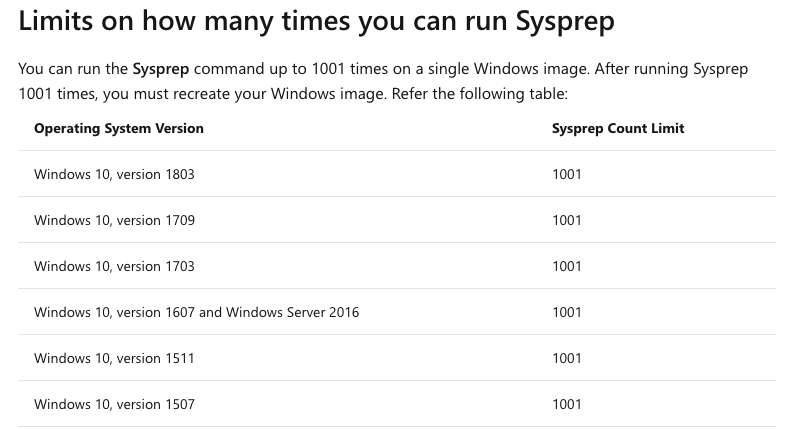
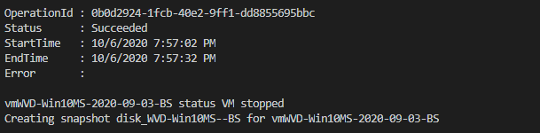
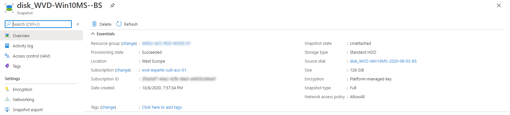
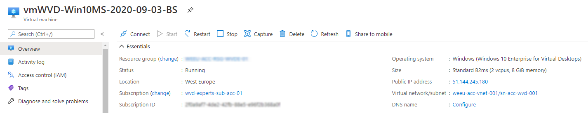
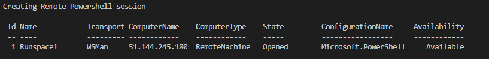
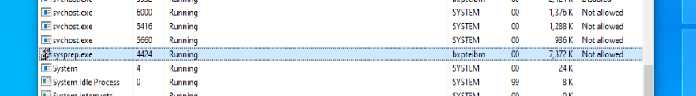
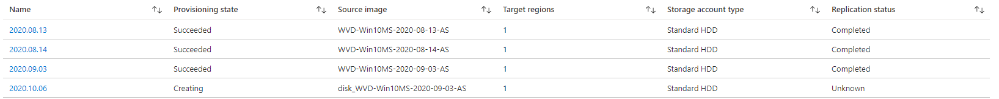
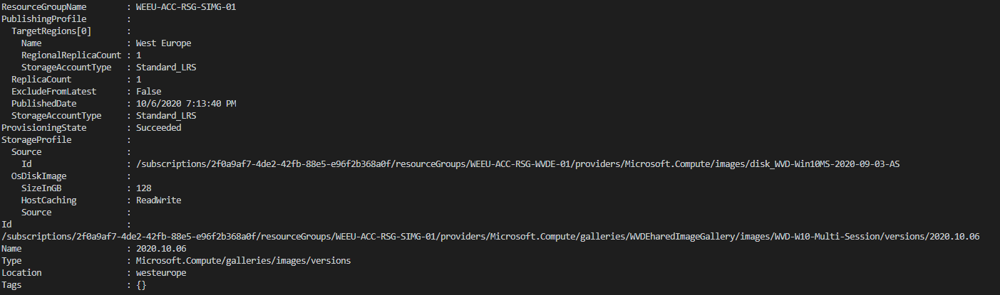
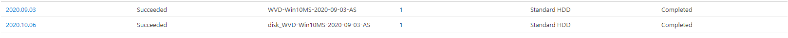

This is part two of a serie posts about AVD disk management. In this blogpost I will explain how to finish a disk with sysprep and deploy it as a version into the Azure Shared Image Gallery automated.

This post is a part of the series Azure Virtual Desktop Image Management Automated.

1. [Create AVD image version based on existing config with PowerShell – Part 1](https://www.rozemuller.com/create-avd-image-version-based-on-existing-config-with-powershell/)
2. [Save AVD image with Sysprep as Image Gallery version – Part 2](https://www.rozemuller.com/save-avd-image-with-sysprep-as-image-gallery-version/)
3. [Create AVD Sessionhosts based on Shared Image Gallery version – Part 3](https://www.rozemuller.com/azure-virtual-desktop-image-management-automated-part-3-create-avd-sessionhosts-based-on-shared-image-gallery-version-with-arm/)
4. [WVD housekeeping, removing all unused sessionhosts, disks and images – Part 4 ](https://www.rozemuller.com/azure-virtual-desktop-image-management-automated-part-4-avd-clean-up-unused-resources/)
5. [Monitor Image Versions with Azure Monitor – Part 5](https://www.rozemuller.com/azure-virtual-desktop-image-management-automated-part-5-monitor-image-versions-with-azure-monitor/)

*Before continuing I will strongly recommend reading [part 1](https://www.rozemuller.com/create-avd-image-version-based-on-existing-config-with-powershell/) first. This part will continue based on part one and you will need the information from that part.*



## Steps overview

Basically there are 2 main steps. 1) Sysprep the machine, 2) creating a new version from a snapshot and put it as a version into the Shared Image Gallery.

#### Sysprep

After your work is done you will need to run a Sysprep on the machine. Microsoft explains a Sysprep (Generalize) as following:  
  
*Sysprep removes all your personal account and security information, and then prepares the machine to be used as an image. For information about Sysprep, see* [sysprep overview](https://docs.microsoft.com/en-us/windows-hardware/manufacture/desktop/sysprep--generalize--a-windows-installation).   
As the article says you can Sysprep an image to the max of 8. To avoid reaching the limit we first going to make a clean Before Snapshot (BS).

Update from Microsoft. It is now possible to run a sysprep up to 1001 times. With this in mind you should be able to skip the create before sysprep snapshot part.   
[https://docs.microsoft.com/en-us/windows-hardware/manufacture/desktop/sysprep–generalize–a-windows-installation#limits-on-how-many-times-you-can-run-sysprep](https://docs.microsoft.com/en-us/windows-hardware/manufacture/desktop/sysprep--generalize--a-windows-installation#limits-on-how-many-times-you-can-run-sysprep)

<figure class="wp-block-image size-large">
#### Create version into the Share Image Gallery

A little introduction about the Shared Image Gallery.  
Shared Image Gallery is a service that helps you build structure and organization around your images. Shared Image Galleries provide:

- Global replication of images.
- Versioning and grouping of images for easier management.
- Highly available images with Zone Redundant Storage (ZRS) accounts in regions that support Availability Zones. ZRS offers better resilience against zonal failures.
- Premium storage support (Premium\_LRS).
- Sharing across subscriptions, and even between Active Directory (AD) tenants, using RBAC.
- Scaling your deployments with image replicas in each region.

Using a Shared Image Gallery you can share your images to different users, service principals, or AD groups within your organization. Shared images can be replicated to multiple regions, for quicker scaling of your deployments. For a full explanation check [Shared Image Gallery overview](https://docs.microsoft.com/en-us/azure/virtual-machines/windows/shared-image-galleries).

### The technique

Lets do the official part like parameters and importing the needed modules first :). The required parameters are virtual machine, the one you have created at part one, the resource group where the virtual machine is in and of course the AVD hostpool.

```powershell
param(
    [parameter(mandatory = $true, ValueFromPipelineByPropertyName)]$virtualMachineName,
    [parameter(mandatory = $true, ValueFromPipelineByPropertyName)]$resourceGroupName,
    [parameter(mandatory = $true, ValueFromPipelineByPropertyName)]$hostpoolName,
    [parameter(mandatory = $true, ValueFromPipelineByPropertyName)]$password,
    [parameter(mandatory = $true, ValueFromPipelineByPropertyName)]$username
)
import-module az.compute
$date = get-date -format "yyyy-MM-dd"
$version = $date.Replace("-", ".")
```

### Stop first

Before creating a clean snapshot we first shutdown the virtual machine. After the virtual machineis shutdown completely we can create the snapshot. For checking the virtual machine status I have created a function.

```powershell
function test-VMstatus($virtualMachineName) {
    $vmStatus = Get-AzVM -name $virtualMachineName -resourcegroup $resourceGroupName -Status
    return "$virtualMachineName status " + (($vmstatus.Statuses | ? { $_.code -match 'Powerstate' }).DisplayStatus)
}

# Stopping VM for creating clean snapshot
Stop-AzVM -name $virtualMachineName -resourcegroup $resourceGroupName -Force -StayProvisioned

do {
    $status = test-vmStatus -virtualMachineName $virtualMachineName
    $status
} until ( $status -match "stopped")
```

The Stop-VM will use the -StayProvisioned flag. This will help keeping the virtual machine available at all time otherwise the virtual machine will be deallocated and will take much longer to start again. (and we will loose the public IP)  
The do-until loop checks the virtual machine status as long it isn’t stopped yet. If the status is stopped the loop will break and continue.

### Create a before sysprep snapshot

Now lets gather the needed information and store it into variables.

```powershell
# If VM is stopped, create snapshot Before Sysprep
$vm = Get-AzVM -name $virtualMachineName -ResourceGroupName $resourceGroupName
$snapshot = New-AzSnapshotConfig -SourceUri $vm.StorageProfile.OsDisk.ManagedDisk.Id -Location $vm.location -CreateOption copy
$snapshotName = ($vm.StorageProfile.OsDisk.name).Split("-")
$snapshotName = $snapshotName[0] + "-" + $snapshotName[1] + "-" + $date + "-BS"
Write-Output "Creating snapshot $snapshotName for $virtualMachineName"
$createSnapshot = New-AzSnapshot -Snapshot $snapshot -SnapshotName $snapshotName -ResourceGroupName $resourceGroupName 

```


After the snapshot is finished we need to start the virtual machine again and test the status with the same function test-VmStatus. The loop will now continue after the virtual machine has a status Started.



```powershell
<# Source: https://docs.microsoft.com/nl-nl/azure/virtual-machines/windows/capture-image-resource
# If snapshot is created start VM again and run a sysprep #>
if ($null -eq $createSnapshot) {
    Write-Error "No snapshot created"
    break; 
}
Start-AzVM -name $virtualMachineName -resourcegroup $resourceGroupName 
Write-Output "Snapshot created, starting machine."
do {
    $status = test-vmStatus -virtualMachineName $virtualMachineName
    $status
} until ($status -match "running")
```


### Remote PowerShell

In the steps we need to use a remote PowerShell session to run commands on the virtual machine. Beforce we can setup a session we need to setup some important parts and have to request the virtual machine public IP. Also we need to enable the remote PowerShell extention.

```powershell
# Get the VM's public IP
$virtualMachinePublicIp = (Get-AzPublicIpAddress | where { $_.name -match $VirtualMachineName }).IpAddress
$virtualNetworkSubnet = (Get-AzNetworkInterface -ResourceId $vm.NetworkProfile.NetworkInterfaces.id).IpConfigurations.subnet.id
$NSG = Get-AzNetworkSecurityGroup | ? { $_.subnets.id -eq $virtualNetworkSubnet }# Enabling Powershell Remote Extention
Write-Output "Enabling Powershell Remote Extention"
Invoke-AzVMRunCommand -CommandId "EnableRemotePS" -VM $vm

```

### Add port to firewall

The second part is adding a firewall rule for port 5986, which is the ssl port for remote PowerShell connection url.  
Now we need the PowerShell function add-firewallRule from [part 1 ](https://www.rozemuller.com/create-avd-image-version-based-on-existing-config-with-powershell/#add-ip)again. After adding the port we will setup a remote PowerShell session.


```powershell
#Adding the role
add-firewallRule -NSG $NSG -localPublicIp $localPublicIp -port 5986
$connectionUri = "https://" + $virtualMachinePublicIp + ":5986" 
[securestring]$secStringPassword = ConvertTo-SecureString $password -AsPlainText -Force
[pscredential]$creds = New-Object System.Management.Automation.PSCredential ($userName, $secStringPassword)
$session = $null
while (!($session)) {
    $session = New-PSSession -ConnectionUri $connectionUri -Credential $creds -SessionOption (New-PSSessionOption -SkipCACheck -SkipCNCheck -SkipRevocationCheck)
    Write-Output "Creating Remote Powershell session"
    $session
}
```

### Remote Sysprep

When the session has been established we are able to run the Sysprep command remotely.

```powershell
$setRegCommand = "Set-Itemproperty -path 'HKLM:\SYSTEM\Setup\Status\SysprepStatus' -Name 'GeneralizationState' -value 3"
$sysprep = 'C:\Windows\System32\Sysprep\Sysprep.exe'
$arg = '/generalize /oobe /shutdown /quiet'
Invoke-Command -Session $session -ScriptBlock { param($sysprep, $arg) Start-Process -FilePath $sysprep -ArgumentList $arg } -ArgumentList $sysprep, $arg
Write-Output "Sysprep command started on $virtualMachineName, now waiting till the vm is stopped."

```


Now the big wait will start till the VM has been shutdown. Again we will run a do-while loop till the virtual machine has been deallocated. Because of a Sysprep can take a while we will add a pause of 5 minutes into the loop.

```powershell
# After sysprep check if vm is stopped and deallocated
do {
    $status = test-vmStatus -virtualMachineName $virtualMachineName
    $status
Start-Sleep 300
} until ($status -like "stopped")
#>
# When the VM is stopped it is time to generalize the VM 
Set-AzVm -ResourceGroupName $resourceGroupName -Name $virtualMachineName -Generalized

```

### Shared Image Gallery

We are going back to the AVD environment and will, just as in part 1, start at the AVD hostpool. From that point we will do some reverse engineering to get all the critical information.

```powershell
# Testing if there is allready a AVD VM with an update status
$hostpool = Get-AzWvdHostPool | ? { $_.Name -eq $hostpoolname } 
# Creating VM configuration based on existing VM's in specific hostpool, selecting first one
$hostpoolResourceGroup = ($hostpool).id.split("/")[4]
Write-Output "Hostpool resourcegroup is $hostpoolResourceGroup "


# Get one of the current production VM's for getting the share image gallery info
$sessionHosts = Get-AzWvdSessionHost -ResourceGroupName $hostpoolResourceGroup -HostPoolName $hostpool.name
$existingSessionHost = ($sessionHosts.Name.Split("/")[-1]).Split(".")[0]
$productionVm = Get-AzVM -Name $existingSessionHost

# Get the VM for creating new image based on connected disk
$diskName = $vm.StorageProfile.OsDisk.name
# Replace the Before Sysprep to After Sysprep
$imageName = $diskname.Replace("BS", "AS")
$image = New-AzImageConfig -Location $vm.location -SourceVirtualMachineId $vm.Id 
# Create the image based on the connected disk on the update VM
Write-Output "Creating image $imageName based on $($vm.name)"
New-AzImage -Image $image -ImageName $imageName -resourcegroupname $productionVm.ResourceGroupName
$managedImage = Get-AzImage -ImageName $imageName -resourcegroupname $productionVm.ResourceGroupName

# Source: https://docs.microsoft.com/en-us/azure/virtual-machines/image-version-managed-image-powershell
# Creating image version based on the image created few steps ago
$imageReference = ((get-azvm -Name $productionVm[-1].name -ResourceGroupName $productionVm[-1].ResourceGroupName).storageprofile.ImageReference).id
$galleryImageDefintion = get-AzGalleryImageDefinition -ResourceId $imageReference
$galleryName = $imageReference.Split("/")[-3]
$gallery = Get-AzGallery -Name $galleryName

# Configuring paramaters
$imageVersionParameters = @{
    GalleryImageDefinitionName = $galleryImageDefintion.Name
    GalleryImageVersionName    = $version
    GalleryName                = $gallery.Name
    ResourceGroupName          = $gallery.ResourceGroupName
    Location                   = $gallery.Location
    Source                     = $managedImage.id.ToString()
}
# Doing the job
New-AzGalleryImageVersion @imageVersionParameters

$bodyValues = [Ordered]@{
    hostPool               = $hostpoolName
    virtualMachineName     = $VirtualMachineName
    resourceGroupName      = $resourceGroupName
    virtualMachinePublicIp = $virtualMachinePublicIp
    username               = $username
    password               = $password
}
$bodyValues
```

Creating an image can take a couple of minutes.


After all when the PowerShell is finished you will get an image overview. At that same moment you will notice the image version provisioning state has been succeeded.



I have added the full script at my AVD [Github ](https://github.com/srozemuller/Windows-Virtual-Desktop)[repository](https://github.com/srozemuller/Windows-Virtual-Desktop)

