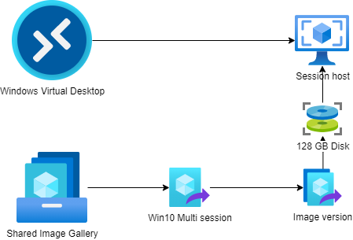
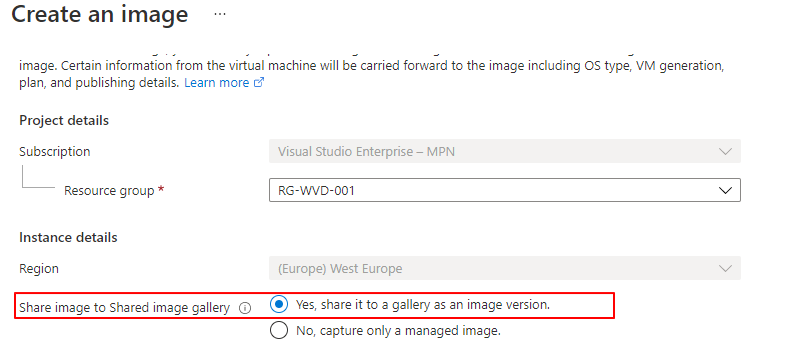

It is very common to use a golden image in avd environments. Some are using Azure images, others are using a Shared Image Gallery. A great advantage of using preconfigured images is that you just have to create a new session host from that image and you’re all set.   
The [change process](https://www.rozemuller.com/create-avd-image-version-based-on-existing-config-with-powershell/) for an image version is very simple, you will start a virtual machine from the version and you will make the changes. But what if you need to change the OS disk size of the golden image. In this article I will explain how to change a avd disk size when using a golden image based on the existing environment automated.

At some day you will have to extend or shrink an OS disk for your session hosts. You log in into the portal, create a new vm, change the disk size afterwards, log in for running a Sysprep and at last generate a new version. These are quite a lot of steps which can be simplified in an automation sequence. In the next chapters I will explain the process about how to change a avd the session host disk size automated.



## Environment explained

In this scenario I have a basic avd environment with a shared image gallery (SIG). I configured a Windows 10 Multisession Generalized V2 image definition.


  
  
*An image definition is a logical group of images with the same specifications like OS-type.*


The image definition has one image version with a basic Windows 20H2 installation with a 128GB disk. At the end of this article a new version has been made with an greater disk.


## Change avd disk size process

Before changing anything it is good to know how an Azure VM is build. An Azure VM consists of various resources. The most simple has a size (B2 or D4), a disk and a network interface card (NIC). In this change process we are changing the disk resource.   
Check this doc which explains more about an Azure VM: <https://docs.microsoft.com/en-us/azure/architecture/reference-architectures/n-tier/windows-vm>

At the end, an image(version) at his place represents a disk state.   
To know what we are doing first I will describe, in short, how to change a disk size in the portal.

### Through the portal

The change process consists of the following:

- Create new virtual machine from an image version


- Change the disk size in the disks blade


- Login into the virtual machine for sysprep
- Generalize machine


- Create image from the virtual machines disk


### Automated

Now the fun begins where we are going to automate things, this time with PowerShell. The main difference in the process is that we are now creating a VM with correct disk size.

#### Install Az.avd module

The first step is making sure you have installed the new [Az.avd PowerShell](https://www.rozemuller.com/launching-the-first-version-of-az-avd-avd-powershell-module/) module.

```powershell
install-module az.avd
import-module az.avd 
```


This module will help you getting the all the session host resources and its id’s. In the example below, I search for one session host to get the latest gallery version. This will return all the needed information to create a new vm.

```powershell
 Get-avdImageVersionStatus -HostpoolName rozemuller-hostpool -ResourceGroupName rg-avd-001 | select -Last 1

 vmLatestVersion     : 1
 vmName              : avd-0
 imageName           : Win10-MultiSession
 currentImageVersion : 2021.04.26
 vmId                : /subscriptions/<s>xx</s>/resourceGroups/RG-avd-001/providers/Microsoft.Compute/virtualMachines/avd-0
 imageGallery        : Rozemuller_ImageGallery
 resourceGroupName   : rg-sig-001
 subscriptionId      : <s>xx</s>
 lastVersion         : 2021.04.26
 hostpoolName        : rozemuller-hostpool
 sessionHostName     : avd-0.rozemuller.local
```


#### Getting information

The next step is gathering the virtual machine information of an existing session host. This needed for getting the network information and vm size. To achieve this goal we need the command below. Recommended is to save the command above into an variable so we can use it later.

```powershell
$parameters = @{
    HostpoolName = "rozemuller-hostpool"
    ResourceGroupName = "rg-avd-001"
}
$sessionHostImageInfo = Get-avdImageVersionStatus @parameters | select -Last 1
$resources = Get-avdSessionHostResources @parameters -SessionHostName $sessionHostImageInfo.sessionHostName
```


#### Create a virtual machine profile

Based on the returned information we are now able to create an virtual machine profile, with the correct disk size. A big difference between the portal, where the disk size is changed afterwards, and the automation part.

As you can see in the example below I’m creating a new vm with a 256 GB disk. Beside the credentials and vm name all other information is gathered from the existing avd environment.

```powershell
$imageParameters = @{
    GalleryName = $sessionHostImageInfo.imageGallery
    resourceGroupName = $sessionHostImageInfo.resourceGroupName
    Name = $sessionHostImageInfo.imageName
}
$galleryImageDefintion = Get-AzGalleryImageDefinition @imageParameters


$LocalAdminUser = "tempVmUser"
$LocalAdminPass = "TempVmP@ssword123"
$vmName = "UpdateDiskVm" 
$DiskSizeGB = 256

$LocalAdminSecurePassword = ConvertTo-SecureString $LocalAdminPass -AsPlainText -Force
$Credentials = New-Object System.Management.Automation.PSCredential ($LocalAdminUser, $LocalAdminSecurePassword)
$virtualNetworkSubnet = (Get-AzNetworkInterface -ResourceId $resources.NetworkProfile.NetworkInterfaces.id).IpConfigurations.subnet.id
$SubnetConfig = Get-AzVirtualNetworkSubnetConfig -ResourceId $virtualNetworkSubnet
$NIC = New-AzNetworkInterface -Name "$vmName-nic" -ResourceGroupName $resources.ResourceGroupName -Location $resources.Location -SubnetId $SubnetConfig.Id

$VirtualMachine = New-AzVMConfig -VMName $vmName -VMSize $resources.HardwareProfile.VmSize
$VirtualMachine = Set-AzVMOperatingSystem -VM $VirtualMachine -Windows -ComputerName $vmName -Credential $Credentials
$VirtualMachine = Set-AzVMSourceImage -VM $VirtualMachine -Id $galleryImageDefintion.Id
$VirtualMachine = Set-AzVMOSDisk -Windows -VM $VirtualMachine -CreateOption FromImage -DiskSizeInGB $DiskSizeGB
$VirtualMachine = Add-AzVMNetworkInterface -VM $VirtualMachine -Id $NIC.Id

New-AzVM -VM $VirtualMachine -ResourceGroupName $resources.ResourceGroupName -Location WestEurope
```


#### Verify

A few minutes later the virtual machine has been created with the new disk size. When looking under the hood you will notice the new virtual machine has been started from the image version out of the shared image gallery.


#### Generalize

Before creating a new image version we first need to generalize the virtual machine. To run a command on the virtual machine I use the invoke-azruncommand and i’ve created a simple PowerShell script which will be executed on the machine. [The script can be downloaded from my GitHub](https://github.com/srozemuller/Windows-Virtual-Desktop/blob/master/Image%20Management/execute-sysprep.ps1). Download the file to your local machine from where you are able to send the save PowerShell into the Invoke-AzRunCommand.

```powershell
Get-AzVM -Name $vmName | Invoke-AzVMRunCommand -CommandId 'RunPowerShellScript' -ScriptPath .\execute-sysprep.ps1
```


If you don’t like a file download then use the Azure CLI command az vm run-command. This command accepts scriptlines, like the PowerShell scriptblock. <https://docs.microsoft.com/en-us/cli/azure/vm/run-command?view=azure-cli-latest>

```powershell
az vm run-command invoke  --command-id RunPowerShellScript --name $vmName -g $resources.resourceGroupName --scripts '$sysprep = "C:\Windows\System32\Sysprep\Sysprep.exe" $arg = "/generalize /oobe /shutdown /quiet /mode:vm"' \    'Start-Process -FilePath $sysprep -ArgumentList $arg' 
```


After a short time the virtual machine has been shutdown and we need to generalize the machine before we can create an image version. Before generalizing a virtual machine make sure the machine is stopped. The shutdown command in the sysprep script will take care for that.

To make sure the machine is really stopped I wrote a simple PowerShell loop which will check the virtual machine status.

```powershell
    function test-VMstatus($virtualMachineName) {
        $vmStatus = Get-AzVM -name $virtualMachineName -Status
        return "$virtualMachineName status " + $vmstatus.PowerState
    }
    
    do {
        $status = test-vmStatus -virtualMachineName $vmName
        $status
        Start-Sleep 10
    } until ( $status -match "stopped")
    Write-Output "$vmName has status $status"
    Get-AzVM -Name $vmName | Set-AzVm -Generalized
```


More information about creating images please check my series about [avd image management automated](https://www.rozemuller.com/create-avd-image-version-based-on-existing-config-with-powershell/).

Since a while it is possible to create a new image version from an virtual machine directly. This will make it possible to skip making a snapshot so we are going to deploy a new image from the machine directly.

#### Create image version

The final step is creating an image version into the Shared Image Gallery. In this part we are reusing the gallery variables from the steps above. Creating a new image could take a while and depends on things like disk type (SSD,HDD) and replication regions.

```powershell
$ImageParameters = @{
    GalleryImageDefinitionName = $galleryImageDefintion.Name
    GalleryImageVersionName    = (Get-Date -format "yyyy.MM.dd")
    GalleryName                = $sessionHostImageInfo.imageGallery
    ResourceGroupName          = $sessionHostImageInfo.ResourceGroupName
    Location                   = 'WestEurope'
    SourceImageId              = (Get-AzVM -Name $vmName).id.ToString()
}
New-AzGalleryImageVersion @ImageParameters
```


After executing the command you will see a new version will be provisioned.

If you like to know the replication status you could click on the version to check the actual status.


In the end you will be able to use this image for your avd sessionhosts with an expanded disk.

## Sources

To get more information about the used resources please check to sources below.

- <https://docs.microsoft.com/en-us/powershell/module/az.compute/set-azvmosdisk?view=azps-6.0.0>
- <https://docs.microsoft.com/en-us/powershell/module/az.compute/new-azvm?view=azps-6.0.0>
- <https://docs.microsoft.com/en-us/powershell/module/az.compute/invoke-azvmruncommand?view=azps-6.0.0>
- <https://docs.microsoft.com/en-us/azure/virtual-machines/windows/capture-image-resource#create-an-image-of-a-vm-using-powershell>

Thank you for reading my blogpost about how to change a avd disk size for a Shared Image Gallery version.
