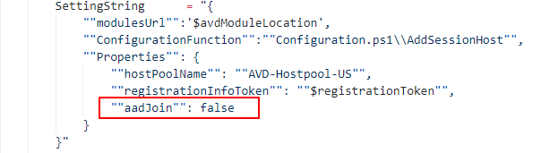
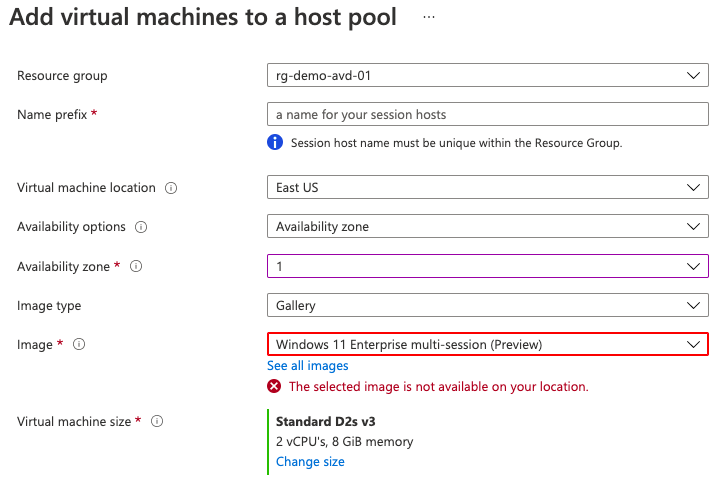
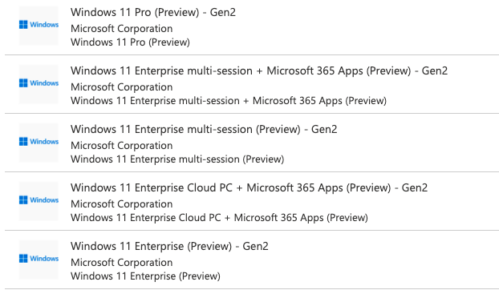
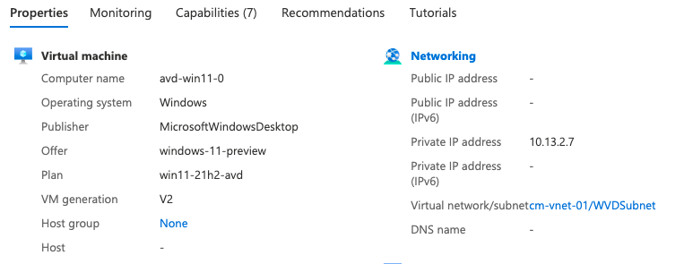
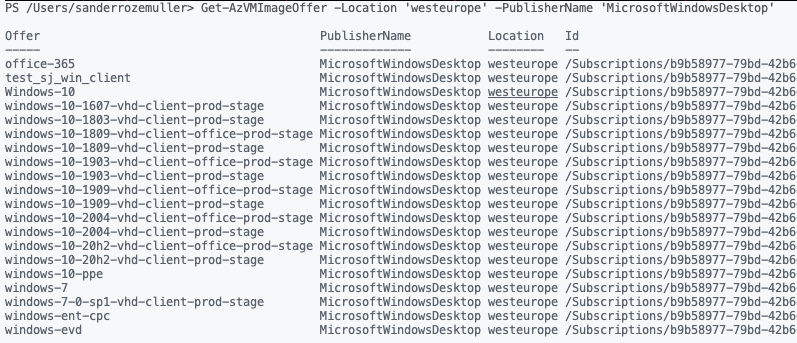
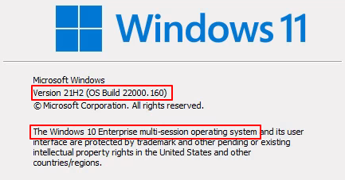
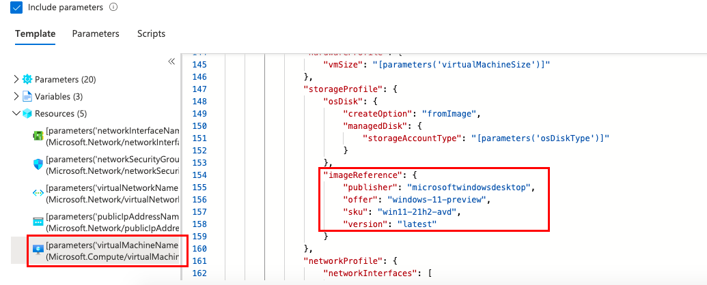

After the Windows 11 launch everyone was waiting till Windows 11 came available in Azure. Since the 19th of August Windows 11 became in preview. I decided to test it in a AVD environment. Because it is not a next-next-finish installation I will explain how to deploy Windows 11 in an AVD environment.

After the release of Windows 11 Microsoft [announced the preview status](https://techcommunity.microsoft.com/t5/azure-virtual-desktop/windows-11-preview-is-now-available-on-azure-virtual-desktop/ba-p/2666468) of Windows 11 for Azure Virtual Desktop. This means we are able to try Windows 11 in our AVD environment. After this announcement a lot of people tried to get it work. During my test I mentioned it wasn’t possible to create an AVD session host with Windows 11 directly. So I decided to write a small post about how to get Windows 11 work in an AVD environment.

Let’s start.



## The issue

After the moment Windows 11 came available for AVD I started to test it out. I started in the portal at the Azure Virtual Desktop. Created a new registration token followed by adding a session host. That’s the point where the issue started.

When creating a new session host you have to select an image from where to create a session host. This can be an image from the Azure marketplace or your own. In this case, I choose the marketplace. After searching for Windows 11 there are several images available.


For AVD I like to test the ***Windows 11 Enterprise multi-session (Preview) – Gen2***. After selecting that image I got a message from Microsoft.

*The selected image is not available on your location.*

The first thing I did was changing the virtual machines location but didn’t help. Also I changed the resource group with an other location. After some community contact we noticed we need to create a VM first and install the AVD extensions later.


## Create Windows 11 VM

The first step to get Windows 11 running in AVD is creating the virtual machine. This time we PowerShell to create the virtual machine.

```powershell
$VMLocalAdminUser = "LocalAdminUser"
$VMLocalPassword = "V3rySecretP@ssw0rd"
$VMLocalAdminSecurePassword = ConvertTo-SecureString $VMLocalPassword -AsPlainText -Force

$location = 'westeurope'
$VMName = "avd-win11-0"
$VMSize = "Standard_D2s_v3"
$ImageSku = "win11-21h2-avd"
$ImageOffer = "windows-11-preview"
$ImagePublisher = "MicrosoftWindowsDesktop"
$ComputerName = $VMName
$DiskSizeGB = 128
$nicName = "nic-$vmName"

$vnetResourceGroup = 'rg-cm-vnet-01'
$vnet = Get-AzVirtualNetwork -Name 'cm-vnet-01' -ResourceGroupName $vnetResourceGroup
$subnet = Get-AzVirtualNetworkSubnetConfig -Name 'wvdSubnet' -VirtualNetwork $vnet
$NIC = New-AzNetworkInterface -Name $nicName -ResourceGroupName $vnetResourceGroup -Location $location -Subnet $subnet
$Credential = New-Object System.Management.Automation.PSCredential ($VMLocalAdminUser, $VMLocalAdminSecurePassword);

$VirtualMachine = New-AzVMConfig -VMName $VMName -VMSize $VMSize
$VirtualMachine = Set-AzVMOperatingSystem -VM $VirtualMachine -Windows -ComputerName $ComputerName -Credential $Credential -ProvisionVMAgent -EnableAutoUpdate
$VirtualMachine = Add-AzVMNetworkInterface -VM $VirtualMachine -Id $NIC.Id
$VirtualMachine = Set-AzVMOSDisk -Windows -VM $VirtualMachine -CreateOption FromImage -DiskSizeInGB $DiskSizeGB
$VirtualMachine = Set-AzVMSourceImage -VM $VirtualMachine -PublisherName $ImagePublisher -Offer $ImageOffer -Skus $ImageSku -Version latest

$newVm = New-AzVM -ResourceGroupName 'rg-cm-wvd-cus' -Location $Location -VM $VirtualMachine
```

The PowerShell commands above creating a VM profile, a network card and disk. At the end it puts all the pieces together into a new vm deployment. Make a note about the image information. How I got these information is discussed later.


## Install AVD Extensions

After the VM is created it is time to install the extensions. In this example, I have chosen to install the native AD join extension.

```powershell
$domainUser = "vmjoiner@domain.local"
$domainPassword = "veryS3cret"
$domain = $domainUser.Split("@")[-1]
$ouPath = "OU=Computers,OU=AVD,DC=domain,DC=local"
<meta charset="utf-8"></meta>$domainPassword = "verySecretPass"


    $domainJoinSettings = @{
        Name                   = "joindomain"
        Type                   = "JsonADDomainExtension" 
        Publisher              = "Microsoft.Compute"
        typeHandlerVersion     = "1.3"
        SettingString          = '{
            "name": "'+ $($domain) + '",
            "ouPath": "'+ $($ouPath) + '",
            "user": "'+ $($domainUser) + '",
            "restart": "'+ $true + '",
            "options": 3
        }'
        ProtectedSettingString = '{
            "password":"' +$($domainPassword)+ '"}'
        VMName                 = $VMName
        ResourceGroupName      = $resourceGroupName
        location               = $Location
    }
    Set-AzVMExtension @domainJoinSettings

```

After the domain join is finished make sure your VM is available under Devices in the Azure AD blade marked as Hybrid AD Joined.

Next is installing the AVD extension. I tested a lot with the “old” not AzureAD join DSC configuration. After all those tests I didn’t get it working fine. So I choose the new Azure AD join DCS configuration with no AAD join.

To get the AzureAD join configuration use the artifact URL below. **

For updating the AVD registration token, with Update-AvdRegistrationToken , I used the [Az.Avd PowerShell module](https://www.powershellgallery.com/packages/Az.avd).

```powershell

$avdHostpool = 'AVD-Hostpool-US'
$avdResourceGroupName = 'rg-demo-avd-01'

$registrationToken = (Update-AvdRegistrationToken -HostpoolName $avdHostpool $avdResourceGroupName).Properties.registrationInfo.token
$avdModuleLocation = ""

       $avdDscSettings = @{
        Name               = "Microsoft.PowerShell.DSC"
        Type               = "DSC" 
        Publisher          = "Microsoft.Powershell"
        typeHandlerVersion = "2.73"
        SettingString      = "{
            ""modulesUrl"":'$avdModuleLocation',
            ""ConfigurationFunction"":""Configuration.ps1\\AddSessionHost"",
            ""Properties"": {
                ""hostPoolName"": ""AVD-Hostpool-US"",
                ""registrationInfoToken"": ""$registrationToken"",
                ""aadJoin"": false
            }
        }"
        VMName             = $VMName
        ResourceGroupName  = $resourceGroupName
        location           = $Location
    }
    Set-AzVMExtension @avdDscSettings
```


## Preview symptoms

During my test, I noticed some preview symptoms which deserve some attention.

### Get Windows 11 Image SKU with PowerShell

Before creating a virtual machine from an image we need the image details. These details are the SKU, offer and publisher. When searching for the Windows 11 SKU’s with PowerShell you will notice no Windows 11 SKU is available. In the command below I’m searching for all MicrosoftWindowsDesktop images. As you can see there is no Windows 11 available.

```powershell
Get-AzVMImageOffer -Location 'westeurope' -PublisherName 'MicrosoftWindowsDesktop'
```


Because I’m not satisfied with this I also tried to find the windows-11-preview SKU itself. Also there I got an error.

```powershell
Get-AzVMImageSku -Location 'westeurope' -PublisherName 'MicrosoftWindowsDesktop' -Offer 'windows11preview'
```

*Get-AzVMImageSku: Artifact: VMImage was not found.  
ErrorCode: NotFound  
ErrorMessage: Artifact: VMImage was not found.  
ErrorTarget:  
StatusCode: 404  
ReasonPhrase: Not Found  
OperationID : 429a474d-c4d4-4791-98f2-f5abb42943a9*

**So how did I find the correct image information?**

To get that answer I moved to the Azure portal. I simply created a new VM with an Windows 11 image from the marketplace. At the end of the wizard I clicked the **download a template for automation** link. In the ARM templates I found the correct Windows 11 image information.


### Windows 10 display names

Other thing I noticed is the operating system display name. In some cases it is still Windows 10.





### Old AVD DSC extension not working

I noticed after testing a lot the old AVD DSC virtual machine extension is not working. At least I didn’t get it stable. What happpens is that the extension will update to the latest version. After the update the I got errors the SXS Stack listener is not working.

I also tried to disable auto update but for some reason it is still updating or gets stuck in the update.

To get the working DSC configuration package use the URL below.



Make sure in the PowerShell you also provide the AADJoin parameter. Because of a hybrid join, I set the parameter to false.


Thank you for reading my post about how to deploy Windows 11 in an AVD environment.

