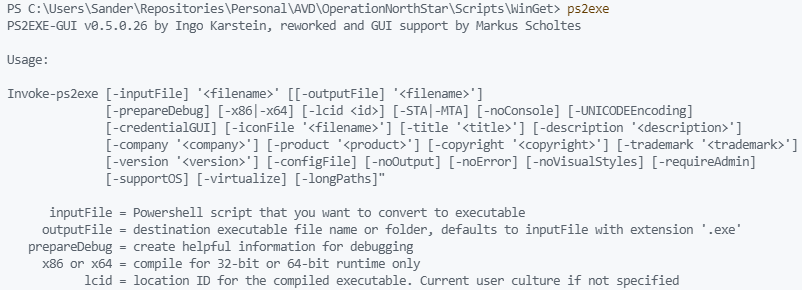
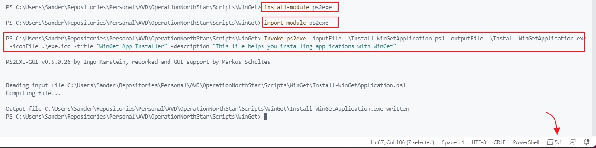
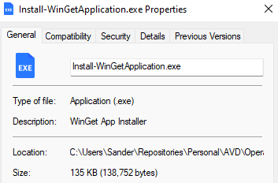
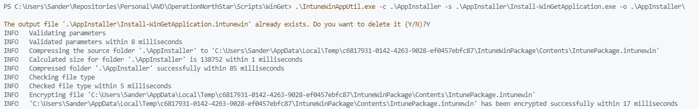
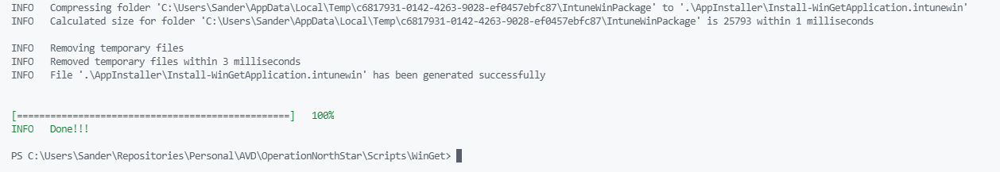
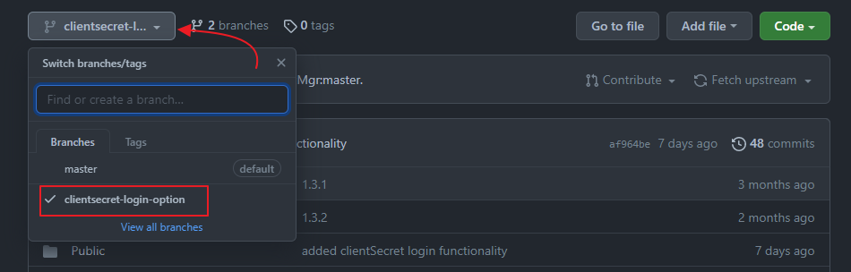
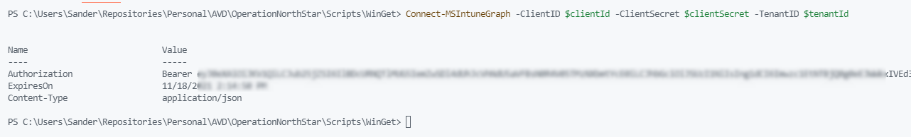
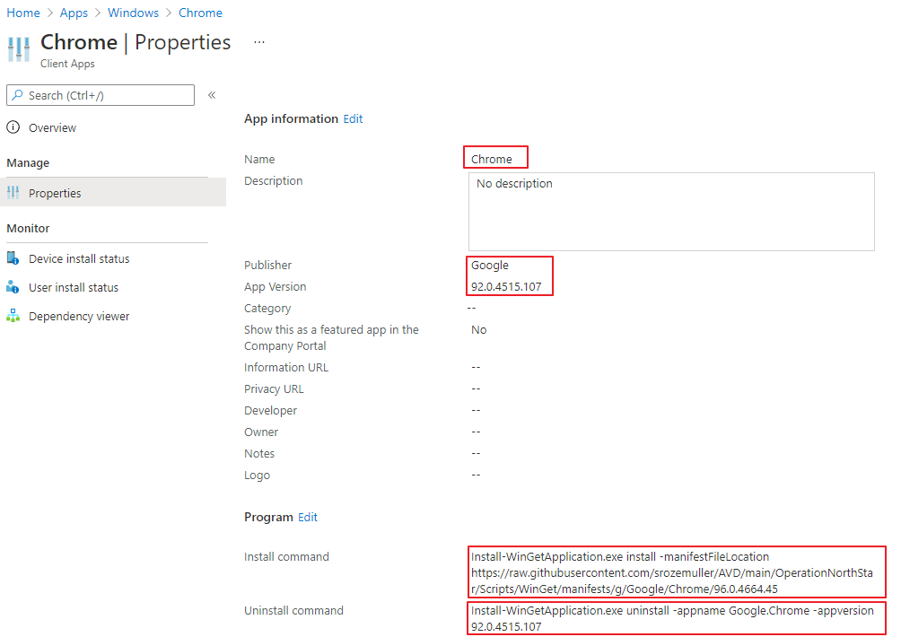

In this post, I will show how to install applications with Windows Package Manager (or Winget), within Microsft Endpoint Manager. This is all done by one single executable package which accepts the application name and version. Or providing a manifest location. Using one single file avoids creating single packages and intunewin-files every time.

During writing the next part of my blog series [Operation North Star](https://www.rozemuller.com/category/north-star/), application management was one of the subjects. Because application management is one of the biggest investments in Endpoint management, I decided to write a blog about this subject only.

Creating images for endpoints is can be done in many ways. We are using tools like System Center Configuration Manager (SCCM), Packer, or writing our own packages installed by Azure DevOps. All good of course. In this blog, I use Winget for application distribution. This is with the back of Microsoft Endpoint Manager. Winget got major improvements in the past months. Major improvements in installation and many application additions. At the moment, there are around 2000 applications available. So in my opinion a good way to deploy applications.

Unfortunately, there is no way to install Winget applications with MEM directly. This means we are not able ([yet](https://techcommunity.microsoft.com/t5/windows-it-pro-blog/evolving-the-microsoft-store-for-business-and-education/ba-p/2569423)) to provide a Winget application with its version in the Apps wizard. However, this will not mean we are not able to install applications with the Winget command line.



## Main idea

So, what are we going to do?   
Well, the main idea is to install Winget applications as a Windows Application (Win32) via Microsoft Endpoint Manager. Nothing new so far as there are a lot of other blog posts about this subject. So what differs from other blog posts?

### What differs from other blogs

This thing is that other posts use install commands based on PowerShell.exe and create install packages per application. However these packages are created automated, and it is very time-consuming. I want to deploy applications with one single executable file which accepts the application name and version or a YAML manifest file location. Based on that location, the package downloads all files.

Ah location could be: https://github.com/srozemuller/AVD/tree/main/OperationNorthStar/Scripts/WinGet/manifests/g/Google/Chrome/96.0.4664.45


Using a single install file avoids creating packages every time which reduces application management. Which results in fewer mistakes and a more efficient way of application distribution.

<s>Another difference is the authentication part. I managed to add a service principal login to [Nickolaj’s IntuneWin32App](https://github.com/MSEndpointMgr/IntuneWin32App) Powershell module and pushed the changes into a pull request. Feel free to use the [updated module in my repository](https://github.com/srozemuller/IntuneWin32App) till the moment the module is updated.</s>

## Deployment strategy

Now the main idea is clear, it is time to work out the automation sequence. In the upcoming paragraphs, I will show how to start creating your very own executable. Next, I will show how to create an application into Intune as a Win32App.

### Creating an executable

Before creating an executable, I first wrote a PowerShell file. In the PowerShell file, I put all the intelligence. I have several reasons for using .exe files. First is a security thing. Changing an executable’s source is more difficult than changing plain text script files. Another thing is the long installation command like “Powershell.exe -ExecutionPolicy Bypass -File xxx”. At last, is just a feeling and a bit of experience. Because of running application installations under the System context, a .exe file is more stable than a PowerShell file. During tests, I experienced that PowerShell running under System wasn’t very stable or running under the wrong context within the PowerShell.   
But, it all starts with a PowerShell file which I convert to a .exe file with the PS2EXE PowerShell module.

For now, I will skip the PowerShell script part, you can find the [script at my GitHub repository](https://github.com/srozemuller/AVD/blob/main/OperationNorthStar/Scripts/WinGet/Install-WinGetApplication.ps1).

Assuming you already have a PowerShell file or downloaded the file from my repo, let’s start creating an executable from a PowerShell file automated.   
As mentioned you need the PS2EXE Powershell Module. Install this module with the command below.

```powershell
Install-Module PS2EXE
Import-Module PS2EXE
```

We have several ways to create an executable from a PowerShell file. Run the ps2exe command only, to show all options you have in the console.


```powershell
Invoke-ps2exe -inputFile .\Install-WinGetApplication.ps1 -outputFile .\Install-WinGetApplication.exe -iconFile .\exe.ico -title "WinGet App Installer" -description "This file helps you installing applications with WinGet"
```


If you have errors during compiling about the fact that the Invoke-Ps2exe command is not found or something, try to *run the module in a PowerShell 5.1 environment.*


When compiling is finished, it is time to create an intunewin file.

### Creating the .intunewin file

Before you can add executables as a Win32 application in Intune, we need to prepare the file. During preparation, all files and folders will be encrypted and zipped into a single .intunewin file. The file is pushed as a Win32 app to devices. During deployment at the site of the machine, the Intune Management Extension decrypts and unpacks the intunewin file into its original state.

Creating an intunewin file from the just-created executable is very easy. Just run the IntuneWinAppUtil.exe and provide the setup folder (-c), the source file (-s), and output folder (-o).

```powershell
.\IntuneWinAppUtil.exe -c .\AppInstaller -s .\AppInstaller\Install-WinGetApplication.exe -o .\AppInstaller\
```




If you need to troubleshoot issues during deployment check the logs at ```C:\\ProgramData\\Microsoft\\IntuneManagementExtension\\Logs``` on the end user’s device.

In addition to the above check the documentation about preparing[ the Win32 app for upload](https://docs.microsoft.com/en-us/mem/intune/apps/apps-win32-prepare).   
For downloading the preparation tool check [the official repository](https://github.com/Microsoft/Microsoft-Win32-Content-Prep-Tool). It is also stored in [my repo combined with all other files](https://github.com/srozemuller/AVD/tree/main/OperationNorthStar/Scripts/WinGet) of this blog.

### Upload the intunewin file

After the .intunewin file is ready it is time to create a Win32 application in Microsoft Endpoint Manager. To do that, I use [Nickolaj’s IntuneWin32App](https://github.com/MSEndpointMgr/IntuneWin32App) PowerShell module. The module has now also a service principal login option. <s>As mentioned at the start of this post I was able to add an extra feature into the module for authenticating to Intune with a service principal. </s>

<s>Because this feature isn’t added to the module yet (the is a pull request waiting) I would suggest [cloning the module from my repository](https://github.com/srozemuller/IntuneWin32App/tree/clientsecret-login-option). Make sure you select the correct branch first. </s>


After you stored the module on your own device, import the module with the command below in the folder itself. I use the -Force to make sure I have loaded the module with my changes. This is in case you already have loaded the original module.

```powershell
Import-Module .\IntuneWin32App.psd1 -Force
```

After importing the module it is time to log in.

```powershell
$tenantId = ""
$clientId = ""
$clientSecret = ""
Connect-MSIntuneGraph -ClientID $clientId -ClientSecret $clientSecret -TenantID $tenantId
```


After login, we are creating the Winget Win32 application in Microsoft Endpoint Manager.  
I created a script that allows me to provide multiple YAML manifest files. In the script below, I configured Google Chrome as a Win32 application.

```powershell
$yamlFile = "https://raw.githubusercontent.com/srozemuller/AVD/main/OperationNorthStar/Scripts/WinGet/manifests/g/Google/Chrome/96.0.4664.45/Google.Chrome.installer.yaml"
$yamlFile | ForEach-Object {
    Try {
        [string[]]$fileContent = (Invoke-WebRequest -Uri $_ -Headers @{"Cache-Control" = "no-cache" }).content
        $content = $null
        foreach ($line in $fileContent) { $content = $content + "`n" + $line }
        Try {
            $yamlContent = ConvertFrom-Yaml $content
        }
        Catch {
            Write-Error "Converting YAML not succesfull, $_"
        }
    }
    Catch {
        Write-Error "He! This location does not exist."
    }

    $detectionRuleParameters = @{
        Path                 = $yamlContent.InstallPath.Substring(0, $yamlContent.InstallPath.LastIndexOf("\"))
        FileOrFolder         = $yamlContent.InstallPath.Substring($yamlContent.InstallPath.LastIndexOf("\") + 1)
        existence            = $true
        check32BitOn64System = $false
        DetectionType        = "exists"
    }
    # Create detection rule
    $DetectionRule = New-IntuneWin32AppDetectionRuleFile @detectionRuleParameters
    $manifestLocation = $_.Substring(0,$_.LastIndexOf('/'))
    $appDeployParameters = @{
        filePath             = $IntuneWinFile.FullName
        publisher            = $yamlContent.PackageIdentifier.Substring(0, $yamlContent.PackageIdentifier.IndexOf('.'))
        displayName          = $($yamlContent.PackageIdentifier.Substring($yamlContent.PackageIdentifier.IndexOf('.') + 1)).Replace('.', ' ')
        description          = $yamlContent.PackageDescription
        appversion           = $yamlContent.PackageVersion
        InstallExperience    = "system"
        RestartBehavior      = "suppress" 
        DetectionRule        = $DetectionRule
        InstallCommandLine   = "Install-WinGetApplication.exe install -manifestFileLocation $manifestLocation"
        UninstallCommandLine = "Install-WinGetApplication.exe uninstall -appname $($yamlContent.PackageIdentifier) -appversion $($yamlContent.PackageVersion)"
    }
    $appDeployment = Add-IntuneWin32App @appDeployParameters -Verbose
    $appDeployment
    Write-Verbose "Group name $groupName provided, looking for group in Azure AD"
    $graphUrl = "https://graph.microsoft.com"
    $requestUrl = $graphUrl + "/beta/groups?`$filter=displayName eq 'All Users'"
    $identityInfo = (Invoke-RestMethod -Method GET -Uri $requestUrl -Headers $token).value.id
    Add-IntuneWin32AppAssignmentGroup -Include -ID $appDeployment.id -GroupID $identityInfo -Intent "available" -Notification "showAll" -Verbose
}
```


### Using Winget in automated image management

Another cool thing about this method is that there is also an option to use this in automated image management. Just provide the executable with the correct YAML file location in Azure DevOps for example. In the example below I created a PowerShell task in DevOps with the Install-WinGetApplication.ps1 file.

```yaml
- task: AzurePowerShell@5
name: deployApp
displayName: Creating Temp ResourceGroup
inputs:
  azureSubscription: ${{ parameters.serviceConnection }}
  ScriptType: 'InlineScript'
  Inline: |
      Set-AzContext -Subscription ${{ parameters.subscriptionId }}
      $vm = Get-AzVm -Name imagevm
      $vm | Invoke-AzVMRunCommand -CommandId 'RunPowerShellScript' -ScriptPath "$(Build.SourcesDirectory)\Install-WinGetApplication.ps1" -Parameter @{task = "install"; manifestfilelocation = "<meta charset="utf-8"></meta>$(Build.SourcesDirectory)\local\manifest\path"}
  azurePowerShellVersion: 'LatestVersion'
```

Thank you for reading this blog about installing Winget applications with Microsoft Endpoint Manager.

