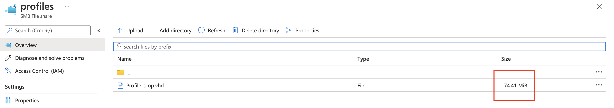
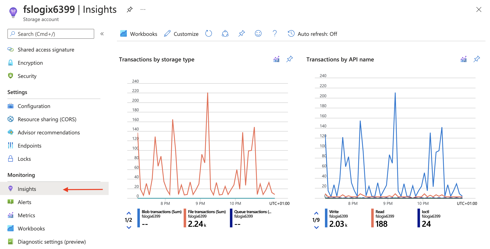
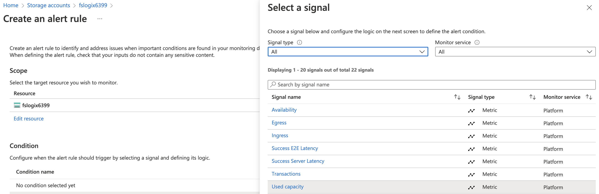
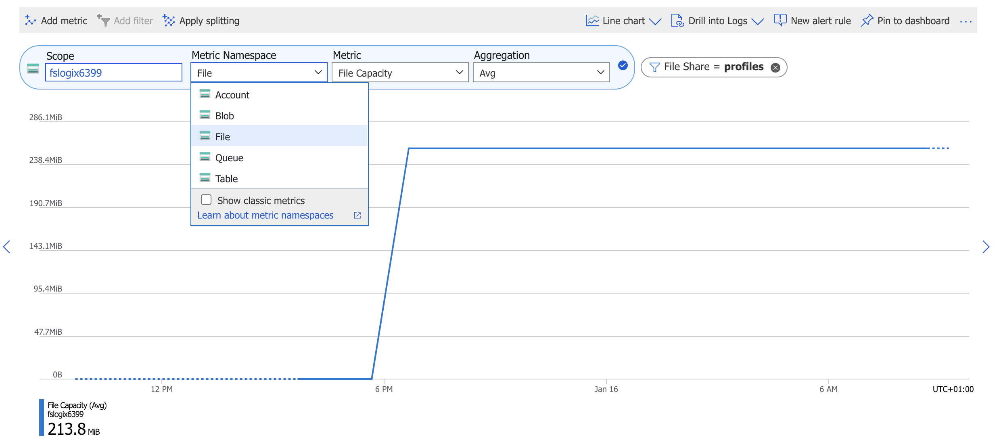

In the new world of (Azure) Virtual Desktops and CloudPC, FSLogix is often used for handling user profiles. Now FSLogix is supported with the back of AzureAD only, FSLogix is almost a required component in an AVD or CloudPC environment. With that in mind is it extremely important to know if the FSLogix file share has enough space. In this post, I explain how to monitor the FSLogix file share usage.



## Introduction

The plan is to monitor a storage account file share on his usage. Also, I do some maths to calculate the usage in percentage. There are several ways to monitor a storage account file share usage. LogAnalytics is an option but there is no way to do some maths. Because I don’t want to know the current bytes in use but a percentage, I use PowerShell. Later, I show the difference (and the gap) between Azure Monitor and PowerShell. Before we start let’s take a look at some background information. What is FSLogix and how does a storage account looks like.

### What is FSLogix

[FSLogix](https://docs.microsoft.com/en-us/fslogix/) is a set of solutions that enhance, enable, and simplify non-persistent Windows computing environments. FSLogix solutions are appropriate for virtual environments in both public and private clouds. For combining FSLogix with Azure Virtual Desktop as a desktop virtualization solution on Azure, I store profiles on Azure Files. In this blog post, I show how to configure Azure Files with Azure AD joined session hosts automated.

In addition, please check the documentation about FSLogix: <https://docs.microsoft.com/en-us/azure/architecture/example-scenario/wvd/windows-virtual-desktop-fslogix>

### Storage account components

An Azure storage account contains all of your Azure Storage data objects. The following data object are available: blobs, file shares, queues, tables, and disks. The storage account provides a globally unique namespace for storing your data on Azure. The data is accessible from anywhere in the world over HTTP or HTTPS. Data in your storage account is durable and highly available, secure, and massively scalable.  
  
In the case of FSLogix, we need a file share. This file share is available from your desktop and used to store the .VHD file representing your profile.

To create a storage account automated, check my blog post about [Configure FSLogix profile for Azure AD joined AVD session host automated](https://www.rozemuller.com/configure-fslogix-profile-for-azure-ad-joined-avd-session-host-automated/#storage-account).   
For more information about Azure storage accounts in general, check the [storage account overview](https://docs.microsoft.com/en-us/azure/storage/common/storage-account-overview).

## Monitoring storage account file shares

To monitor the FSLogix storage account file share, we have some options. Azure Monitor with Storage Insights and REST API for example. In the next paragraphs, I show how to configure and use these options. The data I work with within this situation is a file share with one .VHD file. As shown in the screenshots below, I have a .VHD file. The .VHD file represents my FSLogix profile and is around 170MB.


### Storage account monitoring with Azure Monitor (storage insights)

First, we have the Azure Monitor with Storage Insights. Storage insights provide comprehensive monitoring of your Azure Storage accounts. It gives you a view of the service’s performance, capacity, and availability. You can observe storage capacity, and performance in two ways, view directly from a storage account or view from Azure Monitor to see across groups of storage accounts.

Storage insights work out of the box. After creating a storage account it is available under the Azure Monitor – Storage Accounts.

By default, the insights option is available and shows some graphs as shown below. The graphs below show the default overview with transactions, bandwidth, and usage. The overview is created by metrics. Based on the metrics, actions are available to create alert rules.





For more information check [the storage insights overview](https://docs.microsoft.com/en-us/azure/storage/common/storage-insights-overview).

### File share usage monitoring with REST API

As much as I know, in the case of capacity, there is only one actually. The average used capacity. No doubt there are situations where monitoring average usage capacity is needed. In my case, I want to know how much of the grand total is used. Based on that information I know when to extend the file share. To achieve my goal, I need to do some maths and need more storage account information. Information about the current file share usage and the file share size.

To get this information, I need to use the REST API.

As mentioned in the storage account components chapter, a storage account is in basics a public data entry point. Within a storage account, there are one or more types of data. In the case of file-share monitoring let’s see what we need.

Before we are able to call a REST API, we need the authenticate. At first, I authenticate in PowerShell with **connect-azaccount**. After the authentication point, I use the function below to create an authentication header for the REST API.

```powershell
function GetAuthToken($resource) {
    $context = [Microsoft.Azure.Commands.Common.Authentication.Abstractions.AzureRmProfileProvider]::Instance.Profile.DefaultContext
    $Token = [Microsoft.Azure.Commands.Common.Authentication.AzureSession]::Instance.AuthenticationFactory.Authenticate($context.Account, $context.Environment, $context.Tenant.Id.ToString(), $null, [Microsoft.Azure.Commands.Common.Authentication.ShowDialog]::Never, $null, $resource).AccessToken
    $authHeader = @{
        'Content-Type' = 'application/json'
        Authorization  = 'Bearer ' + $Token
    }
    return $authHeader
}
$azureUrl = "https://management.azure.com"
$script:token = GetAuthToken -resource $azureUrl
```

Now we have everything in place, we need the storage account itself. Finding a storage account with the REST API is simply done with the code below.

```powershell
$resourceType = "Microsoft.Storage/storageAccounts"
$subscriptionId = [Microsoft.Azure.Commands.Common.Authentication.Abstractions.AzureRmProfileProvider]::Instance.Profile.DefaultContext.Subscription.id
$url = "{0}/subscriptions/{1}/resources?`$filter=resourceType eq '$resourceType'&api-version=2021-04-01" -f $azureUrl, $subscriptionId
$resources = Invoke-RestMethod -Uri $url -Headers $script:token -Method GET
```

The result of the request is the storage account.

```basic
id       : /subscriptions/xxx/resourceGroups/RG-ROZ-STOR-01/providers/Microsoft.Storage/storageAccounts/fslogixxxx
name     : fslogixxxx
type     : Microsoft.Storage/storageAccounts
sku      : @{name=Premium_LRS; tier=Premium}
kind     : FileStorage
location : westeurope
tags     : 
```

### Extend extra file share information

Now comes the fun part. This is because there is a lot of information available to work with. Good to know is that every data object has its own API available. In this case, we need the [file share REST API](https://docs.microsoft.com/en-us/rest/api/storagerp/file-shares). If a storage account has no file shares you get an empty response. So in the case of monitoring, we just can request the file share REST API to all storage account. If there is a file share, we get a response.

First, we request the file shares based on the storage account resource ID. If there is a file share, the response is the file share resource ID.

```powershell
$resourceId = $resources.value.id    
$url = "https://management.azure.com{0}/fileServices/default/shares/?api-version=2021-04-01&" -f $resourceId
$shares = Invoke-RestMethod -Uri $url -Headers $script:token -Method GET
$shares.value
```

``basic
id         : /subscriptions/xxx/resourceGroups/RG-ROZ-STOR-01/providers/Microsoft.Storage/storageAccounts/fslogixxxxx/fileServices
             /default/shares/profiles
name       : profiles
type       : Microsoft.Storage/storageAccounts/fileServices/shares
etag       : "0x8D9D837BF9F6598"
properties : @{leaseStatus=unlocked; leaseState=available; accessTier=Premium; lastModifiedTime=15/01/2022 15:00:19; shareQuota=1024; enabledProtocols=SMB}
```

In basics, the output above is the file share response. When looking into the properties you get the output below.

```basic
leaseStatus      : unlocked
leaseState       : available
accessTier       : Premium
lastModifiedTime : 09/12/2021 17:03:12
shareQuota       : 1024
enabledProtocols : SMB
```

There is a trick to getting more information out of the REST API by the use of **$expand=stats** at file share level. The complete URL in PowerShell looks like below. Make a note about “**`**” before the $expand. This is because of escaping $ which is a reserved character in PowerShell.

```powershell
$detailsUrl = "https://management.azure.com/subscriptions/xxxxxx/resourceGroups/RG-ROZ-STOR-01/providers/Microsoft.Storage/storageAccounts/fslogixxx/fileServices/default/shares/profiles?api-version=2021-04-01&`$expand=stats"
$fileShareInfo = Invoke-RestMethod -Uri $detailsUrl -Headers $script:token -Method GET
$fileShareInfo.properties
```

The properties now are extended with the current statistics. For file share, this means the current usage in bytes. With the code below, I also did some maths to calculate the current usage in percentage and add it to the properties object as well.

```powershell
$usageInGb = ($fileShareInfo.properties.shareUsageBytes / 1024 / 1024 / 1024)
$PercentUsage = [math]::ceiling($($usageInGb / $fileShareInfo.properties.shareQuota * 100))
$fileShareInfo.properties | Add-Member -MemberType NoteProperty  -Name "PercentUsage" -Value $PercentUsage
$fileShareInfo.properties
```

```basic
leaseStatus       : unlocked
leaseState        : available
signedIdentifiers : {}
shareUsageBytes   : 182878208
accessTier        : Premium
lastModifiedTime  : 15/01/2022 15:00:19
shareQuota        : 1024
enabledProtocols  : SMB
PercentUsage      : 1
```

### What is next

Now we have an option to calculate file share usage on a storage account, we use this content to send notifications if a specific limit is reached. Because we want alerts, we need a follow-up. To follow up the output, you can use a logic app or a function app that runs at specific times. Currently, I work on the next blog about configuring the logic app.

Thank you for reading this blog about how to monitor FSLogix file share on a storage account.

{{ < bye >}}