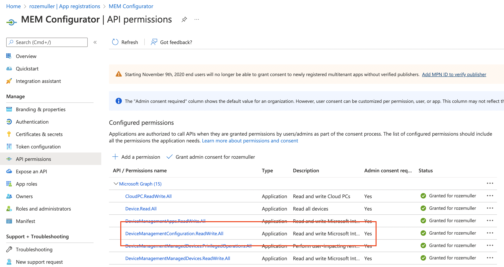
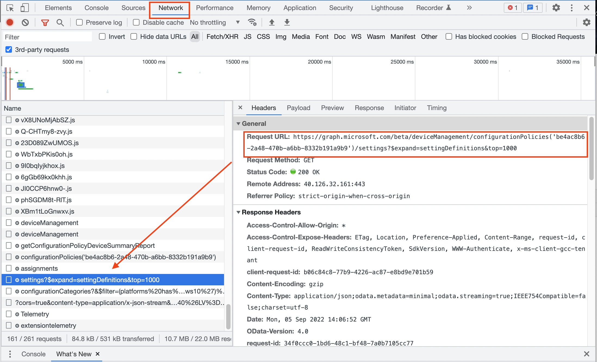
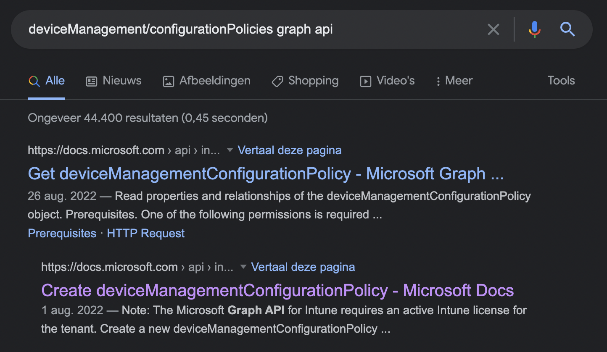

I show in this blog how to create a device configuration profile based on the settings catalog in Intune. A while ago I[ created a profile with power settings and deployed the profile to all devices including a filter](https://www.rozemuller.com/deploy-power-settings-automated-in-microsoft-endpoint-manager/). 

In this blog, I show how to grab settings from an existing policy and create a template from that. 

Let's say this is also IAAC (Intune As A Code)




## What is the Settings Catalog
The Settings catalog in Microsoft Endpoint Manager lists all the settings you can configure in one place. This feature simplifies how you create a policy, and how you see all the available settings. More settings are continually being added. If you prefer to configure settings at a granular level, similar to on-premises GPO, then the settings catalog is a natural transition.


For more information about the settings catalog please check https://docs.microsoft.com/en-us/mem/intune/configuration/settings-catalog

## Why Graph API?
There are a lot of PowerShell modules available for managing Intune. Think about [Microsoft.Graph.Intune](https://github.com/microsoft/Intune-PowerShell-SDK) or [IntuneWin32App](https://github.com/MSEndpointMgr/IntuneWin32App). They all work fine but rely on other PowerShell modules.  

The most important module is the old AzureAD and AzureAD.Preview PowerShell modules that are deprecated. Also, the AzureAD modules rely on an old .NET assembly for PowerShell 5.1. I use DevOps to automate Intune configuration deployments that use PowerShell core and having issues installing the extra modules or Windows-specific dll-files that I don't have on MAC. 
In automation, I try to be less dependent as possible. 

---
Another reason for using the Graph API instead of PowerShell modules is the use of parameters. PowerShell commands need parameters. REST API needs a body with content.  
The advantage of using a body is all the configuration is in that body. The 'body'-file is acting like a template. Having that body is also having a backup. 


---
The last example is complexity. It sounds a bit weird but using the Graph API in PowerShell is way simpler. You only have to remember just one command instead of a bunch of commands for every configuration. The command to be used is ``` Invoke-RestMethod```. And, if you are not that familiar with PowerShell also other options like using [Graph Explorer](https://developer.microsoft.com/en-us/graph/graph-explorer) or [Postman](https://www.postman.com/).

In the further steps I use PowerShell.

## Interact Intune with PowerShell and Graph API
In the automation world, I try to be less dependent as possible. That means to me that I force myself to use out-of-the-box options as much as possible, with no extra module downloads etc. The most out-of-the-box option to interact with Intune is the Graph API. In the end, every module (and browsers) interacts over the Graph API. 

### Graph API Methods
There are several API methods available that tell **how** you interact with the Graph API.

|Method|Description|
|--|--|
|GET|Read data from a resource.|
|POST|Create a new resource, or perform an action.|
|PATCH|Update a resource with new values.|
|PUT|Replace a resource with a new one.|
|DELETE|Remove a resource.|


### Authenticate to Graph API
To deploy settings in Microsoft Endpoint Manager we need to authenticate. I've configured an application registration in Azure AD and set the correct API permissions. To get the correct permissions for a specific action check the Graph API documentation. 

In this case, I create a device management configuration policy. The documentation tells me I need the following permissions:

- **DeviceManagementConfiguration.ReadWrite.All**   
    *(Allows the app to read and write properties of Microsoft Intune-managed device configuration and device compliance policies and their assignment to groups, without a signed-in user.)*



https://docs.microsoft.com/en-us/graph/api/intune-deviceconfigv2-devicemanagementconfigurationpolicy-create?view=graph-rest-beta#prerequisites

To authenticate against the Graph API I used the PowerShell code below:

```powershell
$appId = ""
$appSecret = ""
$tenantId = ""

$body = @{    
    grant_Type    = "client_credentials"
    scope         = "https://graph.microsoft.com/.default"
    client_Id     = $appId
    client_Secret = $appSecret 
} 
$connectParams = @{
    uri = "https://login.microsoftonline.com/{0}/oauth2/v2.0/token" -f $tenantId
    method = "POST" 
    body = $body
}
$connect = Invoke-RestMethod @connectParams
$authHeader = @{
    'Content-Type' = 'application/json'
    Authorization  = 'Bearer ' +$connect.access_token
}
```

If you are not that familiar with REST API authentication then it also possible to use the PowerShell command ```Get-AzAccessToken```. To use that command you need to connect to Azure first with ```Connect-AzAccount```. 
I also connect with the application credentials. If you use these commands, install the ```Az.Accounts``` PowerShell module (it's a dependency).

```powershell
$passwd = ConvertTo-SecureString $appSecret -AsPlainText -Force
$pscredential = New-Object System.Management.Automation.PSCredential($appId, $passwd)
Connect-AzAccount -ServicePrincipal -Credential $pscredential -Tenant $tenantId
$token = Get-AzAccessToken -ResourceUrl 'https://graph.microsoft.com'
$authHeader = @{
    'Content-Type' = 'application/json'
    Authorization  = 'Bearer ' + $token.Token
}
```

### Why use an application registration
The answer why using an application registration is because an application has a multi-purpose solution. An application can be used to log in from my device as it can be used in an automation task configured as a service connection in DevOps for example. 

You should only use application registrations if the source is out of Azure, mostly during deployments. When using Azure resources like Logic Apps or Azure Functions you should consider the use of managed identities. For more information about managed identity please check: https://docs.microsoft.com/en-us/azure/app-service/overview-managed-identity?tabs=portal%2Chttp 

## Settings catalog from an automation perspective
Yes, we have settings, a lot :). But what I mean with parts is that there is more than just settings. Settings are a part of the total. Let's take a look when we search for a configuration policy using the Graph API. 

Settings do have almost a not to guess name and value. Building a configuration profile from scratch directly in code is therefore not very easy. That is the reason I configure a profile in the portal first and convert it back to code afterward. 

> If you have to deploy a configuration profile just one time, I suggest also create a JSON export from the profile. In that case the file can be used as backup.

### How do I get settings before automation
A good place to start is at https://endpoint.microsoft.com and then press F12. On the right side, a new window comes up. Go to the network tab in the new window and look at what is filling out there after refreshing the page.
In the long list search for results that look like an URL. 



Look into the headers tab and copy the representing request URL. Based on the URL in the screenshot, A good step is searching for ```deviceManagement/configurationPolicies graph api```. No doubt you will find the correct Microsoft docs about how to use this Graph API URL.



### Save the settings into a JSON file
I extracted the URL from the example above.
```https://graph.microsoft.com/beta/deviceManagement/configurationPolicies('be4ac8b6-2a48-470b-a6bb-8332b191a9b9')/settings?$expand=settingDefinitions&top=1000```
When executing this URL I only got the settings where I need the policy itself as well. Because of that, I modified the URL to the one below.
```https://graph.microsoft.com/beta/deviceManagement/configurationPolicies('be4ac8b6-2a48-470b-a6bb-8332b191a9b9')?$expand=settings```

This URL requests the configuration policy itself including the settings. 
Save the URL as a variable in PowerShell and execute the request with the ```Invoke-RestMethod``` PowerShell command.

```powershell
$url = "https://graph.microsoft.com/beta/deviceManagement/configurationPolicies('be4ac8b6-2a48-470b-a6bb-8332b191a9b9')?`$expand=settings"
$method = "GET"

$request = Invoke-RestMethod -Uri $url -Method $method -Headers $authHeader
$request | ConvertTo-Json -Depth 99 | Out-File .\configpolicy.json
```

I use the ```GET``` method for reading the data and saving the data into a JSON file. 

## Deploy profile based on settings catalog
To deploy new configurations with the REST API I use the ```POST``` method. Imagine we have a new tenant and have to deploy a configuration profile.
Based on the created ```configpolicy.json``` file I used almost the same code as above. Only we have to add more parameters.

When using POST or PATCH we have to provide a body. The REST API accepts a JSON body. To tell the API we have a JSON body I declare a content type in the request with ```-ContentType 'application/json'```


```powershell
$requestParameters = @{
  uri    = "https://graph.microsoft.com/beta/deviceManagement/configurationPolicies"
  method = "POST"
  body   = Get-Content .\configpolicy.json
  contentType = 'application/json'
  headers = $authHeader
}
$request = Invoke-RestMethod @requestParameters
$request
```

## Assignment
Assigning policies is the next step where more options are available. 
In this part of my earlier power setting blog post, I show how to assign a policy to all devices based on filters.   
https://www.rozemuller.com/deploy-power-settings-automated-in-microsoft-endpoint-manager/#power-settings-assignment-with-filters


