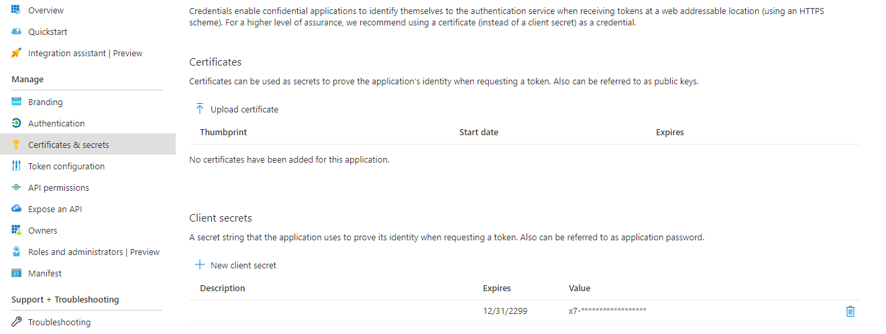

The past few years REST API became important more and more. REST API is a common way for communicating against and between applications. Azure and Microsoft 365 also using REST API’s.   
As the world of API is growing so the tooling for querying API’s is growing with the most well known tool is [Postman](https://www.postman.com/).

But what if you need API output for automation purposes, Postman isn’t the tool you need. So in my case I use Powershell.



## Register an app in Azure AD

  
If you use Powershell you need a couple of things before you can send an authentication request. First of all you need to register an app into the Azure Active Directory. How to accomplish this goal manual you can take a look at the following url: https://docs.microsoft.com/en-us/graph/auth-register-app-v2.If you want to register an application automated with code you can check my post about application registration automated.

After the application is finished and you have set an application secret you can use the applicationId and secret in PowerShell.



## Get a token in Powershell

Now the needed application is finished we can start with the Powershell part. Good to know is there are some different Microsoft parts where you can authenticate with.   
From Azure perspective most of the time you need the Graph API so you can authenticate with https://graph.microsoft.com.   
When you want to query Microsoft 365 you will need https://manage.office.com.

In Powershell the code looks like this

```powershell
$resource = "https//graph.microsoft.com"
$tenantId = "the tenant you want to authenticate to"
$clientId = "the application id"
$clientSecret = "The secret you have created under secrets"
$body = @{grant_type = "client_credentials"; resource = $resource; client_id = $ClientId; client_secret = $ClientSecret }

$oauth = Invoke-RestMethod -Method Post -Uri "https://login.microsoftonline.com/$($tenantID)/oauth2/token?api-version=1.0" -Body $body
$token = @{'Authorization' = "$($oauth.token_type) $($oauth.access_token)" }
```

## Whats next

Now you have a token in the $token variable. After then you can query against API’s. For example the Microsoft 365 ServiceHealth. In this case i’ve used the GET method.

```powershell
$uri = "https://manage.office.com/api/v1.0/$($tenantId)/ServiceComms/CurrentStatus"
Invoke-RestMethod -Uri $uri -Headers $token -Method Get
```

Some other common used methods are POST (create a new record) or PATCH (partial updating records)  
You can find a whole explanation about REST API’s at https://docs.microsoft.com/en-us/graph/use-the-api

