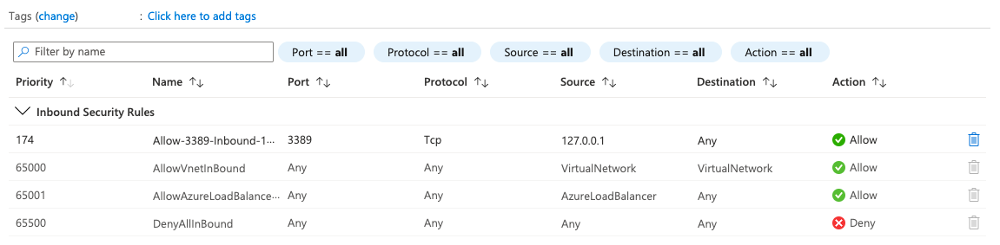
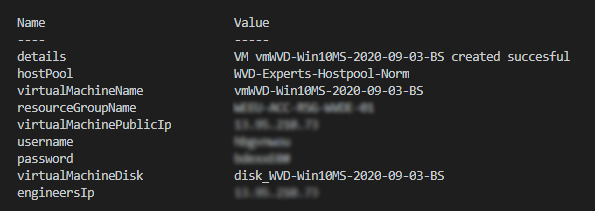
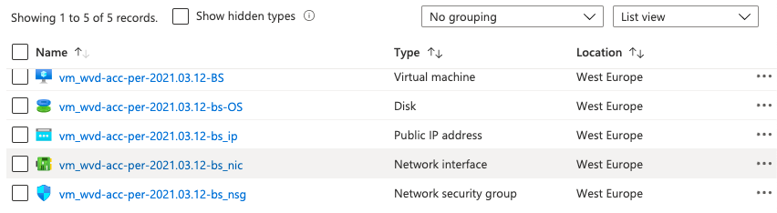

This article is part one of a series of posts about AVD image management automated. In this first part, I will describe how to create and connect a new disk (based on a snapshot) to a new Azure VM based on the existing sessionhost configuration. This will save a lot of extra parameters like VM size, network settings, and type. After the VM is started you will get the information on how to connect to the VM by RDP (3389) with specific credentials specially created for this VM.

*Updated 14-03-2021*

This post is a part of the series AVD Image Management Automated.

1. [Create AVD image version based on existing config with PowerShell – Part 1](https://www.rozemuller.com/create-avd-image-version-based-on-existing-config-with-powershell/)
2. [Save AVD image with Sysprep as Image Gallery version – Part 2](https://www.rozemuller.com/save-avd-image-with-sysprep-as-image-gallery-version/)
3. [Create AVD Session hosts based on Shared Image Gallery version – Part 3](https://www.rozemuller.com/azure-virtual-desktop-image-management-automated-part-3-create-avd-sessionhosts-based-on-shared-image-gallery-version-with-arm/)
4. [AVD housekeeping, removing all unused session hosts](https://www.rozemuller.com/azure-virtual-desktop-image-management-automated-part-4-avd-clean-up-unused-resources/), disks,[ and images – Part 4 ](https://www.rozemuller.com/azure-virtual-desktop-image-management-automated-part-4-avd-clean-up-unused-resources/)
5. [Monitor Image Versions with Azure Monitor – Part 5](https://www.rozemuller.com/azure-virtual-desktop-image-management-automated-part-5-monitor-image-versions-with-azure-monitor/)



## AVD in a nutshell

Azure Virtual Desktop is a desktop and app virtualization service that runs on the cloud. For a full description click here  
In the basic AVD exists in three big parts: clients, AVD, and the Azure VM’s &amp; Services. As the picture below says only AVD is Microsoft managed. For that part you can use ARM templates and you are out of control at that part.


The real fun starts at the dynamic environment like clients and VM’s. In this article we will focus how to deal with disk- and image management automatically.  
Since AVD has no image provisioning like Citrix, disk management goes a bit different. Before knowing how to automate things it is good to know which elements we need and how the tasks need to be done when an image needs to be updated.

## Requirements

### PowerShell Modules

Microsoft has enrolled a new PowerShell module for Windows Virtual Desktop. For executing commands in this article you need this module. How to setup this module please check [https://docs.microsoft.com/en-u](https://docs.microsoft.com/en-us/azure/virtual-desktop/powershell-module)[s](https://docs.microsoft.com/en-us/azure/virtual-desktop/powershell-module)[/azure/virtual-desktop/powershell-module](https://docs.microsoft.com/en-us/azure/virtual-desktop/powershell-module)

We also need the az.network and az.compute PowerShell Modules

## Used Azure components

- Windows Virtual Desktop Hostpool
- Virtual Machines (sessions hosts in a hostpool)
- Disks &amp; Snapshots
- Network
- Shared Image Gallery

## Finding hostpool and session hosts

In this case, I assume you already have an AVD environment with a hostpool, and session hosts. I will talk about AVD environment deployment later.

First, we need to know in which hostpool you want to create a new disk. So the script will ask you for that. After all, actually, these are the only variables you really need :). Since the hostpool is the main AVD part we know every other component.   
I’ve added an extra variable $localPublicIp. I will talk about this later in this topic. I’m also importing the needed modules.

```powershell
param(
    [parameter(mandatory = $true)][string]$hostpoolName,
    [parameter(mandatory = $true)][string]$snapshotName,
    [parameter(mandatory = $true)][string]$localPublicIp
)

import-module az.desktopvirtualization
import-module az.network
import-module az.compute

# Get AVD hostpool information
$hostpool = Get-AzWvdHostPool | Where-Object { $_.Name -eq $hostpoolname }
$hostpoolResourceGroup = ($hostpool).id.split("/")[4]
# Get current AVD Configurgation
$sessionHosts = Get-AzWvdSessionHost -ResourceGroupName $hostpoolResourceGroup -HostPoolName $hostpool.name
$sessionHostName = ($sessionHosts.Name.Split("/")[-1]).Split(".")[0]
$currentVmInfo = Get-AzVM -name $sessionHostName
$virtualMachineSize = $currentVmInfo.hardwareprofile.vmsize
$virtualNetworkSubnet = (Get-AzNetworkInterface -ResourceId $currentVmInfo.NetworkProfile.NetworkInterfaces.id).IpConfigurations.subnet.id
```

Now we have our hostpool and session hosts loaded, the next step is the needed snapshot. This should be a snaphost which has been not syspreped before. This is because of its limits.

*You can run the **Sysprep** command up to 8 times on a single Windows image. After running Sysprep 8 times, you must recreate your Windows image. In previous versions of Windows, you could use the `SkipRearm` answer file setting to reset the Windows Product Activation clock when running Sysprep. If you are using a volume licensing key or a retail product key, you don’t have to use `SkipRearm` because Windows is automatically activated.*

More information about [sysprep a Windows installation check the Microsoft docs.](https://docs.microsoft.com/en-us/windows-hardware/manufacture/desktop/sysprep--generalize--a-windows-installation)

```powershell
# Snapshot values for creating a disk
try {
    $snapshot = get-azsnapshot -SnapshotName $snapshotname
    $resourceGroupName = $snapshot.ResourceGroupName
}
catch {
    Throw "No snapshot found, $_"
}
```

After loading all the basics it is time to deploy things to Azure. Because of the number of temporary components, I will create a new resource group first. This will help you clean up resources at the end since every component is in the same resource group. Just deleting the resource group will be fine then.

```powershell
# Creating a new temporary resource group first
$ResourceGroup = New-AzResourceGroup -Name $TempResourceGroup -Location $ResourceGroupLocation
```

## Disk configuration

When creating a new disk you need to set up a disk configuration. After then you can create a new disk if it not exists already.

```powershell
$VirtualMachineName = ('vm_' + $snapshot.name)
# Creating a disk
$diskConfig = New-AzDiskConfig -SkuName "Premium_LRS" -Location $ResourceGroup.location -CreateOption Copy -SourceResourceId $snapshot.Id
$diskname = ($VirtualMachineName.ToLower()+ '-OS')
$disk = Get-azdisk -diskname $diskname
try {
    $disk = New-AzDisk -Disk $diskConfig -ResourceGroupName $ResourceGroup.resourceGroupName -DiskName $diskName
}
catch {
    Throw "$diskname allready exits, $_"
}
```

## Networking

The next step is the networking part. This consists of three components. A network interface card, public ip and a network security group. In the first part I will create a public IP. This will be the IP to connect when the virtual machine is finished.   
In the next step I will create a network interface card and will connect the public IP to it.

In the third step I will create a Network Security Group (NSG) to protect the virtual machine for attackers. The NSG will be connected to the virtual machine only. Positive side effect is we leave the production NSG which is on the AVD subnet untouched.   
At last I will add the RDP port 3389 to the NSG with my private IP only instead of the whole internet. The function Add-FirewallRule can be found in the [complete script at my GitHub page](https://github.com/srozemuller/Windows-Virtual-Desktop/blob/master/Image%20Management/WVD-Create-UpdateVM.ps1).

```powershell
$PublicIpParameters = @{
    Name              = ($VirtualMachineName.ToLower() + '_ip')
    ResourceGroupName = $ResourceGroup.ResourceGroupName
    Location          = $ResourceGroup.Location
    AllocationMethod  = 'Dynamic'
    Force             = $true
}
$publicIp = New-AzPublicIpAddress @PublicIpParameters

$NicParameters = @{
    Name              = ($VirtualMachineName.ToLower() + '_nic')
    ResourceGroupName = $ResourceGroup.resourceGroupName
    Location          = $ResourceGroup.Location
    SubnetId          = $virtualNetworkSubnet
    PublicIpAddressId = $publicIp.Id
    Force             = $true
}
$nic = New-AzNetworkInterface @NicParameters

# Creating a temporary network security group
$NsgParameters = @{
    ResourceGroupName = $ResourceGroup.ResourceGroupName
    Location          = $ResourceGroup.Location
    Name              = ($VirtualMachineName.ToLower() + '_nsg')
}
$nsg = New-AzNetworkSecurityGroup @NsgParameters

# Adding a security rule to only the network interface card
Add-FirewallRule -NSG $NSG -localPublicIp $localPublicIp -port 3389
$nic.NetworkSecurityGroup = $nsg
$nic | Set-AzNetworkInterface
```


## Create VM

Now the network is in place and save let’s create a new VM with a new disk based on a snapshot.

```powershell
# Creating virtual machine configuration
$VirtualMachine = New-AzVMConfig -VMName $VirtualMachineName -VMSize $virtualMachineSize
# Use the Managed Disk Resource Id to attach it to the virtual machine. Please change the OS type to linux if OS disk has linux OS
$VirtualMachine = Set-AzVMOSDisk -VM $VirtualMachine -ManagedDiskId $disk.Id -CreateOption Attach -Windows
# Create a public IP for the VM
$VirtualMachine = Add-AzVMNetworkInterface -VM $VirtualMachine -Id $nic.Id
#Create the virtual machine with Managed Disk
$newVm = New-AzVM -VM $VirtualMachine -ResourceGroupName $ResourceGroup.resourceGroupName -Location $ResourceGroup.Location
```

When the VM is created we create an username and password in the VM by installing the VMAccessAgent extention.  
<https://docs.microsoft.com/en-us/troubleshoot/azure/virtual-machines/support-agent-extensions>

## Generate credentials

First we need to create a random username and password. I also created a function for that as well, which can be found in the complete script.

```powershell
$userName = create-randomString -type 'username'
$password = ConvertTo-SecureString (create-randomString -type 'password') -AsPlainText -Force
$Credential = New-Object System.Management.Automation.PSCredential ($userName, $password);

$CredentialParameters = @{
    ResourceGroupName  = $ResourceGroup.ResourceGroupName
    Location           = $ResourceGroup.Location
    VMName             = $VirtualMachineName
    Credential         = $Credential
    typeHandlerVersion = "2.0"
    Name               = "VMAccessAgent"
}
Set-AzVMAccessExtension @CredentialParameters
```

## How to use

An example of how to use this script.

```powershell
$hostpoolname = 'avd-hostpool'
$snapshotname = 'avd-acc-per-2021.03.12-BS'
$TempResourceGroup = 'temp-deploy-updates'
$ResourceGroupLocation = 'westeurope'
$localPublicIp = '127.0.0.1'

.\WVD-Create-UpdateVM.ps1 -HostpoolName $hostpoolname -SnapshotName $snapshotname -TempResourceGroup $TempResourceGroup -ResourceGroupLocation $ResourceGroupLocation -localPublicIp $localPublicIp
```

## Results

At last we combining everything we know together to write the content to our screen.

```powershell
if ($newVm) {
    #Adding the role
    $publicIp = (Get-AzPublicIpAddress | where { $_.name -match $VirtualMachineName }).IpAddress
    $bodyValues = [Ordered]@{
        Status                 = $newVm.StatusCode
        hostPool               = $hostpoolName
        virtualMachineName     = $VirtualMachineName
        resourceGroupName      = $ResourceGroup.ResourceGroupName
        virtualMachinePublicIp = $publicIp
        username               = $userName
        password               = $password | ConvertFrom-SecureString -AsPlainText
        virtualMachineDisk     = $diskname
        engineersIp            = $localpublicIp
    }
}
Write-Output $bodyValues
```



The whole script from this article can be found at my [Github Windows Virtual Desktop repository](https://github.com/srozemuller/Windows-Virtual-Desktop/tree/master/Image%20Management).  
  
In the next episode I will describe how to finish the disk with an automated sysprep and moving the disk as a version into the Azure Shared Image Gallery.

Thank you for reading my blog post about AVD Image Management Automated.
