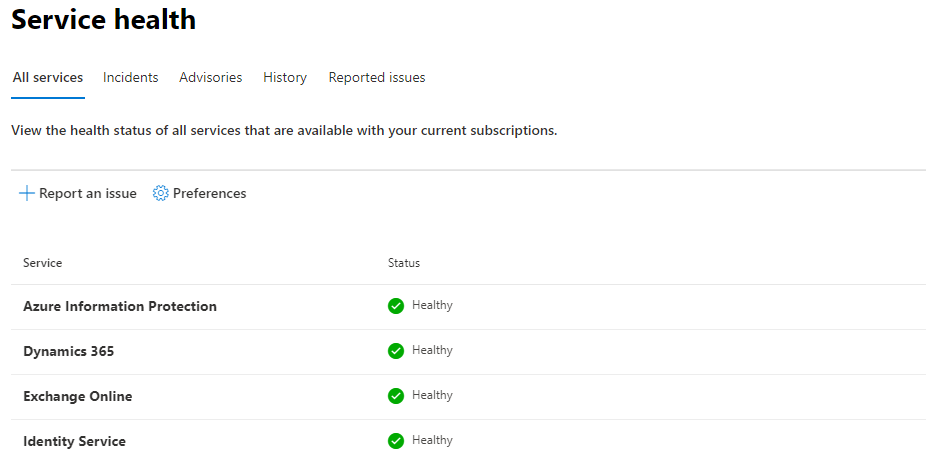
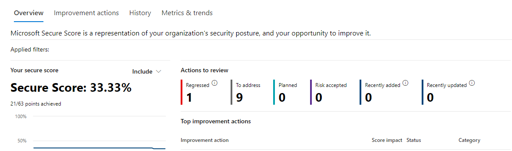

You have some Microsoft 365 (M365) customers which you like to monitor. Every day you are looking at the customer specific M365 portal looking for Microsoft event.

<mark>Logging in </mark>at the<mark> customers portal isn’t a very efficient way.</mark> <mark>Microsoft provides a lot of API’s which can be used for monitoring.</mark> By combining some of them you are able to do some really nice and smart things.




As you may properly know Microsoft provide a ServiceHealth API for monitoring the Microsoft 365 services. By requesting API you get all messages even from services you don’t use. Well there is a way to filter only the services you use in your tenant.


### Getting the messages

In my blogpost about authenticating against the API with PowerShell i’ve wrote in basics how to get an authentication token which you need for requesting an API.   
[How to use](https://www.rozemuller.com/how-to-use-rest-api-with-powershell/) [REST](https://www.rozemuller.com/how-to-use-rest-api-with-powershell/)[API with Powershell](https://www.rozemuller.com/how-to-use-rest-api-with-powershell/)  
  
First you need to request the ServiceHealth message API. This API shows every message for the past few weeks.

```powershell
GET https://manage.office.com/api/v1.0/contoso.com/ServiceComms/Messages
```

To get the right token you need to authenticate to manage.office.com. Authenticating against the wrong resource will result in a “*invalid audience*” error

In PowerShell the request looks like this:

```powershell
$tenantId = xxx
$resource = "https//manage.office.com"
$clientId = "the application id"
$clientSecret = "The secret you have created under secrets"
$body = @{grant_type = "client_credentials"; resource = $resource; client_id = $ClientId; client_secret = $ClientSecret }
$oauth = Invoke-RestMethod -Method Post -Uri "https://login.microsoftonline.com/$($tenantID)/oauth2/token?api-version=1.0" -Body $body
$token = @{'Authorization' = "$($oauth.token_type) $($oauth.access_token)" }

$uri = "https://manage.office.com/api/v1.0/$tenantId/ServiceComms/Messages"
$allMessages = Invoke-RestMethod -Uri $uri -Headers $token -Method Get
$allMessages.Value 
```

After running these commands you get some output like this:

```basic
AffectedWorkloadDisplayNames : {}
AffectedWorkloadNames        : {}
Status                       : Service restored
Workload                     : SharePoint
WorkloadDisplayName          : SharePoint Online
ActionType                   :
AdditionalDetails            : {@{Name=NotifyInApp; Value=True}}
AffectedTenantCount          : 0
AffectedUserCount            :
Classification               : Incident
EndTime                      : 9/24/2020 6:14:10 PM
Feature                      : customsolutionsworkflows
FeatureDisplayName           : Custom Solutions and Workflows
UserFunctionalImpact         : 
Id                           : SP222774
ImpactDescription            : Users did not receive email notifications from SharePoint Online.
LastUpdatedTime              : 9/24/2020 6:21:20 PM
MessageType                  : Incident
Messages                     : {@{MessageText=Title: Some users are not receiving email notifications through SharePoint Online

                               User Impact: Users are not receiving email notifications through SharePoint Online.

                               Current status: We're investigating a potential issue with SharePoint Online where users are not receiving email notifications through SharePoint Online. We'll 
                               provide an update within 30 minutes.; PublishedTime=9/24/2020 6:56:49 AM}, @{MessageText=Title: Some users are unable to receive email notifications in SharePoint      
                               Online

                               Next update by: Thursday, September 24, 2020, at 1:00 PM UTC; PublishedTime=9/24/2020 10:37:34 AM}…}
PostIncidentDocumentUrl      :
Severity                     : Sev2
StartTime                    : 9/24/2020 6:53:54 AM
TenantParams                 : {}
Title                        : Users did not received email notifications from SharePoint Online
```

### Filtering

Now we have all the Microsoft 365 health messages. If you want to get messages about specific Microsoft services you need to do some filtering at the API URL. See below for an example for Teams. If you have one tenant this will do, if you have more tenants, like MSP’s, it will grab Teams messages over every tenant. This will result in false positives if a tenant don’t use Microsoft Teams.

```powershell
https://manage.office.com/api/v1.0/$tenantId/ServiceComms/Messages?$filter=Workload eq 'Teams'
```

Writing tenant specific filter queries will work if you have a few. If you have many more you should consider an other option. One of the options I will explain below.

### Tenant Info

There is a way how to determine which services a tenant is using automatically. A M365 tenant has a security page which tells you about your tenants security status. The status page will be refreshed every 24 hours.


Behind the status page there are some API’s available which provide security info and tenant specific details like enabled services.

```powershell
GET https://graph.microsoft.com/beta/security/securescores?`$top=1
```

Not using the $top=1 filter will result in 90 results. Only the most recent value is fine for now. After requesting the API the info you will get look like this:

```powershell
id                       : 85bxxxca-b5c4-4xxf-a869-d21xxxx992c9_2020-09-28
azureTenantId            : 85bxxxca-b5c4-4xxf-a869-d21xxxx992c9
activeUserCount          : 1288
createdDateTime          : 9/28/2020 12:00:00 AM
currentScore             : 70
enabledServices          : {HasExchange, HasProject, HasSharePoint, HasOD4B…}
licensedUserCount        : 502177
maxScore                 : 238
```

As you can see it has an object call enabledServices. After doing some PowerShell magic manipulating the string you only have the services itself.

T*he security API ‘lives’ at a Microsoft different part* so *you will need to get a new token.* Authenticate to *graph.microsoft.com*.  
  
After receiving the security token you can run the following PowerShell command:

```powershell
$uri = https://graph.microsoft.com/beta/security/securescores?`$top=1
$query = Invoke-WebRequest -Method $method -Uri $uri -ContentType "application/json" -Headers @{Authorization = "Bearer $token" } -ErrorAction Stop 
$ConvertedOutput = $query | Select-Object -ExpandProperty content | ConvertFrom-Json

$convertedoutput.value.enabledServices.replace("Has", $null)

Exchange
Project
SharePoint
OD4B
Yammer
```

The output after removing “has” is exactly the same as the message Workload content shown at the beginning of this post.

```basic
Workload                     : SharePoint
```

### Bring the parts together

Having those two parts we can bring these two parts together. First we need to gather all the messages into a variable. After getting the messages we are going to load the tenantinfo in a variable too.   
I wrote a function for getting the tenant information.

```powershell
function get-tenantInfo {
    param
    (
        [Parameter (Mandatory = $true)][object] $tenantId,
        [Parameter (Mandatory = $true)][object] $clientId,
        [Parameter (Mandatory = $true)][object] $clientSecret
    )
    $results = @()
    # Construct URI
    $uri = "https://login.microsoftonline.com/$tenantId/oauth2/v2.0/token"
    # Construct Body
    $body = @{
        client_id     = $clientId
        scope         = "https://graph.microsoft.com/.default"
        client_secret = $clientSecret
        grant_type    = "client_credentials"
    }
    write-host  "Get OAuth 2.0 Token"
    # Get OAuth 2.0 Token
    $tokenRequest = Invoke-WebRequest -Method Post -Uri $uri -ContentType "application/x-www-form-urlencoded" -Body $body -UseBasicParsing
    # Access Token
    $token = ($tokenRequest.Content | ConvertFrom-Json).access_token
    # Graph API call in PowerShell using obtained OAuth token (see other gists for more details)
    # Specify the URI to call and method
    $method = "GET"
    $uri = "https://graph.microsoft.com/beta/security/securescores?`$top=1"
    write-host "Run Graph API Query"
    # Run Graph API query 
    $query = Invoke-WebRequest -Method $method -Uri $uri -ContentType "application/json" -Headers @{Authorization = "Bearer $token" } -ErrorAction Stop 
    write-host  "Parse results"
    $ConvertedOutput = $query | Select-Object -ExpandProperty content | ConvertFrom-Json

    write-host  "Display results`n"
    foreach ($obj in $convertedoutput.value) {
        $mainCustomerObject = [PSCustomObject][Ordered]@{
            objectId         = $obj.id
            tenantId         = $obj.azureTenantId
            activeUsers      = $obj.activeUserCount
            date             = $obj.createdDateTime
            enabledServices  = ($obj.enabledServices).replace("Has", $null)
            currentScore     = $obj.currentScore
            maxPossibleScore = $obj.maxScore
        }
        $results += $mainCustomerObject
    }
    return $results
}

$tenantParameters = @{
tenantId = xxx
clientId = xxx
clientSecret = xxx
}
$uri = "https://manage.office.com/api/v1.0/$tenantId/ServiceComms/Messages"
$allMessages = Invoke-RestMethod -Uri $uri -Headers $token -Method Get

$healthMessages = $allMessages.Value 
$tenantInfo = get-TenantInfo @tenantParameters

$allMessages | ? { $tenantInfo.enabledServices -match $_.Workload }
```

Now you have messages fitting the services you use. I’m using Azure Functions which is checking every x time for new messages.

