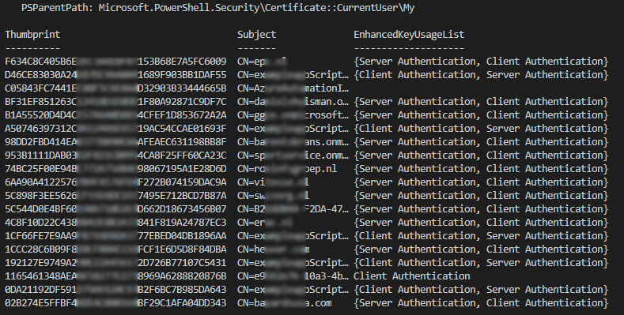
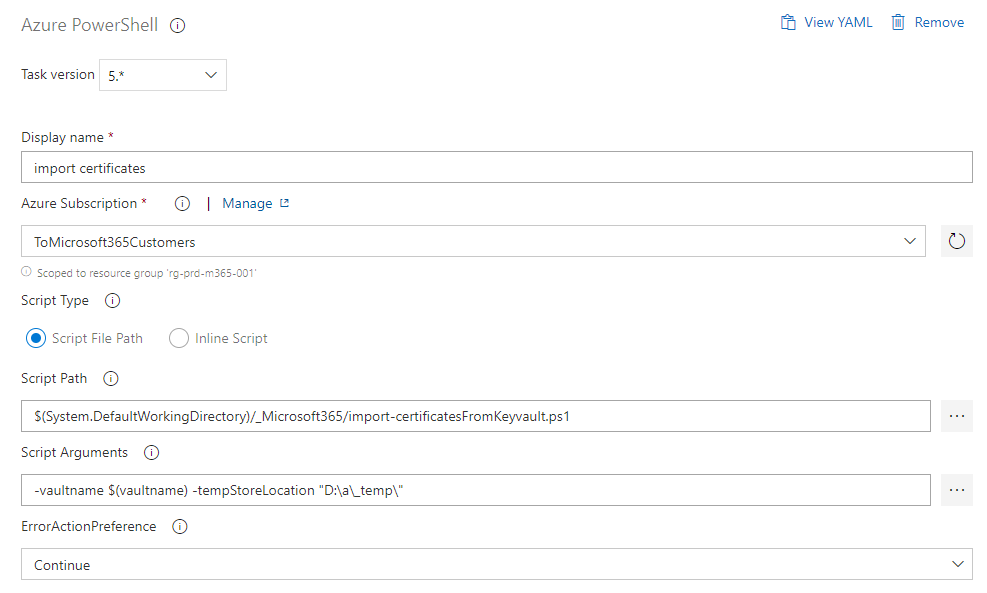

Azure KeyVault is the security key management system in Azure where you can store keys, secrets and certificates. From that place you can use the items everywhere you like.


### The main idea

We using the certificates thumbprint for connecting to an Azure AD. While logged in we like to change application permissions based on a JSON file input. After changing that file the continuous integration (CI) proces in DevOps will take care about the application permission change at all of our customers.

###   
Why using certificates?

Just for a simple reason that a customer does not always have an Azure subscription. You will need a subscription or management group to create a project service connection in DevOps. So we need using certificates in combination with a service principal.

An Azure KeyVault can be used perfectly storing certificates at a save place.   
Before getting logged in you need to get the certificates from the KeyVault and need to install the certificate in a local store first.   
After all a DevOps task is just running on VM with PowerShell. That means that an agent job is able to store things locally on the machine, like certificates in a certificate store. We can use that technology storing the certificates that makes us allow to connect to an Azure AD by certificate thumbprint.

(Yes there is a Azure KeyVault task available for downloading items into seperate variables, actually in this case we need to iterate the whole KeyVault, not just one variable)

###   
Download certificates from KeyVault

The script will accept two parameters, the vaultName and a tempStoreLocation. The vaultName parameter needs no introduction, the tempStoreLocation is the location where the certificates are stored first.

```powershell
param(
    [parameter(mandatory = $true)][string]$vaultName,
    [parameter(mandatory = $true)][string]$tempStoreLocation
    )
```

### The foreach loop

In case there are more certificates needed I created a foreach loop. In the loop each certificate will be exported from the KeyVault to the temp staging location. In order to prevent certificate abuse we will set a password on the certificate, also stored in the KeyVault.   
I recommend a naming convention, this will make life a lot easier. To know the password and certificate combination we use that naming convention, \[customersname\]-\[type\].

At the $prefix variable the -type convention will be deleted, so the customer name will be left.

```powershell
$prefix = ($certificate.name).replace("-certificate", $null)
```

####   
In the loop

In the foreach loop the download and import will be executed

```powershell
   foreach ($certificate in (Get-AzureKeyVaultCertificate -VaultName $vaultName)) {
     $prefix = ($certificate.name).replace("-certificate", $null)
    "Importing certificate $certificate"
     $cert = Get-AzureKeyVaultSecret -VaultName $vaultName -name $certificate.name
    $certBytes = [System.Convert]::FromBase64String($cert.SecretValueText)
    $certCollection = New-Object System.Security.Cryptography.X509Certificates.X509Certificate2Collection
    $certCollection.Import($certBytes, $null, [System.Security.Cryptography.X509Certificates.X509KeyStorageFlags]::Exportable)

    $password = (Get-AzkeyVaultSecret -VaultName $vaultName -Name "$prefix-password").SecretValueText
    $secure = ConvertTo-SecureString -String $password -AsPlainText -Force

    $protectedCertificateBytes = $certCollection.Export([System.Security.Cryptography.X509Certificates.X509ContentType]::Pkcs12, $password)
    $pfxPath = "$tempStoreLocation\$prefix.pfx"
    [System.IO.File]::WriteAllBytes($pfxPath, $protectedCertificateBytes)

    Import-PfxCertificate -FilePath "$tempStoreLocation\$prefix.pfx" Cert:\CurrentUser\My -Password $secure
}
```

Finally we will check the import by executing a dir command

```powershell
Get-ChildItem Cert:\CurrentUser\My
```



### DevOps

After finishing the PowerShell script lets make the DevOps task which will import the needed certificates. This is the YAML from the import certificates task.

Make sure you have the vaultname variable created as pipeline variable.

```yaml
steps:
- task: AzurePowerShell@5
  displayName: 'import certificates'
  inputs:
    azureSubscription: ToMicrosoft365Customers
    ScriptPath: '$(System.DefaultWorkingDirectory)/_Microsoft365/import-certificatesFromKeyvault.ps1'
    ScriptArguments: '-vaultname $(vaultname) -tempStoreLocation "D:\a\_temp\"'
    errorActionPreference: continue
    azurePowerShellVersion: LatestVersion
    pwsh: true
```



From this place the certificates are in the local certificate store at the agent. Make sure you add the certificate dependent tasks in the same agent jobs. This because every agent job (with tasks) runs in an isolated environment.

