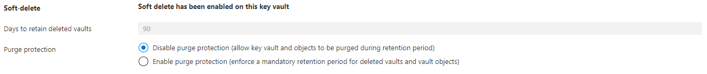
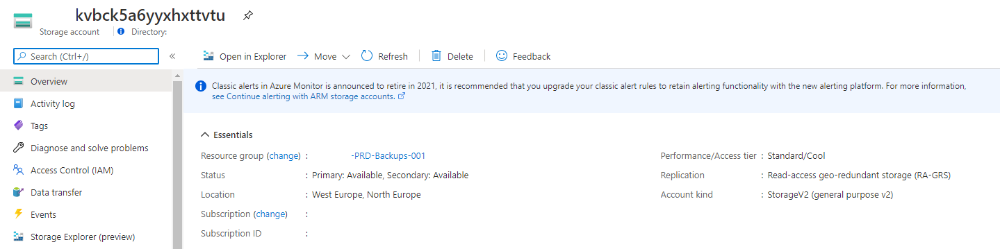
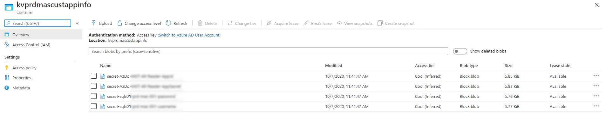
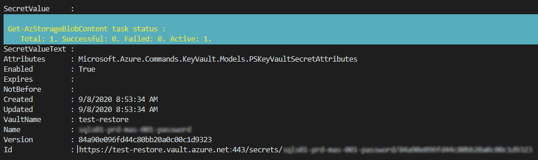
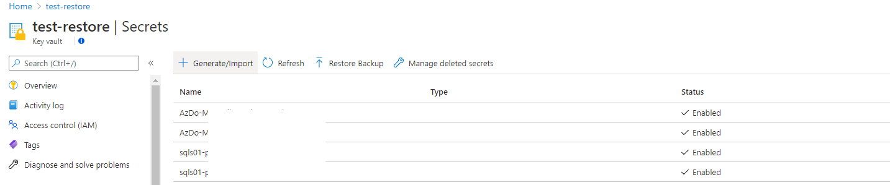

By default the Azure Key Vault has softdelete enabled with a 90 day retention. This option will protect Key Vault items when deleted by accident. When deleted you are able to restore that item through the portal or PowerShell.   
But what if someone has deleted the Key Vault itself with all the items and softdeleted items included. There is no option to restore a Key Vault. In this article I will describe a way how to backup and restore a Key Vault when deleted.



## Azure Key Vault Backup strategy

You have an Azure Key Vault with items, softdelete enabled and want to backup the items. The main idea is to backup every single item into a storage account with PowerShell from an Azure Function. Each Key Vault has its one storage account container. If the storage account is missing the script will create a storage account from an ARM template. The container will be created into to storage account you provided. When created the storage account- and container name will be added to the Key Vault configuration as tags.

The function will run every day.


## Backup items function

To backup a Key Vault item we need to use the AZ.KeyVault PowerShell module. The module has backup commands available which let you choose the backup location. I made a choice to upload all the items once at the end so first we will backup the items to a temporary location.

Initial we need to set some parameters like backup location and template location first.

```powershell
$storageAccountTemplateFile = "https://raw.githubusercontent.com/srozemuller/Azure/main/AzureStorageAccount/azuredeploy.json"
$storageAccountTemplateParameters = "https://raw.githubusercontent.com/srozemuller/Azure/main/AzureStorageAccount/azuredeploy.parameters.json"
$backupFolder = "$env:Temp\KeyVaultBackup"
$location = "West Europe"

$backupLocationTag = "BackupLocation"
$backupContainerTag = "BackupContainer"

$global:parameters = @{
    resourceGroupName = "RG-PRD-Backups-001"
    location          = $location
}
```


For the backup part I wrote a function which accepts the Key Vault name to keep the code nice and clean. The function will take care about the item backup and write it to the temporary location. Later in the script we will call the function.

```powershell

function backup-keyVaultItems($keyvaultName) {
    #######Parameters
    #######Setup backup directory
    If ((test-path $backupFolder)) {
        Remove-Item $backupFolder -Recurse -Force

    }
    ####### Backup items
    New-Item -ItemType Directory -Force -Path "$($backupFolder)\$($keyvaultName)" | Out-Null
    Write-Output "Starting backup of KeyVault to a local directory."
    ###Certificates
    $certificates = Get-AzKeyVaultCertificate -VaultName $keyvaultName 
    foreach ($cert in $certificates) {
        Backup-AzKeyVaultCertificate -Name $cert.name -VaultName $keyvaultName -OutputFile "$backupFolder\$keyvaultName\certificate-$($cert.name)" | Out-Null
    }
    ###Secrets
    $secrets = Get-AzKeyVaultSecret -VaultName $keyvaultName
    foreach ($secret in $secrets) {
        #Exclude any secrets automatically generated when creating a cert, as these cannot be backed up   
        if (! ($certificates.Name -contains $secret.name)) {
            Backup-AzKeyVaultSecret -Name $secret.name -VaultName $keyvaultName -OutputFile "$backupFolder\$keyvaultName\secret-$($secret.name)" | Out-Null
        }
    }
    #keys
    $keys = Get-AzKeyVaultKey -VaultName $keyvaultName
    foreach ($kvkey in $keys) {
        #Exclude any keys automatically generated when creating a cert, as these cannot be backed up   
        if (! ($certificates.Name -contains $kvkey.name)) {
            Backup-AzKeyVaultKey -Name $kvkey.name -VaultName $keyvaultName -OutputFile "$backupFolder\$keyvaultName\key-$($kvkey.name)" | Out-Null
        }
    }
}
```


## Create a backup resource group

Because I want to limit permissions to our backup engineers only I create a specific backup resourece group. In a later stadium I can use this resource group for other backup situations. Setting permissions is out of scope in this article.   
I’ve set the parameter in the beginning of the script.  
If the resource group does not exist the script will create one. If you already have a destination group, just change the parameter value.

```powershell
    if ($null -eq (get-AzResourceGroup $global:parameters.resourceGroupName -ErrorAction SilentlyContinue)) {
        New-AzResourceGroup @global:parameters
    }
```

The next step will check if any Key Vault has the tag “BackupLocation”. By setting this tag I know the Key Vault will backed up. If the tag is missing we first need to create a storage location. When the storage account is created the name will be used as the BackupLocation value.

Because the storage account name is globally unique we need to create a unique name. In the template I set a variable which will generate a unique value. I use a prefix in combination with the resourceGroupId. I haven’t seen issues with this combination yet since the a resourceGroupId is unique by itself.

```json
    "variables": {
        "storageAccountName": "[toLower( concat( parameters('storageNamePrefix'), uniqueString(resourceGroup().id) ) )]",
        "location": "[resourceGroup().location]"
    },
```


```powershell
$keyvaults = Get-AzKeyVault 
    if ($null -eq ($keyvaults | ? { $_.Tags.Keys -match "BackupLocation" })) {
        # if no backuplocation tags is available at any of the keyVaults we will create one first
        $deployment = New-AzResourceGroupDeployment -ResourceGroupName $global:parameters.resourceGroupName -TemplateUri $storageAccountTemplateFile -TemplateParameterUri $storageAccountTemplateParameters
        $backupLocation = $deployment.outputs.Get_Item("storageAccount").value
       
    }
```

After creating a storage account we will update the Key Vault tags by merging with existing tags. Based on the Key Vaults name a container name will be created as well. This name will be used later.

```powershell
            if ($deployment.ProvisioningState -eq "Succeeded") {
                foreach ($keyvault in $keyvaults) {
                    $containerName = $keyvault.VaultName.Replace("-", $null).ToLower()
                    if (!(Get-aztag -ResourceId $keyvault.ResourceId  | ? { $_.Tags.Keys -match $BackupLocationTag }  )) {
                        Update-AzTag $keyvault.ResourceId -operation Merge -Tag @{BackupLocation = $backupLocation; BackupContainer = $containerName }
                    }
                }
            }
```
## Backup Azure Key Vault

Now we have a backup resource group and every Key Vault knows about it, its time to create the backups. The script will read the BackupLocation and BackupContainer tag for every Key Vault and uses that combination to determine the backup location. If the container does not exist the script will create a container first.

```powershell
        else {
            foreach ($keyvault in $keyvaults) {
                $backupLocation = (get-azkeyvault -VaultName $keyvault.vaultname | ? { $_.Tags.Keys -match $BackupLocationTag}).tags.Get_Item($BackupLocationTag)
                $storageAccount = get-AzStorageAccount | ? { $_.StorageAccountName -eq $backupLocation }
                if ($null -eq (Get-aztag -ResourceId $keyvault.ResourceId  | ? { $_.Tags.Keys -match $BackupContainerTag }  )) {
                    $containerName = $keyvault.VaultName.Replace("-", $null).ToLower()
                    Update-AzTag $keyvault.ResourceId -operation Merge -Tag @{BackupContainer = $containerName }
                }
                $containerName = (get-azkeyvault -VaultName $keyvault.vaultname | ? { $_.Tags.Keys -match $backupContainerTag }).tags.Get_Item($backupContainerTag)
                if ($null -eq (Get-AzStorageContainer -Name $containerName -Context $storageAccount.context)) {
                    New-AzStorageContainer -Name $containerName -Context $storageAccount.context
                }
                backup-keyVaultItems -keyvaultName $keyvault.VaultName
                
            }
        }
```

## Upload to the storage account

After the items are backed up to the temporary location it is time to upload the file to the storage account container.

```powershell
foreach ($file in (get-childitem "$($backupFolder)\$($keyvault.VaultName)")) {
                    Set-AzStorageBlobContent -File $file.FullName -Container $containerName -Blob $file.name -Context $storageAccount.context -Force
                }

```




## Restore the Azure Key Vault

If you need to restore the Key Vault first you need to create a Key Vault itself. Mostly you will create a Key Vault with the same name. Due our namingconvention I’m able to determine the original Key Vault name based on the storage account container name.  
By using the following commands you are able to restore items into a Key Vault.

```powershell
$resourceGroup = "RG-PRD-Backups-001"
$storageAccountName = "kvbck5a6yyxhxttvtu"
$storageAccountContainer = "kvprdmascustappinfo"
$context = Get-AzStorageAccount -Name $storageAccountName -ResourceGroupName $resourceGroup
$files = Get-AzStorageBlob -Container $storageAccountContainer -Context $context.Context
$keyVaultName = 'test-restore'
foreach ($file in $files){
    $tempDestination = "c:\temp\$($file.name).blob"
    Get-AzStorageBlobContent -Container kvprdmascustappinfo -Blob $file.name -Context $context.Context -Destination $tempDestination
    if ($file.name -match "key-" ){Restore-AzKeyVaultKey -VaultName $keyVaultName -InputFile $tempDestination}
    if ($file.name -match "secret-" ){Restore-AzKeyVaultSecret -VaultName $keyVaultName -InputFile $tempDestination}
    if ($file.name -match "certificate-" ){Restore-AzKeyVaultCertificate -VaultName $keyVaultName -InputFile $tempDestination}
}
```



At the end I created an Azure Function to take care of the backup part.

I stored the file into my [GitHub](https://github.com/srozemuller/Azure/tree/main/Backup) repository

