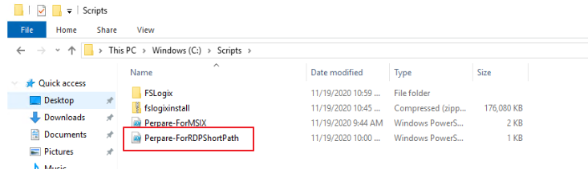
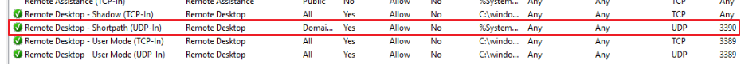
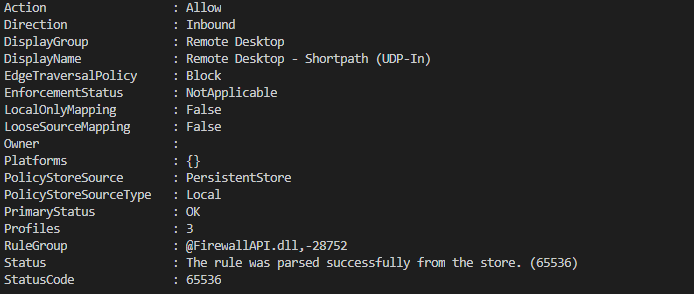
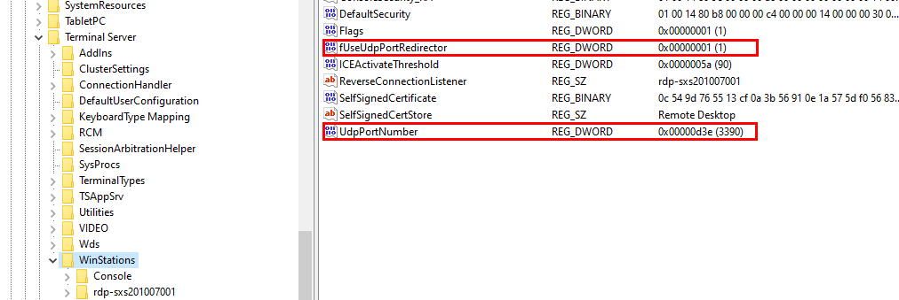
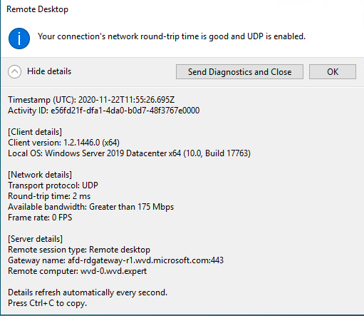

Since Azure Virtual Desktop is generally available a lot of improvements has been done. Think about ARM template deployment, MSIX app attach through the Azure portal and performance improvements in the AVD client and latency improvements at the most of the regions.   
Since 16 November 2020 a nice improvement has been added to the list, Azure Virtual Desktop RDP Short path. In this blogpost I will show you how to enable RDP Shortpath in AVD with some automation tasks.



### Introduction

First some basic background information about Azure Virtual Desktop and default network connectivity. A Azure Virtual Desktop environment consists of host pools, session hosts, workspaces and application groups. If everything has been configured correctly you will be able to connect with a domain account to <https://rdweb.wvd.microsoft.com/arm/webclient/index.html>. After connecting you will able to connect workspaces and/or applications.   
  
The user validation, securing and other connection needs will be handled by the Azure Virtual Desktop gateway and broker. Because I am an automation guy and not a networking guy I will stop talking about networking now :). For a complete networking overview please check the [Azure Virtual Desktop network connectivity page](https://docs.microsoft.com/en-us/azure/virtual-desktop/network-connectivity).

RDP Shortpath is a feature of Azure Virtual Desktop that establishes a direct UDP-based transport between Remote Desktop Client and Session host. RDP uses this transport to deliver Remote Desktop and RemoteApp while offering better reliability and consistent latency. For a complete overview please check the [Shortpath overview](https://docs.microsoft.com/en-us/azure/virtual-desktop/shortpath).

### Prerequisites

Before continuing you will need:

- A Share Image Gallery with an image
- Session hosts booted from the image
- [To support RDP Shortpath, the Windows](https://docs.microsoft.com/en-us/azure/virtual-desktop/shortpath#requirements)[ ](https://docs.microsoft.com/en-us/azure/virtual-desktop/shortpath#requirements)[Virtual Desktop client needs a direct line of sight to the session host](https://docs.microsoft.com/en-us/azure/virtual-desktop/shortpath#requirements)

### Table of contents

For enabling RDP ShortPath in a new image version you do the following steps:

- [Create new virtual machine](#create-new-virtual-machine)
- [Local tasks on the virtual machine](#local-tasks-on-the-virtual-machine)
  - [Configure Network Security Group](#configure-network-security-group)
- [Finalizing the virtual machine](#finalizing-the-virtual-machine)
- [Verify connection](#verify-connection)

## Create new virtual machine

For creating a new virtual I worte a blogpost earlier. Please check my blogpost [Azure Virtual Desktop Image Management Automated – Part 1 – Create AVD image version based on existing config with PowerShell](https://www.rozemuller.com/create-wvd-image-version-based-on-existing-config-with-powershell/). In that post I will explain how to create a new virtual machine based on a existing sessionhost. The only thing you need know is the Azure Virtual Desktop hostpool.   
After following that post at the end you will have an output somthing like this:

<figure class="wp-block-image size-large is-resized"></figure>Use the information for the rest of this article.

## Local tasks on the virtual machine

For enabling the RDP shortpath feature you will need to execute some command on the local virtual machine. Because I don’t want to login I’m using remote PowerShell which allows me to run commands with login into the virtual machine with RDP.   
First of all I created a PowerShell script for the local machine. Before you are able to setup a remote PowerShell connection you will need some parameters first. These are the parameters you received from the [create new virtual machine](#new-vm) part. Beside that you also need some modules and the add-firewallRule function.

```powershell
param(
    [parameter(mandatory = $true, ValueFromPipelineByPropertyName)]$virtualMachineName,
    [parameter(mandatory = $true, ValueFromPipelineByPropertyName)]$resourceGroupName,
    [parameter(mandatory = $true, ValueFromPipelineByPropertyName)]$password,
    [parameter(mandatory = $true, ValueFromPipelineByPropertyName)]$username
)

import-module az.desktopvirtualization
import-module az.network
import-module az.compute


function add-firewallRule() {
    param(
    [parameter(mandatory = $true, ValueFromPipelineByPropertyName)]$NSG,
    [parameter(mandatory = $true, ValueFromPipelineByPropertyName)]$Name,
    [parameter(mandatory = $true, ValueFromPipelineByPropertyName)]$Port,
    [parameter(mandatory = $true, ValueFromPipelineByPropertyName)]$Protocol,
    [parameter(mandatory = $false, ValueFromPipelineByPropertyName)]$Source

)
    if ($null -eq $Source){$Source = "*";$SourceReadable="Any"}
    # Pick random number for setting priority. It will exclude current priorities.
    $InputRange = 100..200
    $Exclude = ($NSG | Get-AzNetworkSecurityRuleConfig | select Priority).priority
    $RandomRange = $InputRange | Where-Object { $Exclude -notcontains $_ }
    $priority = Get-Random -InputObject $RandomRange
    $nsgParameters = @{
        Name                     = $Name
        Description              = $Name
        Access                   = 'Allow'
        Protocol                 = $Protocol 
        Direction                = "Inbound" 
        Priority                 = $priority 
        SourceAddressPrefix      = $Source 
        SourcePortRange          = "*"
        DestinationAddressPrefix = "*" 
        DestinationPortRange     = $Port
    }
    $NSG | Add-AzNetworkSecurityRuleConfig @NSGParameters  | Set-AzNetworkSecurityGroup 
}
```

<div aria-hidden="true" class="wp-block-spacer" style="height:50px"></div>The code below will take care about enabling remote PowerShell on the virtual machine by installing the EnableRemotePS extention. It will also create a NSG rule which allows you to connect. For security reasons I recommend providing a source from where the remote PowerShell connection will be made instead of any. In this example I’m using 127.0.0.1, you will need to change that source of course.

```powershell

$vm = Get-AzVM -name $virtualMachineName -ResourceGroupName $resourceGroupName
$virtualNetworkSubnet = (Get-AzNetworkInterface -ResourceId $vm.NetworkProfile.NetworkInterfaces.id).IpConfigurations.subnet.id
$NSG = Get-AzNetworkSecurityGroup | ? { $_.subnets.id -eq $virtualNetworkSubnet }# Enabling Powershell Remote Extention
$virtualMachinePublicIp = (Get-AzPublicIpAddress | where { $_.name -match $VirtualMachineName }).IpAddress

$connectionUri = "https://" + $virtualMachinePublicIp + ":5986" 
[securestring]$secStringPassword = ConvertTo-SecureString $password -AsPlainText -Force
[pscredential]$creds = New-Object System.Management.Automation.PSCredential ($userName, $secStringPassword)
$session = $null


# Adding Remote PowerShell Extention and NSG configuration
Write-Output "Enabling Powershell Remote Extention"
Invoke-AzVMRunCommand -CommandId "EnableRemotePS" -VM $vm
add-firewallRule -NSG $NSG -port 5986 -Source 127.0.0.1
 -Protocol "TCP" -Name "Allow-port-5986"

```

<div aria-hidden="true" class="wp-block-spacer" style="height:50px"></div>After the extention has been installed and the NSG has been configured you can setup a remote PowerShell connection.

```powershell
while (!($session)) {
    $session = New-PSSession -ConnectionUri $connectionUri -Credential $creds -SessionOption (New-PSSessionOption -SkipCACheck -SkipCNCheck -SkipRevocationCheck)
    Write-Output "Creating Remote Powershell session"
    $session
}


```

After the session has been established we are able to execute remote commands.  
In the first place I will set the execution policy to unrestricted so my script will run. Next the script will test if there is a C:\\Scripts directory allready, if it does not exist we will create one.   
The next part will download the real script which will configure the needed register keys and the local Windows Firewall. At last it will execute the script.

```powershell

# Configure base needs
Invoke-Command -Session $session -ScriptBlock { Set-ExecutionPolicy -ExecutionPolicy Unrestricted }
Invoke-Command -Session $session -ScriptBlock { if(!(Test-Path C:\Scripts)){New-Item -ItemType "directory" -Path "C:\Scripts" } }
# RDP Short path
Invoke-Command -Session $session -ScriptBlock { Invoke-WebRequest -uri https://raw.githubusercontent.com/srozemuller/Windows-Virtual-Desktop/master/SessionHost-Management/Prepare-ForRDPShortPath.ps1 -OutFile C:\Scripts\Perpare-ForRDPShortPath.ps1} 
Invoke-Command -Session $session -ScriptBlock { C:\Scripts\Perpare-ForRDPShortPath.ps1 } 

Disconnect-PSSession -Session $session
Remove-PSSession -Session $session

```

After the script has run locally you will see the prepare script in C:\\Scripts. The Prepare-ForRDPShortpath.ps1 content will take care of the register keys and the local Windows Firewall

```powershell
$WinstationsKey = 'HKLM:\SYSTEM\CurrentControlSet\Control\Terminal Server\WinStations'
if(Test-Path $WinstationsKey){
    New-ItemProperty -Path $WinstationsKey -Name 'fUseUdpPortRedirector' -ErrorAction:SilentlyContinue -PropertyType:dword -Value 1 -Force
    New-ItemProperty -Path $WinstationsKey -Name 'UdpPortNumber' -ErrorAction:SilentlyContinue -PropertyType:dword -Value 3390 -Force
}

New-NetFirewallRule -DisplayName 'Remote Desktop - Shortpath (UDP-In)'  -Action Allow -Description 'Inbound rule for the Remote Desktop service to allow RDP traffic. [UDP 3390]' -Group '@FirewallAPI.dll,-28752' -Name 'RemoteDesktop-UserMode-In-Shortpath-UDP'  -PolicyStore PersistentStore -Profile Domain, Private -Service TermService -Protocol udp -LocalPort 3390 -Program '%SystemRoot%\system32\svchost.exe' -Enabled:True
Restart-Computer $env:computername -Force
```


The local Windows Firewall has been set.




The needed registry keys.



### Configure Network Security Group

After the local settings has been done the next step is to add port 3390 to the correct NSG. In this step we will execute the add-firewallRule function again, this time without a source.

```powershell

# Adding the role for RDP Shortpath
add-firewallRule -NSG $NSG -port 3390 -Protocol "UDP" -Name "Allow-3390"
```

## Finalizing the virtual machine

The second last step is Sysprep the virtual machine and create a new version into the Shared Image Gallery. I talked about how to Sysprep and create a new version automatically in [part 2 of Azure Virtual Desktop Image Management Automated](https://www.rozemuller.com/save-wvd-image-with-sysprep-as-image-gallery-version/).

The very last step is adding the new virtual machines to the Azure Virtual Desktop hostpool. How to achieve that goal fully automatically please check [part 3 Create AVD sessionhosts on image version](https://www.rozemuller.com/windows-virtual-desktop-image-management-automated-part-3-create-wvd-sessionhosts-based-on-shared-image-gallery-version-with-arm/)

## Verify connection

At the end after connecting with the Windows Remote Client (download via [Windows desktop client page](https://docs.microsoft.com/nl-nl/windows-server/remote/remote-desktop-services/clients/windowsdesktop#install-the-client)) and the Workspace tab you are able to view the connection settings.

