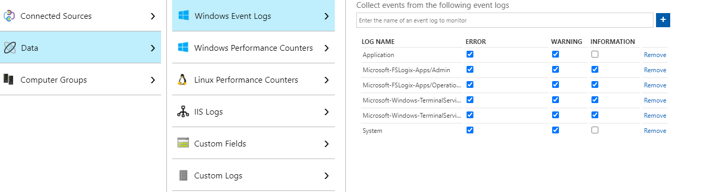
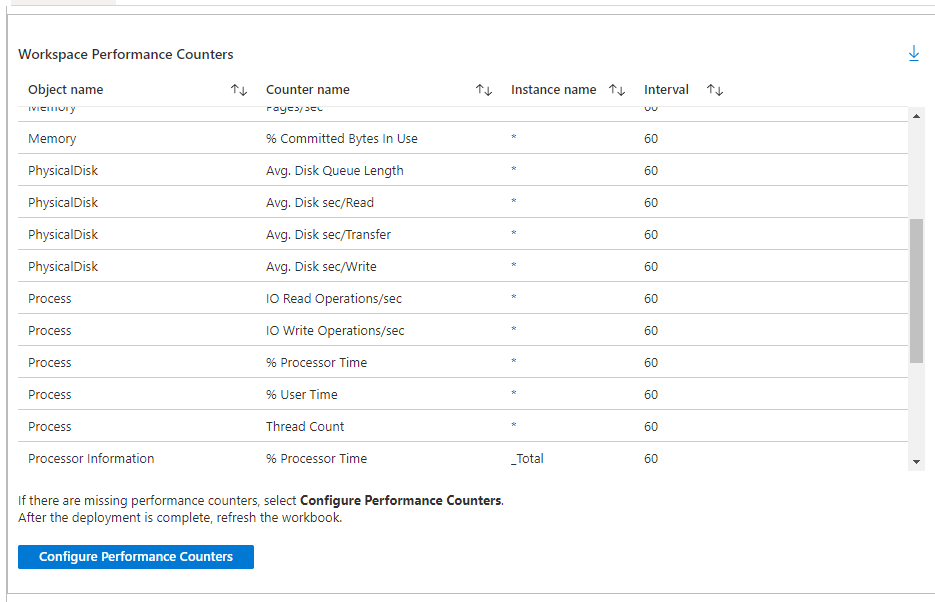
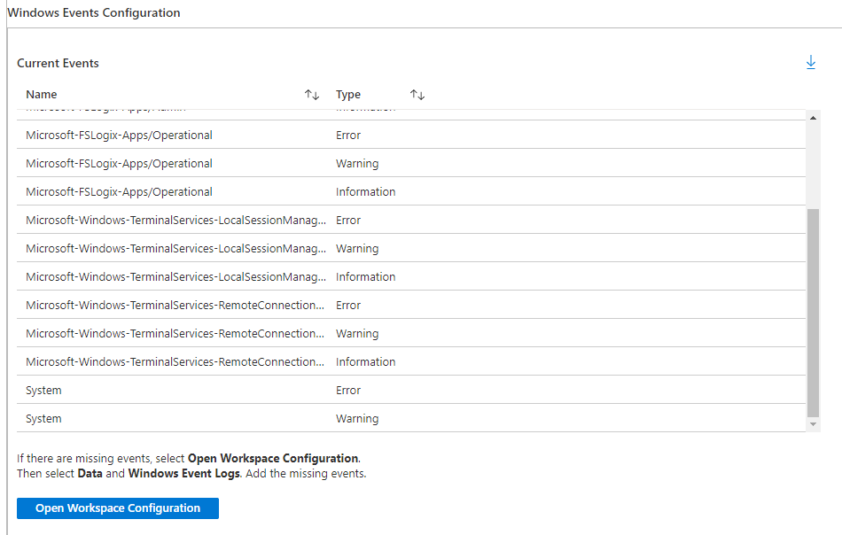
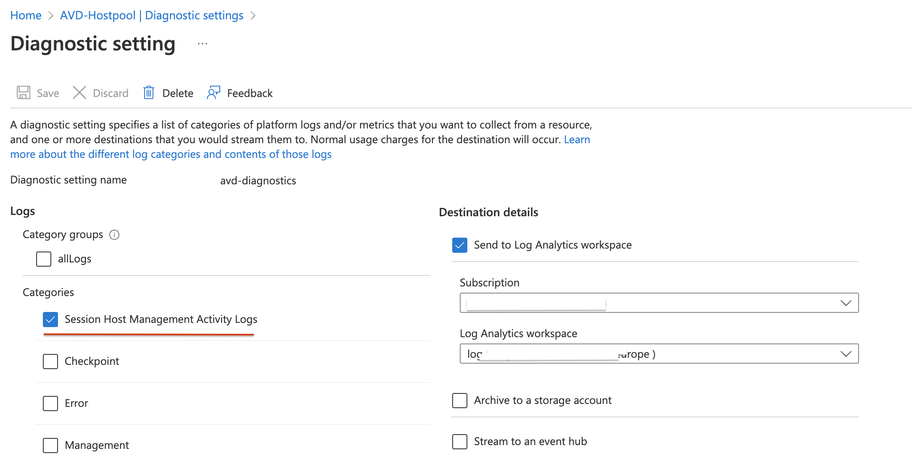
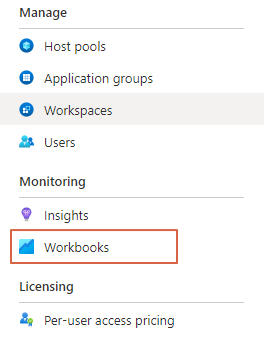
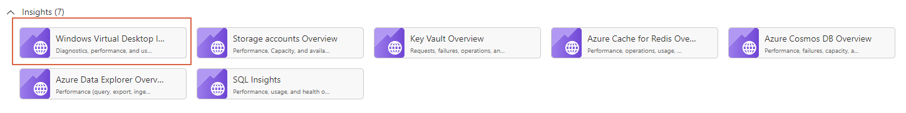
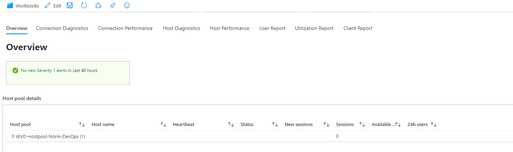
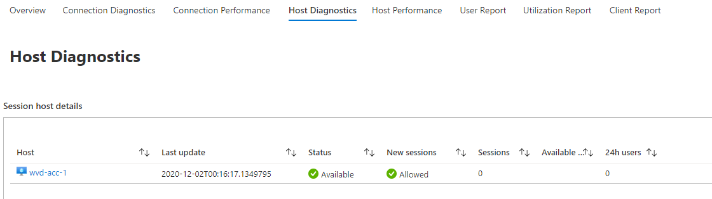
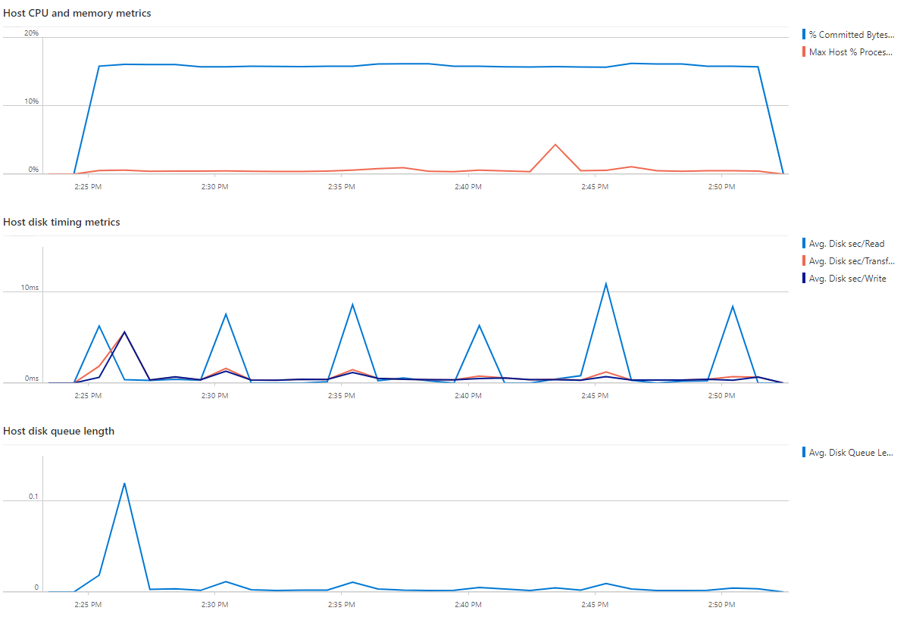

Monitoring user environments will help you get sight of what is going on and will help you solve problems. An Azure Virtual Desktop environment isn’t an exception. It is recommended to configure a monitoring environment. In this post, I will show how to deploy Azure Monitor for AVD fully automated.

In this article, I will describe how to configure a monitoring environment from scratch fully automated. Especially when you have to manage more than one AVD environment this article will help you set up monitoring for all environments.



## Prepare Log Analytics Workspace

Preparing the Log Analytics Workspace (LAWS) is the first step. In these steps, we will create the workspace and will add the needed Windows events en Windows performance counters.   
The needed events and counters are in two separate JSON files which need to be imported into a PowerShell script. The files are stored on my [GitHub repository](https://github.com/srozemuller/Windows-Virtual-Desktop/tree/master/Azure-Monitor).

### Parameters

The template files and workspace names are mandatory. The script will create a workspace if no workspace name is provided.

```powershell
param(
    [parameter(mandatory = $false)][string]$EventsTemplate,
    [parameter(mandatory = $false)][string]$CountersTemplate,
    [parameter(mandatory = $true)][string]$ResourceGroup,
    [parameter(mandatory = $true)][string]$Location,
    [parameter(mandatory = $false)][string]$WorkspaceName

)
Import-Module Az.OperationalInsights

if ($null -eq $WorkspaceName) {
    Write-Host "No Log Analytics Workspace name provided, creating new Workspace"
    $WorkspaceName = "log-analytics-wvd-" + (Get-Random -Maximum 99999) # workspace names need to be unique across all Azure subscriptions - Get-Random helps with this for the example code

    # Create the workspace
    New-AzOperationalInsightsWorkspace -Location $Location -Name $WorkspaceName -Sku Standard -ResourceGroupName $ResourceGroup
}
Write-Host "Created workspace $WorkspaceName"
$WindowsEvents = Get-Content $EventsTemplate | ConvertFrom-Json
$PerformanceCounters = Get-Content $CountersTemplate | ConvertFrom-Json
```

### Functions

To make things easier I have created two functions. These will help to set the correct event levels and will be added as a dynamic switch statement.  
The next function creates an Azure-friendly name because a slash (“/”) is not allowed. I’m using the event and counter name also as counter names to keep things clear.

### Configuring LAWS

Now it is time to configure the workspace with events and counters. Two for-each loops will take care of applying the Windows events and Windows performance counters.

The code below is a snippet from a complete script. Make sure you are using the complete PowerShell scripts (<https://github.com/srozemuller/Windows-Virtual-Desktop/blob/master/Azure-Monitor/deploy-laws.ps1>, and [https://github.com/srozemuller/](https://github.com/srozemuller/Windows-Virtual-Desktop/blob/master/Azure-Monitor/deploy-wvdhostpool-diagsettings.ps1)[Windows](https://github.com/srozemuller/Windows-Virtual-Desktop/blob/master/Azure-Monitor/deploy-wvdhostpool-diagsettings.ps1)[-Virtual-Desktop/blob/master/Azure-Monitor/deploy-wvdhostpool-diagsettings.ps1](https://github.com/srozemuller/Windows-Virtual-Desktop/blob/master/Azure-Monitor/deploy-wvdhostpool-diagsettings.ps1)).

```powershell

If ($EventsTemplate) {
    foreach ($WindowsEventLog in $WindowsEvents.WindowsEvent.EventLogNames) {
        $Level = Get-CorrectEventLevels -EventLevels $WindowsEventLog.EventTypes
        $Name = Make-NameAzureFriendly -Name $WindowsEventLog.Value
        # Windows Event
        New-AzOperationalInsightsWindowsEventDataSource -ResourceGroupName $ResourceGroup -WorkspaceName $WorkspaceName -EventLogName $WindowsEventLog.Value -Name $Name @Level
    }
}

If ($CountersTemplate) {
    foreach ($CounterObject in $PerformanceCounters.WindowsPerformanceCounter) {
        $CounterObject
        foreach ($Counter in $CounterObject.Counters) {
            $Name = Make-NameAzureFriendly -Name $Counter.name
            $Parameters = @{
                ObjectName      = $CounterObject.Object
                InstanceName    = $Counter.InstanceName
                CounterName     = $Counter.CounterName
                IntervalSeconds = $Counter.IntervalSeconds
                Name            = $Name
            }
            $Parameters
            New-AzOperationalInsightsWindowsPerformanceCounterDataSource -ResourceGroupName $ResourceGroup -WorkspaceName $WorkspaceName @parameters
        }
    }
}
```

After running the PowerShell you will notice the needed configuration had been set.




## Enable diagnostic settings on the Azure Virtual Desktop host pool
Before Azure Monitor works for Azure Virtual Desktop, you need to enable diagnostic settings for the AVD Hostpool. To enable diagnostics, I use the [Az.Avd PowerShell module](https://www.powershellgallery.com/packages/Az.Avd). 
In the example below, I enable the ```SessionHostManagement``` category.  
The script I’m using needs two parameters, the host pool and the workspace.   
Check first if the Microsoft.Insights provider is registered in the subscription. Otherwise, the script will install the Microsoft.Insights provider.

Make sure you use at least beta version 2.4.4-beta.21: https://github.com/srozemuller/AzAvd/releases/tag/v2.4.4-beta.22

```powershell
param(
    [parameter(mandatory = $true)][string]$HostPoolName,
    [parameter(mandatory = $true)][string]$ResourceGroupName,
    [parameter(mandatory = $true)][string]$WorkspaceName,
    [parameter(mandatory = $true)][string]$WorkspaceResourceGroup,

)
Import-Module Az.Avd

try {
    # Check if the insightsprovide is registered otherwise register
    If (!(Register-AzResourceProvider -ProviderNamespace microsoft.insights).RegistrationState.Contains("Registered")){
        Register-AzResourceProvider -ProviderNamespace microsoft.insights
    }
    while (!(Register-AzResourceProvider -ProviderNamespace microsoft.insights).RegistrationState.Contains("Registered")){
        Write-Host "Resource provider microsoft.insights is not registered yet"
        Start-Sleep 1
    }
}
catch {
    Throw "Not able to register insights provider, $_"
}
$avdParams = @{
    hostpoolName      = $HostPoolName
    resourceGroupName = $ResourceGroupName
}
$hostpool = Get-AvdHostPool @avdParams
$parameters = @{
    lAWorkspace = $WorkspaceName
    laResourceGroupName = $WorkspaceResourceGroup
    Categories = @("SessionHostManagement")
}
$hostpool | Enable-AvdDiagnostics -DiagnosticsName 'avd-diagnostics' @parameters -Verbose
```



### Add session hosts to LAWS

The last step is adding the session hosts to the workspace. Achieve this by installing the MicrosoftMonitoringAgent extension with an ARM template. This is the last section of the script.

```powershell
# region install Log Analytics Agent on Virutal Machine 
$sessionhosts = Get-AvdSessionHostResources -HostpoolName  $HostpoolName -ResourceGroupName $ResourceGroupName
$virtualMachines = @($sessionhosts.vmResources.name)
$workspaceKey = ($Workspace | Get-AzOperationalInsightsWorkspaceSharedKey).PrimarySharedKey
$TemplateParameters = @{
    workspaceId = $Workspace.CustomerId
    workspaceKey = $workspaceKey
    virtualMachines = $virtualMachines
    extensionNames = @("OMSExtenstion")
}
New-AzResourceGroupDeployment -ResourceGroupName $ResourceGroup -TemplateUri "https://raw.githubusercontent.com/srozemuller/Windows-Virtual-Desktop/master/Azure-Monitor/deploy-lawsagent.json" -TemplateParameterObject $TemplateParameters
#endregion
```

### Workbooks
At the end when opening the workbook you will get something like below. The workbook in the example below is a default workbook from Microsoft. This workbook is stored under the workbook blade on the left of Azure Virtual Desktop.






All needed files can be downloaded from [my GitHub repository](https://github.com/srozemuller/Windows-Virtual-Desktop/tree/master/Azure-Monitor).

## How to use

You need to run the scripts like the example below. After you downloaded them from the repository, use the following commands.

First, make sure you are connected to Azure.

```powershell
Connect-AzAccount
```

A browser will appear or, in case of PowerShell 7, you have to open a link and provide a code which PowerShell gives you.  
Next make sure you have selected the correct subscription.

```powershell
Set-AzContext -Subscriptionid [id]
```
First run the deploy-laws.ps1 script. If the workspaceName parameter left empty the script will create one.

```powershell
./deploy-laws.ps1 -EventsTemplate ./events-configuration.json -CountersTemplate ./performance-counters-configuration.json -ResourceGroup [rg-laws-wvd] -Location westeurope 
```

### Update (25-03-2021)

Microsoft recommends removing the counters below to reduce data ingestion, and so costs. Based on the article below I moved these performance counters to a separate JSON file.  
If you need these counters use the command below to add them.  
*We have removed 5 per-process performance counters from the default configuration, which has a minimal impact on UI and should reduce data ingestion by over 80% depending on your environment size and usage:*

- *Process(\*)\\% Processor Time*
- *Process(\*)\\% User Time*
- *Process(\*)\\ Thread count*
- *Process(\*)\\ IO Write Operations/second*
- *Process(\*)\\ IO Read Operations/second*

To still add these use the command below.

```powershell
./deploy-laws.ps1 -CountersTemplate ./high-ingestion-counters.json -ResourceGroup [rg-laws-wvd] -Location westeurope 
```

Microsoft announcement: <https://techcommunity.microsoft.com/t5/windows-virtual-desktop/updated-guidance-on-azure-monitor-for-wvd/m-p/2236173>

To deploy the diagnostic settings to WVD use the second script deploy-wvdhostpool-diagsettings.ps1. This script needs the WVD hostpool name and the exising or just created WorkspaceName.

```powershell
./deploy-wvdhostpool-diagsettings.ps1 -HostPoolName wvdhostpool -WorkspaceName la-workspace
```

