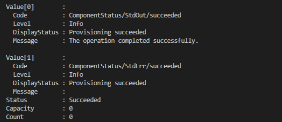
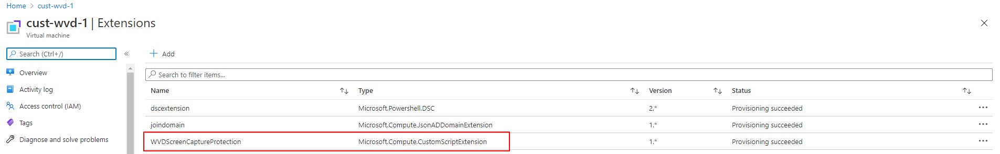
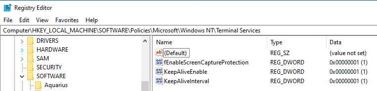
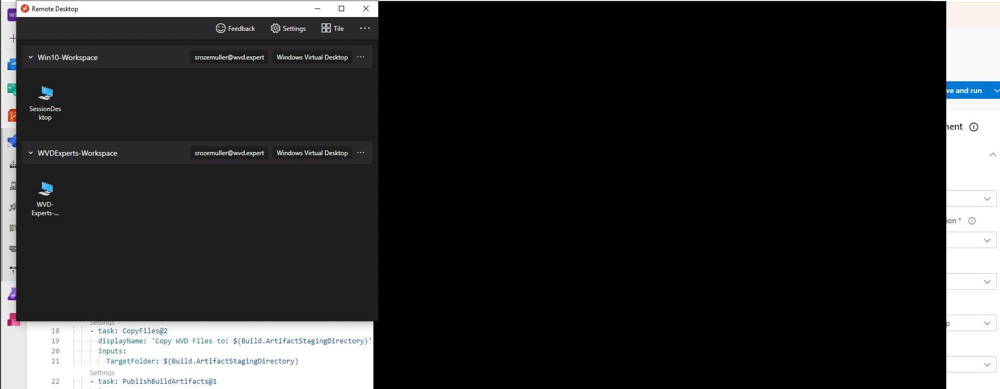

Working remotely has a lot of advantages like less travel time, more focus to work (when the house is not full of kids :)), which contributes to working efficiently. But there are some concerns about security, and rightly so I think. Especially when you are used to ‘see’ what happens on the screen in real life which help at least you think you are in control of your data. In this article I will show how to enable AVD screen protection automated.

## Introduction

In the world of working remotely a lot has been changed. Everyone is used to go to the office and see, speak and work together with colleagues. Now most of the time the only thing you see is your own screen without the knowledge what is going on on the other screens.   
That’s the point where people gets nervous about a big thing: SECURITY. Where is the data, who is sharing it and how to avoid data leaks.

In this article I’m showing how to stop one of most easiest and common ways of the data leaks: Screen Capture. I will explain how to enable AVD Screen protection automated.

There are different ways how to enable the Screen Capture Protection and there also are different environment scenario’s. In this article I explain two environment scenario’s and two deployment scenario’s



## Enable AVD Screen protection 

The screen capture protection feature prevents sensitive information from being captured on the client endpoints. When you enable this feature, remote content will be automatically blocked or hidden in screenshots and screen shares. Also, the Remote Desktop client will hide content from malicious software that may be capturing the screen. To enable this feature automated, please check the post below.

### Prerequisites

Currently, only the Windows Desktop client supports screen capture protection and only full desktops are supported.
Install the Az.Avd PowerShell module

```powershell
Install-Module Az.Avd
Import-Module Az.Avd
```

## Finding AVD session hosts

In the first place we need to get all the Azure Virtual Desktop session hosts and their virtual machine names. To achieve that goal I use the Az.Avd PowerShell module.

```powershell
# Get one of the current production VM's for getting the share image gallery info
$sessionHosts = Get-Avdsessionhost -hostpool avd-hostpool -ResourceGroupName rg-demo-avd-01
```

## Run remote PowerShell command on the session host

One of the options is executing a local PowerShell script at the Windows Virtual Desktop sessionhost with the [Invoke-AzVMRunComand](https://docs.microsoft.com/en-us/powershell/module/az.compute/invoke-azvmruncommand?view=azps-5.2.0) command. This command allows you executing a local PowerShell script on the remote machine.

Now we know every existing session host we are able to execute the PowerShell which enables the Screen Capture Protection

```powershell
foreach ($sessionHost in $sessionHosts.value){
    $VirtualMachineName = ($sessionHosts.Name.Split("/")[-1]).Split(".")[0]
    Get-AzVM -Name $VirtualMachineName | Invoke-AzVMRunCommand -CommandId 'RunPowerShellScript' -ScriptPath [PathToLocalScript]
}
```

After executing the command you will see something like this.


## Enable AVD Screen Protection via ARM template

For the ARM template lovers I created a simple extension. It is possible to deploy the extension to the virtual machine with the New-AzResourceGroupDeployment command. The ARM templates are stored in my [Github repository](https://github.com/srozemuller/Windows-Virtual-Desktop/tree/master/Security).

```powershell
New-AzResourceGroupDeployment -ResourceGroupName ResourceGroupName -TemplateUri https://raw.githubusercontent.com/srozemuller/Windows-Virtual-Desktop/master/Security/Extensions/deploy-WvdScpExtension.json -vmName cust-wvd-1
```



After the configuration has been set there is no way to screen capture a Azure Virtual Desktop session.


Now you can see how easy it is to enable AVD screen protection.

Additional to the post more information is available at the following url: <https://docs.microsoft.com/en-us/azure/virtual-desktop/screen-capture-protection>.

