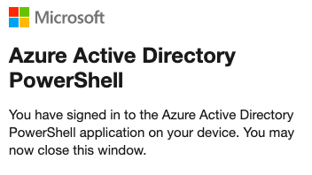
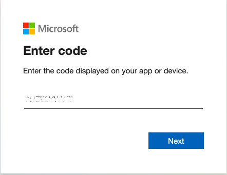
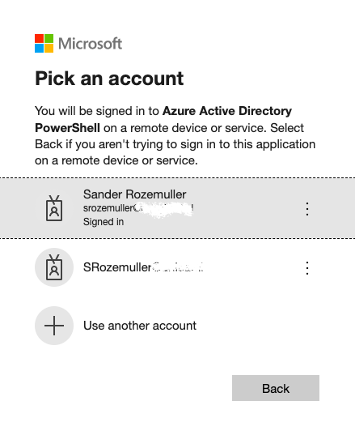
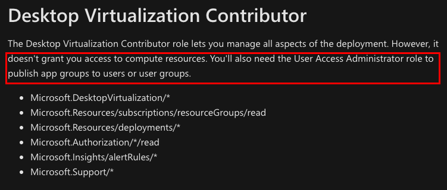
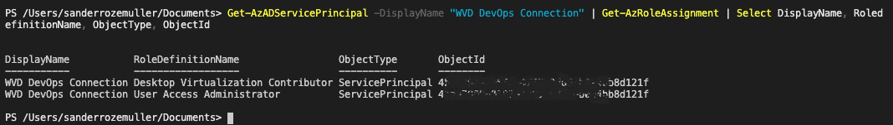
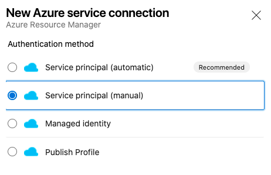
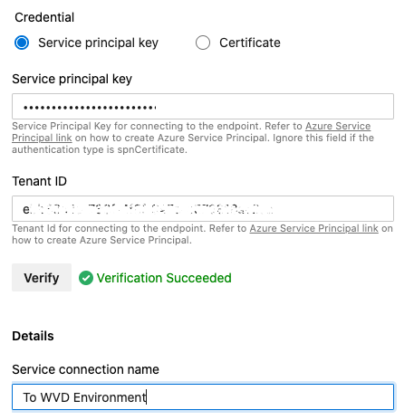

Using Azure DevOps is a really nice way to deploy resources in Azure, so also for Azure Virtual Desktop. Before you are able to deploy resources into Azure with pipelines you will need to setup a project and a service connection first. While configuring a service connection you will be asked for some specific tenant details.   
In this short series I will explain every step you need to prepare DevOps for AVD deployment.

## Introduction

In this series about Prepare Azure DevOps for Azure Virtual Desktop deployment I will post three small blogposts which will help you setting up a prepared DevOps environment fully automated. At the end of this series you will able to create a script which let you fill in an application name, a projectname and a PAT code for connecting to DevOps and will run all the needed steps to start with DevOps.

This series consists of the following subjects:

- [App registration in Azure Active Directory](https://www.rozemuller.com/prepare-azure-devops-for-azure-virtual-desktop-deployment-app-registration/)
- [Create an Azure DevOps project](https://www.rozemuller.com/prepare-azure-devops-for-azure-virtual-desktop-deployment-create-devops-project/)
- Add a Service connection in the DevOps project
- Create a pipeline from a source project



## Register the application

In this first part we will take care about the application registration in the Azure Active Directory. The application is an Active Directory object just like a user. Depending on the application permissions you are able to do tasks into the tenant.

At the end of this post you will have an application registered in the tenants Active Directory with the correct Azure Virtual Desktop permissions.

### Connect to the tenant

The first step is to login into the Azure tenant with PowerShell. Make sure you have the Az.Accounts and Az.Resources modules installed .Use the commands below.

```powershell
Install-Module Az.Accounts
Import-Module Az.Accounts

Install-Module Az.Resources
Import-Module Az.Resources
```

Use Az.\* to import all the Azure PowerShell modules.

For logging in into the tenant use the Connect-AzAccount. Since PowerShell 7 there will be a url provided and a code. Follow the instructions on the screen. *TIP: if u are using VSCode the popup can be placed on the background, use alt-tab.*


Fill in the code which provided by PowerShell


Choose or fill in the correct account.



You may close the tab or browser now.

## Role Based Access

After being connected lets start with the application registration. Because of security reasons the application will only have the roles assigned which are needed to prepare DevOps for AVD deployment.  
In this case the application will be assigned to the **Azure Virtual Desktop Contributor** and **User Access Administrator** role.


More info about build-in roles please check [Built-in roles for Azure Virtual Desktop](https://docs.microsoft.com/en-us/azure/virtual-desktop/rbac).

### The script

The script will take care about registering the application and the service principal in the Azure AD. Also there will be a password generated based on a random guid.  
As mentioned the application will get the Desktop Virtualisation Contributor role, after the registration was successful the additional User Access Administrator role will be added.

```powershell
$ApplicationName = "AVD DevOps Connection"
try {
    if ($null -eq (Get-AzADApplication -DisplayName $ApplicationName)) {
        $IdentifierUri = ($ApplicationName).Replace(" ", $null)
        $PlainPassword = ([System.Convert]::ToBase64String([System.Text.Encoding]::UTF8.GetBytes((New-Guid)))) + "="
        $SecureStringPassword = ConvertTo-SecureString -String $PlainPassword -AsPlainText -Force
        $AADApplication = New-AzADApplication -DisplayName $ApplicationName -IdentifierUris "http://$IdentifierUri" -Password $SecureStringPassword
        $AADServicePrincipal = New-AzADServicePrincipal -DisplayName $ApplicationName -Role "Desktop Virtualization Contributor" -ApplicationId $AADApplication.applicationId
        $AADServicePrincipal | New-AzRoleAssignment -RoleDefinitionName "User Access Administrator"
        Write-Host "Updated $ApplicationName to Service Principal"  
    }
    else { Write-Host "$ApplicationName exists" }
}
catch {
    $ErrorMessage = $_ | ConvertFrom-Json
    Throw "Could not create application: $($ErrorMessage.message)"
}
$TenantInfo = Get-AzContext
Write-Output "Subscription Id: $($TenantInfo.Subscription)"
Write-Output "Subscription Name: $($TenantInfo.SubscriptionName)"
Write-Output "Service Principal Id: $($AADApplication.ApplicationId.Guid)"
Write-Output "Service Principal Key: $PlainPassword"
Write-Output "Tenant Id: $($TenantInfo.Tenant)"
```


At the end the script will output some values which are needed to create a service connection in DevOps. For now the service connection needs to be created manually. Later in this series we are using these values to create service connection automatically.

## Create DevOps Service Connection (manual)

Let’s say we will create a service connection manually now. Assuming you already have a DevOps environment and a project. Go to Project Settings -&gt; Pipelines -&gt; Service Connections.   
Choose New Service Connection on the right top and type Azure Resource Manager. In the next step choose Service Principal (Manual).


## Validation

In the next step fill in the parameters you’ve got from the script. At last validate the parameters.


Then save the connection. You’re all set now.  
As I mentioned before in the next part of this series I will show how to automate this last step. At the end you will know everything you need to prepare DevOps for AVD deployment.

## More info about application registrations

If you like more information about application registration please check the following pages.

- [Quickstart: Register an application with the Microsoft identity platform](https://docs.microsoft.com/en-us/azure/active-directory/develop/quickstart-register-app)
- [How and why applications are added to Azure AD](https://docs.microsoft.com/nl-nl/azure/active-directory/develop/active-directory-how-applications-are-added)
- [Steps to add a role assignment](https://docs.microsoft.com/nl-nl/azure/role-based-access-control/role-assignments-steps)

{{ bye }}