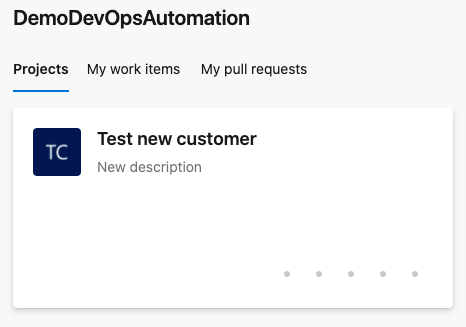
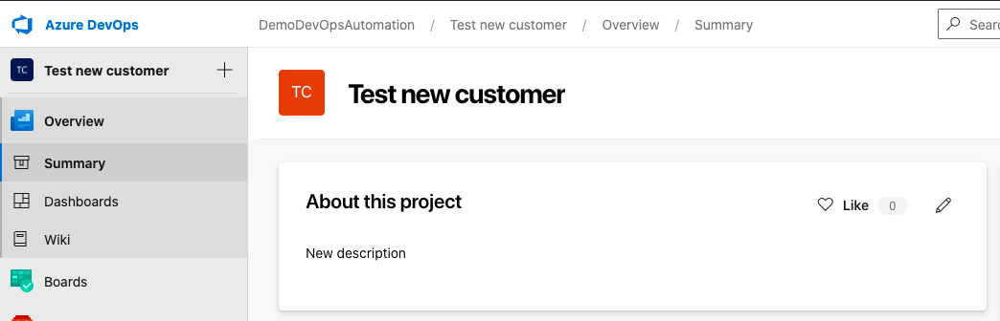
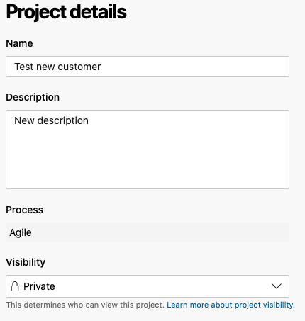

An Azure DevOps environment consists of projects. Before create anything in DevOps like a board, repositories or pipelines you first need a project. In this second part of the series Prepare Azure DevOps for Azure Virtual Desktop we are diving into that DevOps part, a project. At the end of this post you will be able to deploy WVD with DevOps automated.

## Introduction

In this series about Prepare Azure DevOps for Azure Virtual Desktop deployment I will post some small blogposts which will help you setting up a prepared DevOps environment fully automated. This to achieve the goal to deploy WVD with DevOps. At the end of this series you will able to create a script which let you fill in an application name, a projectname and a PAT code for connecting to DevOps and will run all the needed steps to start with DevOps.

This series consists of the following subjects:

- [App registration in Azure Active Directory](https://www.rozemuller.com/prepare-azure-devops-for-azure-virtual-desktop-deployment-app-registration/)
- [Create an Azure DevOps project](https://www.rozemuller.com/prepare-azure-devops-for-azure-virtual-desktop-deployment-create-devops-project/)
- Add a Service connection in the DevOps project
- Create a pipeline from a source project



### Parameters

The script consists of some parameters you will need. In this paragraph I will explain which parameters and what they mean.

**Organisation**: This is the Azure DevOps organisation and first thing you need. Please check [About organization management in Azure DevOps](https://docs.microsoft.com/en-us/azure/devops/organizations/accounts/organization-management?view=azure-devops) about creating an Azure DevOps organisation or go to <https://dev.azure.com>.

**PersonalToken:** A personal access token (PAT) is used as an alternate password to authenticate into Azure DevOps. You are able to create a PAT under you own personal account. Want to learn how to create, use, modify, and revoke PATs for Azure DevOps please check [Authenticate with personal access tokens](https://docs.microsoft.com/en-us/azure/devops/organizations/accounts/use-personal-access-tokens-to-authenticate?view=azure-devops&tabs=preview-page).

**ProjectName** &amp; **ProjectDescription** as the name says, just a name and a description.

**Visibility**: Is the project visible or not, accepted values are private or public.

```powershell
Param(
    [Parameter(Mandatory = $True)]
    [string]$Organisation,

    [Parameter(Mandatory = $True)]
    [string]$PersonalToken,
    
    [Parameter(Mandatory = $True)]
    [string]$ProjectName,
    
    [Parameter(Mandatory = $True)]
    [string]$ProjectDescription, 
    
    [ValidateSet("private","public")]
    [Parameter(Mandatory = $True)]
    [string]$Visibility
)
```
## Basic settings

After you filled in the correct values the script will generate an authentication token based on the provided personal access token and an organisation URL like https://dev.azure.com/MyOrganisation

```powershell
$orgUrl = "https://dev.azure.com/$($organisation)"
Write-Host "Initialize authentication context" -ForegroundColor Yellow
$token = [System.Convert]::ToBase64String([System.Text.Encoding]::ASCII.GetBytes(":$($personalToken)"))
$header = @{authorization = "Basic $token" }
```

## JSON Body

The next part is creating a JSON body for the POST request. As you can see most of the parameters are used in the JSON body. This will actually do the job. After setting the body the ConvertTo-Json will take care about the correct JSON format.   
Check [Create Azure DevOps Projects](https://docs.microsoft.com/en-us/rest/api/azure/devops/core/projects/create?view=azure-devops-rest-6.0) for more about creating projects with REST API.

```powershell
$jsonBody = @{
    name         = $ProjectName
    description  = $ProjectDescription
    visibility   = $Visibility
    capabilities = @{
        versioncontrol  = @{
            sourceControlType = "Git"
        }
        processTemplate = @{
            templateTypeId = "adcc42ab-9882-485e-a3ed-7678f01f66bc"
        }
    }
}
$newJSONBody = ($jsonBody | ConvertTo-Json -Depth 3)
```
## Create the project

At last the project will be created in DevOps.

```powershell
$projectsUrl = "$orgUrl/_apis/projects?api-version=5.1"
# Create new project

Write-Host "Creating project $($ProjectName)" -ForegroundColor blue
Invoke-RestMethod -Uri $projectsUrl -Method Post -ContentType "application/json" -Headers $header -Body $newJSONBody
```

In the end you are able to run the script like:

```powershell
New-DevOpsProject -Organisation "DemoDevOpsAutomation" -Personaltoken $token -ProjectName "Test new customer" -ProjectDescription "New description" -Visibility Private
```




More about REST API and DevOps please check [Get started with Azure DevOps and API](https://docs.microsoft.com/en-us/rest/api/azure/devops/?view=azure-devops-rest-6.1)  
Follow this series that help you deploy AVD with DevOps

