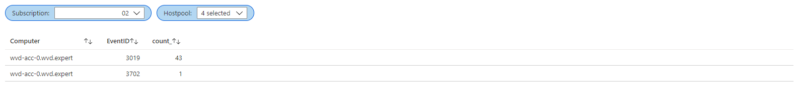

Microsoft has provided a list with URL’s which you need for running a Azure Virtual Desktop environment. In this blog post I will explain how to monitor any issues related to the AVD required URL’s. and how to setup the monitoring environment.

## Introduction

Most of the time you are able to connect to the Internet over port 443. But there could be several reasons you don’t. In case of a Azure Virtual Desktop environment it is critical you can reach Microsoft, otherwise you are unsupported. So it is very important to monitor AVD required URL’s. To help configuring the firewall Microsoft came up with an URL list.   
In this case I blocked every traffic to the Internet, with an exception to the Azure Virtual Desktop needed URL’s.




There are several ways to notice there is something wrong connecting to one of the required URL’s. In the next chapters I will handle some of them.

## Windows Event log

The most common and important place is the Windows event log on the sessionhosts. If there is an issue you will see events like below. A lot of application errors with source AVD-Agent and eventId 3019.


For every URL which cannot be reached there will be an event.  
There also could be some warnings on eventId 3702. You will see errors like this:


### Azure portal

An another place where to find issues is on the Azure Portal itself under the Azure Virtual Desktop blade.


## Log Analytics

A second place where you can find events is the Log Analytics Workspace. Important thing to know is that Log Analytics is not working out of the box. For using Log Analytics is you will need a Log Analytics workspace. Also make sure you installed the MicrosoftMonitoringAgent extension on each AVD session host.

I wrote a blog post about enabling [Azure Monitor for Azure Virtual Desktop](https://www.rozemuller.com/deploy-azure-monitor-for-azure-virtual-desktop-automated/). In that post I explain how to enable the Azure Monitor in basics for AVD including setting up a Log Analytics workspace with the correct settings.   
The blog post below will continue at the last section when adding session host to the workspace.

### **Add session hosts to Log Analytics Workspace**

If you have configured the Azure Monitor you will need to add every sessionhost to Log Analytics. Make sure you add this step into your AVD deployment sequence for future installations.

### Finding the Log Analytics Workspace

There are more way to figure out the Log Analytics Workspace. The first route is through the Azure portal by going to the Azure Virtual Desktop blade, select the correct hostpool and search for diagnostic settings.


A second way is by PowerShell using the command below. Use the provided workspace name.

```powershell
$HostpoolName = "Test-AVD-Host"
$ResourceGroup = "Test-AVD-ResourceGroup"
$hostpool = Get-AzWvdHostPool -name $HostpoolName -ResourceGroupName $ResourceGroup 
Get-AzDiagnosticSetting -ResourceId $hostpool.id | Select Name, @{Label=”WorkSpace Name”;Expression={($_.WorkspaceId.Split("/")[-1])}}
```


If you have all the needed information use the PowerShell below for installing the OMSExtension.

```powershell
$HostpoolName = "Test-AVD-Host"
$ResourceGroup = "Test-AVD-ResourceGroup"
$Workspace = "LA-Workspace-xxxxx"

# region install Log Analytics Agent on Virutal Machine 
$ResourceGroup = ($hostpool).id.split("/")[4]
$sessionhosts = Get-AzWvdSessionHost -HostpoolName  $HostpoolName -ResourceGroupName $ResourceGroup
$virtualMachines = @($sessionhosts.ResourceId.Split("/")[-1])
$workspaceKey = ($Workspace | Get-AzOperationalInsightsWorkspaceSharedKey).PrimarySharedKey
$TemplateParameters = @{
    workspaceId = $Workspace.CustomerId
    workspaceKey = $workspaceKey
    virtualMachines = $virtualMachines
    extensionNames = @("OMSExtenstion")
}
New-AzResourceGroupDeployment -ResourceGroupName $ResourceGroup -TemplateUri "https://raw.githubusercontent.com/srozemuller/Windows-Virtual-Desktop/master/Azure-Monitor/deploy-lawsagent.json" -TemplateParameterObject $TemplateParameters
#endregion
```

At the end, if you have installed the Log Analytics extension on the sessionhosts, the Windows events will appear in the Log Analytics Workspace. I used the Kusto Query below for searching for AVD-Agent events.

```basic
Event
| where TimeGenerated > ago(6h)
and Source == "AVD-Agent"
| sort by TimeGenerated desc
| project TimeGenerated, Computer, EventLog, EventID , EventLevelName, RenderedDescription, _ResourceId
```


More information about Log Analytics and Windows event log check [Collect Windows event log data sources with Log Analytics agent.](https://docs.microsoft.com/en-us/azure/azure-monitor/platform/data-sources-windows-events)

## Monitor workbook

Using a monitor workbook can help creating a great overview. Although creating a complete workbook from scratch is not a part of the scope in this article, I will describe the basics from where to start.

First we need some dashboard parameters like subscription and hostpool name.   
Go to Azure Monitor, click Workbook and click an Empty workbook


In the workbook click Add and choose Add Parameters


From there you will be able to create dynamic parameters by executing queries. For example when requesting all subscriptions you will need to execute an Azure Resource Graph query.


After creating the parameters add the query boxes via the Add button below and choose Add query. In this case I’ve used two simple queries.


```basic
Event
| where  Source == "AVD-Agent"
| summarize count() by Computer, EventID

Event
| where Source == "AVD-Agent"
| sort by TimeGenerated desc
| project TimeGenerated, Computer, EventLog, EventID , EventLevelName, RenderedDescription, _ResourceId
```



## Alerting

There are some options for getting alerts I like to show. The first option is by using PowerShell.

### Powershell

The script will need a AVD hostpool name and its resource group. All other information will found automatically. If there are results found the script will let you know.

```powershell
$HostpoolName = "Test-AVD-Host"
$ResourceGroup = "Test-AVD-ResourceGroup"

Try {
    $sessionHosts = Get-AzWvdSessionHost -ResourceGroupName $ResourceGroup -HostPoolName $HostpoolName
}
Catch {
    Throw "Error getting sessionhosts $_"
}

if ($sessionHosts) {
    Write-Host "Found session hosts $sessionHosts"
    $VirtualMachine = Get-AzResource -ResourceId $sessionHosts[0].ResourceId
    $ExtentionResult = (Get-AzVMExtension -VMName $VirtualMachine.Name -ResourceGroupName $VirtualMachine.ResourceGroupName -Name "OMSExtenstion")
    $WorkspaceId = ($ExtentionResult.PublicSettings | ConvertFrom-Json).workspaceId
    $query = @"
    Event
    | where TimeGenerated > ago(6h) and Source == 'AVD-Agent' 
    | sort by TimeGenerated desc 
    | project TimeGenerated, Computer, EventLog, EventID, EventLevelName, RenderedDescription, _ResourceId
"@
    $Results = Invoke-AzOperationalInsightsQuery -WorkspaceId $WorkspaceId -Query $Query
    if ($Results) {
        $Count = $($Results.Results).count
        Write-Warning "AVD Agent errors found! Total: $Count "
    }
    else {
        Write-Host "No errors found"
    }
}
else {
    Write-Error "No hosts found !"
}
```

### Azure Monitor

Alert rules are rulesets in the Azure Monitor. Rules can be configured based on scopes (resource types). In this configuration I use the Log Analytics resource. Every resource has it own condition sets. When using Log Analytics you will able to run a custom log search, a user defined query.

#### Action groups

The common parts at every rule is an action group. This can be a webhook, email or ITSM tool. In this case I will configure an action group based on an e-mailaddress.   
I used the code below to deploy an action group first based on an ARM template.

```powershell
$TemplateFileLocation = 'https://github.com/srozemuller/Windows-Virtual-Desktop/blob/master/Azure-Monitor/deploy-actiongroup.json'
$TemplateParameters = @{
    actionGroupName = "Ag-MailToAVDAdmin"
    actionGroupShortName = "AVD"
    receiverName = "AVD Admin"
    receiverEmailAddress = "admin@wvd-ilike.it"
    tags = @{AVD = "TestEnvironment"}
}
$ActionGroup =  New-AzResourceGroupDeployment -ResourceGroupName $HostpoolResourceGroup -Name 'Deploy-ActionGroup-FromPowerShell' -TemplateUri $TemplateFileLocation @TemplateParameters
```

More information about creating action groups in the portal check the [Microsoft docs](https://docs.microsoft.com/nl-nl/azure/azure-monitor/platform/action-groups).

#### Action rule

After the alert group is configured all the needed parts are there to create the alert rule. As mentioned before I will use the Log Analytics resource and will configure a custom log search as condition.


In this case I use a simple query which search for Error events with a source AVD-Agent.

```basic
Event | where EventLevelName == 'Error' and Source == 'AVD-Agent' | sort by TimeGenerated
```

The last part is configuring the action. After clicking Add action groups, select the just created action group. At the end I configured an alert rule which will send me an e-mail if the result is above 0.


When finished the configuration the setup will look something like below.


### Automated

An option is to create an alert rule through the Azure portal. An another option is to create a rule automated, with PowerShell in this example. For a good start check the Microsoft docs about creating a [new schedule query rule](https://docs.microsoft.com/en-us/powershell/module/az.monitor/new-azscheduledqueryrule?view=azps-5.4.0). From there all the needed commands will explained. To get all the information I had to do some reverse engineering which results in a script like below.

```powershell
$HostpoolName = "Test-AVD-Host"
$ResourceGroup = "Test-AVD-ResourceGroup"

$hostpool = Get-AzWvdHostPool -name $HostpoolName -ResourceGroupName $HostpoolResourceGroup
$Query = "Event | where EventLevelName == 'Error' and Source == 'AVD-Agent' | sort by TimeGenerated"
$DataSourceId = (Get-AzDiagnosticSetting -ResourceId $hostpool.id).WorkspaceId
$Source = New-AzScheduledQueryRuleSource -Query  "Event | where EventLevelName == 'Error' and Source == 'AVD-Agent' | sort by TimeGenerated" -DataSourceId $DataSourceId
$Schedule = New-AzScheduledQueryRuleSchedule -FrequencyInMinutes 5 -TimeWindowInMinutes 5

# use the actiongroup variable from the previous step
$AznsAction = New-AzScheduledQueryRuleAznsActionGroup -ActionGroup $ActionGroup.Outputs.actionGroupResourceId.value -EmailSubject "AVD-Agent Eventlog Errors" -CustomWebhookPayload "{}"
$TriggerCondition = New-AzScheduledQueryRuleTriggerCondition -ThresholdOperator "GreaterThan" -Threshold 0
$AlertingAction = New-AzScheduledQueryRuleAlertingAction -AznsAction $AznsAction -Severity 1 -Trigger $TriggerCondition

$QueryRuleParameters = @{
    ResourceGroupName = $HostpoolResourceGroup
    Location = "West Europe"
    Enabled = $true
    Name = "AVD-Agent Eventlog Errors"
    Description = "Gets AVD-Agent Eventlog Errors from sessionhosts"
    Source = $Source
    Schedule = $Schedule
    Action = $alertingAction
}
New-AzScheduledQueryRule @QueryRuleParameters
```

## Prevent issues

In case of better safe then sorry the best way is to setup the Network Security Group (NSG) correctly. Most of the time outgoing secure traffic (HTTPS, port 443) is permitted. But in case of some limitations this is a way how to open the firewall with less destinations as possible.

### Network Security Group

In this part I will show a possible way how to configure the NSG in case of there are outgoing limitations.   
During the time the NSG had a lot of improvement. The option using destination service tags is one of them. Now AVD is a part for the Azure family a new service tag is available, WindowsVirtualDesktop. All other services tags are available as well. Using them will things make things a lot easier.


I wrote a PowerShell function which will help added NSG rules automatically. The function will check the first deny rule and will place the needed rules above them.

```powershell
$NSGName = "NSG"
$ResourceGroupName = "ResourceGroup"

function add-firewallRule($NSG, $port, $ServiceTag) {
    # Pick random number for setting priority. It will exclude current priorities.
    $FirstDenyRule = ($NSG | Get-AzNetworkSecurityRuleConfig | where {$_.access -eq "Deny"} | select Priority).priority[0]
    $InputRange = 100..($FirstDenyRule-1)
    $priority = Get-Random -InputObject $InputRange 
    $nsgParameters = @{
        Name                     = "Allow-$ServiceTag-over-$port"
        Description              = "Allow port $port to $ServiceTag"
        Access                   = 'Allow'
        Protocol                 = "Tcp" 
        Direction                = "Outbound" 
        Priority                 = $priority 
        SourceAddressPrefix      = "*"
        SourcePortRange          = "*"
        DestinationAddressPrefix = $ServiceTag 
        DestinationPortRange     = $port
    }
    if ($NSG.SecurityRules.Name.Contains($nsgParameters.Name)){
        Write-Host "Rule already exists."
        
    }
    else {$NSG | Add-AzNetworkSecurityRuleConfig @NSGParameters  | Set-AzNetworkSecurityGroup }
}

$NSG = Get-AzNetworkSecurityGroup -name $NSGName -ResourceGroupName $ResourceGroupName
add-firewallRule -NSG $NSG -ServiceTag WindowsVirtualDesktop -port 443
```

At the end you are able to monitor AVD required URL’s.

More info about the safe URL list, Network Security Group, Azure Monitor check the links below:

Safe URL list: <https://docs.microsoft.com/en-us/azure/virtual-desktop/safe-url-list>  
Protect AVD: <https://docs.microsoft.com/en-us/azure/firewall/protect-windows-virtual-desktop>  
Azure Monitor: <https://docs.microsoft.com/nl-nl/azure/azure-monitor/overview>

