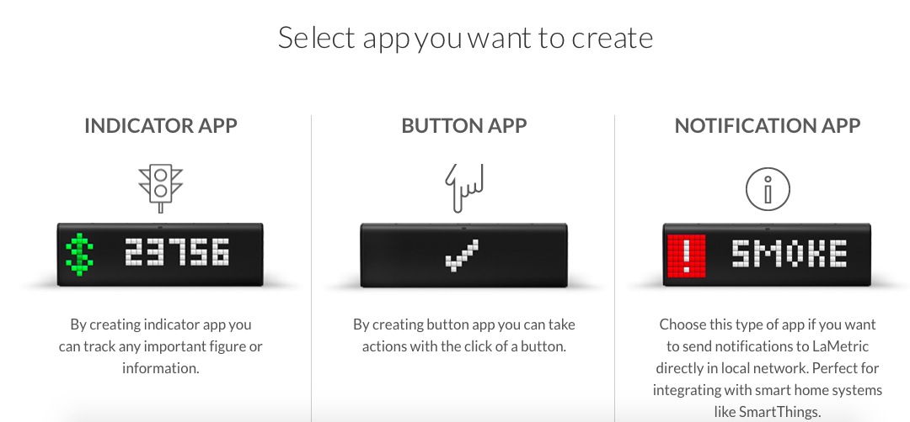
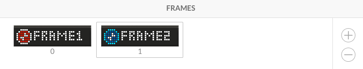
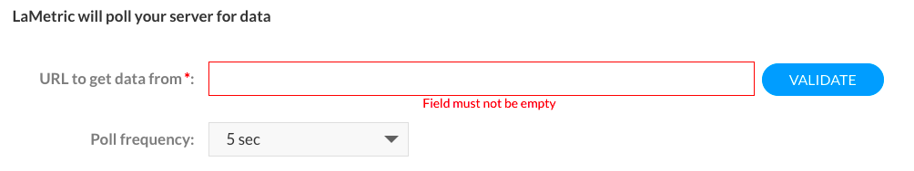
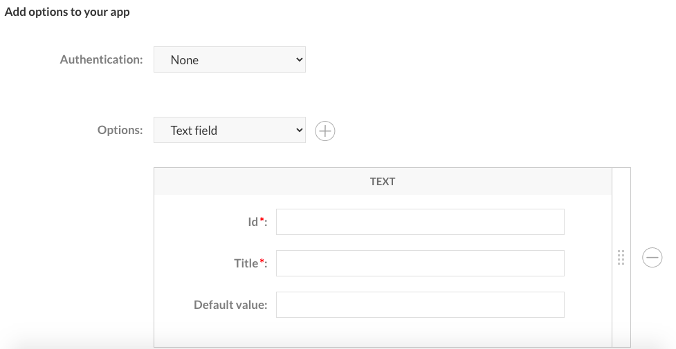
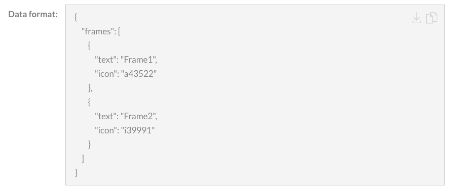
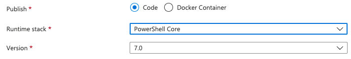
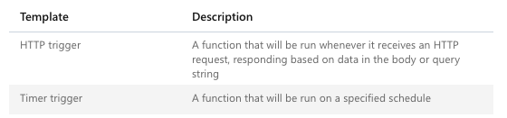
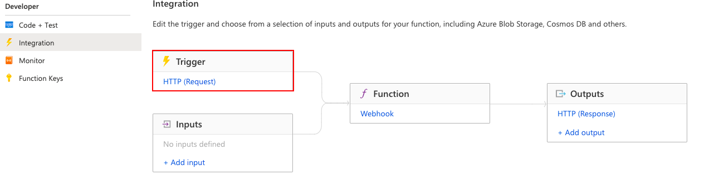
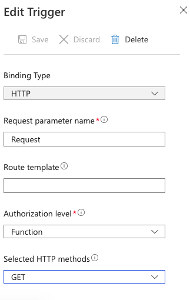

A lot of people in the Microsoft community are using a fancy gadget called LaMetric Time. It is a smart clock which can show time, receiving notifications from a lot of different environments and more. In this blog I will show how to use LaMetric Time to monitor a AVD environment.

Welcome to this fun with functions blog about using LaMetric Time to monitor AVD environment based on an [Azure Function](https://docs.microsoft.com/nl-nl/azure/azure-functions/). In this post I will explain how to setup the Azure Function and create dynamic content for the LaMetric time application.



## LaMetric Time

Before setting up the application it is good to know where to start, which types there are and how they act.

### Developer account

Before creating a LaMetric application you will need a developer account. This account can be created at <https://developer.lametric.com/>. This is very easy by clicking the *Sign Up* button.


### Select type

After signing in you will see a create button. After clicking you will get a page where you need to select a type. In this case I used the indicator type. The reason why is I don’t need actions. I more like the notification type but in that case I have to do some port forwarding from the internet to my device. This because of the function app (later in this article) will send information to the device.


After selecting the application type the next page will guide you through every step.

## Creating the application

### Look-and-feel

Now it is time to create the application. An application consists of frames. Every frame is display on the LaMetric device. In the create user interface you are able to setup the look-and-feel. Under the frames part you are able to configure an icon and some text.


### Communication

The next part is the communication type and where the application can get his information. In my case I used the poll type. Depending on the type the form below will ask for the required information. By selecting the poll type the form will ask you for a server URL where he can find the data. This will be the function app URL which we will create in the next part.


### Parameters

When the application has been installed on the LaMetric device it would be nice to configure things like the AVD hostpool you like to monitor. These parameters can be configured by adding fields.


The Id is the parameter which will be send with the request. The title is the display name in the application. While sending parameters with the URL, the URL will look like https://url.azurewebsite.net&amp;textidvalue=value&amp;nexttextidvalue=value.

### Data format

By configuring frames, icons and text the data format will change automatically. In this section you will see the correct data format which the application will use for displaying the correct info on the LaMetric device.


## Azure Function

With the LaMetric data format in mind it is time to create an Azure Function. The poll type will request the URL (Webhook) with a GET method. That means you will have to create an Azure Function with a HTTP trigger.

### Function app

Before creating a function you will need a function app first. A function app is the host which will execute the function. Because of using function apps you won’t need resource types like a VM.  
Please follow the [Microsoft Docs for creating an Azure Function App](https://docs.microsoft.com/nl-nl/azure/azure-functions/functions-create-function-app-portal). Make sure while creating a function app you choose the PowerShell runtime.


### Function

When the function app has been created it is time to create a function. Functions has different types of templates. Most common are HTTP Trigger and Timer Trigger.


In this case we need a HTTP Trigger. This means the function will be executed when the function URL has been triggered ([by the LaMetric application](#communication)).

After selecting the template a basic function is created. Because of security reasons I set the HTTP Methods to GET only.



### Permissions

Before the function will run successfully make sure the function app has the correct permissions. Because of security reasons I will configure as less permissions as needed.

To configure the correct permissions first you need to setup an identity. By enable the identity status the function will become an Azure AD object. When configuring permissions the function will appear in the list of object.


Now there are special roles I have chosen the Desktop Virtualization Host Pool Reader and LogAnalyics Reader.


### The code

Basically, the code consists on four parts (regions), receiving and handling the request, finding sessionhost availabillity, gathering LogAnalytics information and throw out the JSON format where the LaMetric app will pick up the body.

Let me explain the most important things of the script.

The request query parameters are the parameters which are send from the [LaMetric app](#lametric-parameters). The given Id must be the same (case sensitive) in the LaMetric app as in the function.

Second are the LaMetric icon numbers. These are the numbers which can be found at <https://developer.lametric.com/icons>

```powershell
using namespace System.Net

# Input bindings are passed in via param block.
param($Request)

# Write to the Azure Functions log stream.
Write-Host "PowerShell HTTP trigger function processed a request."
#region request query parameters // these are the LaMetric Ids. 
$avdHostpool = $Request.Query.WvdHostpool
$resourceGroup = $Request.Query.ResourceGroup
$days = $Request.Query.Days
#endregion

$hosts = Get-AzWvdSessionHost -HostPoolName $avdHostpool -resourcegroupname $ResourceGroup
$failedHosts = ($hosts.Status | Where {$_ -ne "Available"})
$fail = $false
$LametricWvdIcon = "i39991"

#region sessionhosts
if ($failedHosts) {
    $fail = $true
    $percentage = ($failedHosts.count / $hosts.count)*100
}
else {
    $fail = $false
    $percentage = 100
}
if ($fail){
    Write-Host "Fail: Percentage is $percentage"
    $LametricWvdStatusIcon = "a43522" #Animated fail icon
}
else {
    Write-Host "OK: Percentage is $percentage"
    $LametricWvdStatusIcon = "a43527" #Animated ok icon
}
#endregion

#region sessions
$hostpool = Get-AzWvdHostPool -name $avdHostpool -ResourceGroupName $ResourceGroup
$Diagsettings = Get-AzDiagnosticSetting -ResourceId $hostpool.id | Select Name, @{Label=”WorkSpace Name”;Expression={($_.WorkspaceId.Split("/")[-1])}}
try {
    $WorkspaceInfo = Get-AzResource -ResourceId $Diagsettings.WorkspaceId
    $Workspace = Get-AzOperationalInsightsWorkspace -Name $WorkspaceInfo.Name -resourcegroupname $WorkspaceInfo.ResourceGroupName
    $query = "AVDConnections | where State == 'Started' and split(_ResourceId,'/')[-1] == '$avdHostpool' | make-series total=count() default=0 on TimeGenerated from ago($days`d) to now() step 1d by now() | summarize mylist = make_list(total) "
    $results = Invoke-AzOperationalInsightsQuery -Workspace $Workspace -Query $query
    $resultValues = @(($results.Results.mylist).Split(",") -replace "\D") | % {$_ -as [Int32]}
}
catch {
    Write-Warning "$_ "
}
#endregion

$JSONBody = new-object psobject
$frames = @(
    @{index = '0'; text = $avdHostpool; icon = $LametricWvdIcon; },
    @{index = '1'; text = '% Avail'; icon = $LametricWvdIcon; },
    @{index = '2'; text = $percentage; icon = $LametricWvdStatusIcon; }
    @{index = '3'; text = 'lst days'; icon = $LametricWvdIcon; }
    @{index = '4'; chartData = $resultValues;}
)
$JSONBody | Add-Member -MemberType NoteProperty -Name 'frames' -Value $frames -Force
$Body = $JSONBody | ConvertTo-Json -Depth 3

# Associate values to output bindings by calling 'Push-OutputBinding'.
Push-OutputBinding -Name Response -Value ([HttpResponseContext]@{
    StatusCode = [HttpStatusCode]::OK
    Body = $Body
})
```

<div aria-hidden="true" class="wp-block-spacer" style="height:50px"></div>Good to know is that the function is querying the Log Analytics workspace. Make sure you have AVD monitoring enabled. You could take a look at my page about [enabling AVD monitoring automated](https://rozemuller.com/deploy-azure-monitor-for-windows-virtual-desktop-automated).

## Result

<video controls="" muted="" src="IMG_1662.mov"></video>
Last good thing to know is that the LaMetric app should be stay in private visibility. A public app will not work because you are using a function URL which will only work for you environment.   
Following on this post I`m working an a Graph API version with authentication. Stay tuned and for now happy playing with the LaMetric Time to monitor an AVD environment :-).

