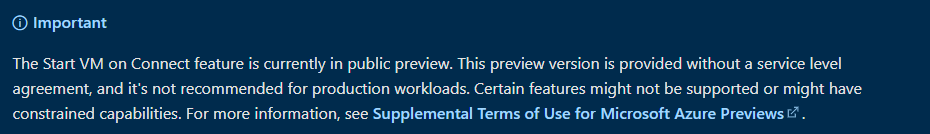
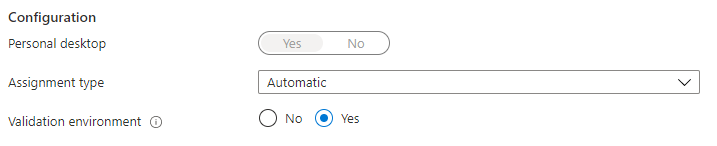
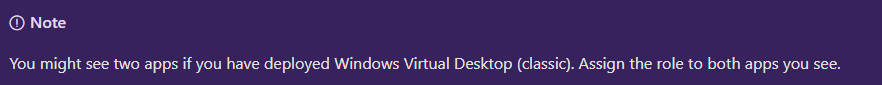
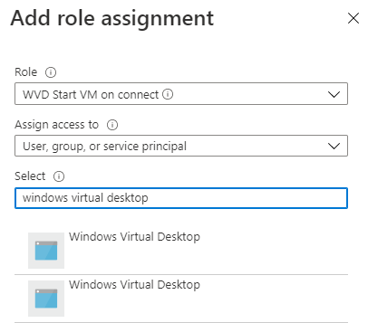
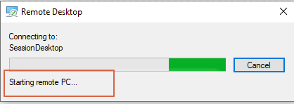

Costs are a topic of an Azure conversation very often. As we all know you pay for usage, if it is storage, CPU or bandwidth usage, (almost) every resource has its price. For Windows Virtual Desktop it means you have to pay for CPU usage, for example. It is important then to keep this usage as low as possible. Now there is an option to keep these usage as low as possible with AVD Start VM on Connect.

## Introduction

At the end of March (31-03-2021) Microsoft announced the AVD Start VM on Connect is in Public Preview for personal AVD environments. This means in short you are able to shutdown your AVD session, and so the VM. To keep costs as low as possible, make sure the VM’s are deallocated. Shutting down a VM from Windows isn’t enough. In this article I will show how to configure AVD Start VM on Connect fully automated with one single login via REST API.

The shutdown process is out of scope in the article. I’m working on a new article about the whole shutdown process.

See the official announcement:[ https://techcommunity.microsoft.com/t5/windows-virtual-desktop/start-vm-on-connect-starts-public-preview/m-p/2247357](https://techcommunity.microsoft.com/t5/windows-virtual-desktop/start-vm-on-connect-starts-public-preview/m-p/2247357)

UPDATE: On 12 May Microsoft announced this feature is now also available for pooled AVD environments.   
See the office announcement: <https://techcommunity.microsoft.com/t5/windows-virtual-desktop/leverage-start-vm-on-connect-for-pooled-host-pools-and-azure-gov/m-p/2349866>



## Requirements and limitations

Good to know is that this feature is in public preview. This means it is for testing purposes only.


Other things to keep in mind are the following:

From the office announcement:

- You can configure the setting on [validation pool only](https://docs.microsoft.com/en-us/azure/virtual-desktop/create-validation-host-pool)
- <s>This setting is for personal host pools only.</s> [Microsoft announced it is working for personal as for pooled AVD host pools. ](https://techcommunity.microsoft.com/t5/windows-virtual-desktop/leverage-start-vm-on-connect-for-pooled-host-pools-and-azure-gov/m-p/2349866)
- This setting can be accessed from PowerShell and RestAPI only.

From the docs:

- [The Windows client (version 1.2748 or later)](https://docs.microsoft.com/en-us/azure/virtual-desktop/connect-windows-7-10)

Check the [documentation](https://docs.microsoft.com/en-us/azure/virtual-desktop/start-virtual-machine-connect#create-a-custom-role-for-start-vm-on-connect) for all the information.

*At last the AVD Start VM on Connect can only be enabled on existing AVD hostpools. In case of a new environment you will have to deploy a hostpool first and then configure this option afterwards.*

## Considerations

Before we start to code we have some considerations about the code strategy. Azure AD differs from Azure with it resources. As the documentation says we have to create and assign Azure AD roles to the ‘Windows Virtual Desktop’ service principal and we have to update the AVD hostpool, which is Azure.   
This means when automating with PowerShell we have to connect to two different environments, the Azure AD and Azure. In PowerShell you will have to install an additional module [AzureADPreview](https://www.powershellgallery.com/packages/AzureADPreview/2.0.2.129). To connect to the Azure AD use the command.

```powershell
Connect-AzureAD
```

Later you will have to connect to Azure with the command below.

```powershell
Connect-AzAccount
```

In the world of automation you will have less interactions as possible, which means you want to connect only once if possible. I will explain how to deal with that.

## Windows Virtual Desktop

As you maybe know a AVD hostpool has two types of hostpools, personal and pooled. A personal hostpool means every user has it’s own sessionhost, where in a pooled type you will have to share a sessionhost with other users.

### Enable AVD Start VM on Connect 

The first and most important requirement is you will need to have a personal hostpool type and it have to be set as a validation environment. In the script is it the first thing which will be checked.   
Enabling AVD Start VM on Connect is only possible with PowerShell or the REST API.


```powershell
$HostpoolName = 'avd-hostpool-personal-001'
$ResourceGroupName = 'rg-avd-001'
try {
    $HostpoolParameters = @{
        HostPoolName      = $HostpoolName 
        ResourceGroupName = $ResourceGroupName
    }
    $Hostpool = Get-AzWvdHostPool @HostpoolParameters
    if ($Hostpool.ValidationEnvironment -eq $true) {
        Update-AzWvdHostPool @HostpoolParameters -StartVMOnConnect:$true
        Write-Verbose "Hostpool updated, StartVMOnConnect is set"
    }
}
catch {
    Throw "The hostpooltype for provided hostpool $Hostpoolname must be a check as a validation environment"
}
```

If the check is passed the statement immediately will enable Start VM on Connect on the AVD hostpool.  
That was the most simple part. Now it is time to prepare the Azure Active Directory

## Active Directory

To make things work you have to configure the correct permissions in the Azure AD. This means that you have to create and assign a new role to the Windows Virtual Desktop principal. These permissions are needed to start the virtual machines.   
  
*“Microsoft.Compute/virtualMachines/start/action”,  
“Microsoft.Compute/virtualMachines/read”*

### Authentication

The main consideration is about the authentication. As mentioned I will like to authenticate as less as possible.   
  
There is some nuance about authentication. In the script I need to authenticate several times to the different parts of the REST API but I only have to authenticate once manual. To achieve my goal I have created a function for that.

```powershell
function GetAuthToken($resource) {
    $context = [Microsoft.Azure.Commands.Common.Authentication.Abstractions.AzureRmProfileProvider]::Instance.Profile.DefaultContext
    $Token = [Microsoft.Azure.Commands.Common.Authentication.AzureSession]::Instance.AuthenticationFactory.Authenticate($context.Account, $context.Environment, $context.Tenant.Id.ToString(), $null, [Microsoft.Azure.Commands.Common.Authentication.ShowDialog]::Never, $null, $resource).AccessToken
    $authHeader = @{
        'Content-Type' = 'application/json'
        Authorization  = 'Bearer ' + $Token
    }
    return $authHeader
}
```

The function will use the current context (from Connect-AzAccount) to authenticate to the Graph API.

### Service Principal

In the first step we need to get information about the Windows Virtual Desktop service principal. This is the principal which will get permissions to start the virtual machines. The service principal already exists if a AVD hostpool is created. The information we need is the service principal ID. In some cases there are two of them, then assign the new created role to both of them. The script will take care of that.


In the first part I will authenticate to the Graph API and will request the service principals from the Azure AD.

```powershell
$GraphResource = "https://graph.microsoft.com"
$GraphHeader = GetAuthToken -resource $GraphResource
$ServicePrincipalURL = "$($GraphResource)/beta/servicePrincipals?`$filter=displayName eq 'Windows Virtual Desktop'"
$ServicePrincipals = Invoke-RestMethod -Method GET -Uri $ServicePrincipalURL -Headers $GraphHeader
```

In my case the code above has two results.

### Create custom role

The next step is creating a new role which allows the principal to manage the virtual machines. First I determine in which resource group the session hosts are. For security reasons I will use this resource group to scope the permissions to. (In the docs the scope is set at subscription level).  
In the next step I will automatically authenticate to the Azure API.

```powershell
$ScopeResourceGroup = Get-AzResource -ResourceID (Get-AzWvdSessionHost @HostpoolParameters | Select -Last 1).Id
$Scope = "subscriptions/$($context.Subscription.Id)/Resourcegroups/$($ScopeResourceGroup.ResourceGroupName)"
$AzureResource = "https://management.azure.com"
$AzureHeader = GetAuthToken -resource $AzureResource

```

First I will create a random GUID which it needed to create an unique role based on the Id. The roleName and description doesn’t need any further introduction. The assignableScopes part is where to scope this role too.   
The permissions are set to virtualMachines start en read.

At last the whole body is converted to JSON and will be send to Azure API. Good to know is that the PUT method creates and updates the role. If you need to edit the role afterwards just search for this role, modify the settings and run a PUT request again.

```powershell
#Region create custom role
# Building a new role GUID
$RoleGuid = (New-Guid).Guid
# Generating the role body
$RoleBody = @{
    name       = $RoleGuid
    properties = @{
        roleName         = "AVD Start VM on connect"
        description      = "This role is used to start VM when connecting"
        assignableScopes = @(
            $Scope
        )
        permissions      = @(
            @{
                actions        = @(
                    "Microsoft.Compute/virtualMachines/start/action",
                    "Microsoft.Compute/virtualMachines/read"
                )
                notActions     = @()
                dataActions    = @()
                notDataActions = @()
            }
        )
    }
}
$RoleJsonBody = $RoleBody | ConvertTo-Json -Depth 5
$DefinitionUrl = "$($AzureResource)/$Scope/providers/Microsoft.Authorization/roleDefinitions/$($RoleGuid)?api-version=2018-07-01"
$CustomRole = Invoke-RestMethod -Method PUT -Body $RoleJsonBody -Headers $AzureHeader -URi $DefinitionUrl
```

### Role assignment

Now we have the Windows Virtual Desktop service principal id (or two) and a custom role it is time to assign this custom role to the service principal and add it to the resource group.  
The assignment API works the same as the role definition API. You will have to create a unique Id first.

The assign body is where the custom role resource Id and the principal come together. The assign URL tells where to assign the couple to. In this case the scope is the resource group.

```powershell
$ServicePrincipals.value.id | foreach {
    $AssignGuid = (New-Guid).Guid
    $AssignURL = "$AzureResource/$Scope/providers/Microsoft.Authorization/roleAssignments/$($AssignGuid)?api-version=2015-07-01"
    $assignBody = @{
        properties = @{
            roleDefinitionId = $CustomRole.id
            principalId      = $_
        }
    }
    $JsonBody = $assignBody | ConvertTo-Json 
    Invoke-RestMethod -Method PUT -Uri $AssignURL -Headers $AzureHeader -Body $JsonBody
}

```

At the end I’ve created, assigned and enabled StartVMOnConnect by simple providing a AVD hostpool and its resource group.



## Testing

I tested the following scenario’s:

- Shutdown session host with Windows (VM is **not** deallocated)
- Stopped the VM with the Stop-AzVM PowerShell command. (VM is deallocated)

In both scenario’s the VM came back.


Thank you for reading my post about enabling AVD Start VM on Connect fully automated :).

