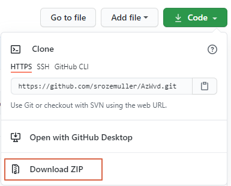

During my travel the past year in the world of AVD I noticed I’m using the common Az.DesktopVirtualization PowerShell module very often, but there are some limits. In basics they do their job but if you like more intelligence or add more resource types you will need to combine PowerShell commands to get useful information. That’s the point where I started writing a AVD PowerShell module and now it is time to share my functions as a fresh new module called Az.Avd.

I’m really glad to announce that the new Az.Wvd has been published into the official PowerShell Gallery. Inspired by my colleague John de Jager ([@johnde\_jager](https://twitter.com/johnde_jager) on Twitter) I started writing a PowerShell module to maintain Windows Virtual Desktop environments.



## Download locations

The PowerShell Gallery and my GitHub page are the places to get the Az.Avd module and install from.  
If you have registered the PSGallery repository you will be able to install the Az.Avd module directly from the PowerShell Gallery.

To register the PowerShell Gallery repository in your own environment run the command below.   
For PowerShell 5+ you will need this command.

```powershell
Register-PSRepository -Default -InstallationPolicy Trusted
```

For older PowerShell environments use this command.

```powershell
Register-PSRepository -Name PSGallery -SourceLocation https://www.powershellgallery.com/api/v2/ -InstallationPolicy Trusted
```

After registering you will be able to test the repostory with the command below.

```powershell
PS C:> Get-PSRepository        
 Name                      InstallationPolicy   SourceLocation
 ----                      ------------------   --------------
 PSGallery                 Trusted              https://www.powershellgallery.com/api/v2
 Posh Test Gallery         Trusted              https://www.poshtestgallery.com/api/v2/
 PS C:>
```

If you like to update Powershell please check the [Microsoft documentation about installing Powershell](https://docs.microsoft.com/en-us/powershell/scripting/install/installing-powershell?view=powershell-7.1)

- PowerShell Gallery link: <https://www.powershellgallery.com/packages/Az.Avd>
- GitHub link: <https://github.com/srozemuller/AzWvd>

## Install Az.Avd

After registering the PSGallery repository you will be able to install the Az.Avd module from that location directly by running the command in PowerShell.

```powershell
Install-Module -Name Az.Wvd
```

The module is also downloadable from my GitHub repository. Clone the repository by executing the git clone command in PowerShell on the decided location, or download the package from the repository location. If you want to use the GitHub command make sure you have [install the Git software](https://docs.github.com/en/desktop/installing-and-configuring-github-desktop/installing-github-desktop) first.

```powershell
git clone https://github.com/srozemuller/AzWvd.git
```


After cloning or unpacking the repository, go to the directory (in PowerShell) to import the module with the Import-Module command.

## Roadmap

In this first version the main focus was getting information about a AVD environment. Knowing all the components, if there are are still used and if the hosts are running on a latest image version is the first step to get a stable environment with the lowest cost as possible.   
In the upcoming months the focus will be on the deployment and housekeeping.

## Final words

I hope you will enjoy the Az.Avd PowerShell module and feel free to contribute at my GitHub page.  
And I will thank John for pointing me into this direction.   
  
Thank you for reading my post about the launch of the Az.Avd module.   

