It is very common to use a golden image in Azure Virtual Desktop environments. Some are using Azure images, others are using a Shared Image Gallery. A great advantage of using preconfigured images is that you just have to create a new session host from that image and you’re all set.   
The [change process](https://www.rozemuller.com/create-avd-image-version-based-on-existing-config-with-powershell/) for an image version is very simple, you will start a virtual machine from the version and you will make the changes. But what if you need to change the OS disk size of the golden image? In this article, I will explain how to change an Azure Virtual Desktop disk size when using a golden image based on the existing environment automated.

At some day you will have to extend or shrink an OS disk for your session hosts. You login into the portal, create a new virtual machine, change the disk size afterward, log in for running a Sysprep and at last generate a new version. These are quite a lot of steps that can be simplified in an automation sequence. In the next chapters, I will explain the process of how to change an Azure Virtual Desktop session host disk size automated.



## Environment explained

In this scenario, I have a basic Azure Virtual Desktop environment with a shared image gallery (SIG). I configured a Windows 10 Multisession Generalized V2 image definition.

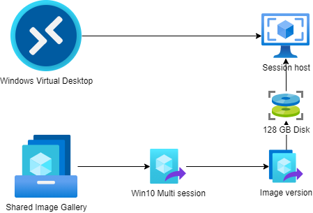
  
  
*An image definition is a logical group of images with the same specifications like OS-type.*

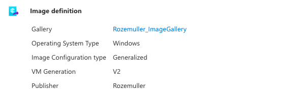
The image definition has one image version with a basic Windows 20H2 installation with a 128GB disk. At the end of this article, a new version has been made with a greater disk.

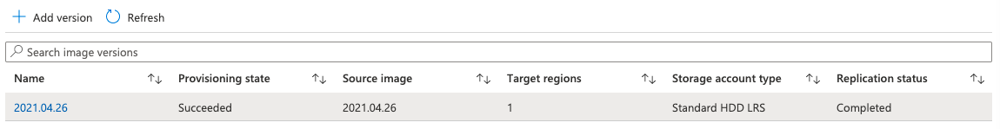
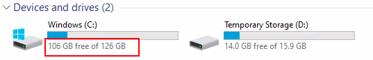
## Change avd disk size process

Before changing anything it is good to know how an Azure VM is built. An Azure VM consists of various resources. The most simple has a size (B2 or D4), a disk and a network interface card (NIC). In this change process, we are changing the disk resource.   
Check this doc which explains more about an Azure VM: <https://docs.microsoft.com/en-us/azure/architecture/reference-architectures/n-tier/windows-vm>

In the end, an image(version) at his place represents a disk state.   
To know what we are doing first I will describe, in short, how to change a disk size in the portal.

### Through the portal

The change process consists of the following:

- Create a new virtual machine from an image version

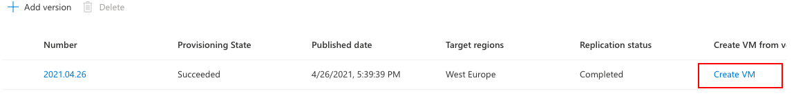
- Change the disk size in the disks blade

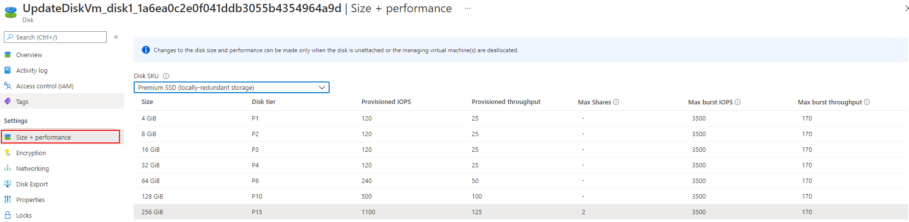
- Login into the virtual machine for Sysprep
- Generalize machine

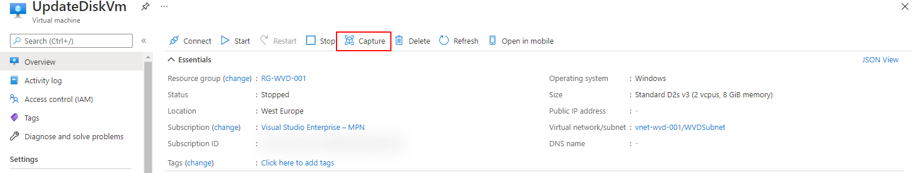
- Create an image from the virtual machine`s disk

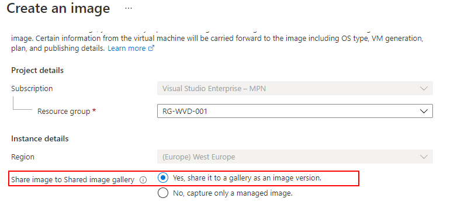
### Automated

Now the fun begins when we are going to automate things, this time with PowerShell. The main difference in the process is that we are now creating a VM with the correct disk size.

#### Install Az.avd module

The first step is to make sure you have installed the new [Az.avd PowerShell](https://www.rozemuller.com/launching-the-first-version-of-az-avd-avd-powershell-module/) module.

```powershell
install-module az.avd
import-module az.avd 
```


This module will help you get the session host's resources and id’s. In the example below, I search for one session host to get the latest gallery version. This will return all the needed information to create a new virtual machine.

```powershell
 Get-avdImageVersionStatus -HostpoolName rozemuller-hostpool -ResourceGroupName rg-avd-001 | select -Last 1

 vmLatestVersion     : 1
 vmName              : avd-0
 imageName           : Win10-MultiSession
 currentImageVersion : 2021.04.26
 vmId                : /subscriptions/<s>xx</s>/resourceGroups/RG-avd-001/providers/Microsoft.Compute/virtualMachines/avd-0
 imageGallery        : Rozemuller_ImageGallery
 resourceGroupName   : rg-sig-001
 subscriptionId      : <s>xx</s>
 lastVersion         : 2021.04.26
 hostpoolName        : rozemuller-hostpool
 sessionHostName     : avd-0.rozemuller.local
```


#### Getting information

The next step is gathering the virtual machine information of an existing session host. This is needed for getting the network information and virtual machine size. To achieve this goal we need the command below. Recommended is to save the command above into a variable so we can use it later.

```powershell
$parameters = @{
    HostpoolName = "rozemuller-hostpool"
    ResourceGroupName = "rg-avd-001"
}
$sessionHostImageInfo = Get-AvdImageVersionStatus @parameters | select -Last 1
$resources = Get-AvdSessionHostResources @parameters -SessionHostName $sessionHostImageInfo.sessionHostName
```


#### Create a virtual machine profile

Based on the returned information we are now able to create a virtual machine profile, with the correct disk size. A big difference between the portal, where the disk size is changed afterward, and the automation part.

As you can see in the example below I’m creating a new virtual machine with a 256 GB disk. Besides the credentials and virtual machine name, all other information is gathered from the existing Azure Virtual Desktop environment.

```powershell
$imageParameters = @{
    GalleryName = $sessionHostImageInfo.imageGallery
    resourceGroupName = $sessionHostImageInfo.resourceGroupName
    Name = $sessionHostImageInfo.imageName
}
$galleryImageDefintion = Get-AzGalleryImageDefinition @imageParameters


$LocalAdminUser = "tempVmUser"
$LocalAdminPass = "TempVmP@ssword123"
$vmName = "UpdateDiskVm" 
$DiskSizeGB = 256

$LocalAdminSecurePassword = ConvertTo-SecureString $LocalAdminPass -AsPlainText -Force
$Credentials = New-Object System.Management.Automation.PSCredential ($LocalAdminUser, $LocalAdminSecurePassword)
$virtualNetworkSubnet = (Get-AzNetworkInterface -ResourceId $resources.NetworkProfile.NetworkInterfaces.id).IpConfigurations.subnet.id
$SubnetConfig = Get-AzVirtualNetworkSubnetConfig -ResourceId $virtualNetworkSubnet
$NIC = New-AzNetworkInterface -Name "$vmName-nic" -ResourceGroupName $resources.ResourceGroupName -Location $resources.Location -SubnetId $SubnetConfig.Id

$VirtualMachine = New-AzVMConfig -VMName $vmName -VMSize $resources.HardwareProfile.VmSize
$VirtualMachine = Set-AzVMOperatingSystem -VM $VirtualMachine -Windows -ComputerName $vmName -Credential $Credentials
$VirtualMachine = Set-AzVMSourceImage -VM $VirtualMachine -Id $galleryImageDefintion.Id
$VirtualMachine = Set-AzVMOSDisk -Windows -VM $VirtualMachine -CreateOption FromImage -DiskSizeInGB $DiskSizeGB
$VirtualMachine = Add-AzVMNetworkInterface -VM $VirtualMachine -Id $NIC.Id

New-AzVM -VM $VirtualMachine -ResourceGroupName $resources.ResourceGroupName -Location WestEurope
```


#### Verify

A few minutes later the virtual machine has been created with the new disk size. When looking under the hood you will notice the new virtual machine has been started from the image version out of the shared image gallery.

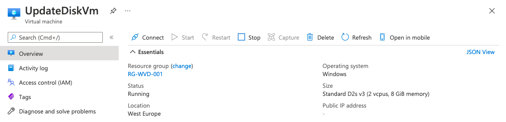
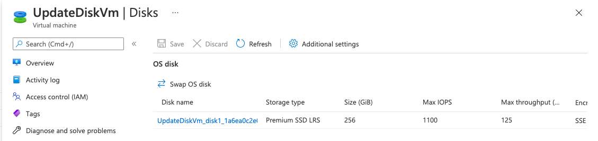
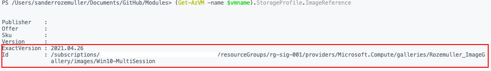
#### Generalize

Before creating a new image version we first need to generalize the virtual machine. To run a command on the virtual machine I use the ```Invoke-AzRunCommand``` and I have created a simple PowerShell script which will be executed on the machine. [The script can be downloaded from my GitHub](https://github.com/srozemuller/Windows-Virtual-Desktop/blob/master/Image%20Management/execute-sysprep.ps1). Download the file to your local machine from where you are able to send the saved PowerShell into the Invoke-AzRunCommand.

```powershell
Get-AzVM -Name $vmName | Invoke-AzVMRunCommand -CommandId 'RunPowerShellScript' -ScriptPath .\execute-sysprep.ps1
```


If you don’t like a file download then use the Azure CLI command az vm run-command. This command accepts script lines, like the PowerShell script block. <https://docs.microsoft.com/en-us/cli/azure/vm/run-command?view=azure-cli-latest>

```powershell
az vm run-command invoke  --command-id RunPowerShellScript --name $vmName -g $resources.resourceGroupName --scripts '$sysprep = "C:\Windows\System32\Sysprep\Sysprep.exe" $arg = "/generalize /oobe /shutdown /quiet /mode:vm"' \    'Start-Process -FilePath $sysprep -ArgumentList $arg' 
```


After a short time, the virtual machine has been shut down and we need to generalize the machine before we can create an image version. Before generalizing a virtual machine make sure the machine is stopped. The shutdown command in the Sysprep script will take care of that.

To make sure the machine is stopped I wrote a simple PowerShell loop that will check the virtual machine status.

```powershell
    function test-VMstatus($virtualMachineName) {
        $vmStatus = Get-AzVM -name $virtualMachineName -Status
        return "$virtualMachineName status " + $vmstatus.PowerState
    }
    
    do {
        $status = test-vmStatus -virtualMachineName $vmName
        $status
        Start-Sleep 10
    } until ( $status -match "stopped")
    Write-Output "$vmName has status $status"
    Get-AzVM -Name $vmName | Set-AzVm -Generalized
```


For more information about creating images please check my series about [avd image management automated](https://www.rozemuller.com/create-avd-image-version-based-on-existing-config-with-powershell/).

For a while, it is possible to create a new image version from a virtual machine directly. This will make it possible to skip making a snapshot so we are going to deploy a new image from the machine directly.

#### Create image version

The final step is creating an image version in the Azure Compute Gallery. In this part, we are reusing the gallery variables from the steps above. Creating a new image could take a while and depends on things like disk type (SSD, HDD) and replication regions.

```powershell
$ImageParameters = @{
    GalleryImageDefinitionName = $galleryImageDefintion.Name
    GalleryImageVersionName    = (Get-Date -format "yyyy.MM.dd")
    GalleryName                = $sessionHostImageInfo.imageGallery
    ResourceGroupName          = $sessionHostImageInfo.ResourceGroupName
    Location                   = 'WestEurope'
    SourceImageId              = (Get-AzVM -Name $vmName).id.ToString()
}
New-AzGalleryImageVersion @ImageParameters
```


After executing the command you will see a new version will be provisioned.

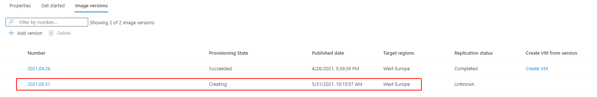If you like to know the replication status you could click on the version to check the actual status.

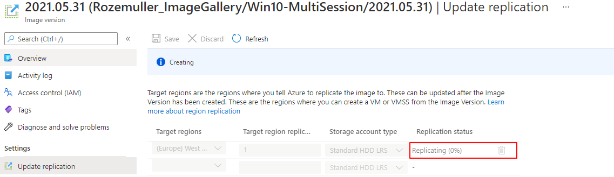
In the end, you will be able to use this image for your Azure Virtual Desktop session hosts with an expanded disk.

## Sources

To get more information about the used resources please check to sources below.

- <https://docs.microsoft.com/en-us/powershell/module/az.compute/set-azvmosdisk?view=azps-6.0.0>
- <https://docs.microsoft.com/en-us/powershell/module/az.compute/new-azvm?view=azps-6.0.0>
- <https://docs.microsoft.com/en-us/powershell/module/az.compute/invoke-azvmruncommand?view=azps-6.0.0>
- <https://docs.microsoft.com/en-us/azure/virtual-machines/windows/capture-image-resource#create-an-image-of-a-vm-using-powershell>


