Welcome to the AVD Automation Cocktail. In this cocktail series I will show different AVD deployment strategies and languages. In this cocktail, the Fresh Minty Breeze, I will show you how to deploy an AVD environment automated with Bicep and Azure CLI.



## Recipe

In this “MintyBreeze”-deployment recipe I will deploy an AVD environment automated with Bicep and Azure CLI. Bicep is a fresh new coding language for deploying Azure resources. Bicep helps reduce the syntax complexity which ARM templates has. Because it is very new I like to show in this article how to deploy an AVD environment with Bicep. To give Azure CLI also a stage I thought this could be a really nice combination.

### Before to drink

To start enrolling AVD automated with Bicep and Azure CLI you will need to install the Bicep CLI and Azure CLI software first. To download the Bicep installer go to the following URL, choose your favorite operating system and follow the instructions. <https://github.com/Azure/bicep/blob/main/docs/installing.md#install-the-bicep-cli-details>

After the installation of Bicep install the Azure CLI software by clicking this URL:[ https://docs.microsoft.com/en-us/cli/azure/install-azure-cli](https://docs.microsoft.com/en-us/cli/azure/install-azure-cli)

More information about Bicep or Azure CLI please check the following URLs:

- <https://docs.microsoft.com/en-us/azure/azure-resource-manager/bicep/overview>
- <https://docs.microsoft.com/en-us/cli/azure/>

### List CLI of ingredients

- [https://docs.microsoft.com/en-us/cli/azure/vm/run-command?view=azure-cli-latest#az\_vm\_run\_command\_invoke](https://docs.microsoft.com/en-us/cli/azure/vm/run-command?view=azure-cli-latest#az_vm_run_command_invoke) (VM Run command)
- [https://docs.microsoft.com/en-us/cli/azure/vm?view=azure-cli-latest#az\_vm\_capture](https://docs.microsoft.com/en-us/cli/azure/vm?view=azure-cli-latest#az_vm_capture) (VM Capture)
- <https://docs.microsoft.com/en-us/azure/virtual-machines/image-version-vm-cli> (Image Version)
- [https://docs.microsoft.com/en-us/cli/azure/vm?view=azure-cli-latest#az\_vm\_generalize](https://docs.microsoft.com/en-us/cli/azure/vm?view=azure-cli-latest#az_vm_generalize) (VM Generalize)
- [https://docs.microsoft.com/en-us/cli/azure/desktopvirtualization/hostpool?view=azure-cli-latest#az\_desktopvirtualization\_hostpool\_update](https://docs.microsoft.com/en-us/cli/azure/desktopvirtualization/hostpool?view=azure-cli-latest#az_desktopvirtualization_hostpool_update) (AVD Hostpool token)
- <https://docs.microsoft.com/en-us/cli/azure/ad/signed-in-user?view=azure-cli-latest> (AD Signed in User)
- [https://docs.microsoft.com/en-us/cli/azure/deployment/group?view=azure-cli-latest#az\_deployment\_group\_create](https://docs.microsoft.com/en-us/cli/azure/deployment/group?view=azure-cli-latest#az_deployment_group_create) (Deployment)

### Aftertaste

In the beginning this cocktail has a fresh taste with a lot Bicep and a pinch of Azure CLI. At the end you will have an AVD environment in Azure deployed with all the needed resources. These are a hostpool, a workspace, an application group. Also there are some session hosts. These hosts have an underlying image from a shared image gallery.

## AVD automated with Bicep en Azure CLI

In this chapter I will explain how to deploy an AVD environment automated with Bicep and Azure CLI. I will recommend to clone my [AVD GitHub repository ](https://github.com/srozemuller/AVD)to get all the needed files, also for the other cocktails. I like to work with modules as much as I can. This will avoid you are repeating yourself in lines of code and will help you keeping your code nice and clean. You will notice that when looking back in the file structure I’ve setup in the repository.   
For every purpose, in this case create an AVD environment with a SIG in basics, I will create a main.bicep file and will use modules in it.   
Later on if I need a new environment without a SIG for example I only have to create a new main.bicep without the SIG part. Yes there are options for a [conditional deploy](https://github.com/Azure/bicep/blob/main/docs/tutorial/05-loops-conditions-existing.md#conditions) but will skip that part for now to keep it as simple as possible.

### Resource Group

Before deploying anything we need to login and create a new resource group.

```powershell
az login
az group create --name RG-ROZ-BREEZE-COCKTAIL --location westeurope
```

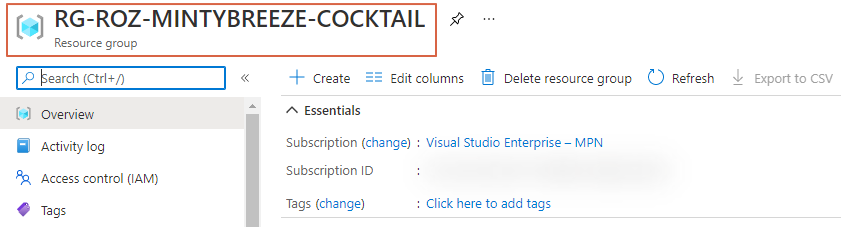
### Networking

The base of every environment is networking. In this step the idea is to deploy a new virtual network (vnet) with two subnets, a default subnet and an AVD-Breeze-subnet. Because my goal is to deploy as much as I can from parameter files I’ve create an array into a parameter file. That array will be transformed to a Bicep array. The array is used to deploy the vnet.

The parameter snippet looks like the following:

```
<pre class="wp-block-code">```json
"vnetSubnets": {
            "value": {
                "subnets": [
                    {
                        "name": "DefaultSubnet",
                        "addressPrefix": "10.0.0.0/24"
                    },
                    {
                        "name": "AVDBreezeSubnet",
                        "addressPrefix": "10.0.1.0/24"
                    }
                ]
            }
        }
```

A dynamic array is created which will be inserted into the deployment. A dynamic array has its pros because now you are scale able within your parameter file. It doesn’t matter how many subnets are in the parameter file. If you need one extra just add it to the file.

The parameter accepts the incoming parameter. It will create the array subnets. After that it will insert it into the subnets resource object.

```powershell
param vnetSubnets object
var subnets = [for item in vnetSubnets.subnets: {
  name: item.name
  properties: {
    addressPrefix: item.addressPrefix
  }
}]

resource vnet 'Microsoft.Network/virtualNetworks@2020-06-01' = {
  name: vnetName
  location: location
  properties: {
    addressSpace: {
      addressPrefixes: [
        addressPrefix
      ]
    }
    enableVmProtection: false
    enableDdosProtection: false
    subnets: subnets
  }
}
```

Mention the format of the array. It must be the same format as regular deployment code.

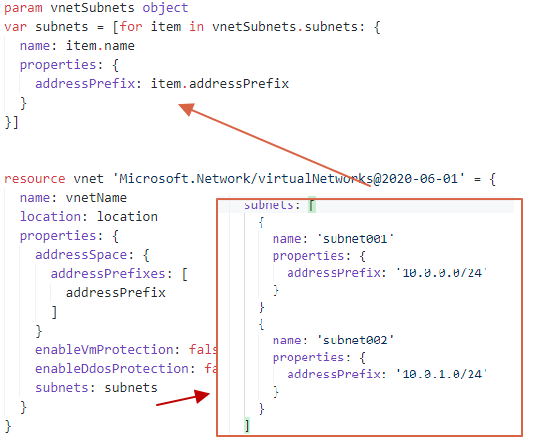
After the template and parameters are ready to deploy use the CLI command below to deploy the resources.

```powershell
az deployment group create --resource-group RG-ROZ-MINTYBREEZE-COCKTAIL --template-file .\Templates\Network\deploy-vnet-with-subnet.bicep --parameters .\Parameters\vnet-with-subnet.parameters.json
```

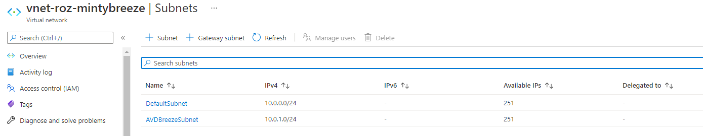
### Shared Image Gallery

In this step, we are going to create a new image version into a Shared Image Gallery. In the next Bicep files we taking care of creating the SIG. It will create the image definition and the version.

I created a template bicep file for creating a SIG and its definition. As you can see in the screenshot it will deploy two resources. The thing which is not in the examples (yet) , is deploying a SIG with dependencies. Bicep will try to deploy resources in parallel. This means it will deploy these both resources at once. Because the definition depends on the gallery the deployment will fail. (I created an pull request to fix that)

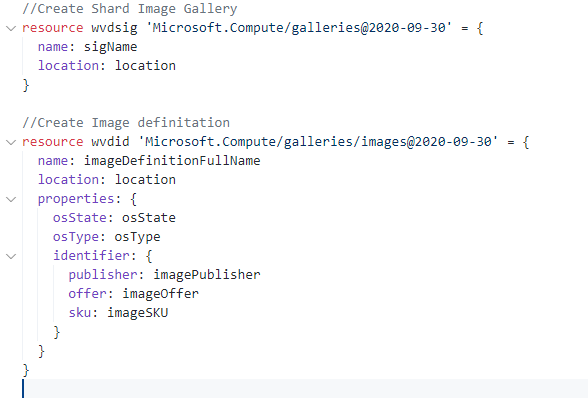
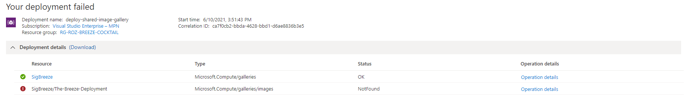
If you have dependencies then tell which dependencies it has. The definition deployment will wait for the main resource.

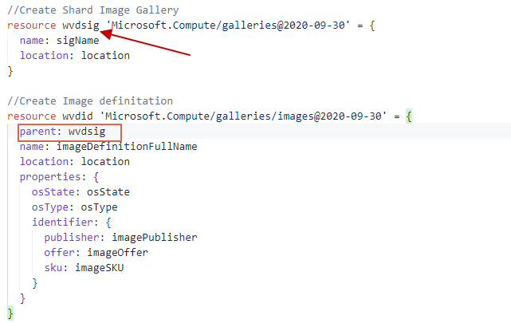
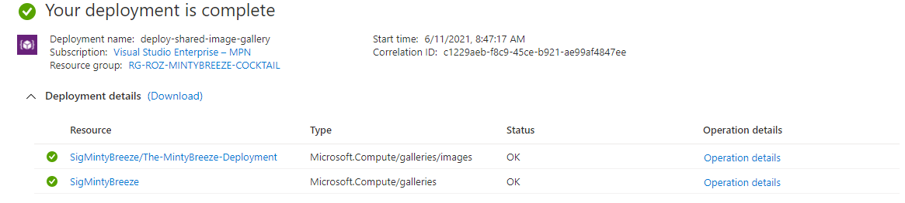
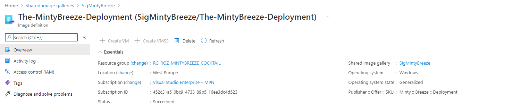
And then the deployment is successful. In the code below I used the SIG template only with a parameter file. Check my [GitHub repository](https://github.com/srozemuller/AVD/tree/main/Deployment/MintyBreeze/Templates/SIG) for the SIG template and parameter file.

```powershell
az deployment group create --resource-group RG-ROZ-BREEZE-COCKTAIL --template-file .\Templates\SIG\deploy-shared-image-gallery.bicep --parameters .\Parameters\shared-image-gallery.parameters.json
```

### Initial Image Version

The next step in our MintyBreeze-deployment is creating a new virtual machine. This machine is used for creating a new image version. This version will be deployed into the gallery. In the first step, we are creating a parameter file with the virtual machine configuration. The Bicep file for a VM and NIC deployment.

#### Create a virtual machine

I have chosen to keep is as simple as possible, so no Network Security Group for example. The machine has no public IP and will be removed after a sysprep. Sysprep is the next step after the VM deployment.

```powershell

//create nic
resource vmNic 'Microsoft.Network/networkInterfaces@2017-06-01' = {
  name: defaultVmNicName
  location: defaultLocation
  properties: {
    ipConfigurations: [
      {
        name: 'ipconfig1'
        properties: {
          subnet: {
            id: resourceId('Microsoft.Network/virtualNetworks/subnets', vnetName, subnetName)
          }
          privateIPAllocationMethod: privateIPAllocationMethod
        }
      }
    ]
  }
}

//create VM
resource vm 'Microsoft.Compute/virtualMachines@2019-07-01' = {
  name: vmName
  location: defaultLocation
  properties: {
    osProfile: {
      computerName: vmName
      adminUsername: localAdminName
      adminPassword: localAdminPassword
    }
    hardwareProfile: {
      vmSize: vmSize
    }
    storageProfile: {
      imageReference: {
        publisher: 'MicrosoftWindowsDesktop'
        offer: vmOffer
        sku: vmOs
        version: 'latest'
      }
      osDisk: {
        createOption: 'FromImage'
      }
    }
    licenseType: 'Windows_Client'
    networkProfile: {
      networkInterfaces: [
        {
          properties: {
            primary: true
          }
          id: vmNic.id
        }
      ]
    }
  }
}
```

Check my [GitHub repository at this location](https://github.com/srozemuller/AVD/tree/main/Deployment/MintyBreeze/Bicep/Templates/VM) for the VM deployment file.

```powershell
az deployment group create --resource-group RG-ROZ-MINTYBREEZE-COCKTAIL --template-file .\Templates\VM\deploy-vm-win10.bicep --parameters .\Parameters\vm-win10.parameters.json
```

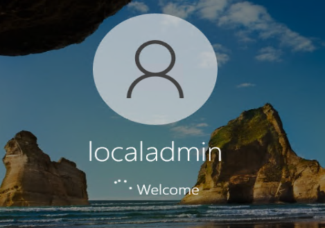
#### SysPrep

First the VM must be generalized and Sysprepped. There are several options for running a script on a VM. Think about a Custom Script Extension or an Invoke-AzRunCommand in PowerShell. In this case I’m using the Azure CLI.

```powershell
az vm run-command invoke  --command-id RunPowerShellScript --name MintyBreezeVm -g RG-ROZ-MINTYBREEZE-COCKTAIL --scripts 'param([string]$sysprep,[string]$arg) Start-Process -FilePath $sysprep -ArgumentList $arg' --parameters "sysprep=C:\Windows\System32\Sysprep\Sysprep.exe" "arg=/generalize /oobe /shutdown /quiet /mode:vm" 
```

Using the az vm run-command CLI comand gives me the option to skip creating an separate script first. In the –scripts part of the command is able to create a PowerShell on-the-fly. In the –parameters part I will send these parameters.   
When running the command, the VM will create a PowerShell file on the local machine. The provided –scripts content is stored in that local file.


#### Generalize VM

Next step beforce creating an image version is generalize and capture the virtual machine. To achieve that goal we are using the CLI again.

```powershell
az vm generalize -g RG-ROZ-MINTYBREEZE-COCKTAIL -n MintyBreezeVm
```

#### Create image version

The last step is to create a new image version. This is a deployment task so we using Bicep again. In the first step I will search for the VM Id with Azure CLI. The VM Id is the source input for the image creation. The dynamic parameters (VM Id) are additional passed in the Azure CLI command together with the parameter file

The parameter file will look like below.

```
<pre class="wp-block-code">```json
{
    "$schema": "https://schema.management.azure.com/schemas/2019-04-01/deploymentParameters.json#",
    "contentVersion": "1.0.0.0",
    "parameters": {
        "galleryName": {
            "value": "SigMintyBreeze"
        },
        "definitionName": {
            "value": "The-MintyBreeze-Deployment"
        },
        "replicaRegion": {
            "value": "westeurope"
        }
    }
}
```

Creating versions is a task which is executed often. Due that reason I created a separate Bicep file for that. The gallery and definition are deployed in the initial phase. The galleryName, definitionName and replicaRegion are pretty fixed and stored in the parameter file. The version name is unique and created by the CLI.

```powershell
param galleryName string
param definitionName string
param versionName string
param replicaRegion string
param source string

resource sigVersion 'Microsoft.Compute/galleries/images/versions@2019-12-01' = {
    name: '${galleryName}/${definitionName}/${versionName}'
    location: resourceGroup().location
    tags: {}
    properties: {
      publishingProfile: {
        targetRegions: [
          {
            name: replicaRegion
          }
        ]
        replicaCount: 1
      }
      storageProfile: {
        source: {
          id: source
        }
        osDiskImage: {
          hostCaching: 'ReadWrite'
        }
      }
    }
  }
```

In the Azure CLI code below the deployment should start. Before starting the deployment I’m searching for the VM id. I use the –query to get the id only. (Like the select command in PowerShell)

```powershell
$vm = az vm show --resource-group RG-ROZ-MINTYBREEZE-COCKTAIL --name MintyBreezeVM --query 'id'
az deployment group create --resource-group RG-ROZ-MINTYBREEZE-COCKTAIL --template-file .\Templates\SIG\deploy-shared-image-gallery-version.bicep --parameters .\Parameters\shared-image-gallery-version.parameters.json versionName='2021.06.14' source=$vm
```

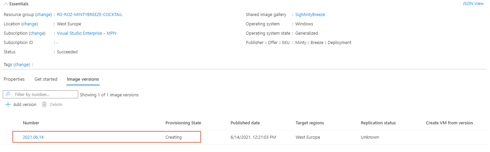
### Azure Virtual Desktop

Now every needed component is in place it is time to deploy the the Azure Virtual Desktop environment with Bicep. In this deployment we are going to deploy a host pool. The next step is the application group. The last step is a workspace. I have chosen to create a separate Bicep file for the session host. This for exactly the same reason as for an image gallery.

I created two Bicep templates. The AVD backend part with the host pool, application group and workspace. The second template for the AVD session hosts. This for exactly the same reason as for an image gallery.

```powershell
//Create WVD Hostpool
resource hp 'Microsoft.DesktopVirtualization/hostpools@2019-12-10-preview' = {
  name: hostpoolName
  location: avdlocation
  properties: {
    friendlyName: hostpoolFriendlyName
    hostPoolType: hostPoolType
    loadBalancerType: loadBalancerType
    preferredAppGroupType: preferredAppGroupType
  }
}

//Create WVD AppGroup
resource ag 'Microsoft.DesktopVirtualization/applicationgroups@2019-12-10-preview' = {
  name: appgroupName
  location: avdlocation
  properties: {
    friendlyName: appgroupNameFriendlyName
    applicationGroupType: applicationgrouptype
    hostPoolArmPath: hp.id
  }
}

//Create WVD Workspace
resource ws 'Microsoft.DesktopVirtualization/workspaces@2019-12-10-preview' = {
  name: workspaceName
  location: avdlocation
  properties: {
    friendlyName: workspaceNameFriendlyName
    applicationGroupReferences: [
      ag.id
    ]
  }
}
```

For the initial parts I created a parameter file. Check my [GitHub repository](https://github.com/srozemuller/AVD/tree/main/Deployment/MintyBreeze/Bicep/Templates/AVD) for these files.

```powershell
az deployment group create --resource-group RG-ROZ-MINTYBREEZE-COCKTAIL --template-file .\Templates\AVD\deploy-avd-environment.bicep --parameters .\Parameters\avd-enviroment.parameters.json
```

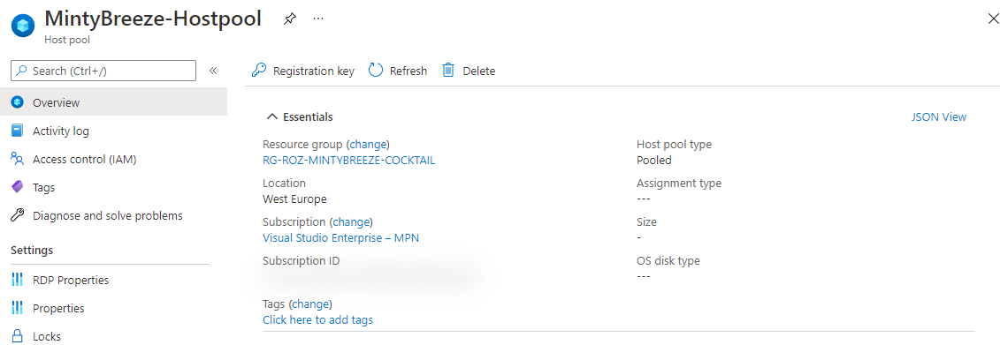
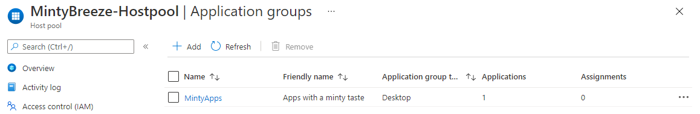>
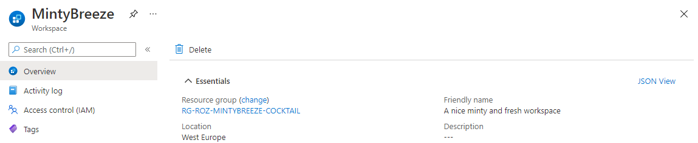
### Monitoring

As in every environment, we also like to monitor this environment. To monitor this environment we are going to use Log Analytics.

I used a template that deploys a LogAnalytics workspace. This will enable the provided logs for the AVD environment. After creating the workspace the diagnostic settings will be deployed.  
For the WorkspaceId I referenced the output of the LogAnalytics Workspace resource deployment.

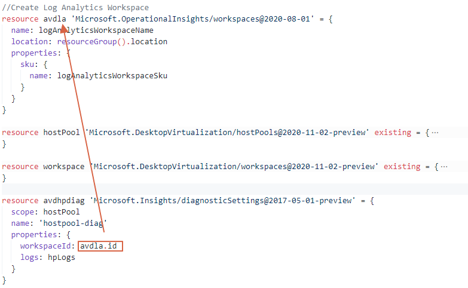
```powershell
az deployment group create --resource-group RG-ROZ-MINTYBREEZE-COCKTAIL --template-file .\Templates\LogAnalytics\deploy-LogAnalytics.bicep --parameters logAnalyticsWorkspaceName='avdLogAnalyticsWorkspace' logAnalyticsWorkspaceSku='pergb2018'
```

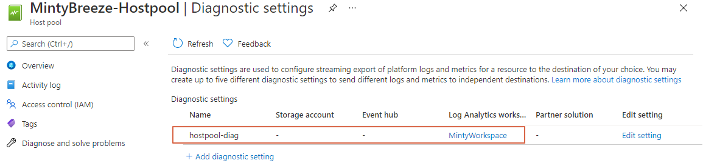
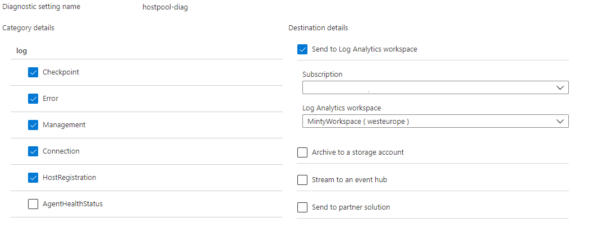
### AVD Session hosts

The last step is deploying the session hosts into the AVD hostpool. Before deploying a session host I decided to deploy an Azure Key Vault first. Into the key vault I will store the administrator password for the domain join. In the later steps I will reference to this key vault secret in the template.

#### Azure Key vault

In this step I will create an Azure Key Vault with Bicep and store the administrator password in it. I created a template and a parameter file. When running the deploy command the CLI will ask you for the vmjoiner password.

```powershell
az deployment group create --resource-group RG-ROZ-MINTYBREEZE-COCKTAIL --template-file .\Templates\KeyVault\deploy-keyvault-with-secret.bicep --parameter .\Parameters\keyvault-parameters.json objectId=$objectId
 A new Bicep release is available: v0.4.63. Upgrade now by running "az bicep upgrade".
 C:\Users\Sander\Personal Repo\AVD\Deployment\Bicep\Templates\KeyVault\deploy-keyvault-with-secret.bicep(51,28) : Warning secure-parameter-default: Secure parameters should not have hardcoded defaults (except for empty or newGuid()). [https://aka.ms/bicep/linter/secure-parameter-default]
 Please provide string value for 'vmJoinerPassword' (? for help): 
```

An another point is setting the key vault access policy. To grant access to the key vault I search for the current users ObjectId and add it to the access policy.

The parameter file and the objectId are passed into the deployment.

```powershell
$objectId = az ad signed-in-user show --query objectId
az deployment group create --resource-group RG-ROZ-MINTYBREEZE-COCKTAIL --template-file .\Templates\KeyVault\deploy-keyvault-with-secret.bicep --parameter .\Parameters\keyvault-parameters.json objectId=$objectId
```

The secret is added with the correct access policy.

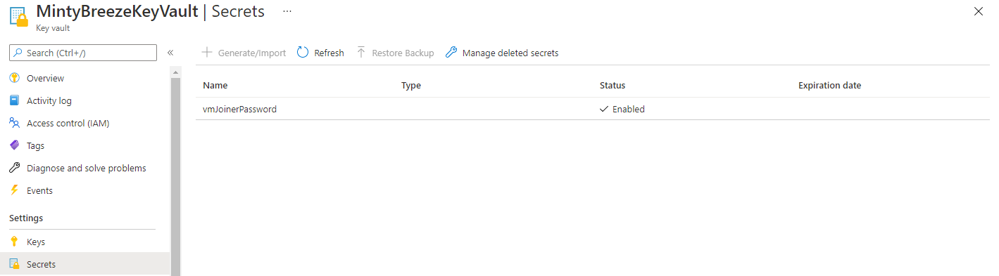
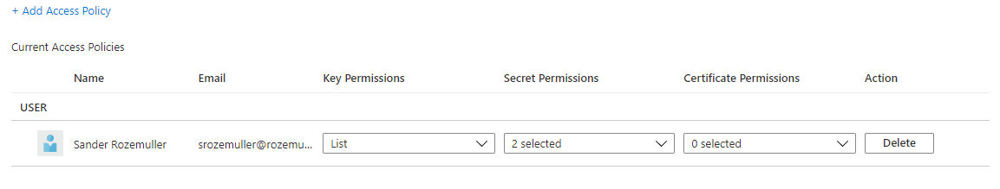
#### Create session host

The next step is creating session with a Bicep template. Before starting the deployment we need to create a hostpool registration token first. This token will be use to add the session host into the correct hostpool.

```powershell
$hostpoolToken = az desktopvirtualization hostpool update --resource-group RG-ROZ-MINTYBREEZE-COCKTAIL --name MintyBreeze-Hostpool --registration-info expiration-time="2021-06-16T15:01:54.9571247Z" registration-token-operation="Update" --query 'registrationInfo.token'
```

The command below will take care for getting the domain join password from the key vault.

```powershell
$adminpassword = az KeyVault secret show --vault-name MintyBreezeKeyVault --name vmJoinerPassword --query value
```

The value above are dynamic and/or secure values which are not recommended to save in a parameter files. I store these dynamic values into a variable which are added in the deployment command together with the Bicep template and parameter file.

Default the executing below is creating a session host that is Hybrid Azure AD joined only.
```powershell
az deployment group create --resource-group RG-ROZ-MINTYBREEZE-COCKTAIL --template-file .\Templates\AVD\deploy-avd-sessionhosts.bicep --parameters .\Parameters\avd-sessionhost.parameters.json administratorAccountPassword=$adminpassword hostpoolToken=$hostpoolToken
```

If you want to deploy session hosts in a Azure AD joined environment, then use the command below.

```powershell
az deployment group create --resource-group RG-ROZ-MINTYBREEZE-COCKTAIL --template-file .\Templates\AVD\deploy-avd-sessionhosts.bicep --parameters .\Parameters\avd-sessionhost.parameters.json administratorAccountPassword=$adminpassword hostpoolToken=$hostpoolToken aadJoin=$true
```

If you also want to add the session hosts into Microsoft Intune, then use then also add `intune=$true` to the command.

After the deployment the session hosts are created in the correct OU.

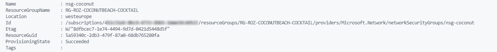
I have the automated assignment of users to application group under investigation.   
For now everything is in place you only have to assign a usergroup to the application group and that’s it.

## Conclusion

I’m very exited about the way how Bicep works. Bicep is well documented ([check the GitHub page](https://github.com/Azure/bicep)) but it is still under development. During my deployment, as you read above, I had to use my ARM knowledge to add additional object into the Bicep template and figuring out how a deployment name should be.  
But after all Bicep in basics is very useful can help a lot of people with less coding experience.   
  
I have chosen to keep it as simple as possible from my opinion. Yes there are a lot more options like creating a main.bicep file which accepts all the parameters from one parameter file and creating modules with output.   
In fact with all this Bicep files from this article you are able to create a main.bicep file. In the main.bicep you can create modules. These modules referrers to the template file. In the template file you configure the resource deployment.

I’m also very surprised about Azure CLI. It feels very fast in relation to PowerShell, at least with deployment (or other ‘push’ tasks). As you read above I’m also querying some info which isn’t very fast. A big advantage in relation to PowerShell is that you don’t need modules, well not as many as in PowerShell :). For the desktop virtualization part I had to install an extension but that’s it.   
An another point is that you don’t have to remember use a lot different commands like get-avd, set-avd, update-avd. It all starts with the same context and then what you like to do, show, remove, update for example.

## Thank you!

I hope you liked the Fresh Minty Breeze 🍃💨 you are a bit inspired. Now you know deploy AVD automated with Bicep and Azure CLI is one of the options. If you like another cocktail feel free to stay and check the [AVD Automation Cocktail menu](https://www.rozemuller.com/avd-automation-cocktail-the-menu/).

