Welcome to the AVD Automation Cocktail. In this cocktail series, I will show different AVD deployment strategies and languages. In this cocktail, the Coconut Beach Party, I will show you how to deploy an AVD environment automated with PowerShell only.



## Recipe

In this “CoconutBeach”-deployment recipe I will deploy an AVD environment automated with PowerShell only. PowerShell is commonly used for automating the management of systems.

### Before to drink

To start enrolling AVD automated with PowerShell you will need to install PowerShell on your system.

<https://docs.microsoft.com/en-us/powershell/scripting/install/installing-powershell?view=powershell-7.1>

In automation variables are key. In the code snippets below you will notice I use variables in combination with hash tables a lot. After creating a hash table I will use the [splatting](https://docs.microsoft.com/en-us/powershell/module/microsoft.powershell.core/about/about_splatting?view=powershell-7.1) technique. For me the most important reason of splatting parameters is it will keep my code short and clean.

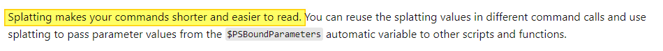
### List PowerShell of ingredients

To make PowerShell working without issues you will need to some PowerShell modules. For installing and importing modules use the code below. Change the module name with the modules in the list. At the start of every chapter I wrote down which module is needed to run the automation.

```powershell
Install-Module Az.Network
Import-Module Az.Network
```

- Az.Network
- Az.Resources
- Az.Compute
- Az.Avd

### Aftertaste

This cocktail has a strong PowerShell taste with a coconut aftertaste. In the beginning the cocktail the cocktail starts a bit light when the taste gets stronger. At the end you will have an AVD environment in Azure deployed automated with PowerShell with all the needed resources. These are a hostpool, a workspace, an application group. Also there are some session hosts. These hosts have an underlying image from a shared image gallery.

## AVD automated with PowerShell only

In this chapter I will explain how to deploy an AVD environment automated with PowerShell. If you are not that good in ARM, CLI or Bicep this cocktail can help you automating I will recommend to clone my [AVD GitHub repository ](https://github.com/srozemuller/AVD)to get all the needed files, also for the other cocktails.   
For every purpose, in this case create an AVD environment with a SIG in basics.

### Resource group

The first step in our deployment is creating a new resource group. In this group I will deploy all the resources in this blog post. Needed module: Az.Resources

```powershell
$resourceGroupName = "RG-ROZ-COCONUTBEACH-COCKTAIL"
$location = "WestEurope"
$parameters = @{
        ResourceGroup = $resourceGroupName
        Location = $location
}
New-AzResourceGroup @parameters
```


### Networking

The second step of our “CoconutBeach”-deployment is deploying a VNET with a custom DNS (for our domain join), two subnets and a network security group. A network security group, or NSG, will help us protecting our network for unwanted traffic.

Needed module: Az.Network

First I will deploy the NSG with the code below. The deployment will be stored into a variable. If you look into the variable you will get the deployment result output like a resourceId. Storing output in variables is very useful in for deployments further in the script.

```powershell
$nsgParameters = @{
    ResourceGroupName = $resourceGroupName 
    Location = $location 
    Name =  "nsg-coconut"
}
$networkSecurityGroup = New-AzNetworkSecurityGroup @nsgParameters
```

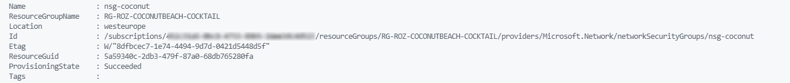
The next step is configuring the subnets and assigning them to the recently created NSG. I created a hashtable with all the needed subnets and the NSG variable. It looks like a bit overkill creating an for each loop for two subnets but it is just a way of working I learned myself. Working with arrays will help you avoiding executing the same commands over and over.

```powershell
$subnetParameters = @{
    defaultSubnet = "10.0.1.0/24"
    avdSubnet = "10.0.2.0/24"
    NetworkSecurityGroup = $networkSecurityGroup
}
$subnets = $subnetParameters.GetEnumerator().ForEach({
    New-AzVirtualNetworkSubnetConfig -Name $_.Name -AddressPrefix $_.Value -NetworkSecurityGroup $networkSecurityGroup
})
```

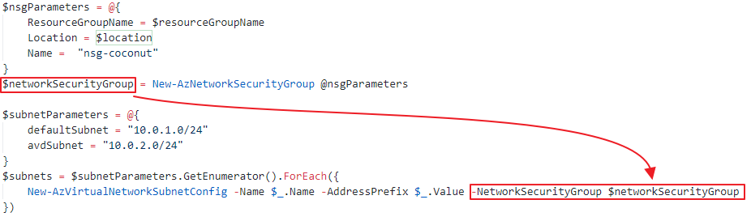
After the NSG and the subnet config deployment we are creating the virtual network. To create a network I stored the subnets variable into the vnet parameters. I also stored a DNS server into the config. The 10.3.1.4 is my domain controller and DNS server.

```powershell
$vnetParameters = @{
    name = "vnet-coconutbeach"
    ResourceGroupName = $resourceGroupName
    Location = $location
    AddressPrefix = "10.0.0.0/16" 
    Subnet = $subnets
    DnsServer = "10.3.1.4"
}
$virtualNetwork = New-AzVirtualNetwork @vnetParameters 
```

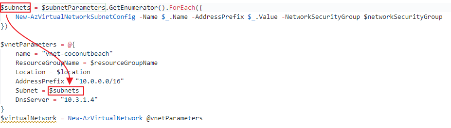
Subnet parameters stored in the vnet configuration</figcaption>
At the end the virtual network is deployed with the correct settings.

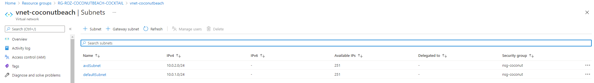
### Shared Image Gallery

The next part is creating a shared image gallery. In this gallery we are creating image versions. We going to use these versions to start AVD sessions host later in this article.

Needed module: Az.Compute

First, we are creating the gallery itself with the command below.

```powershell
$galleryParameters = @{
    GalleryName = "CoconutBeachGallery"
    ResourceGroupName = $resourceGroupName
    Location = $location
    Description = "Shared Image Gallery for my beach party"
}
$gallery = New-AzGallery @galleryParameters
```

The next step is assigning an Azure AD group to the gallery with contributor permissions.  
Because I stored the gallery deployment into a variable, I’m now able to use that deployment in the next one. First I will create a new Azure AD Group called Gallery Contributor.

```powershell
$GalleryContributor = New-AzAdGroup -DisplayName "Gallery Contributor" -MailNickname "GalleryContributor" -Description "This group had shared image gallery contributor permissions"

$galleryRoleParameters = @{
    ObjectId = $GalleryContributor.Id
    RoleDefinitionName = "contributor"
    ResourceName = $gallery.Name
    ResourceType = "Microsoft.Compute/galleries" 
    ResourceGroupName = $gallery.ResourceGroupName
}

New-AzRoleAssignment @galleryRoleParameters
```

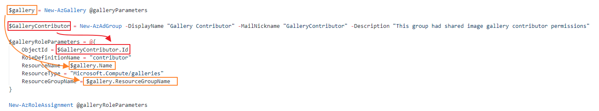
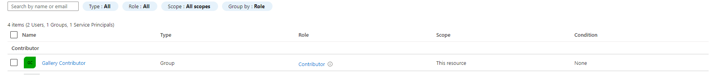
A part of a gallery is the image gallery definition. This is a logical group of images with the same properties like os-type, system state (generalized, specialized) and VM generation.

I’m creating a sysprepped Windows installation on a V2 generation. Again I’m able to reuse deployments from an earlier stadium.

```powershell
$imageDefinitionParameters = @{
    GalleryName = $gallery.Name
    ResourceGroupName = $gallery.ResourceGroupName
    Location = $gallery.Location
    Name = "CoconutDefinition"
    OsState = "Generalized"
    OsType = "Windows"
    Publisher = "Coconut"
    Offer = "Beach"
    Sku = "Party"
    HyperVGeneration= "V2"
}
$imageDefinition = New-AzGalleryImageDefinition @imageDefinitionParameters
```

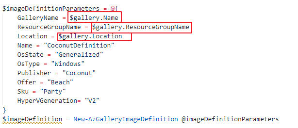
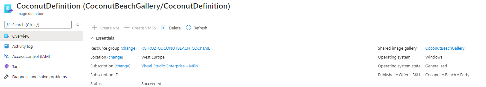

### Initial image version

It is time to create an initial image version. This version is the base of our AVD enviroment. Later on we are able to create new versions based on this one.

Needed module: Az.Compute, Az.Network

### Create a virtual machine

The first step is creating a new Windows 10 Multi Session virtual machine. The VM has a custom OS disk size of 512 GB. Make a notice of the G2 image SKU. The G2 is the HyperV generation. This must be the same generation as the image definition HyperV generation.

```powershell
$VMLocalAdminUser = "LocalAdminUser"
$VMLocalPassword = "V3rySecretP@ssw0rd"
$VMLocalAdminSecurePassword = ConvertTo-SecureString $VMLocalPassword -AsPlainText -Force

$VMName = "vm-coconut"
$VMSize = "Standard_D2s_v3"
$ImageSku = "21h1-evd-g2"
$ImageOffer = "Windows-10"
$ImagePublisher = "MicrosoftWindowsDesktop"
$ComputerName = $VMName
$DiskSizeGB = 512
$nicName = "nic-$vmName"

$NIC = New-AzNetworkInterface -Name $NICName -ResourceGroupName $ResourceGroupName -Location $location -SubnetId ($virtualNetwork.Subnets | Where {$_.Name -eq "avdSubnet"}).Id
$Credential = New-Object System.Management.Automation.PSCredential ($VMLocalAdminUser, $VMLocalAdminSecurePassword);

$VirtualMachine = New-AzVMConfig -VMName $VMName -VMSize $VMSize
$VirtualMachine = Set-AzVMOperatingSystem -VM $VirtualMachine -Windows -ComputerName $ComputerName -Credential $Credential -ProvisionVMAgent -EnableAutoUpdate
$VirtualMachine = Add-AzVMNetworkInterface -VM $VirtualMachine -Id $NIC.Id
$VirtualMachine = Set-AzVMOSDisk -Windows -VM $VirtualMachine -CreateOption FromImage -DiskSizeInGB $DiskSizeGB
$VirtualMachine = Set-AzVMSourceImage -VM $VirtualMachine -PublisherName $ImagePublisher -Offer $ImageOffer -Skus $ImageSku -Version latest

$initialVM = New-AzVM -ResourceGroupName $ResourceGroupName -Location $Location -VM $VirtualMachine
```

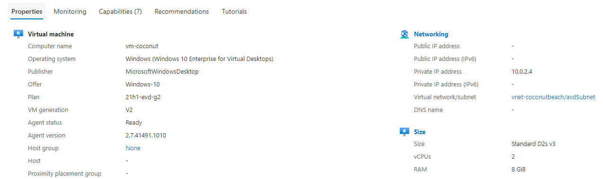
### Sysprep

First, the VM must be generalized and Sysprepped. We are executing the sysprep command with the Invoke-AzRunCommand PowerShell command. This command allows you to run commands on Azure VMs remotely.

Needed module: Az.Compute

In comparison with Azure CLI PowerShell needs a script input where Azure CLI can handle commands as well. Because of that point I will create a script within my automation sequence. The script is stored at the current working directory.   
Of course you are able to store it where you like. Make a notice about the “`” before the variables. Because $ is a special character we need to use escape characters. Otherwise PowerShell will acts the value as a variable.

Another ‘trick’ is the -Wait parameter in this case. Using the -Wait switch parameter takes care that the PowerShell script will be opened till the Sysprep process is stopped.   
If you skip the -Wait parameter the Invoke-AzVMRunCommand command will only execute the PowerShell and waits till the PowerShell script is stopped. If the script is stopped the VM will return a success before the actual process, sysprep.exe, is finished.

```powershell
$content = 
@"
    param (
        `$sysprep,
        `$arg
    )
    Start-Process -FilePath `$sysprep -ArgumentList `$arg -Wait
"@

Set-Content -Path .\sysprep.ps1 -Value $content
```

After the file has been created the we are able to execute the file on the virtual machine. Because the file accepts parameters I’m passing the variables in the -parameter command. Make a notice about storing the virtual machine object into a variable. This variable will be used in the next two commands.

```powershell
$vm = Get-AzVM -Name $VMName
$vm | Invoke-AzVMRunCommand -CommandId "RunPowerShellScript" -ScriptPath .\sysprep.ps1 -Parameter @{sysprep = "C:\Windows\System32\Sysprep\Sysprep.exe";arg = "/generalize /oobe /shutdown /quiet /mode:vm"}
```

By using the /shutdown switch the will shutdown after the process is finished. The VM must have a stopped status before we are able to generalize the VM.

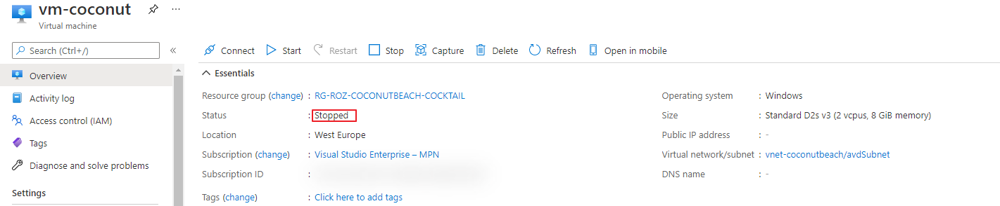
### Generalize

Generalizing a virtual machine is the last step before we are able to create an image version. Generalizing a machine is done by one simple command.

Needed module: Az.Compute

```powershell
$vm | Set-AzVm -Generalized
```

### Create image version

The last step is creating a new image version into the gallery. As you can see I’m using information which I already know and has been stored into variables in the earlier steps. After the image has been deployed the next step is create AVD session hosts from this image.

```powershell
$imageVersionParameters = @{
    GalleryImageDefinitionName = $imageDefinition.Name
    GalleryImageVersionName    = (Get-Date -f "yyyy.MM.dd")
    GalleryName                = $gallery.Name
    ResourceGroupName          = $gallery.ResourceGroupName
    Location                   = $gallery.Location
    SourceImageId              = $vm.id.ToString()
}
$imageVersion = New-AzGalleryImageVersion @imageVersionParameters
```

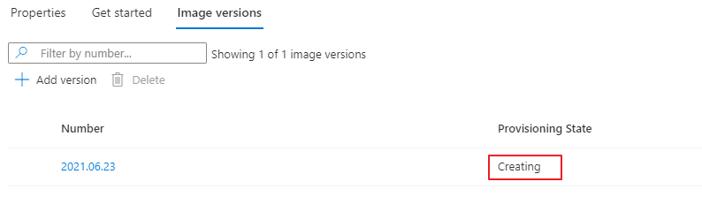
## Azure Virtual Desktop

After the backend is prepared, it is time to deploy the AVD environment. This deployment differs a little in relation to other cocktails like [The Fresh Minty Breeze](https://www.rozemuller.com/avd-automation-cocktail-avd-with-bicep-and-azure-cli/#avd). In the cocktails where templates and parameter files are used I recommend creating single template files. These files are used for repeatable actions like deploying session host. This will make life easier and you code a lot more cleaner.

In this case we only use code and we are in full control which commands we are using and when.

### AVD Hostpool

The first step in deploying an AVD enviroment automated with PowerShell is creating a hostpool. In this hostpool I also configuring the new StartVMOnConnect option. This option allows you to shutdown sessionhosts at the end of the day. When the first account is connecting the host will start automatically.

Needed module: Az.DesktopVirtualization

```powershell
$hostpoolParameters = @{
    Name = "CoconutBeach-Hostpool"
    Description = "A nice coconut on a sunny beach"
    ResourceGroupName = $resourceGroupName
    Location = $location
    HostpoolType = "Pooled"
    LoadBalancerType = "BreadthFirst"
    preferredAppGroupType = "Desktop"
    ValidationEnvironment = $true
    StartVMOnConnect = $true
}
$avdHostpool = New-AzWvdHostPool @hostpoolParameters
```

### Start VM on Connect

To save costs it is recommended to enable the Start VM on Connection feature. Enabling this feature allows you to shutdown all the hosts at the end of the day. If all hosts are down and a person is logging in a session host will start automatically.   
To enable this feature you will need to create a custom role in the Azure AD and assign this role to the session host resourcegroup.

To make this process easier [I wrote the PowerShell module Az.Avd](https://www.rozemuller.com/launching-the-first-version-of-az-wvd-wvd-powershell-module/). In this module there is a command which allows you enabling the Start VM on Connect feature in one simple command. Because this is an initial deployment I need to provide a HostResourceGroup as well. This is the resource group where the session hosts are. In an existing environment you can skip the parameter. The module will find out itself.

Needed module: Az.Avd

```powershell
$startVmParameters = @{
    HostpoolName = $avdHostpool.Name
    ResourceGroupName = $hostpoolParameters.resourceGroupName
    HostResourceGroup = $hostpoolParameters.resourceGroupName
}
$startVmOnConnect = Enable-AvdStartVmOnConnect @startVmParameters
```

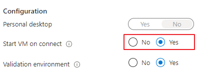
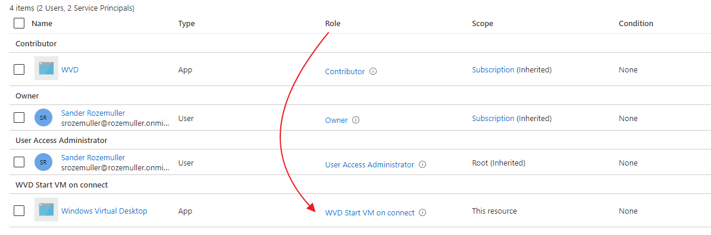
### Application group

The application group is the place where to assign users/groups to the AVD environment. Also in this part I’m using variables from the previous deployment.

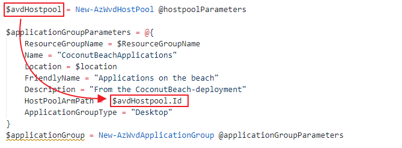
```powershell
$applicationGroupParameters = @{
    ResourceGroupName = $ResourceGroupName
    Name = "CoconutBeachApplications"
    Location = $location
    FriendlyName = "Applications on the beach"
    Description = "From the CoconutBeach-deployment"
    HostPoolArmPath =  $avdHostpool.Id
    ApplicationGroupType = "Desktop"
}
$applicationGroup = New-AzWvdApplicationGroup @applicationGroupParameters
```

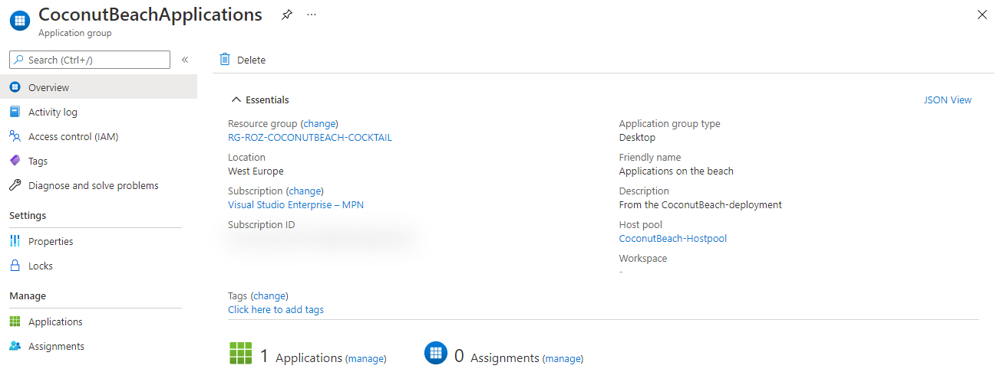
### Workspace

The AVD workspace is the frontend of the AVD enviroment. This is the place where people subscribing to. Deploying the workspace is the last step before deploying the AVD session hosts. In the code below we are creating a new workspace and assign it to the recently created application group.

```powershell
$workSpaceParameters = @{
    ResourceGroupName = $ResourceGroupName
    Name = "Party-Workspace"
    Location = $location
    FriendlyName = "The party workspace"
    ApplicationGroupReference = $applicationGroup.Id
    Description = "This is the place to party"
}
$workSpace = New-AzWvdWorkspace @workSpaceParameters
```

Make sure, after deployment, you will assign the workspace to the correct users or groups.

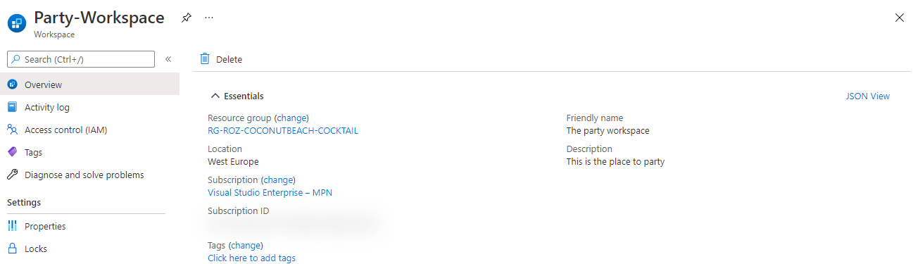
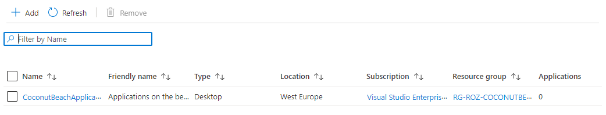
### AVD Session hosts

The last step is deploying the session hosts into the AVD hostpool. Before deploying a session host I decided to deploy an Azure Key Vault first. Into the key vault I will store the administrator password for the domain join. In the later steps I will reference to this key vault secret in the template.

Needed modules: Az.DesktopVirtualization, Az.KeyVault

#### Azure Key vault

In this step I will create an Azure Key Vault with PowerShell and store the administrator password in it. The password will be used later in the automation sequence.

```powershell
$keyVaultParameters = @{
    Name = "CoconutKeyVault"
    ResourceGroupName = $resourceGroupName
    Location = $location
}
$keyVault = New-AzKeyVault @keyVaultParameters

$secretString = "V3ryS3cretP4sswOrd!"
$secretParameters = @{
    VaultName = $keyVault.VaultName
    Name= "vmjoinerPassword"
    SecretValue = ConvertTo-SecureString -String $secretString -AsPlainText -Force
}
$secret = Set-AzKeyVaultSecret @secretParameters
```


#### Create session host

Finally it is time to create our first AVD session host with PowerShell. Before starting the deployment we need to create a hostpool registration token first. This token will be use to add the session host into the correct hostpool.

Needed module: Az.Avd, Az.Compute

First I set the needed parameters to deploy AVD session hosts.

```powershell
$sessionHostCount = 1
$initialNumber = 1
$VMLocalAdminUser = "LocalAdminUser"
$VMLocalAdminSecurePassword = ConvertTo-SecureString (Get-AzKeyVaultSecret -VaultName $keyVault.Vaultname -Name $secret.Name ) -AsPlainText -Force
$avdPrefix = "avd-"
$VMSize = "Standard_D2s_v3"
$DiskSizeGB = 512
$domainUser = "joinaccount@domain.local"
$domain = $domainUser.Split("@")[-1]
$ouPath = "OU=Computers,OU=AVD,DC=domain,DC=local"

$registrationToken = Update-AvdRegistrationToken -HostpoolName $avdHostpool.name $resourceGroupName
$moduleLocation = ""
```

When using templates like ARM or Bicep the template and ARM engine takes care of looping through the machine count. If you deploy with only code you will need to create a loop by yourself. In this case I created an Do-While loop. It executes code as long the condition is not met.

The condition is while the sessionHostCount is not 0. In the parameters above I set the count to 1. At the end of the “do”-part the counter will decrease with 1. Till the counter is not 0 the loop will execute.   
First I will create a network card and a VM. After the resources are deployed I install the needed extensions for the AD domain join and the AVD agent.

```powershell
Do {
    $VMName = $avdPrefix+"$initialNumber"
    $ComputerName = $VMName
    $nicName = "nic-$vmName"
    $NIC = New-AzNetworkInterface -Name $NICName -ResourceGroupName $ResourceGroupName -Location $location -SubnetId ($virtualNetwork.Subnets | Where { $_.Name -eq "avdSubnet" }).Id
    $Credential = New-Object System.Management.Automation.PSCredential ($VMLocalAdminUser, $VMLocalAdminSecurePassword);

    $VirtualMachine = New-AzVMConfig -VMName $VMName -VMSize $VMSize
    $VirtualMachine = Set-AzVMOperatingSystem -VM $VirtualMachine -Windows -ComputerName $ComputerName -Credential $Credential -ProvisionVMAgent -EnableAutoUpdate
    $VirtualMachine = Add-AzVMNetworkInterface -VM $VirtualMachine -Id $NIC.Id
    $VirtualMachine = Set-AzVMOSDisk -Windows -VM $VirtualMachine -CreateOption FromImage -DiskSizeInGB $DiskSizeGB
    $VirtualMachine = Set-AzVMSourceImage -VM $VirtualMachine -Id $imageVersion.id

    $sessionHost = New-AzVM -ResourceGroupName $ResourceGroupName -Location $Location -VM $VirtualMachine

    $initialNumber++
    $sessionHostCount--
    Write-Output "$VMName deployed"
}
while ($sessionHostCount -ne 0) {
    Write-Verbose "Session hosts are created"
}
```

#### Install AVD extensions with PowerShell

To make a ‘normal’ vm a AVD session host we need to install two extensions. The ActiveDirectory domain join extension and the desired state config (DSC) extension. The DSC extension installs the AVD agent software and registers the host into the AVD hostpool.

There are two separate commands available for deploying the specific extension types. More information about these types [Set-AzVmDscExtension](https://docs.microsoft.com/en-us/powershell/module/az.compute/set-azvmdscextension?view=azps-6.1.0) and [Set-AzVMADDomainExtension](https://docs.microsoft.com/en-us/powershell/module/az.compute/set-azvmaddomainextension?view=azps-6.1.0) check the Microsoft documentation. To keep my code as simple as possible I’ve chosen to use the [Set-AzVMExtension](https://docs.microsoft.com/en-us/powershell/module/az.compute/set-azvmextension?view=azps-6.1.0).

```powershell
        $domainJoinSettings = @{
        Name                   = "joindomain"
        Type                   = "JsonADDomainExtension" 
        Publisher              = "Microsoft.Compute"
        typeHandlerVersion     = "1.3"
        SettingString          = '{
            "name": "'+ $($domain) + '",
            "ouPath": "'+ $($ouPath) + '",
            "user": "'+ $($domainUser) + '",
            "restart": "'+ $true + '",
            "options": 3
        }'
        ProtectedSettingString = '{
            "password":"' + $(Get-AzKeyVaultSecret -VaultName $keyVault.Vaultname -Name $secret.Name -AsPlainText) + '"}'
        VMName                 = $VMName
        ResourceGroupName      = $resourceGroupName
        location               = $Location
    }
    Set-AzVMExtension @domainJoinSettings

    $avdDscSettings = @{
        Name               = "Microsoft.PowerShell.DSC"
        Type               = "DSC" 
        Publisher          = "Microsoft.Powershell"
        typeHandlerVersion = "2.73"
        SettingString      = "{
            ""modulesUrl"":'$avdModuleLocation',
            ""ConfigurationFunction"":""Configuration.ps1\\AddSessionHost"",
            ""Properties"": {
                ""hostPoolName"": ""$($fileParameters.avdSettings.avdHostpool.Name)"",
                ""registrationInfoToken"": ""$($registrationToken.token)"",
                ""aadJoin"": true
            }
        }"
        VMName             = $VMName
        ResourceGroupName  = $resourceGroupName
        location           = $Location
    }
    Set-AzVMExtension @avdDscSettings   
```

Check the complete do-while loop at my [GitHub page](https://github.com/srozemuller/AVD/tree/main/Deployment/CoconutBeach).

## Monitoring

The next step in our sequence is the monitoring part. In this part we are going to install a Log Analytics Workspace and will enable diagnostic settings on the hostpool and the workspace.

In the code below I’m creating a new Log Analytics Workspace with a fixed prefix and a random number. This because of a Log Analytics workspaces must be unique per resource group.

```powershell
$loganalyticsParameters = @{
    Location = $Location 
    Name = "log-analytics-avd-" + (Get-Random -Maximum 99999)
    Sku = "Standard" 
    ResourceGroupName = $resourceGroupName
}

# Create the workspace
$laws = New-AzOperationalInsightsWorkspace @loganalyticsParameters
```


In the next part I’m connecting the workspace to the AVD diagnostics settings. Also in this situation I will use the deployment variable.


Make a notice on the orange arrow. This variable was created in the [hostpool part of the AVD environment](#hostpool).


Enabling these settings are the basics for a good monitoring environment. If you like to configure advanced AVD monitoring automated please check my post about[ enabling AVD monitoring automated](https://www.rozemuller.com/deploy-azure-monitor-for-windows-virtual-desktop-automated/). I will recommend monitoring the AVD required URLs also. [Check my post about how to achieve that goal](https://www.rozemuller.com/monitor-windows-virtual-desktop-required-urls-with-log-analytics-workspace/).

## Conclusion

PowerShell is my ‘mother’-language for automation. I’ve created a lot of scripts with PowerShell but must say, during writing this post, I’ve seen some new commands. I took some time to figure it out how these work the best. Especially the extension part took some time.

The great of PowerShell is that it is community driven. This makes it possible to created modules to make life easier. For example the [Az.Avd module I wrote](https://www.rozemuller.com/launching-the-first-version-of-az-wvd-wvd-powershell-module/). In this post I use my own module and the native modules like Az.Resources or Az.Compute.

All these modules are great and nasty at the same time. If you think you’re all set a new module dependency came up. So make sure you have install all the needed module.   
If you are using this sequence in a DevOps pipeline for example, I would suggest to only install the needed modules. Installing all the Az\* module will take some time and is totally overkill.

For me it was really fun creating a fully PowerShell driven deployment for AVD. Of course I prefer parameter files as well but in fact in the very beginning I just started with a location and a resource group name. From that perspective I’m able to deploy an AVD enviroment fully automated.. This will allow you to generate an AVD environment fully automated by just providing a location only.   
And that’s what I like about PowerShell.

## Thank you!

I hope you liked the Coconut Beach Party 🧉 🏖 🥳 and got a bit inspired. Now you know deploy AVD automated with PowerShell is one of the options. If you like another cocktail feel free to stay and check the [AVD Automation Cocktail menu](https://www.rozemuller.com/avd-automation-cocktail-the-menu/).

