Welcome to the AVD Automation Cocktail. In this cocktail series I will show different AVD deployment strategies and languages. In this cocktail, the Strawberry Banana Mix, I will show you how to deploy an AVD environment automated with DevOps, ARM templates and a bit of PowerShell.



## Recipe

In this “StrawberryBanana”-deployment recipe I will deploy an AVD environment automated with DevOps and ARM templates. I also using some PowerShell to glue some parts together.

### Before to drink

To start enrolling AVD automated with DevOps and ARM templates you will need to have a DevOps organization. In that organization, you need a project. In that project you will have to configure a service connection to an Azure tenant. Configuring the DevOps requirements is not the scope of this cocktail. For more info about configuring DevOps the automated way please check my series [‘the DevOps project’](https://www.rozemuller.com/prepare-azure-devops-for-windows-virtual-desktop-deployment-app-registration/)

Also, make sure you have an Active Directory domain present for the domain join.

### List DevOps of ingredients

- ARM templates
- YAML templates
- DevOps Libraries
- PowerShell

### Aftertaste

This cocktail has an Azure DevOps in YAML base with ARM templates as main ingredient. Sometimes there is a little PowerShell taste. At the end you will have an AVD environment in Azure deployed automated with PowerShell with all the needed resources. These are a hostpool, a workspace, an application group. Also there are some session hosts. These hosts have an underlying image from a shared image gallery.

## Introduction to Azure DevOps

In contrast to the other cocktails I feel the need to write a little bit about the techniques I used. This because these techniques are very important to the whole automation sequence and differers from other cocktails.  
As I mentioned in earlier cocktails, variables are key in automation. I’m using variables all the time which helps me avoid providing input all the time.

In coding languages like PowerShell, Azure CLI, bash, Python you are able to use variables. In Azure DevOps it is a bit different because Azure DevOps isn’t a programming language. But there are options, of course.

### YAML Pipelines

Maybe you know there are two ways to create pipelines, classic and YAML. The classic release pipeline is a clickable page where you are able to create stages and jobs. In this article, I’m using the other option, YAML.  
One if the reasons why using YAML is the ability to use output variables over different jobs. Another good reason is that YAML pipelines are saved in the current projects repository. This make the use of version, import and export possible. Yes, the learning curve is a bit steep but it is worth it.


[https://docs.microsoft.com/en-us/azure/devops/pipelines/process/variables?view=azure-devops&amp;tabs=yaml%2Cbatch#use-output-variables-from-tasks](https://docs.microsoft.com/en-us/azure/devops/pipelines/process/variables?view=azure-devops&tabs=yaml%2Cbatch#use-output-variables-from-tasks)

### Pipeline variables

DevOps provides the ability using jobs outcome as output variables. But it is not that simple. I challenged myself using the native methods instead of using PowerShell in Devops. Because I’m using ARM templates for deployment I use the ARM template deployment task.   
Advantage of using this task is you just have to fill in parameters and don’t have to write PowerShell code for deployment. But no worries we still need PowerShell ;).


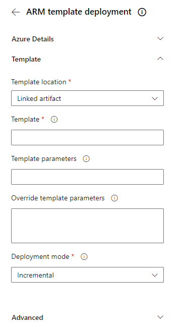
### DevOps ARM template output

As you properly know ARM templates also have ARM parameter files. Within this parameter files you are able to store deployment parameters. From automation perspective you try to reuse parameters and use output for the next step as much as possible.   
With that in mind you like to pick up an ARM deployment result. An example is a just created resource and its id. This id is needed in the next step.

In the ARM template deployment there is an advanced option called Deployment outputs. This is the point where it becomes interesting. Deployment outputs are returned in JSON format. Before you are able to use this output you first need to convert it from JSON into a pipeline variable. For more details about that point check [this](https://github.com/microsoft/azure-pipelines-tasks/tree/master/Tasks/AzureResourceManagerTemplateDeploymentV3#deployment-outputs).

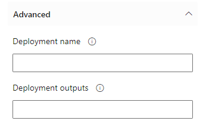
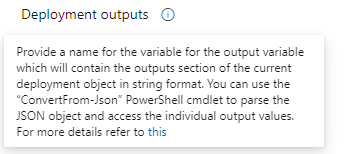
### PowerShell

As the description says we need PowerShell to convert the output from JSON to something. If you want to use the output as variables in your pipeline you will need to send the output values to the pipeline.  
Sending outputs to YAML pipeline variables with PowerShell can be done by the code below.

```powershell
Write-Host "##vso[task.setvariable variable=variableName;isOutput=true]$variableValue"
```

*Make sure you will add the <span style="text-decoration: underline;">isOutput=true </span>to the line. Otherwise there is no output.*

On the internet several solutions where provided but that wasn’t enough for me. So I used one of the solutions as base and added some extra options. The main idea of all is that the output will be send to the PowerShell as object. The function will look for an output item with a name and a value. This is the output from an ARM template. All items within the object will be generated to a pipeline variable with the code above.

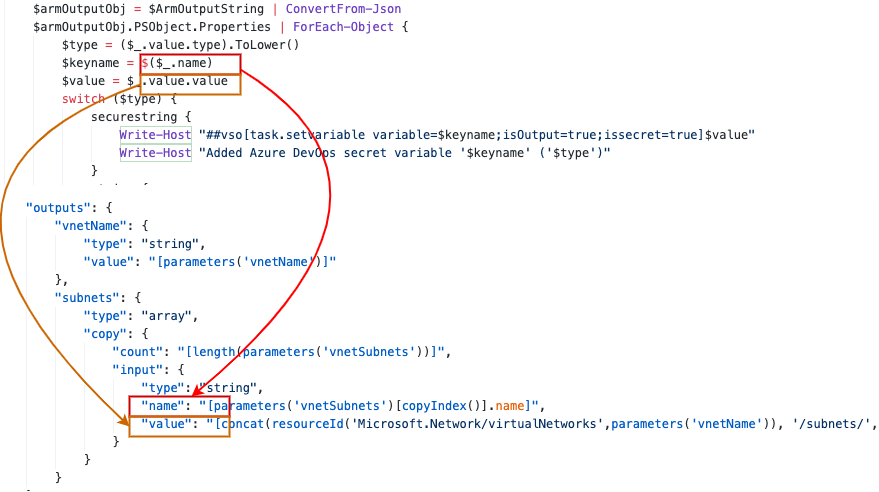
```powershell
$armOutputObj = $ArmOutputString | ConvertFrom-Json
    $armOutputObj.PSObject.Properties | ForEach-Object {
        $type = ($_.value.type).ToLower()
        $keyname = $($_.name)
        $value = $_.value.value
        switch ($type) {
            securestring {
                Write-Host "##vso[task.setvariable variable=$keyname;isOutput=true;issecret=true]$value"
                Write-Host "Added Azure DevOps secret variable '$keyname' ('$type')"
            }
            string {
                Write-Host "##vso[task.setvariable variable=$keyname;isOutput=true]$value"
                Write-Host "Added Azure DevOps variable '$keyname' ('$type') with value '$value'"
            }
            array {
                ($armOutputObj.PSObject.Properties | where { $_.Name -eq $keyname }).Value.value | ForEach-Object {
                    Write-Host "##vso[task.setvariable variable=$_.name;isOutput=true]$_.value"
                    Write-Host "Added Azure DevOps variable '$($_.name)' ('$type') with value '$($_.value)'"
                }
            }
            default {
                Throw "Type '$type' is not supported for '$keyname'"
            }
        }
    }
```

The whole function to convert ARM output variables in DevOps to pipeline variables can be found in my GitHub. The function also provides an option to insert an ARM array output which the other solutions don’t have.

### YAML templates

An another automation principal is Don’t Repeat Yourself. That is the reason why we are using functions and templates. I knew I will need this PowerShell code from above very often in my automation sequence. With the principal in mind I created a YAML task template which I will use after every ARM deployment job.

In this template I copied the whole PowerShell code. I have chosen to paste it into the YAML file as a PowerShell task. The reason is that I don’t need to request an another file. Because of the amount of requests I like to speed up the pipeline a bit. The YAML task template asks for the ARMOutputString which is the output of the ARM deployment task, a prefix to make every pipeline variable unique and the task name. The task name is the reference in the steps later.

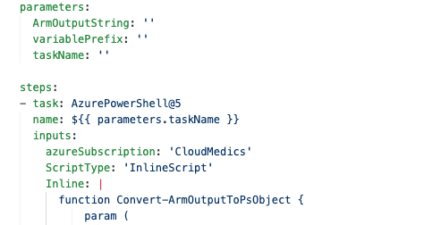
The template will requested in the master pipeline. I pasted a code block of one of the jobs. The job starts with a deployment task with some output. In this task I called the output ‘rgOutput’. This output is send as parameter into the template.

```yaml
# Deploy Resource Groups
jobs:
- job: DeployRG
  displayName: Deploying Resouregroup
  steps:
  - task: AzureResourceManagerTemplateDeployment@3
    name: DeployResourceGroup
    displayName: 'Deploy VNET Configuration including subnets'
    enabled: true
    inputs:
      deploymentScope: 'Subscription'
      azureResourceManagerConnection: $(serviceConnection)
      subscriptionId: $(subscriptionId)
      location: $(location)
      templateLocation: 'Linked artifact'
      csmFile: '$(Build.SourcesDirectory)/StrawberryBanana/Templates/ResourceGroups/deploy-resourcegroup.json'
      csmParametersFile: '$(Build.SourcesDirectory)/StrawberryBanana/Parameters/resourcegroup.parameters.json'
      deploymentMode: 'Incremental'
      deploymentOutputs: 'rgOutput'
  - template: 'StrawberryBanana/DevOps Pipelines/Templates/create-pipelinevariables.yml@Rozemuller'
    parameters:
      taskName: 'rgDeploy'
      ArmOutputString: '$(rgOutput)'
      variablePrefix: rgDeploy
```

If your template is in an another repository then your pipeline you will need to add that repository into your pipeline. Because the master pipeline must be able to run in every project I added the repository in the master pipeline by default.

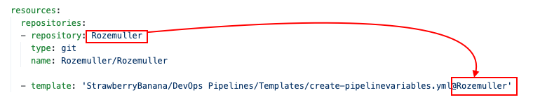
By using templates I reduce the code in the master pipeline and I don’t repeat the ConvertFrom-Json code every time.   
More information about YAML templates check the [Microsoft docs](https://docs.microsoft.com/en-us/azure/devops/pipelines/process/templates?view=azure-devops)

## Referencing pipeline variables

Finally we have output send into pipeline variables. Now it is time to put the parts together and use them in our pipelines.   
Let’s start with the code. In the next job I need the output of the resourceGroup deployment.

```yaml
  dependsOn: DeployRG
  variables: 
      resourceGroupName: $[ <em>dependencies.DeployRG.outputs</em>[<em>'rgDeploy.rgName'</em>] ]
```

To get outputs from previous jobs we need three pointers. The job name (DeployRG), the task name and the output variable name (rgName).  
The code shows us we have to deal with dependencies. This means we have need to set dependsOn with the jobs we are relying on. This are the job names. Make sure you have set every job you are depending on otherwise the variable will stay empty. However the variable is empty there is no error.

The second part is the task name. That is the reason I configured the template accepting task names. Now I don’t need to know how the tasks is called inside the template. The last part is the output variable name. This is the name of the output in the ARM template.

The convert to JSON template helps you a little bit. Below the output of that task.

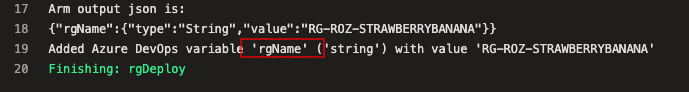
## AVD automated with DevOps YAML and ARM

In this chapter I will explain how to deploy an AVD environment automated with Azure DevOps in YAML with ARM templates. In some cases I’m also using PowerShell to convert ARM template outputs into pipeline variables. These variables are used later in the pipeline. I will recommend to clone my [AVD GitHub repository ](https://github.com/srozemuller/AVD)to get all the needed files, also for the other cocktails.   
For every purpose, in this case create an AVD environment with a SIG in basics.

### Resource group

The first step in our deployment is creating a new resource group. In this group I will deploy all the resources in this blog post. When starting a pipeline search for the ARM deployment task on the right side of the screen.

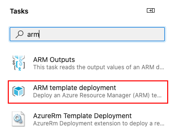
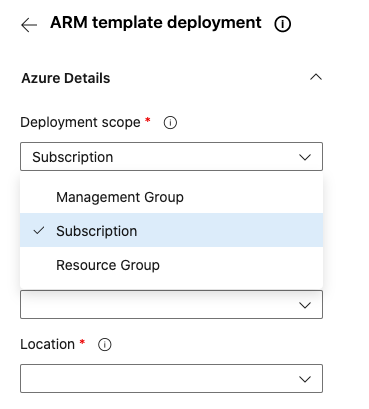
For the first task, I chose the subscription deployment scope. This is because I’m deploying a new resource group at a subscription. In the next tasks I choose the resource group deployment scope. This is because I’m updating a resource group.

```yaml
# Deploy Resource Groups
jobs:
- job: DeployRG
  displayName: Deploying Resouregroup
  steps:
  - task: AzureResourceManagerTemplateDeployment@3
    name: DeployResourceGroup
    displayName: 'Deploy Resouregroup Configuration in $(location)'
    enabled: true
    inputs:
      deploymentScope: 'Subscription'
      azureResourceManagerConnection: $(serviceConnection)
      subscriptionId: $(subscriptionId)
      location: $(location)
      templateLocation: 'Linked artifact'
      csmFile: '$(Build.SourcesDirectory)/StrawberryBanana/Templates/ResourceGroups/deploy-resourcegroup.json'
      csmParametersFile: '$(Build.SourcesDirectory)/StrawberryBanana/Parameters/resourcegroup.parameters.json'
      deploymentMode: 'Incremental'
      deploymentOutputs: 'rgOutput'
  - template: 'StrawberryBanana/DevOps Pipelines/Templates/create-pipelinevariables.yml@Rozemuller'
    parameters:
      taskName: 'rgDeploy'
      ArmOutputString: '$(rgOutput)'
      variablePrefix: rgDeploy
```

The task has some default inputs like the template file and the parameter file. Make a notice about the ‘deploymentsOutputs’ name ‘rgOutput’. This is the input for the pipeline variable template.

*To reduce the length of this post for the next steps I only will paste the differences like the files input or deploymentOutputs.*

### Networking

The second step of our “StrawberryBanana”-deployment is deploying a VNET with a custom DNS (for our domain join), two subnets and a network security group. A network security group, or NSG, will help us protecting our network for unwanted traffic.

First I will deploy the NSG with the code below. As you can see the resource group output is used here as variable. To make this work make sure you have added the needed job in the dependsOn part.

```yaml
# Deploy Network Security Group
- job: DeployNSG
  dependsOn: DeployRG
  displayName: Deploying Network Security Group
  variables: 
      resourceGroupName: $[ dependencies.DeployRG.outputs['rgDeploy.rgName'] ]
```

In the task within the job I changed the scope to resource group and using the resource group variable.

```yaml
 - task: AzureResourceManagerTemplateDeployment@3
      name: DeployNSG
      displayName: 'Deploy Network Security Group'
      enabled: true
      inputs:
        deploymentScope: 'Resource Group'
        resourceGroupName: $(resourceGroupName)
        csmFile: '$(Build.SourcesDirectory)/StrawberryBanana/Templates/Network/deploy-nsg.json'
        csmParametersFile: '$(Build.SourcesDirectory)/StrawberryBanana/Parameters/network-nsg.parameters.json'
        deploymentOutputs: 'nsgOutput'
```

After the NSG and the subnet config deployment we are creating the virtual network. To create a network I stored all the unknown values in the parameter file. I also stored a DNS server into the parameter file. In this task I added the DeployNSG as dependency. Good to know is that you have to declare variables at every job.

```yaml
- job: DeployVnet
  dependsOn: 
    - DeployNSG
    - DeployRG
  displayName: Deploying Network and Subnets
  variables: 
      resourceGroupName: $[ dependencies.DeployRG.outputs['rgDeploy.rgName'] ]
      nsgId: $[ dependencies.DeployNSG.outputs['nsgDeploy.nsgId'] ]
```

The nsgId variable is used as parameter value in the ARM deployment. Overriding parameters can be done with the overrideParameter option.

```yaml
    - task: AzureResourceManagerTemplateDeployment@3
      name: DeployNSG
      displayName: 'Deploy VNET Configuration including subnets'
      inputs:
        resourceGroupName: $(resourceGroupName)
        csmFile: '$(Build.SourcesDirectory)/StrawberryBanana/Templates/Network/deploy-network.json'
        csmParametersFile: '$(Build.SourcesDirectory)/StrawberryBanana/Parameters/network-with-subnet.parameters.json'
        overrideParameters: '-nsgId $(nsgId)'
        deploymentMode: 'Incremental'
        deploymentOutputs: 'vnetOutput'
```

At the end the virtual network is deployed with the correct settings.

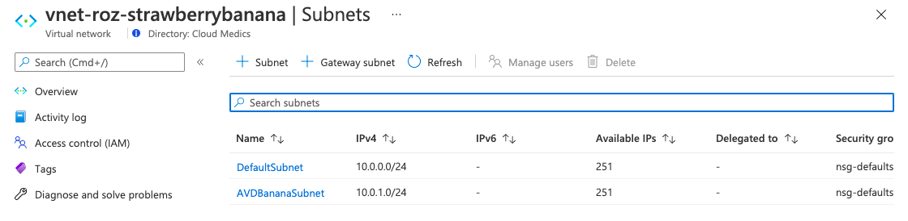
### Shared Image Gallery

The next part is creating a shared image gallery. In this gallery we are creating image versions. We going to use these versions to start AVD sessions host later in this article.

First, we are creating the gallery itself and the image definition with the task below.

```yaml
$galleryParameters = @{
    GalleryName = "CoconutBeachGallery"
   # Deploy Shared Image Gallery Configuration
- job: DeploySig
  dependsOn: 
    - DeployRG
  displayName: Deploying Shared Image Gallery
  variables: 
      resourceGroupName: $[ dependencies.DeployRG.outputs['rgDeploy.rgName'] ]
steps: 
    - task: AzureResourceManagerTemplateDeployment@3
      name: DeploySIG
      displayName: 'Deploy SIG Configuration including definition'
      inputs:
        csmFile: '$(Build.SourcesDirectory)/StrawberryBanana/Templates/SharedImageGallery/deploy-sig.json'
        csmParametersFile: '$(Build.SourcesDirectory)/StrawberryBanana/Parameters/shared-image-gallery.parameters.json'
        deploymentOutputs: 'sigOutput'
```

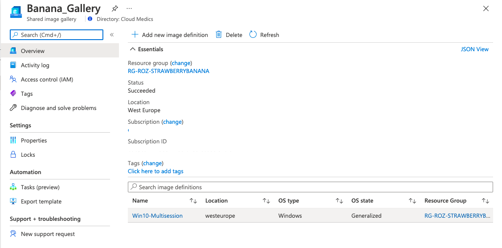
### Initial image version

It is time to create an initial image version. This version is the base of our AVD environment. Later on we are able to create new versions based on this one.

### Create a virtual machine

The first step is creating a new Windows 10 Multi Session virtual machine. The VM has a custom OS disk size of 128 GB. Make a notice of the G2 image SKU in the parameter file. The G2 is the HyperV generation. This must be the same generation as the image definition HyperV generation.

```yaml
- job: DeployVm
  dependsOn: 
    - DeployRG
    - DeployVnet
    - DeployNSG
  displayName: Deploying intial VM
  variables: 
      resourceGroupName: $[ dependencies.DeployRG.outputs['rgDeploy.rgName'] ]
      nsgId: $[ dependencies.DeployNSG.outputs['nsgDeploy.nsgId'] ]
      virtualNetworkName: $[ dependencies.DeployVnet.outputs['vnetDeploy.vnetName'] ]
```

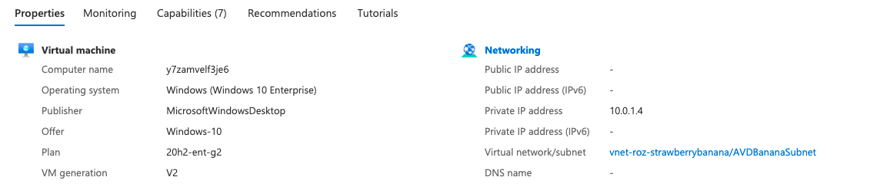
I use the VM deployment output for the VM details and using the vmName to connect to in the next steps.

### Sysprep

Executing some code isn’t an Azure deployment. Because of ARM can only be used to deploy resources we need to grab back to PowerShell. In the next few tasks we are executing PowerShell scripts via DevOps. In this first task I’m sysprepping the virtual machine.

```powershell
- job: PrepareVM
  dependsOn: 
    - DeployVM
  displayName: Preparing VM for sysprep and generalizing
  variables: 
      vmName: $[ dependencies.DeployVM.outputs['vmDeploy.virtualMachineName'] ]
  steps: 
  - task: AzurePowerShell@5
    name: Execute_Sysprep
    inputs:
      ScriptType: 'InlineScript'
      Inline: |
        $vm = Get-AzVM -Name $(vmName)
        $vm | Invoke-AzVMRunCommand -CommandId "RunPowerShellScript" -ScriptPath '$(Build.SourcesDirectory)/StrawberryBanana/PowerShell/sysprep.ps1' -Wait
      azurePowerShellVersion: 'LatestVersion'
      pwsh: true
```

Using the -Wait command will keep the task running till the Sysprep is finished. The virtual machine is stopped after the task is done.

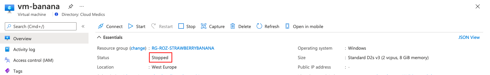
### Generalize

Generalizing a virtual machine is the last step before we are able to create an image version. Generalizing a machine is done by one simple command. This command is also executed within a PowerShell task. This task is a part of the prepareVm job.

```powershell
  - task: AzurePowerShell@5
    name: Execute_Generalize
    displayName: Generalizing $(vmName)
    inputs:
      ScriptType: 'InlineScript'
      Inline: |
        $vm = Get-AzVM -Name $(vmName)
        $vm | Set-AzVm -Generalized
      azurePowerShellVersion: 'LatestVersion'
      pwsh: true
```

### Create image version

The last step is creating a new image version into the gallery. As you can see I’m using information which I already know and has been stored into variables in the earlier steps. After the image has been deployed the next step is create AVD session hosts from this image.

I created a new job with a separate ARM template file for just creating an image version. This because I will need this template more often then only in the initial enrollment.

“<sup>***Keeping templates as small as possible will help you troubleshooting deployment issues.***</sup>“

The PrepareSigVersion jobs had some dependencies from out of the whole automation sequence. Beside the resource group I need the Shared Image Gallery info, the virtual machine info and I have to wait till the VM is prepared.   
I use some date formatting to generate a version number. A version number must have a [SemVer notition](https://semver.org/). To create a job variable I use the Get-Date option as input to the PowerShell task. The PowerShell task generates a version number.

When the version numbers has been created this value will inserted into the version deployment job.

```powershell
# Creating new SIG Version
- job: DeploySigVersion
  dependsOn: 
    - DeployRG
    - DeployVM
    - DeploySig
    - PrepareVM
  displayName: Preparing image version
  variables: 
    resourceGroupName: $[ dependencies.DeployRG.outputs['rgDeploy.rgName'] ]
    vmId: $[ dependencies.DeployVM.outputs['vmDeploy.resourceId'] ]
    major: $(Get-Date -format yyyy)  
    minor: $(Get-Date -format MMdd)  
    patch: $[counter(variables['minor'], 0)]
    galleryName: $[ dependencies.DeploySig.outputs['sigDeploy.galleryName'] ]
    galleryImageDefinitionName: $[ dependencies.DeploySig.outputs['sigDeploy.galleryImageDefinitionName'] ]
  steps: 
  - powershell: |
       write-host "##vso[task.setvariable variable=galleryImageVersionName;isOutput=true]$(major).$(minor).$(patch)"
    name: CreateImageVersionName
  - bash: echo "the version value is $(CreateImageVersionName.galleryImageVersionName)" 
  - task: AzureResourceManagerTemplateDeployment@3
    name: DeployVersion
    displayName: 'Deploy Initial Version'
    enabled: true
    inputs:
      deploymentScope: 'Resource Group'
      azureResourceManagerConnection: $(serviceConnection)
      subscriptionId: $(subscriptionId)
      action: 'Create Or Update Resource Group'
      resourceGroupName: $(resourceGroupName)
      location: $(location)
      templateLocation: 'Linked artifact'
      csmFile: '$(Build.SourcesDirectory)/StrawberryBanana/Templates/SharedImageGallery/deploy-sig-version.json'
      overrideParameters: '-sourceId $(vmId) -galleryName $(galleryName) -galleryImageDefinitionName $(galleryImageDefinitionName) -galleryImageVersionName $(CreateImageVersionName.galleryImageVersionName)'
      deploymentMode: 'Incremental'
      deploymentOutputs: 'versionOutput'
  - template: 'StrawberryBanana/DevOps Pipelines/Templates/create-pipelinevariables.yml@Rozemuller'
    parameters:
      taskName: 'versionDeploy'
      ArmOutputString: '$(versionOutput)'
      variablePrefix: versionDeploy   
```

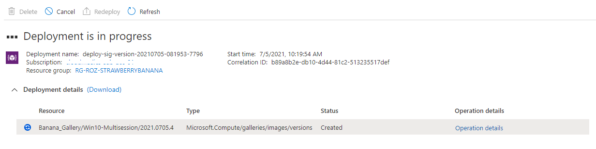
## Azure Virtual Desktop

After the backend is prepared, it is time to deploy the AVD environment. In the cocktails where templates and parameter files are used I recommend creating single template files. These files are used for repeatable actions like deploying session host. This will make life easier and you code a lot more cleaner.

### AVD Hostpool

The first step in deploying an AVD enviroment automated with DevOps and ARM templates is creating an AVD host pool. In this hostpool I also configuring the new StartVMOnConnect option. This option allows you to shutdown session hosts at the end of the day. When the first account is connecting the host will start automatically.


During the pipeline run I create a new date which is used to create a new token for the next few hours. In the first step of the job the PowerShell task is creating a new date format. This date format will override the ‘tokenExpirationTime’ in the template. The template will return a new AVD hostpool token through the ARM template output.


### Application group

The application group is the place where to assign users/groups to the AVD environment. I created a separate template file for that. The only parameter needed is the host pool name. This will be provided in the template. Because I’m still in the same job I don’t need to add a dependency for the variables. Referring to the task in combination with the output variable name is good.


The .hostpoolName is the output from the ARM template.


### Workspace

The AVD workspace is the frontend of the AVD enviroment. This is the place where people subscribing to. Deploying the workspace is the next step. I also created a separate template for the workspace deployment.

I’m also referring to the host pool output. Based on that output I created a workspace name.

```powershell
  - task: AzureResourceManagerTemplateDeployment@3
    name: DeployAVDWorkspace
    displayName: 'Deploy AVD Workspace'
    enabled: true
    inputs:
      deploymentScope: 'Resource Group'
      azureResourceManagerConnection: $(serviceConnection)
      subscriptionId: $(subscriptionId)
      action: 'Create Or Update Resource Group'
      resourceGroupName: $(resourceGroupName)
      location: $(location)
      templateLocation: 'Linked artifact'
      csmFile: '$(Build.SourcesDirectory)/StrawberryBanana/Templates/AVD/deploy-avd-workspace.json'
      overrideParameters: '-hostpoolName $(hostpoolDeploy.hostpoolName) -workSpaceName $(hostpoolDeploy.hostpoolName)-Workspace'
      deploymentMode: 'Incremental'
      deploymentOutputs: 'avdWorkspaceOutput'
```


***Make sure, after deployment, you will assign the workspace to the correct users or groups.***

### Monitoring

The next step in our sequence is the monitoring part. In this part we are going to install a Log Analytics Workspace and will enable diagnostic settings on the host pool.

For monitoring I created a template file as well with a parameter file. Additional I added the host pool name.

```yaml
- task: AzureResourceManagerTemplateDeployment@3
    name: DeployAVDDiagnostics
    displayName: 'Deploy AVD Diagnostics'
    enabled: true
    inputs:
      deploymentScope: 'Resource Group'
      azureResourceManagerConnection: $(serviceConnection)
      subscriptionId: $(subscriptionId)
      action: 'Create Or Update Resource Group'
      resourceGroupName: $(resourceGroupName)
      location: $(location)
      templateLocation: 'Linked artifact'
      csmFile: '$(Build.SourcesDirectory)/StrawberryBanana/Templates/AVD/deploy-avd-diagnostics.json'
      csmParametersFile: '$(Build.SourcesDirectory)/StrawberryBanana/Parameters/avd-diagnostics.parameters.json'
      overrideParameters: '-hostpoolName $(hostpoolDeploy.hostpoolName)'
```

Enabling these settings is the basics for a good monitoring environment. If you like to configure advanced AVD monitoring automated please check my post about[ enabling AVD monitoring automated](https://www.rozemuller.com/deploy-azure-monitor-for-windows-virtual-desktop-automated/). I will recommend monitoring the AVD required URLs also. [Check my post about how to achieve that goal](https://www.rozemuller.com/monitor-windows-virtual-desktop-required-urls-with-log-analytics-workspace/).

### AVD Session hosts

The last step is deploying the session hosts into the AVD hostpool. Before deploying a session host I decided to deploy an Azure Key Vault first. Into the key vault I will store the administrator password for the domain join. In the later steps I will reference to this key vault secret in the template.

#### DevOps Library Groups

In this step, I will create a DevOps Libray group. In this group, I will set the domain password for the domain join. Because the password is a secure value I don’t want this value plain in a parameter file.


To take advantage of the library you need to add this variable group to the pipeline variables.

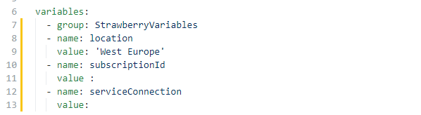
```powershell
variables:
  - group: StrawberryVariables
```

Later in the pipeline you can request the variable like all others.

More information about using libraries check the url: [https://docs.microsoft.com/en-us/azure/devops/pipelines/library/variable-groups?view=azure-devops&amp;tabs=yaml](https://docs.microsoft.com/en-us/azure/devops/pipelines/library/variable-groups?view=azure-devops&tabs=yaml)

#### Create session host

Finally it is time to create our first AVD session host with DevOps and ARM. During the host pool deployment I created a hostpool registration. This token will be use to add the session host into the correct hostpool.

All the static and non secure parameters are stored in the parameter file. I started the job with all of its dependencies and the new variables.

```powershell
- job: DeployAVDSessionHost
  dependsOn: 
    - DeployRG
    - DeploySig
    - DeploySigVersion
    - DeployAVDEnvironment
    - DeployVnet
  displayName: Deploying First AVD Session Host
  variables: 
    resourceGroupName: $[ dependencies.DeployRG.outputs['rgDeploy.rgName'] ]
    hostpoolToken: $[ dependencies.DeployAVDEnvironment.outputs['hostpoolDeploy.hostpoolToken'] ]
    domainPassword: $(vmjoinerPassword)
```

In the deployment part the variables will override the template parameters.

```powershell
  templateLocation: 'Linked artifact'
      csmFile: '$(Build.SourcesDirectory)/StrawberryBanana/Templates/AVD/deploy-avd-sessionhosts.json'
      csmParametersFile: '$(Build.SourcesDirectory)/StrawberryBanana/Parameters/avd-sessionhost.parameters.json'
      overrideParameters: '-administratorAccountPassword $(domainPassword) -hostpoolToken $(hostpoolToken)'
```

This is the end of the AVD deployment automated with Azure DevOps and ARM templates. For all the YAML files, ARM templates and parameter files, please check my [GitHub repository](https://github.com/srozemuller/AVD/tree/main/Deployment/StrawberryBanana).

## Conclusion

DevOps is a great way for automating tasks. This in combination with the use of ARM templates makes it a really good combination.

To be honest, learning DevOps and/or ARM from the beginning is pretty hard. The default ARM templates are doing their job but if you want to stitch the templates into one automation sequence there is a lot of trial and error. But at the end it is definitely worth it.

Where to start?

Make sure you will understand how YAML pipelines are working. How to use YAML templates and work jobs and dependencies. If you know the pipeline architecture it is just a matter of adding the ARM deployment jobs with the correct parameters.

Check the YAML schema over here:[ https://docs.microsoft.com/en-us/azure/devops/pipelines/yaml-schema?view=azure-devops&amp;tabs=schema%2Cparameter-schema](https://docs.microsoft.com/en-us/azure/devops/pipelines/yaml-schema?view=azure-devops&tabs=schema%2Cparameter-schema)  
  
The next thing which could help you is using YAML templates but this is the next step. Using templates will keep you master pipeline more readable.   
Check how to make use of templates over here: <https://docs.microsoft.com/en-us/azure/devops/pipelines/process/templates?view=azure-devops>

The last thing are the ARM templates. In the first place make a start with static parameters in the parameter files and make sure all of your resources are deployed. If your deployment is successful the next step is using job output variables.  
How to use output variables please check this link: [https://docs.microsoft.com/en-us/azure/devops/pipelines/process/variables?view=azure-devops&amp;tabs=yaml%2Cbatch](https://docs.microsoft.com/en-us/azure/devops/pipelines/process/variables?view=azure-devops&tabs=yaml%2Cbatch)

## Thank you!

I hope you liked the Strawberry Banana Mix 🍓 🍌 and got a bit inspired. Now you know deploy AVD automated with DevOps and ARM templates is one of the options. If you like another cocktail feel free to stay and check the [AVD Automation Cocktail menu](https://www.rozemuller.com/avd-automation-cocktail-the-menu/).

