Welcome to the AVD Automation Cocktail. In this cocktail series, I will show different AVD deployment strategies and languages. In this cocktail, the Pineapple Citrus Splash, I will show you how to deploy an AVD environment automated with REST API, and JSON executed with PowerShell.



## Recipe

In this “PineappleCitrus”-deployment recipe I will deploy an AVD environment automated with REST API, JSON input and PowerShell. You can leave PowerShell of you like an other coding language which is able to send API calls.

### Before to drink

To begin with the most important thing. Make sure you have an Active Directory domain present for the domain join.

### List of REST API ingredients

- Method
- JSON Body
- WebRequest

### Aftertaste

This cocktail has REST API as main ingredient with some JSON and PowerShell on the side. During this post I will show how to deploy all the needed resources. Finally at the end you will have an AVD environment in Azure deployed automated with REST API. Some of these resources are a host pool, a workspace, an application group. Also there are some session hosts. At last these hosts have an underlying image from a shared image gallery.

To learn more about REST API please check the following url: <https://docs.microsoft.com/en-us/rest/api/azure/>

## AVD automated with REST API

In this chapter I will explain how to deploy an AVD environment automated with REST API. Also I’m using JSON formatting and PowerShell for execution. REST API, or Representational State Transfer (REST) APIs are service endpoints that support sets of HTTP operations (methods). REST API’s provide create, retrieve, update, or delete access to the service’s resources.

To be sure you won’t miss code, I recommend to clone my [AVD GitHub repository ](https://github.com/srozemuller/AVD)to get all the needed files. Also for the other cocktails.   
At the end as a result an AVD environment with a SIG in basics.

### REST API with PowerShell

At first, REST API’s have less dependencies like PowerShell modules or ARM templates. For this reason it is useful to know how REST API work. In the examples below I use PowerShell to send the API calls. Important to realize is that PowerShell has two commands which allows you to send REST API calls.

The Invoke-RestMethod and Invoke-WebRequest. There is some similarity between both commands. In the first place both accepts JSON input and are able to send requests to an API URL for example. Beside that there are some big differences.

#### Invoke-WebRequest

From Microsoft: The `Invoke-WebRequest` cmdlet sends HTTP and HTTPS requests to a web page or web service. It parses the response and returns collections of links, images, and other significant HTML elements.

In fact this means you will get a website response with content. For example a code like 200 OK or 503 Service Unavailable. By catching these codes you know the status of your API call.   
However the result is returned in JSON format returned. To read the content as PowerShell objects you need to deserialize it. Deserialize code can be done with ConvertFrom-Json whit PowerShell readable objects as a result.

#### Invoke-RestMethod

From Microsoft: The `Invoke-RestMethod` cmdlet sends HTTP and HTTPS requests to Representational State Transfer (REST) web services that return richly structured data.

PowerShell formats the response based to the data type. For an RSS or ATOM feed, PowerShell returns the Item or Entry XML nodes. For JavaScript Object Notation (JSON) or XML, PowerShell converts, or deserializes, the content into `[PSCustomObject]` objects.

In short this means you get PowerShell objects as a result. You don’t need to deserialize it. A disadvantage is that you have no idea of the current status.

In addition to the context above there is more about creating galleries and images at the links below:

- <https://docs.microsoft.com/en-us/powershell/module/microsoft.powershell.utility/invoke-restmethod?view=powershell-7.1>
- <https://docs.microsoft.com/en-us/powershell/module/microsoft.powershell.utility/invoke-webrequest?view=powershell-7.1>

### Authenticating

Before you are able to use the REST API you will need to authenticate to the API. Because we are using PowerShell for executing the REST API calls we need to authenticate in PowerShell. Within the current context we are gathering a header token for the REST API.

```powershell
function GetAuthToken($resource) {
    $context = [Microsoft.Azure.Commands.Common.Authentication.Abstractions.AzureRmProfileProvider]::Instance.Profile.DefaultContext
    $Token = [Microsoft.Azure.Commands.Common.Authentication.AzureSession]::Instance.AuthenticationFactory.Authenticate($context.Account, $context.Environment, $context.Tenant.Id.ToString(), $null, [Microsoft.Azure.Commands.Common.Authentication.ShowDialog]::Never, $null, $resource).AccessToken
    $authHeader = @{
        'Content-Type' = 'application/json'
        Authorization  = 'Bearer ' + $Token
    }
    return $authHeader
}
$token = GetAuthToken -resource "https://management.azure.com"
```

The authentication token returns into the $token variable. This is the token we need for requesting API calls to Azure.

### Formatting

Formatting is big point in JSON. Because the other side need to ‘unpack’ or deserialize the code it is important the correct format is provided. When converting PowerShell objects, arrays and hashtables into JSON format make sure every items is in the JSON code. If you have nested tables or arrays you will need the provide the -Depth command. Default depth is 2.

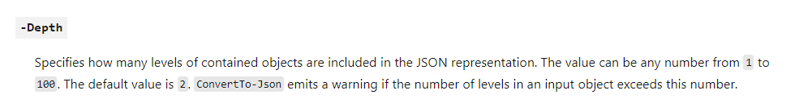In the example below you see the same content with a depth of 4 and 5. See the difference.

```powershell
$nicBody | ConvertTo-Json -Depth 4
```

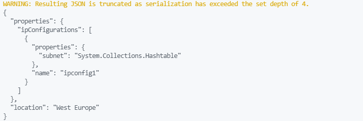


```powershell
$nicBody | ConvertTo-Json -Depth 5
```

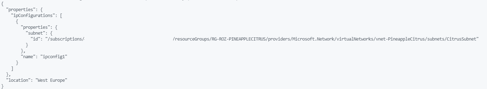
For more about ConvertTo-Json please check the URL below.

<https://docs.microsoft.com/en-us/powershell/module/microsoft.powershell.utility/convertto-json?view=powershell-7.1>

### Resource group

Because we need a resource group, the first step in our deployment is creating a new one. In this group I will deploy all the resources in this blog post. I start with a subscriptionId, a resourcegroupName and a location. Later on these value will reused. Because the resourcegroup output is needed in every deployment I save the output into a variable.

```powershell
$subscriptionId = [Microsoft.Azure.Commands.Common.Authentication.Abstractions.AzureRmProfileProvider]::Instance.Profile.DefaultContext.Subscription.id
$ResourceGroupName = 'RG-ROZ-PINEAPPLECITRUS'
$location = "West Europe"
$url = "https://management.azure.com/subscriptions/" + $($subscriptionId) + "/resourcegroups/" + $ResourceGroupName + "?api-version=2021-04-01"
$body = @{
        location = $location
}
$parameters = @{
    uri = $url
    method = 'PUT'
    header = $token
    body = $body | ConvertTo-Json
}
$ResourceGroup = Invoke-RestMethod @Parameters
```

### Networking

The second step of our “PinappleCitrus”-deployment is deploying a VNET. Thereafter two subnets and a network security group (NSG) are deployed. A NSG will help us protecting our network for unwanted traffic. To make sure we can find our domain controller I added a custom DNS.

Because the NSG is securing our network it is deployed at first. To deploy a network I used the code below.

```powershell
$networkSecurityGroupName = "NSG-PineappleCitrus"
$nsgUrl = "https://management.azure.com/subscriptions/" + $($subscriptionId) + "/resourcegroups/" + $ResourceGroupName + "/providers/Microsoft.Network/networkSecurityGroups/" + $networkSecurityGroupName + "?api-version=2020-11-01"
$nsgBody = @{
    location = $location
    properties = @{
        
    }
}
$nsgParameters = @{
    uri = $nsgUrl
    method = 'PUT'
    header = $token
    body = $nsgBody | ConvertTo-Json
}
$networkSecurityGroup = Invoke-WebRequest @nsgParameters
```

Once the NSG is deployed, we are creating the virtual network including the subnets. To create a network I reuse the resource group name and adding the virtual network name. For example, in the JSON body I’ve set some fixed address.

```powershell
$vnetName = "vnet-PineappleCitrus"
$vnetUrl = "https://management.azure.com/subscriptions/" + $($subscriptionId) + "/resourcegroups/" + $ResourceGroupName + "/providers/Microsoft.Network/virtualNetworks/" + $vnetName + "?api-version=2021-02-01"
$vnetBody = @{
    location   = $location
    properties = @{
        AddressSpace = @{ 
            addressPrefixes = @(
                "10.0.0.0/16"
            )
        }
        dhcpOptions  = @{
            dnsServers = @(
                "10.1.3.4"
            )
        }
        subnets      = @(
            @{
                name       = 'defaultSubnet'
                properties = @{
                    addressPrefix        = "10.0.1.0/24"
                }
            },
            @{
                name       = 'CitrusSubnet'
                properties = @{
                    addressPrefix        = "10.0.2.0/24"
                }
            }
        )
    }
}
$vnetParameters = @{
    uri    = $vnetUrl
    method = 'PUT'
    header = $token
    body   = $vnetBody | ConvertTo-Json -Depth 4
}
$virtualNetwork = Invoke-WebRequest @vnetParameters
```

At the end the virtual network is deployed with the correct settings.  
More about deploying networks with REST API, please check the [Microsoft Virtual Network documentation](https://docs.microsoft.com/en-us/rest/api/virtualnetwork/virtual-networks/create-or-update)

### Shared Image Gallery

Because I want to avoid updating every single session host in feature I create a shared image gallery with versions. We going to use these versions to start AVD sessions host later in this article.

First we are creating the gallery itself.

```powershell
$galleryName = "Citrus_Gallery"
$galleryUrl = "https://management.azure.com/subscriptions/" + $($subscriptionId) + "/resourcegroups/" + $ResourceGroupName + "/providers/Microsoft.Compute/galleries/" + $galleryName + "?api-version=2021-03-01"
$galleryBody = @{
    location   = $location
    properties = @{
        description = "A really fresh gallery with pineapple and citrus."
    }
}
$galleryParameters = @{
    uri    = $galleryUrl
    method = 'PUT'
    header = $token
    body   = $galleryBody | ConvertTo-Json -Depth 4
}
$sharedImageGallery = Invoke-WebRequest @galleryParameters
```

### Shared Image Gallery Definition

An image definition are image properties, for example the OS is Windows and it is generalized. To deploy an image definition I used the code below.

```powershell
$sharedImageGalleryInfo = ($sharedImageGallery | ConvertFrom-Json).id
$galleryImageName = "Win10-Pineapple-Image"
$galleryImageUrl = "https://management.azure.com/" + $sharedImageGalleryInfo + "/images/" + $galleryImageName + "?api-version=2021-03-01"
$galleryImageBody = @{
    location   = $location
    properties = @{
        identifier = @{
            offer = "Pineapple"
            publisher = "Rozemuller"
            sku = "Citrus"
        }
        osState  = "Generalized"
        osType = "Windows"
        description = "Citrus are lovely"
        hyperVGeneration = "V2"
    }
}
$galleryImageParameters = @{
    uri    = $galleryImageUrl
    method = 'PUT'
    header = $token
    body   = $galleryImageBody | ConvertTo-Json -Depth 4
}
$sharedImageGalleryImage = Invoke-WebRequest @galleryImageParameters
```

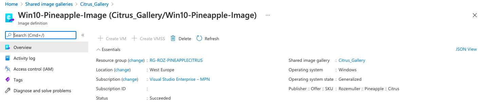
https://docs.microsoft.com/en-us/rest/api/compute/gallery-images

### Initial image version

To start with a good base it is time to create an initial image version. Later on we are able to create new versions based on this one.

### Create a virtual machine

The first step is creating a new Windows 10 Multi Session generation 2 virtual machine. This VM generation must be the same as the image definition Hyper-V generation.

```powershell
$vmName = "vm-Pineapple"
$vmUrl = "https://management.azure.com/" + $ResourceGroupUrl + "/providers/Microsoft.Compute/virtualMachines/" + $vmName + "?api-version=2021-03-01"
$vmBody = @{
    location   = $location
    properties = @{
        hardwareProfile = @{
            vmSize = "Standard_B2ms"
        }
        networkProfile  = @{
            networkInterfaces = @(
                @{
                    id         = $nicId
                    properties = @{
                        primary = $true
                    }
                }
            )
        }
        storageProfile  = @{
            imageReference = @{
                sku       = "21h1-ent-g2"
                version   = "latest"
                offer     = "Windows-10"
                publisher = "MicrosoftWindowsDesktop"
            }
        
            osDisk         = @{
                caching      = "ReadWrite"
                managedDisk  = @{
                    storageAccountType = "Standard_LRS"
                }
                name         = "os-pineapple"
                createOption = "FromImage"
            }
        }
        osProfile       = @{
            adminUsername = "citrus-user"
            computerName  = $vmName
            adminPassword = "VeryS3cretP@44W0rd!"
        }
    }
}
$vmParameters = @{
    uri    = $vmUrl 
    method = 'PUT'
    header = $token
    body   = $vmBody | ConvertTo-Json -Depth 5
}
$virtualMachine = Invoke-WebRequest @vmParameters
```

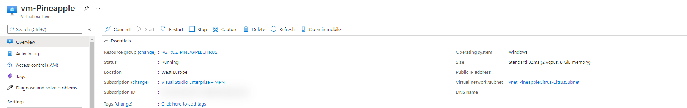
Because I need the VM info I stored the deployment output in a variable.

### Sysprep

It is possible to execute commands via the REST API. This is a great way to execute scripts without creating local scripts. Because of that I send an array of commands through the REST API.

```powershell
$script = [System.Collections.ArrayList]@()
$script.Add('$sysprep = "C:\Windows\System32\Sysprep\Sysprep.exe"')
$script.Add('$arg = "/generalize /oobe /shutdown /quiet /mode:vm"')
$script.Add('Start-Process -FilePath $sysprep -ArgumentList $arg')
$scriptBody = @{
    commandId = "RunPowerShellScript"
    script    = $script
}
$virtualMachineId = ($virtualMachine | ConvertFrom-Json).id
$url = "https://management.azure.com" + $virtualMachineId  + "/runCommand?api-version=2021-03-01"
$parameters = @{
    URI     = $url 
    Method  = "POST"
    Body    = $scriptBody | ConvertTo-Json
    Headers = $token
}
$executeSysprep = Invoke-WebRequest @parameters
```

Again, the REST API sends only a request. To make sure the virtual machine is stopped the current status must be checked. The virtual machine is stopped after the local PowerShell task is done.

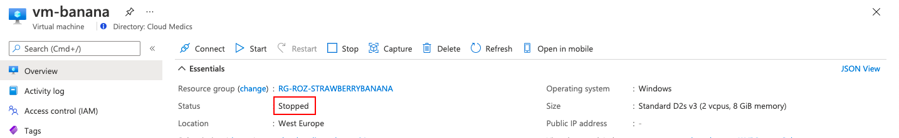
### Generalize

Next is generalizing a virtual machine before we are able to create an image version. Generalizing a machine is done by one simple command.

```powershell
$generalizeUrl = "https://management.azure.com" + $virtualMachineId  + "/generalize?api-version=2021-03-01"
$generalizeParameters = @{
    uri    = $generalizeUrl
    method = 'POST'
    header = $token
}
$generalizeVM = Invoke-WebRequest @generalizeParameters
```

### Create image version

The last step is creating a new image version into the gallery. As you can see I’m using information which I already know and has been stored into variables in the earlier steps. Now that the image has been deployed, the next step is creating an AVD session hosts from this image.

Beside the resource group I need the Shared Image Gallery info, the virtual machine info and I have to wait till the VM is prepared.   
For example, you could use some date formatting to generate a version number. A version number must have a [SemVer notation](https://semver.org/).

```powershell
$sharedImageGalleryImageUrl = ($sharedImageGalleryImage | ConvertFrom-Json).id
$galleryVersionName = Get-Date -Format yyyy.MM.dd
$versionUrl = "https://management.azure.com" + $sharedImageGalleryImageUrl + "/versions/" + $galleryVersionName + "?api-version=2021-03-01"
$versionBody = @{
    location   = $location
    properties = @{
        storageProfile = @{
            source = @{
                id = $virtualMachineId
            }
        }
    }
}
$imageVersionParameters = @{
    uri    = $versionUrl 
    method = 'PUT'
    header = $token
    body   = $versionBody | ConvertTo-Json -Depth 5
}
$imageVersion = Invoke-WebRequest @imageVersionParameters
```

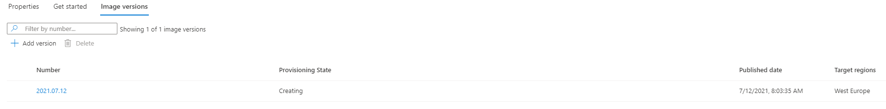
In addition to the context above there is more about creating galleries and images at the links below:

- <https://docs.microsoft.com/en-us/rest/api/compute/galleries/create-or-update>
- <https://docs.microsoft.com/en-us/rest/api/compute/gallery-images/create-or-update>
- <https://docs.microsoft.com/en-us/rest/api/compute/gallery-image-versions/create-or-update>

## Azure Virtual Desktop

After the AVD back-end is prepared, it is time to deploy the AVD environment. To keep my code clean I deploy every part in separate jobs.

### AVD Hostpool

First in this post about deploying an AVD environment automated with REST API is creating an AVD host pool. At the same time I also configuring the new StartVMOnConnect option. This option allows you to shutdown session hosts at the end of the day. When the first account is connecting the host will start automatically.

Because I need a registration token later in the sequence, I create a new token based on the current date and time. I’m adding a few hours from now which means the token is valid till that time.

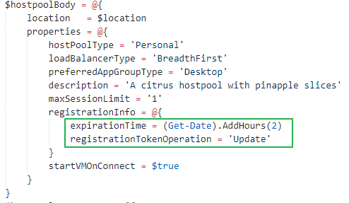After deployment I convert the output to PowerShell objects. One of these objects is the registration token. By the time I will use that token later in the sequence.

```powershell
$hostpoolInfo = ($hostpool | ConvertFrom-Json)
$token = $hostpoolInfo.properties.registrationInfo.token
```

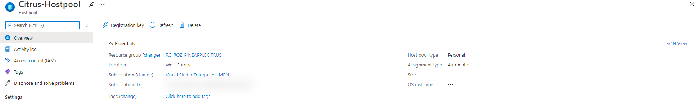
### Application group

The application group is the place where to assign users/groups to the AVD environment. Be sure you make a notice about the $hostpoolInfo variable.

```powershell
$applicationGroupName = "Pinapple-applications"
$applicationGroupUrl = "https://management.azure.com" + $ResourceGroupUrl + "/providers/Microsoft.DesktopVirtualization/applicationGroups/" + $applicationGroupName + "?api-version=2021-01-14-preview"
$applicationGroupBody = @{
    location   = $location
    properties = @{
        applicationGroupType = 'Desktop'
        hostPoolArmPath = $hostpoolInfo.id
        description = 'A nice group with citrus fruits'
        friendlyName = 'Pineapple Application Group'
    }
}
$applicationGroupParameters = @{
    uri    = $applicationGroupUrl 
    method = 'PUT'
    header = $token
    body   = $applicationGroupBody | ConvertTo-Json -Depth 5
}
$applicationGroup = Invoke-WebRequest @applicationGroupParameters
```

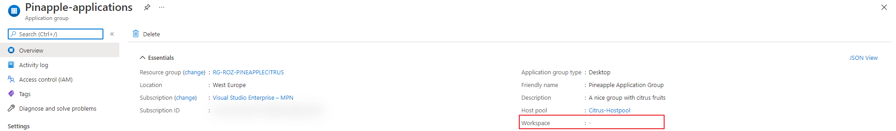Because there is no workspace, it is not assigned in the deployment. Next, after creating the workspace, we will assign the workspace.

### Workspace

In front of AVD we have the workspace. This is the place where people subscribe at. I’m also referring to the host pool output. Based on that output I created a workspace name.

```powershell
$applicationGroupInfo = ($applicationGroup | ConvertFrom-Json)
$workspaceName = "Citrus-Workspace"
$workspaceUrl = "https://management.azure.com" + $ResourceGroupUrl + "/providers/Microsoft.DesktopVirtualization/workspaces/" + $workspaceName + "?api-version=2021-01-14-preview"
$workspaceBody = @{
    location   = $location
    properties = @{
        applicationGroupReferences = @(
                $applicationGroupInfo.id
        )
        description = 'A workspace with nice citrus fruits'
        friendlyName = 'Citrus Workspace'
    }
}
$workspaceParameters = @{
    uri    = $workspaceUrl 
    method = 'PUT'
    header = $token
    body   = $workspaceBody | ConvertTo-Json -Depth 5
}
$workspace = Invoke-WebRequest @workspaceParameters
```

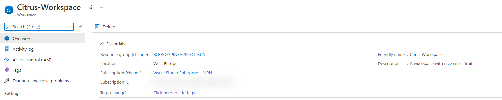
Make a note at the green box. After there is a workspace, we are able to assign the workspace to an application group.

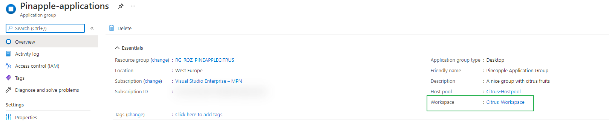
***Make sure, after deployment, you will assign the workspace to the correct users or groups.***

### Monitoring

Now the environment is running we need monitoring. In the first place, we need to install a Log Analytics Workspace. As soon as the Log Analytics Workspace is created we will enable diagnostic settings on the host pool.

```powershell
$LAWorkspace = "log-analytics-avd-" + (Get-Random -Maximum 99999)
$LawsBody = @{
    location   = $location
    properties = @{
        retentionInDays = "30"
        sku             = @{
            name = "PerGB2018"
        }
    }
}
$lawsUrl = "https://management.azure.com" + $ResourceGroupUrl + "/providers/Microsoft.OperationalInsights/workspaces/" + $LAWorkspace + "?api-version=2020-08-01"
$loganalyticsParameters = @{
    URI     = $lawsUrl 
    Method  = "PUT"
    Body    = $LawsBody | ConvertTo-Json
    Headers = $token
}
$laws = Invoke-WebRequest @loganalyticsParameters
```

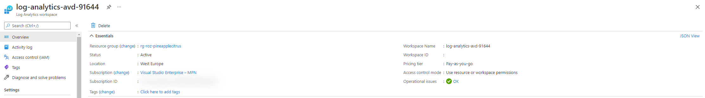
Second is assigning the just created workspace to the AVD Hostpool.  
Make a notice about the $hostpoolInfo.id variable. This is the variable from the [hostpool deployment output](#hostpool).

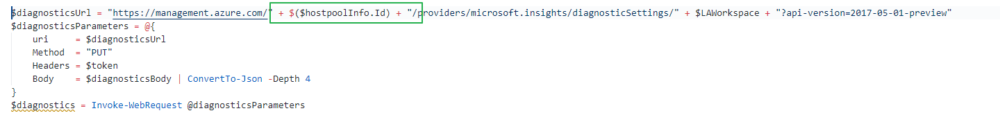
```powershell
$diagnosticsBody = @{
    Properties = @{
        workspaceId = $Laws.id
        logs        = @(
            @{
                Category = 'Error'
                Enabled  = $true
            },
            @{
                Category = 'Connection'
                Enabled  = $true
            }
        )
    }
}  
$diagnosticsUrl = "https://management.azure.com/" + $($hostpoolInfo.Id) + "/providers/microsoft.insights/diagnosticSettings/" + $LAWorkspace + "?api-version=2017-05-01-preview"  
$diagnosticsParameters = @{
    uri     = $diagnosticsUrl
    Method  = "PUT"
    Headers = $token
    Body    = $diagnosticsBody | ConvertTo-Json -Depth 4
}
$diagnostics = Invoke-WebRequest @diagnosticsParameters
```

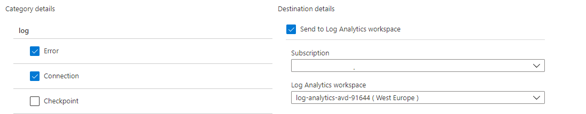
To keep an eye on our environment we need monitoring. For example I added the error and connection logging. These settings are the basics for a good monitoring environment. In addition to monitoring please check my post about[ enabling AVD monitoring automated](https://rozemuller.com/deploy-azure-monitor-for-windows-virtual-desktop-automated/). Further I recommend monitoring the AVD required URLs also. [Check my post about how to achieve that goal](https://rozemuller.com/monitor-windows-virtual-desktop-required-urls-with-log-analytics-workspace/).

### Create an AVD session host with REST API

At last we are deploying the session hosts into the AVD hostpool. In fact, a session host is nothing more than a domain joined virtual machine with an AVD agent installed. This is exactly what I’m going to do. First I repeat creating a NIC and a VM.

Now I’m using the image gallery output as image reference.

In the first place I create the network interface. I use the $vmName variable as basics for all other resources.

```powershell
$vmName = 'pinci-0'
$nicName = "nic-"+$vmName
$nicUrl = "https://management.azure.com/" + $ResourceGroupUrl + "/providers/Microsoft.Network/networkInterfaces/" + $nicName + "?api-version=2021-02-01"
$nicBody = @{
    location   = $location
    properties = @{
        ipConfigurations = @(
            @{
                name       = "ipconfig1"
                properties = @{
                    subnet = @{
                        id = $subnetId
                    }
                }
            }
        )
    }
}
$nicParameters = @{
    uri    = $nicUrl
    method = 'PUT'
    header = $token
    body   = $nicBody | ConvertTo-Json -Depth 5
}
$networkInterface = Invoke-WebRequest @nicParameters
$nicId = ($networkInterface | ConvertFrom-Json).id
```

Next, after creating the network card, I create the virtual machine.

```powershell
$imageInfo = ($sharedImageGalleryImage | ConvertFrom-Json)
$vmUrl = "https://management.azure.com/" + $ResourceGroupUrl + "/providers/Microsoft.Compute/virtualMachines/" + $vmName + "?api-version=2021-03-01"
$sessionHostBody = @{
    location   = $location
    properties = @{
        hardwareProfile = @{
            vmSize = "Standard_B2ms"
        }
        networkProfile  = @{
            networkInterfaces = @(
                @{
                    id         = $nicId
                    properties = @{
                        primary = $true
                    }
                }
            )
        }
        storageProfile  = @{
            imageReference = @{
               id = $imageInfo.id
            }
            osDisk         = @{
                caching      = "ReadWrite"
                managedDisk  = @{
                    storageAccountType = "Standard_LRS"
                }
                name         = "os-"+$vmName
                createOption = "FromImage"
            }
        }
        osProfile       = @{
            adminUsername = "citrus-user"
            computerName  = $vmName
            adminPassword = "VeryS3cretP@44W0rd!"
        }
    }
}
$sessionHostParameters = @{
    uri    = $vmUrl 
    method = 'PUT'
    header = $token
    body   = $sessionHostBody | ConvertTo-Json -Depth 5
}
$sessionHost = Invoke-WebRequest @sessionHostParameters
```

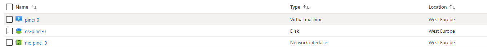
At last, if the virtual machine is deployed, it is time to install the domain join extension.

```powershell
$domain = 'domain.local'
$ouPath = "OU=Computers,OU=AVD,DC=domain,DC=local"
$vmjoinerUser = 'vmjoiner@domain.local'
$securePassword = 'verySecretPasswordforDomain@1'

$domainJoinExtensionName = "JsonADDomainExtension"
$domainJoinUrl = "https://management.azure.com/" + $ResourceGroupUrl + "/providers/Microsoft.Compute/virtualMachines/" + $vmName + "/extensions/" + $domainJoinExtensionName + "?api-version=2021-03-01"
$domainJoinBody = @{
    location   = $location
    properties = @{
        publisher = "Microsoft.Compute"
        type = "JsonADDomainExtension"
        typeHandlerVersion = "1.3"
        settings = @{
            name = $domain
            ouPath = $ouPath
            user = $vmjoinerUser
            restart = $true
            options = "3"
        }
        protectedSettings = @{
            password = $securePassword
        }
    }
}
$domainJoinParameters = @{
    uri    = $domainJoinUrl
    method = 'PUT'
    header = $token
    body   = $domainJoinBody | ConvertTo-Json -Depth 5
}
$domainJoin = Invoke-WebRequest @domainJoinParameters
```

Now we arrived at the final and last step of the AVD agent deployment. To get a session host into a AVD host pool we need to install the AVD dsc extension. Like the code above, this code will install an another extension. This extension installs the RDS agent which connects to the AVD host pool.

```powershell
$avdExtensionName = "dscextension"
$artifactLocation = ""
$avdExtensionUrl = "https://management.azure.com/" + $ResourceGroupUrl + "/providers/Microsoft.Compute/virtualMachines/" + $vmName + "/extensions/" + $avdExtensionName + "?api-version=2021-03-01"
$avdExtensionBody = @{
    location   = $location
    properties = @{
        publisher = "Microsoft.Powershell"
        type = "DSC"
        typeHandlerVersion = "2.73"
        settings = @{
            modulesUrl = $artifactLocation
            configurationFunction = "Configuration.ps1\\AddSessionHost"
            properties = @{
                hostPoolName = $hostpoolInfo.name
                registrationInfoToken = $hostpoolInfo.properties.registrationInfo.token
            }
        }
    }
}
$avdExtensionParameters = @{
    uri    = $avdExtensionUrl
    method = 'PUT'
    header = $token
    body   = $avdExtensionBody | ConvertTo-Json -Depth 5
}
$avdExtension = Invoke-WebRequest @avdExtensionParameters
```

Now we are at the end of the AVD deployment automated with REST API. For all files please check my [GitHub repository](https://github.com/srozemuller/AVD/tree/main/Deployment/PineappleCitrus).

## Conclusion

In the first place I like to say that deploying with REST API is a great. It is fast and because of you don’t have to install PowerShell modules or write complex templates. As an illustration in the tasks above I have set some fixed values and some variables. In production environments you should use a JSON parameter file with all needs. At the start of the script you will read that file and use all the values.

Knowledge about ARM templates is a pre before you begin with REST API. After all the REST API handles almost the same values as an ARM template.

However there are some cons about using REST API. Yes a lot is possible, but you will have to build your own checks. An API call is just a trigger which pushes the first domino stone. In other words if the stone is pushed you will get an OK returned. This will not mean the task is accomplished (successful). In the examples above I use the PUT method. If you want to check the outcome and the status you need to request the status with the GET method.

From where to start?

Make sure you know how REST API is working. At first start with a simple request like creating a resource group. Next try to make a match with an ARM template. You will notice similarity between ARM and REST API.   
Second is learn how to deal with PowerShell hashtables and arrays. Hashtables and arrays are converted to JSON and send as the body in the API call.

## Thank you!

Finally I would say, I hope you liked the Pineapple 🍍 Citrus 🍊 Splash 🌊 . In the hope that you got a bit inspired. Now you know deploy AVD automated with REST API, JSON and PowerShell is one of the options. If you like an another cocktail feel free to stay and check the [AVD Automation Cocktail menu](https://rozemuller.com/avd-automation-cocktail-the-menu/).

