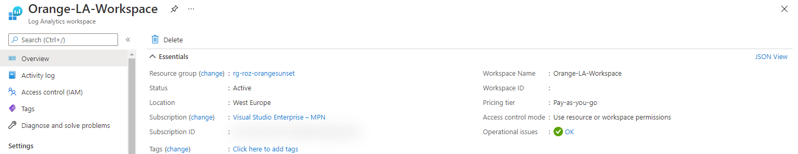

Welcome to the AVD Automation Cocktail. In this cocktail series I will show different AVD deployment strategies and languages. In this cocktail, the Sweet Orange Sunset, I will show you how to deploy an AVD environment automated with Azure CLI. Great new feature in this cocktail is the Azure AAD Join feature.



## Recipe

In this “OrangeSunset “-deployment recipe I will deploy an AVD environment automated with Azure CLI only. This cocktail looks a bit like the [Fresh Minty Breeze](https://www.rozemuller.com/avd-automation-cocktail-avd-with-bicep-and-azure-cli/). However this cocktail has no templates and using the specific deployment commands. This deployment also using the input parameters. This because to show all the needed Azure CLI commands and parameters. A great extra is the Azure AAD Join deployment.

### Before to drink

To start enrolling AVD automated with Azure CLI you need installing the software first. Download the Azure CLI software by clicking this URL:[ https://docs.microsoft.com/en-us/cli/azure/install-azure-cli](https://docs.microsoft.com/en-us/cli/azure/install-azure-cli)

More information about Azure CLI please check the following URLs:

- <https://docs.microsoft.com/en-us/cli/azure/>

### List Azure CLI of ingredients

- <https://docs.microsoft.com/nl-nl/cli/azure/network/nsg?view=azure-cli-latest> (NSG)
- <https://docs.microsoft.com/nl-nl/cli/azure/network?view=azure-cli-latest> (Network)
- <https://docs.microsoft.com/en-us/cli/azure/sig?view=azure-cli-latest> (Shared Image Gallery)
- [https://docs.microsoft.com/en-us/cli/azure/vm/run-command?view=azure-cli-latest#az\_vm\_run\_command\_invoke](https://docs.microsoft.com/en-us/cli/azure/vm/run-command?view=azure-cli-latest#az_vm_run_command_invoke) (VM Run command)
- [https://docs.microsoft.com/en-us/cli/azure/vm?view=azure-cli-latest#az\_vm\_capture](https://docs.microsoft.com/en-us/cli/azure/vm?view=azure-cli-latest#az_vm_capture) (VM Capture)
- [https://docs.microsoft.com/en-us/cli/azure/vm?view=azure-cli-latest#az\_vm\_generalize](https://docs.microsoft.com/en-us/cli/azure/vm?view=azure-cli-latest#az_vm_generalize) (VM Generalize)
- [https://docs.microsoft.com/en-us/cli/azure/vm/identity?view=azure-cli-latest#az\_vm\_identity\_assign](https://docs.microsoft.com/en-us/cli/azure/vm/identity?view=azure-cli-latest#az_vm_identity_assign) (VM Identity)
- <https://docs.microsoft.com/en-us/cli/azure/ad/signed-in-user?view=azure-cli-latest> (AD Signed in User)
- [https://docs.microsoft.com/en-us/cli/azure/vm/extension?view=azure-cli-latest#az\_vm\_extension\_set](https://docs.microsoft.com/en-us/cli/azure/vm/extension?view=azure-cli-latest#az_vm_extension_set) (VM Extension)
- <https://docs.microsoft.com/en-us/cli/azure/keyvault?view=azure-cli-latest> (Key Vault)
- <https://docs.microsoft.com/en-us/cli/azure/monitor/diagnostic-settings?view=azure-cli-latest> (Azure Monitor)
- <https://docs.microsoft.com/en-us/cli/azure/desktopvirtualization?view=azure-cli-latest> (AVD)
- [https://docs.microsoft.com/en-us/cli/azure/desktopvirtualization/hostpool?view=azure-cli-latest#az\_desktopvirtualization\_hostpool\_update](https://docs.microsoft.com/en-us/cli/azure/desktopvirtualization/hostpool?view=azure-cli-latest#az_desktopvirtualization_hostpool_update) (AVD Hostpool token)

### Aftertaste

This cocktail has a strong sweet Azure CLI taste with a little bit of PowerShell. At the end you will have an AVD environment in Azure deployed with all the needed resources. These are a hostpool, a workspace, an application group. Also there are some session hosts. These hosts have an underlying image from a shared image gallery.

## AVD automated with Azure CLI

In this chapter I will explain how to deploy an AVD environment automated with Azure CLI. I will recommend to clone my [AVD GitHub repository ](https://github.com/srozemuller/AVD)to get all the needed files, also for the other cocktails. I like to work with functions as much as I can. Using functions will avoid you are repeating yourself in lines of code. It also will help you keeping your code nice and clean. You will notice that when looking back in the file structure I’ve setup in the repository.

### Resource Group

Before deploying anything we need to login and create a new resource group.

```powershell
$location=westeurope
$resourceGroupName=RG-ROZ-ORANGESUNSET

az login
az group create --name $resourceGroupName --location $location
```


### Networking

The base of every environment is networking. In this step the idea is to deploy a new virtual network. The VNET has two subnets, a default subnet and an AVD-orange-subnet. The deployment code looks like the following:

```
<pre class="wp-block-code">```json
$deployNsg = az network nsg create --name nsg-roz-orangesunset --resource-group $resourceGroupName
```


Next, when the network is deployed, the subnets are created.

```powershell
$deployVnet = az network vnet create --name vnet-roz-orangesunset --resource-group $resourceGroupName --address-prefixes 10.4.0.0/22 --network-security-group $nsg.NewNSG.name
$vnet = $deployVnet | ConvertFrom-Json
$deployDefaultSubnet = az network vnet subnet create --name DefaultSubnet --address-prefixes 10.4.1.0/24 --resource-group $resourceGroupName --vnet-name $vnet.newVNet.name
$deployAvdSubnet = az network vnet subnet create --name AVD-Orange-Subnet --address-prefixes 10.4.2.0/24 --resource-group $resourceGroupName --vnet-name $vnet.newVNet.name

```


### Shared Image Gallery

First, we need the Shared Image Gallery itself. Because I want to reuse parameters as much as possible, I stored the deployment output in a variable. After deployment, I convert the deployment output from JSON to PowerShell objects

```powershell
$gallery = $deploySig | ConvertFrom-Json
$deploySigDefinition = az sig image-definition create --gallery-image-definition Win-Orange-Definition --gallery-name $gallery.name `
--resource-group $resourceGroupName --os-type Windows --hyper-v-generation V2 `
--offer Sweet --publisher Orange --sku Sunset
```

While the deployment is running you will notice the “Running” state in the terminal.


Finally the deployment is successful.

### Initial Image Version

Next step in our OrangeSunset-deployment is creating a new virtual machine. This machine is used for creating a new image version. This version is deployed into the gallery.

#### Create a virtual machine

Before I create a virtual machine through Azure CLI I need the correct image. By using the az vm image list command I get an complete image overview. Because of the long image list, I use a filter based on the publisher and SKU. After running the command I get some image versions for the 21h1 version. I picked the latest.

```powershell
$initialImage = az vm image list --publisher MicrosoftWindowsDesktop --sku 21h1-evd-g2 --all
$lastImage = ($initialImage | ConvertFrom-Json)[-1]
```

I use the ```–image``` option with the urn output.

```json
[
  {
    "offer": "Windows-10",
    "publisher": "MicrosoftWindowsDesktop",
    "sku": "21h1-evd-g2",
    "urn": "MicrosoftWindowsDesktop:Windows-10:21h1-evd-g2:19043.1083.2107060627",
    "version": "19043.1083.2107060627"
  },
  {
    "offer": "Windows-10",
    "publisher": "MicrosoftWindowsDesktop",
    "sku": "21h1-evd-g2",
    "urn": "MicrosoftWindowsDesktop:Windows-10:21h1-evd-g2:19043.1110.2107101729",
    "version": "19043.1110.2107101729"
  }
]
```

Now we have all the information we can create the initial virtual machine.

```powershell
$subnet = $deployAvdSubnet | ConvertFrom-Json
$deployVm = az vm create --name orange-vm --resource-group $resourceGroupName --image $lastImage.urn `
--size Standard_D2s_v3 --vnet-name $vnet.newVNet.name --subnet $subnet.name --admin-username 'localadmin' --admin-password 'verytS3cr3t!'
```

The az vm create command creates all the needed components like an OS disk and a network card.


#### SysPrep

First the VM must be and sysprepped and generalized. There are several options for running a script on a VM. This is like the Custom Script Extension or an Invoke-AzRunCommand in PowerShell. In this case I’m using the Azure CLI.

```powershell
$vm = $deployVm | ConvertFrom-Json

az vm run-command invoke  --command-id RunPowerShellScript --name $vm.id.Split("/")[-1] --resource-group $resourceGroupName --scripts 'param([string]$sysprep,[string]$arg) Start-Process -FilePath $sysprep -ArgumentList $arg' --parameters "sysprep=C:\Windows\System32\Sysprep\Sysprep.exe" "arg=/generalize /oobe /shutdown /quiet /mode:vm" 

```

Using the az vm run-command CLI comand gives me the option to skip creating an separate script first. In the –scripts part of the command is able to create a PowerShell on-the-fly. In the –parameters part I will send these parameters.   
When running the command, the VM will create a PowerShell file on the local machine. The provided –scripts content is stored in that local file.


#### Generalize VM

Next step before creating an image version is generalize and capture the virtual machine. To achieve that goal we are using the CLI again.

```powershell
az vm generalize --name $vm --resource-group $resourceGroupName
```

#### Create image version

Finally, it is time to create a new image version. In the first place I’m converting the outputs from the gallery and definition deployment. Because I want to create an image from a VM, I use the source as input for the image creation. I also refer to the gallery- and definition-deployment.

```powershell
$gallery = $deploySig | ConvertFrom-Json
$imageDef = $deploySigDefinition | ConvertFrom-Json
$vm = $deployVm | ConvertFrom-Json

$deployImageVersion = az sig image-version create --resource-group $resourceGroupName --gallery-image-version 2021.1907.01 `
--gallery-image-definition $imageDef.name --gallery-name $gallery.name --managed-image $vm.id
```

After executing the CLI command it could take a while before the image is ready. While the task is running the shell shows the running state. In the meantime, I take a look in the Azure Portal. You see the image has the creating status.


## Azure Virtual Desktop

Now every needed component is in place it is time to deploy the the Azure Virtual Desktop environment with Azure CLI. In this deployment we are going to deploy a host pool. The next step is the application group. The last step is a workspace.

Before using the desktop virtualization commands, we need to install the Azure CLI desktopvirtualization extension. When executing a ‘desktopvirtualization’-command the extension will automatically install.


### AVD Azure AD join Automated

We all heard the news that Azure AD join is now in public preview. Because of that I decided to use that new feature. To make this feature work you’ll need to walk through some steps. I will explain these steps in short.

First is adding an extra RDP property to the host pool, **<span style="text-decoration: underline;">```targetisaadjoined:i:1```</span>**. The host pool also needs the validation environment set.


Second we need assign a Virtual Machine User Login or Virtual Machine Administrator Login role. This role can be assigned at VM, resource group or at subscription level. I choose the resource group scope. I use the All Users AD group for example.   
To realize that a few command are needed. At first we need to get the All Users objectId

```powershell
$objectId = az ad group show --group "All Users" --query "objectId"
```

Next is finding the correct role. I use the Virtual Machine User Login role. This role is a BuilldIn role.

```powershell
$role = az role definition list --name "Virtual Machine User Login" --query "name"
$roleName = $role | Convertfrom-json
```


Now we have the correct Id’s it is time to assign the role to the resource group for All Users

```powershell
az role assignment create --assignee $objectId --role $roleName.name --resource-group $resourceGroupName
```


At last we need to install the correct VM extension. I will disqus that point later in the session host deployment.

More info about Azure AD Join: <https://docs.microsoft.com/en-us/azure/virtual-desktop/deploy-azure-ad-joined-vm>

### Hostpool

First, I create a date in string format with an addition of 1 hour. One hour is the minimum expiration, 27 days is the maximum.

```powershell
$date = (Get-Date).AddHours(1).ToString("yyyy'-'MM'-'dd'T'HH':'mm':'ss.fffffffK")
$deployAvdHostpool = az desktopvirtualization hostpool create --location $location --resource-group $resourceGroupName  --name Sunset-Hostpool  `
--description "For a nice relaxing sunset" --friendly-name "Orange Sunset Hostpool" --host-pool-type "Pooled" --load-balancer-type "BreadthFirst" `
--max-session-limit 10 --personal-desktop-assignment-type "Automatic" --registration-info expiration-time=$date registration-token-operation="Update" --custom-rdp-property "targetisaadjoined:i:1" --validation-environment $true
```


Second, the AVD host pool is deployed with the Azure AD needed RDP properties.


## Application group

I used the code below to deploy the application group. The application group is the place where to assign users/groups to the AVD environment.

```powershell
$hostpool = $deployAvdHostpool | ConvertFrom-Json
$deployAvdApplicationGroup = az desktopvirtualization applicationgroup create --location $location --resource-group $resourceGroupName --name "Orange-ApplicationGroup" `
--description "Application group with oranges" --application-group-type "RemoteApp" --friendly-name "The Sweet Orange Sunset group" --host-pool-arm-path $hostpool.id 
```


### Workspace

In front of AVD we have the workspace. This is the place where people subscribe to. I’m also referring to the application output. Based on that output I created a workspace name.

```powershell
$applicationGroup = $deployAvdApplicationGroup | ConvertFrom-Json
$deployAvdWorkspace = az desktopvirtualization workspace create --location $location --resource-group $resourceGroupName --name "Sweet-Workspace" `
--description "A Sweet Workspace" --friendly-name "Sweet Workplace" --application-group-references $applicationGroup.id
```


### Monitoring

As every environment we also like to monitor this environment. To monitor this environment we are going to use Log Analytics.

I used a template which deploys a LogAnalytics workspace. This will enable the provided logs for the AVD environment. After creating the workspace the diagnostic settings will be deployed.  
For the WorkspaceId I referenced the output of the LogAnalytics Workspace resource deployment.

```powershell
$deployLogAnalytics = az monitor log-analytics workspace create --resource-group $resourceGroupName --workspace-name Orange-LA-Workspace
```


Next we need to configure the diagnostic settings for the AVD host pool. In the command below I configure the checkpoint and error logs. The logs are send to the just created Log Analytics Workspace.

```powershell
$workspace = $deployLogAnalytics | ConvertFrom-Json
$logs = '[{""category"": ""Checkpoint"", ""categoryGroup"": null, ""enabled"": true, ""retentionPolicy"": {  ""days"": 0, ""enabled"": false }},{""category"": ""Error"",""categoryGroup"": null,""enabled"": true,""retentionPolicy"": {""days"": 0,""enabled"": false}}]'
$deployDiagnostics = az monitor diagnostic-settings create --name avd-diag-settings --resource $hostpool.id --workspace $workspace.id --logs $logs
```

To explain the context I used one line with JSON formatted text. Finally, you should use a JSON formatted file. In that case use ‘@{file}’ to load from a file.


## AVD Session hosts

Last is deploying the session hosts into the AVD hostpool. Before deploying a session host I decided to deploy an Azure Key Vault first. Into the key vault, I will store the administrator password for the domain join. In the later steps I will reference to this key vault secret in the template.

### Azure Key vault

In this step I will create an Azure Key Vault with Azure CLI and store the administrator password in it.

```powershell
$deployKeyVault = az keyvault create --location $location --resource-group $resourceGroupName --name SweetOrange-KeyVault

$keyvault = $deployKeyVault | ConvertFrom-Json
$deploySecretPass = az keyvault secret set --name vmjoinerPassword --vault-name $keyvault.name --value 'veryS3cretP@ssw0rd!'
```


Info: Because I deploy a key vault from my own account I allready have access to the key vault. In case of deploying a key vault from DevOps for example the context may be different. Make sure you set the correct permissions for users.

### Azure AAD Join Settings

To join an AVD session host to Azure AD you need some different settings relating to the default settings (native AD). First, thing to remember is the Desired State Config extension. Second thing which is different is the VM identity. A not AAD joined VM has no system assigned identity in the Azure AD.

### AVD Extension

The AVD module is a Desired State Config (DSC) extension. DSC is a management platform in PowerShell that enables you to ‘push’ configuration settings as code to a resource. In case of AVD, means that the extension installs the AVD software with specific AVD environment settings. For example the registration token and the host pool name. Now AADJoin is part of the family a new module came up. This new module accepts the aadJoin parameter, which the native module does not.

If you install the native module with the AADJoin parameter you will get a message like below.

*(ArtifactNotFound) The VM extension with publisher ‘Microsoft.Azure.ActiveDirectory’ and type ‘ActiveDirectory’ could not be found.  
(VMExtensionProvisioningError) VM has reported a failure when processing extension ‘DSC’. Error message: “The DSC Extension received an incorrect input: A parameter cannot be found that matches parameter name ‘aadJoin’.*

After digging into the deployment I found the correct artifact URL.



To deploy the AVD DSC extension with Azure CLI I used the code below. Make a notice about the aadJoin parameter in the settings.


```powershell
$moduleLocation = ""
$avdExtensionName = "DSC"
$avdExtensionPublisher = "Microsoft.Powershell"
$avdExtensionVersion = "2.73"
$avdExtensionSetting = '{""modulesUrl"": ""'+$moduleLocation+'"",""ConfigurationFunction"":""Configuration.ps1\\AddSessionHost"",""Properties"": {""hostPoolName"": ""'+ $($hostpool.name) + '"",""registrationInfoToken"": ""'+ $($hostpool.registrationInfo.token) + '"", ""aadJoin"": "'+ $true + '"}}'
```

### System identity

The next difference between a native domain joined VM is the resource identity.   
  
From Microsoft: **System-assigned** Some Azure services allow you to enable a managed identity directly on a service instance. When you enable a system-assigned managed identity, the identity is created in Azure AD that is tied to the lifecycle of that service instance. So when the resource is deleted, Azure automatically deletes the identity for you. By design, only that Azure resource can use this identity to request tokens from Azure AD.

Use the Azure CLI command below for assigning the system identity.

```powershell
az vm identity assign --name $vmName --resource-group $resourceGroupName --identities System
```

In addition to this context please check the following URL for more information: <https://docs.microsoft.com/en-us/azure/active-directory/managed-identities-azure-resources/overview>

### Create session host

Now it is time creating session hosts with Azure CLI. Before starting the deployment we need to create a host pool registration token first. This token will be use to add the session host into the correct host pool.

```powershell
$hostpoolToken = az desktopvirtualization hostpool update --resource-group RG-ROZ-MINTYBREEZE-COCKTAIL --name MintyBreeze-Hostpool --registration-info expiration-time="2021-06-16T15:01:54.9571247Z" registration-token-operation="Update" --query 'registrationInfo.token'
```

The command below will take care for getting the domain join password from the key vault.

```powershell
$adminpassword = az KeyVault secret show --vault-name $keyvault.name --name vmjoinerPassword --query value
```

#### Public IP and NSG

When deploying a virtual machine with Azure CLI, a Public IP address and a NSG is configured as default. Because I don’t want public ip’s assigned to my session hosts we need to avoid that. Because the VNET has a NSG allready, I also don’t want a NSG created. The way to avoid creating a public IP and a NSG is adding a null value in the parameters.


```powershell
--public-ip-address '""' --nsg '""'
```

At the end the complete session host deployment code will look like below. The used commands can be found at my [GitHub page](https://github.com/srozemuller/AVD/tree/main/Deployment/OrangeSunset).

```powershell
$sessionHostCount = 1
$initialNumber = 1
$VMLocalAdminUser = "LocalAdminUser"
$adminpassword = az KeyVault secret show --vault-name $keyvault.name --name vmjoinerPassword --query value
$avdPrefix = "sun-"
$vmSize = "Standard_D2s_v3"
$image = $deployImageVersion | ConvertFrom-Json

$domainJoinName = "AADLoginForWindows"
$domainJoinPublisher = "Microsoft.Azure.ActiveDirectory"
$domainJoinVersion   = "1.0"
$domainJoinSettings  = '{""mdmId"": ""0000000a-0000-0000-c000-000000000000""}'


$moduleLocation = ""
$avdExtensionName = "DSC"
$avdExtensionPublisher = "Microsoft.Powershell"
$avdExtensionVersion = "2.73"
$avdExtensionSetting = '{""modulesUrl"": ""'+$moduleLocation+'"",""ConfigurationFunction"":""Configuration.ps1\\AddSessionHost"",""Properties"": {""hostPoolName"": ""'+ $($hostpool.name) + '"",""registrationInfoToken"": ""'+ $($hostpool.registrationInfo.token) + '"", ""aadJoin"": "'+ $true + '"}}'

Do {
    $vmName = $avdPrefix+"$initialNumber"
    az vm create --name $vmName --resource-group $resourceGroupName --image $image.id --size $vmSize --vnet-name $vnet.newVNet.name --subnet $subnet.name --admin-username $VMLocalAdminUser --admin-password $adminpassword --public-ip-address '""' --nsg '""'
    az vm identity assign --name $vmName --resource-group $resourceGroupName
    az vm extension set --vm-name $vmName --resource-group $resourceGroupName --name $domainJoinName --publisher $domainJoinPublisher --version $domainJoinVersion --settings $domainJoinSettings
    az vm extension set --vm-name $vmName --resource-group $resourceGroupName --name $avdExtensionName --publisher $avdExtensionPublisher --version $avdExtensionVersion --settings $avdExtensionSetting

    $initialNumber++
    $sessionHostCount--
    Write-Output "$vmName deployed"
}
while ($sessionHostCount -ne 0) {
    Write-Verbose "Session hosts are created"
}
```


Finally, at the end, we have Azure AD Join session hosts.


I have the automated assignment of users to application group under investigation.   
For now everything is in place you only have to assign a usergroup to the application group and that’s it.

## Conclusion

Azure CLI is fast but has a steep learning curve. The basics are quite simple, but if you go more advance I will take some time. For example if you want to pass some JSON formatting. I had to use my ARM knowledge to create the correct JSON format for the extension deployment. Digging into ARM deployments helped me to get the correct information for the extension deployments. Also via ARM I noticed the VM needs an Azure AD system assigned identity.   
  
I have chosen to keep it as simple as possible from my opinion. I used some fixed values as well. In fact all these values should be in one singles parameter file.

In basic I’m very surprised about Azure CLI. It feels very fast in relation to PowerShell, at least with deployment (or other ‘push’ tasks). Querying info feels a bit slow. A big advantage is that you don’t need modules, well not as many as in PowerShell :). For the desktop virtualization part I had to install an extension but that’s it (which goes automatically).   
An another point is that you don’t have to remember use a lot different commands like get-avd, set-avd, update-avd. It all starts with the same context and then what you like to do, show, remove, update for example.

## Thank you!

I hope you liked the Sweet Orange [🍊](https://emojipedia.org/tangerine/) Sunset [☀️](https://emojipedia.org/sun/) you are a bit inspired. Now you know deploy AVD automated with Azure CLI is one of the options. If you like an another cocktail feel free to stay and check the [AVD Automation Cocktail menu](https://www.rozemuller.com/avd-automation-cocktail-the-menu/).

