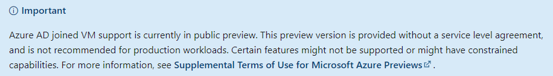
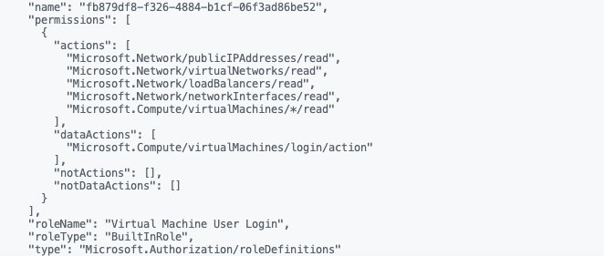
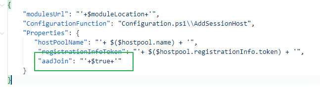

In this article, I show how to deploy and join an Azure VM to Azure AD join automated. In the deployment, I use two different ways of deployment. I use PowerShell and Azure CLI. Additionally, I show how to install the AVD extension with the Azure AD join.


## Azure AD join

We all heard the news that Azure AD join is now in public preview. Because of that, I decided to try that new feature in an Azure Virtual Desktop environment. While testing the feature I also want to do azure ad join automated. To make this feature work you’ll need to walk through some steps. The first thing to remember is there are also some limitations and it is still in public preview.


In addition to the short introduction more info about Azure AD join: <https://docs.microsoft.com/en-us/azure/virtual-desktop/deploy-azure-ad-joined-vm>

## Deploy an Azure AD joined VM

During joining a virtual machine several steps are executed in the background. The first is creating a system identity based on the virtual machine. The second is deploying the correct AAD VM extension. These two steps are explained below.

### System identity

A difference between a native domain joined VM is the resource identity.   
  
From Microsoft: **System-assigned** Some Azure services allow you to enable a managed identity directly on a service instance. When you enable a system-assigned managed identity identity is created in Azure AD that is tied to the lifecycle of that service instance. So when the resource is deleted, Azure automatically deletes the identity for you. By design, only that Azure resource can use this identity to request tokens from Azure AD.

The PowerShell command below is creating a system identity for the VM.

```powershell
# VM Properties
$vmName = "avd-1"
$resourceGroupName = "rg-avd-demo"
$location = 'westeurope' 

$vm = Get-AzVM -Name $vmName -ResourceGroupName $resourceGroupName
Update-AzVM -ResourceGroupName $resourceGroupName
-VM $vm -IdentityType SystemAssigned
```

Use the command below for assigning the system identity with Azure CLI.

```powershell
az vm identity assign --name $vmName --resource-group $resourceGroupName --identities System
```

### Deploy AAD VM-extension

Joining a virtual machine to a domain is handled by an Azure VM-Extension. Since AAD join is possible two new extensions are available.

In addition to this context please check the following URL for more information: <https://docs.microsoft.com/en-us/azure/active-directory/managed-identities-azure-resources/overview>

- AADLoginForWindows
- AADLoginForWindowsWithIntune

There are several options for installing the AAD extension to an Azure virtual machine. In the commands below I show how to deploy these extensions. To demonstrate several options I show a deployment with Azure CLI and PowerShell.  
Good to know is that only one extension can be deployed to a virtual machine.

Before adding an Azure VM extension with PowerShell make sure you imported the Az.Compute module. Next, configure the parameters.

```powershell
# VM Properties
$vmName = "avd-1"
$resourceGroupName = "rg-avd-demo"
$location = 'westeurope' 

# Azure AD Join domain extension
$domainJoinName = "AADLoginForWindows"
$domainJoinType = "AADLoginForWindows"
$domainJoinPublisher = "Microsoft.Azure.ActiveDirectory"
$domainJoinVersion   = "1.0"

Set-AzVMExtension -VMName $vmName -ResourceGroupName $resourceGroupName -Location $location -TypeHandlerVersion $domainJoinVersion -Publisher $domainJoinPublisher -ExtensionType $domainJoinType -Name $domainJoinName
```

If you like to join the machine also in your Microsoft Intune (MEM) environment you need to use the AADLoginForWindowWithIntune extension. In that case, you need to provide the mdmId in the extension settings.

```powershell
# VM Properties
$vmName = "avd-1"
$resourceGroupName = "rg-avd-demo"
$location = 'westeurope' 

$domainJoinName = "AADLoginForWindowsWithIntune"
$domainJoinSettings  = @{
    mdmId = "0000000a-0000-0000-c000-000000000000"
}
$domainJoinType = "AADLoginForWindows"
$domainJoinPublisher = "Microsoft.Azure.ActiveDirectory"
$domainJoinVersion   = "1.0"

Set-AzVMExtension -VMName $vmName -ResourceGroupName $resourceGroupName -Location $location -TypeHandlerVersion $domainJoinVersion -Publisher $domainJoinPublisher -ExtensionType $domainJoinType -Name $domainJoinName -Settings $domainJoinSettings
```

For deploying extensions with Azure CLI use the command below. Use the parameters above.

```powershell
# Azure AD Join domain extension
$domainJoinName = "AADLoginForWindows"
$domainJoinPublisher = "Microsoft.Azure.ActiveDirectory"
$domainJoinVersion   = "1.0"
$domainJoinSettings  = '{""mdmId"": ""0000000a-0000-0000-c000-000000000000""}'

az vm identity assign --name $vmName --resource-group $resourceGroupName
az vm extension set --vm-name $vmName --resource-group $resourceGroupName --name $domainJoinName --publisher $domainJoinPublisher --version $domainJoinVersion --settings $domainJoinSettings
```

## AAD join in Azure Virtual Desktop

After creating the virtual machines (or session hosts) it is time to prepare the AVD environment. This is the host pool and installing the AVD extension. Also for AVD is a new VM extension available.

### Prepare AVD host pool

To connect to an Azure AD joined virtual machine the client PC must meet one of the following conditions.

- Azure AD-joined to the same Azure AD tenant as the session host
- Hybrid Azure AD-joined to the same Azure AD tenant as the session host
- Running Windows 10, version 2004 and later and Azure AD registered to the same Azure AD tenant as the session host  
      
    (Source: Microsoft)

However, in an AVD situation, not every client PC has one of the conditions above. In fact, AVD is also available from the web (via https://rdweb.wvd.microsoft.com/arm/webclient/index.html). Till to the present day, a browser has no domain join :). Luckily there is a solution for accessing AVD with non-domain joined clients.


#### AVD RDP property

First is adding an extra RDP property to the host pool, **<span style="text-decoration: underline;">```targetisaadjoined:i:1```</span>**. The second step is configuring the host pool as a validation environment set.

```powershell
# AVD Properties
$resourceGroupName = "rg-avd-demo"
$location = 'westeurope' 
$HostPoolName = 'avd-hostpool'
$rdpProperties = "targetisaadjoined:i:1"

New-AzWvdHostPool -ResourceGroupName -Name $HostPoolName -Location $location -HostPoolType 'Personal' -LoadBalancerType 'Persistent' -PreferredAppGroupType "Desktop" -MaxSessionLimit 5 -CustomRdpProperty $rdpProperties -ValidationEnvironment:$true
```

### Assign roles

Next is assigning a Virtual Machine User Login or Virtual Machine Administrator Login role. This role must be assigned at VM, resource group, or at the subscription level. I choose the resource group scope. For example, I used the All Users AD group.  
In the first place, we need to get the All Users objectId.

Next is finding the correct role. I use the Virtual Machine User Login role. This role is a BuilldIn role.

<mark>In PowerShell use the following code.</mark> (PowerShell module: Az.Resources). I use the resource group scope.

Now we have the correct Id’s it is time to assign the role to the resource group for All Users.

```powershell
$objectId = Get-AzADGroup -DisplayName "All Users" | Select Id
$role = Get-AzRoleDefinition -Name "Virtual Machine User Login" 

New-AzRoleAssignment -ObjectId $objectId -RoleDefinitionName $role.name -resourceGroupName rg-avd-001
```

For Azure CLI use the code below.

```powershell
$objectId = az ad group show --group "AVD Users" --query "objectId"
$role = az role definition list --name "Virtual Machine User Login" --query "name"
$roleName = $role | Convertfrom-json
az role assignment create --assignee $objectId --role $roleName.name --resource-group $resourceGroupName
```

<figure class="wp-block-image size-large is-resized"><figcaption>Role output from Azure CLI</figcaption>
<figure class="wp-block-image size-large is-resized">
At last, we need to install the correct VM extension. I will discuss that point later in the session host deployment.

### AVD AAD join settings

To join an AVD session host to Azure AD you need different settings relating to native AD. The first thing to remember is the Desired State Config extension. The second thing which is different is the VM identity. A not AAD joined VM has no system assigned identity in the Azure AD.

#### AVD Extension

The AVD module is a Desired State Config (DSC) extension. DSC is a management platform in PowerShell that enables you to ‘push’ configuration settings as code to a resource. In the case of AVD, means that the extension installs the AVD software with specific AVD environment settings. For example the registration token and the host pool name. Now AADJoin is part of the family a new module came up. This new module accepts the aadJoin parameter, which the native module does not.

While installing the native module with the AADJoin parameter you will get a message like below.

*(ArtifactNotFound) The VM extension with publisher ‘Microsoft.Azure.ActiveDirectory’ and type ‘ActiveDirectory’ could not be found.  
(VMExtensionProvisioningError) VM has reported a failure when processing extension ‘DSC’. Error message: “The DSC Extension received an incorrect input: A parameter cannot be found that matches parameter name ‘aadJoin’.*

After digging into the deployment I found the correct AVD desired state config artifact URL.



When using PowerShell use the commands below. I used the Az.Avd PowerShell module and the Az.Compute.

```powershell
$hostpoolName = "avd-hostpool"
$resourceGroupName = "rg-avd-demo"
$token = Update-AvdRegistrationToken -HostpoolName $hostpoolName -ResourceGroupName $resourceGroupName -HoursActive 4


# AVD Azure AD Join domain extension
$moduleLocation = ""
$avdExtensionName = "DSC"
$avdExtensionPublisher = "Microsoft.Powershell"
$avdExtensionVersion = "2.73"
$avdExtensionSetting = @{
    modulesUrl            = $moduleLocation
    ConfigurationFunction = "Configuration.ps1\\AddSessionHost"
    Properties            = @{
        hostPoolName          = $hostpoolName
        registrationInfoToken = $($token.token)
        aadJoin               = $true
    }
}
Set-AzVMExtension -VMName $vmName -ResourceGroupName $resourceGroupName -Location $location -TypeHandlerVersion $avdExtensionVersion -Publisher $avdExtensionPublisher -ExtensionType $avdExtensionName -Name $avdExtensionName -Settings $avdExtensionSetting 
```

Use the code below to deploy the AVD DSC extension with Azure CLI. Make a notice about the aadJoin parameter in the settings. Important to realize when using Azure CLI, is the JSON input format for the extension settings.


```powershell
$token = az desktopvirtualization hostpool update --name $hostpoolName --resource-group $resourceGroupName --registration-info expiration-time=$date registration-token-operation="Update" 
$registrationToken = $token | ConvertFrom-Json

$hostpoolName = "avd-hostpool"
$resourceGroupName = "rg-avd-demo"
$date = (Get-Date).AddHours(4).ToString("yyyy'-'MM'-'dd'T'HH':'mm':'ss.fffffffK")

$token = az desktopvirtualization hostpool update --name $hostpoolName --resourcegroup $resourceGroupName --registration-token-operation="Update" --registration-info expiration-time=$date
$moduleLocation = ""
$avdExtensionName = "DSC"
$avdExtensionPublisher = "Microsoft.Powershell"
$avdExtensionVersion = "2.73"
$avdExtensionSetting = '{""modulesUrl"": ""'+$moduleLocation+'"",""ConfigurationFunction"":""Configuration.ps1\\AddSessionHost"",""Properties"": {""hostPoolName"": ""'+ $($hostpoolName) + '"",""registrationInfoToken"": ""'+ $($registrationToken .registrationInfo.token) + '"", ""aadJoin"": "'+ $true + '"}}'

az vm extension set --vm-name $vmName --resource-group $resourceGroupName --name $avdExtensionName --publisher $avdExtensionPublisher --version $avdExtensionVersion --settings $avdExtensionSetting

```

Thank you for reading this article I show how to deploy and an Azure VM to Azure AD join automated.

