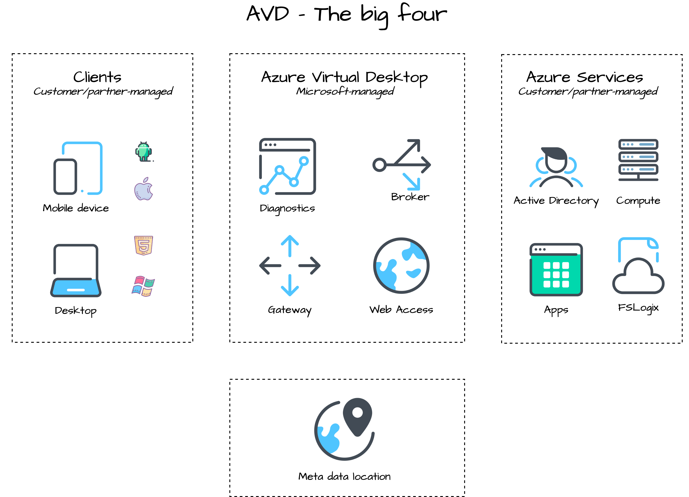
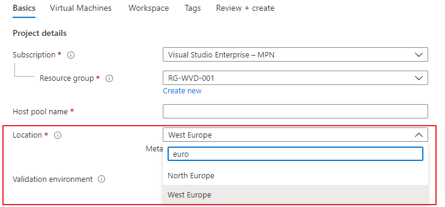
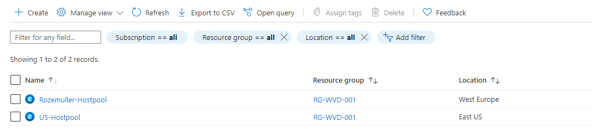
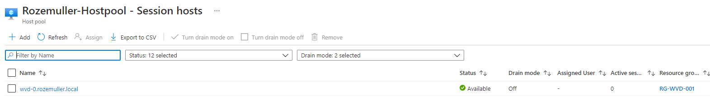
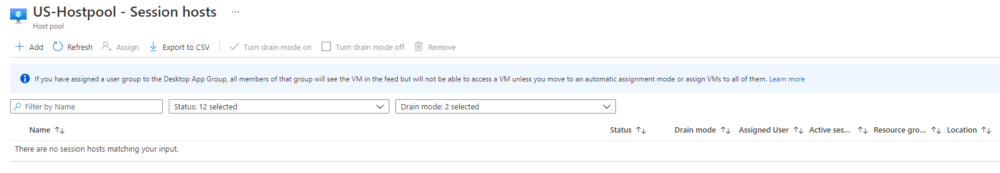
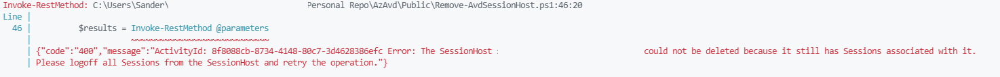
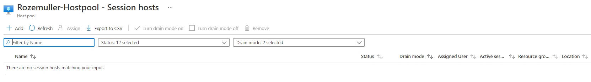
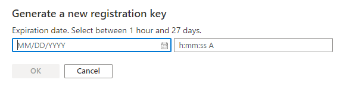
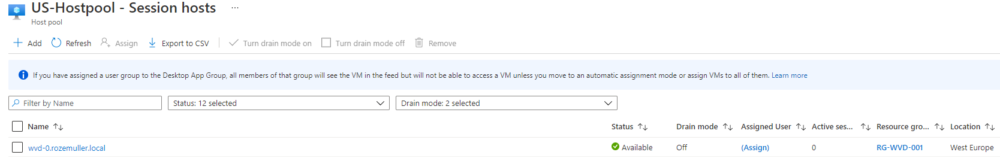

Azure Virtual Desktop is growing and becomes available at new (metadata) locations more and more. In this article, I will explain how to move AVD session hosts to a new AVD host pool. metadata location with REST API and PowerShell.

## Introduction

Azure Virtual Desktop becomes a more important Azure service every day and does not need any more introduction I think. AVD is a service that takes care of publishing in a remote working place. The working place with its resources is your own responsibility but Microsoft takes care of the session handling, the login website, and publishing the correct workspaces to end-users.   
The Microsoft part also has stored his configuration somewhere. This location is called the metadata location. In the beginning, a few locations were available but, the metadata locations are growing. This is good news, but only for new AVD host pools. At this moment there is no option for moving a host pool to a new metadata location. Luckily we are able to create a new host pool and then move existing session hosts to the new host pool.   
In this article, I will show you how to move the session hosts to a new host pool automated.



## AVD metadata locations

Azure Virtual Desktop consists of several Azure Resources. Think of the session hosts (virtual machines), networking, file servers, or other associated services. Another part of AVD is services resources. Think about the session broker, a gateway, and the web page.

In the graph below you see the three big Azure Virtual Desktop pieces. The right resources are the customer’s responsibility. These resources can be stored at every Azure geographical location. These are the resources that are your own responsibility.

The middle part is the AVD services resources. These resources are managed by Microsoft and also stored somewhere. That location is called the metadata location. At this location, Microsoft stores traffic patterns, health checks, usage log information, and more. This information is needed to control the infrastructure and can scale capacity if needed. Customer data is not stored at this location.



Currently, Microsoft has the following locations available.

- United States (US)
- Europe (EU)
- United Kingdom (UK)
- Canada (CA)
- Japan (JP) \**in Public Preview*
- Australia (AU) \**in Public Preview*

For more information about data location please [check the AVD data location documentation](https://docs.microsoft.com/en-us/azure/virtual-desktop/data-locations).

## Move AVD session hosts to another host pool

Microsoft is planning more locations in the future. That will make it possible to get the metadata location at a place you like. However, at this moment it is not possible to move a host pool to a new location. Even when you move the host pool to a new resource group, with another location, the host pool location will not be changed.

But there are options to change the metadata location if you like. There is an option to move session hosts to a new host pool. This can be done by creating a new host pool at the correct location and moving the session hosts to the new host pool.


In the following chapters, I will explain the process how to move an AVD session host to a new host pool with REST API.

In my situation I have two AVD host pools:

- Rozemuller-Hostpool is located in West-Europe
- US-Hostpool is located in East-US.


The Rozemuller-Hostpool has one session host wvd-0.rozemuller.local. The US-Hostpool is empty.



### Remove session host from AVD host pool

The first step in the process is removing the session host from its current host pool. Make sure there are no sessions associated with the host. Otherwise, you will get an error message like the one below.


Once the session host is empty you are able to remove it from the host pool. We are using the REST API for removing the session host.

#### Authenticating

Before you are able to use the REST API you will need to authenticate to the API.   
Because we are using PowerShell for executing the REST API calls we only need to authenticate in PowerShell. From that context, we are gathering a header token for the REST API.

```powershell
function GetAuthToken($resource) {
    $context = [Microsoft.Azure.Commands.Common.Authentication.Abstractions.AzureRmProfileProvider]::Instance.Profile.DefaultContext
    $Token = [Microsoft.Azure.Commands.Common.Authentication.AzureSession]::Instance.AuthenticationFactory.Authenticate($context.Account, $context.Environment, $context.Tenant.Id.ToString(), $null, [Microsoft.Azure.Commands.Common.Authentication.ShowDialog]::Never, $null, $resource).AccessToken
    $authHeader = @{
        'Content-Type' = 'application/json'
        Authorization  = 'Bearer ' + $Token
    }
    return $authHeader
}
$token = GetAuthToken -resource "https://management.azure.com"
```

The authentication token will be returned to the $token variable. This is the token we need for requesting API calls to Azure.

#### Remove session host

If we have received a token we are able to call the REST API for removing the session host. I will save the outcome into the $DeleteSessionHost variable. The command returns the session host object. The object contains the virtual machine resourceId which is needed in the next step.

```powershell
$subscriptionId = "xxx"
$ResourceGroupName = "rg-wvd-001"
$hostpoolname = "Rozemuller-hostpool"
$SessionHostName = 'wvd-0.rozemuller.local'

$SessionHostUrl = "https://management.azure.com/subscriptions/{0}/resourceGroups/{1}/providers/Microsoft.DesktopVirtualization/hostpools/{2}/sessionHosts/{3}?api-version=2021-03-09-preview" -f $subscriptionId, $ResourceGroupName, $HostpoolName, $SessionHostName
$parameters = @{
    uri     = $SessionHostUrl
    Method  = "DELETE"
    Headers = $token
}
$sessionHost = Invoke-RestMethod @parameters
```

Or, use the Az.Avd module (after login with Connect-AzAccount) and run the command below.

```powershell
$ResourceGroupName = "rg-wvd-001"
$hostpoolname = "Rozemuller-hostpool"
$SessionHostName = 'wvd-0.rozemuller.local'

Remove-AvdSessionHost -HostpoolName $hostpoolname -ResourceGroupName $ResourceGroupName -Name $SessionHostName
```

The Rozemuller-Hostpool is now empty.


### Generate token

A session host will register itself to a host pool with a globally unique token. This very long string in combination with the host pool name will make it possible to join a host pool. The AVD RD Infra Agent will search in the Azure cloud for a host pool name with this token and register itself into that host pool.

A token must be available between an hour and a maximum of 27 days.


In my code, I will generate a new token for 1 hour in the new host pool. This for the simple reason I don’t need more time to register the session host. Make a notice about the $hostpoolToken variable. I will store the output into this variable. I need the token which will be returned.

```powershell
$subscriptionId = "xxx"
$NewResourceGroupName = "rg-wvd-001"
$Newhostpoolname = "US-Hostpool"
$baseUrl = "https://management.azure.com/subscriptions/{0}/resourceGroups/{1}/providers/Microsoft.DesktopVirtualization/hostpools/{2}?api-version=2021-03-09-preview" -f $subscriptionId, $NewResourceGroupName, $Newhostpoolname
$Body = @{
  properties = @{
      registrationInfo = @{
        expirationTime = "$($(Get-Date).AddHours(1))"
        registrationTokenOperation = "Update"
      }
  }
}
$parameters = @{
    URI     = $baseUrl 
    Method  = "PATCH"
    Headers = $token
    Body = $Body | ConvertTo-Json
}
$hostpoolToken = Invoke-RestMethod @parameters
```

Use the code below in the next request body.

```powershell
$hostpoolToken.properties.registrationInfo.token
```

Generating a host pool token is also possible with the Az.Avd PowerShell module. Use the command below.

```powershell
Update-AvdRegistrationToken -HostpoolName $Newhostpoolname -ResourceGroupName $NewResourceGroupName -HoursActive 4
```

### Add session host to a new AVD host pool

The last step generating a script that will be executed on the session host. We have stored the session host Id and the token in variables and are using these in the body.

We are also going to send an invoke-azruncommand via the REST API. To send a script via the REST API we need to generate an ArrayList with PowerShell. In the first part of the commands below, we are creating an ArrayList and adding commands with the.Add () function.

In the first command, I use the $hostpool token variable which is the registration token value in the registry.   
The $sessionHost resource Id is used in the REST API URL.

```powershell
$script = [System.Collections.ArrayList]@()
$script.Add('Set-ItemProperty -Path Registry::HKEY_LOCAL_MACHINE\SOFTWARE\Microsoft\RDInfraAgent -Name RegistrationToken -Value '+$($hostpoolToken.properties.registrationInfo.token)+'')
$script.Add('Set-ItemProperty -Path Registry::HKEY_LOCAL_MACHINE\SOFTWARE\Microsoft\RDInfraAgent -Name IsRegistered -Value 0')
$script.Add('Restart-Service -Name RDAgentBootLoader')

$MoveBody = @{
    commandId = "RunPowerShellScript"
    script    = $script
}
$url = "https://management.azure.com{0}runCommand?api-version=2021-03-01" -f $sessionHost.properties.resourceId
$parameters = @{
    URI     = $url 
    Method  = "POST"
    Body    = $MoveBody | ConvertTo-Json
    Headers = $token
}
Invoke-RestMethod @parameters
```

Wait for a few minutes after running the command. The session host is moved to a new host pool.


### PowerShell Module Az.Avd

If you are not that familiar with Rest API, no worries. I also updated the [Az.Avd PowerShell module](https://www.powershellgallery.com/packages/Az.avd) with a new command called Move-AvdSessionHost. This command helps you move session hosts to another host pool.

Use the following syntax:

```powershell
Move-AvdSessionHost -FromHostpoolName <String> -FromResourceGroupName <String> -ToHostpoolName <String> 
    -ToResourceGroupName <String> [-SessionHostName <String>] [<CommonParameters>]
```

Thank you for reading about moving AVD session hosts to a new host pool via REST API.   

