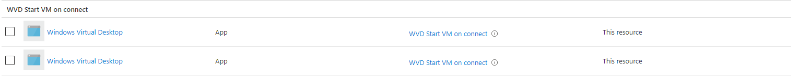
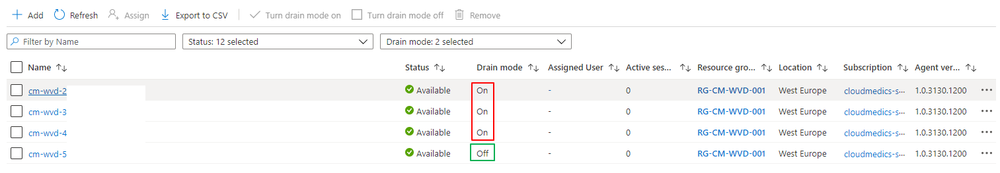

A Shared Image Gallery is a great way to distribute images over multiple environments. This great feature is also its disadvantage. When using a Shared Image Gallery in combination with several environments with even more host pools you will lose sight fast. At this moment there is no good overview of which host in which environment is using which version.   
In this article, I will explain how to deal with AVD session hosts and version management. This will help to keep your environment clean and save costs.

We all were in a situation where image versioning wasn’t that necessary. But at this time we all know better and create versions over and over. And we all agree that versioning reduces downtime and gives us options to revert quickly.   
Also, Microsoft thought it was a good idea to provide us with an image versioning option. Where Citrix is using Citrix Provisioning Microsoft has the Azure Shared Image gallery.   
  
I have worked a lot with both and still do (mostly on the Microsoft site). During the years I experienced it could be hard to manage all those environments with all of their versions. It becomes hard when you have multiple tenants with environments. And at last, it becomes almost impossible when you have set some AVD session hosts in drain mode (not accepting new connections) and deployed new session hosts with a newer version in the same host pool. It is just a matter of time becoming a mess.

In this article, I will show how to deal with AVD session hosts and version management. I will show you how to get all the session host information with the image versions, how to set drain mode, and how to clean up old session hosts.



## Getting sight

Let’s clear the air and make sure we are getting sight of our environment. The main idea is to get all the session host information in combination with the underlying image source. To get sight without writing a lot of code every time I will recommend using the Az.Avd PowerShell module. This module helps you manage AVD environments with PowerShell

### Install module Az.Avd

If you haven’t already installed the Az.Avd module then is time to do it right now. As I said it really helps you manage your AVD environments.

Because the module is available in the official [PowerShell gallery](https://www.powershellgallery.com/packages/Az.Avd) it is very easy to install the module by the following command. After installing don’t forget to import the module as well.

```powershell
Install-Module Az.Avd
Import-Module Az.Avd
```

So far so good.

### Get AVD image version status

After the module is installed a whole new set of AVD PowerShell command become available. One of them is Get-AvdImageVersionStatus. This command accepts a few parameters and will look into the environment for all the needed information.

```powershell    
Get-AvdImageVersionStatus -HostpoolName  -ResourceGroupName  [-NotLatest]
Get-AvdImageVersionStatus -HostpoolName <String> -ResourceGroupName <String> [-SessionHostName <String>] [-NotLatest] [<CommonParameters>]
```

For all help, information use the command Get-Help Get-AvdImageVersionStatus -Full

Now let’s see the command in action. I’m searching in an AVD hostpool for all the session hosts with their image versions.

```powershell
$hostpoolInfo = @{
    HostpoolName      = "avd-hostpool"
    ResourceGroupName = "rg-avd-01"
}
Get-AvdImageVersionStatus @hostpoolInfo -Verbose 
```

The result of the command is shown in the picture below. If there are different versions active in one hostpool, you see differences between the latestVersion object and the currentImageVersion object. The latest version is picked from the Azure Compute Gallery from where the sessionhost got his image. The currentImageVersion is the version that has the sessionhost now.

 When using the -Latest flag in the command, the command searches at the isLatestVersion object.



## Drain mode

To clean up the mess it is recommended to get the users to correct session hosts. Putting the old session hosts into drain mode is the first step. Drain mode avoids users logging in at one of the old hosts.

Putting hosts into drain mode is simple with the Az.Avd PowerShell module. In the first step, I’m only requesting the old session hosts with the -NotLatest switch parameter. The results will be piped to another command Update-AvdSessionhostDrainMode.

```powershell
$avdParams = @{
    hostpoolName      = "AVD-Hostpool"
    resourceGroupName = 'rg-roz-avd-01'
}
Get-AvdImageVersionStatus @avdParams -NotLatest | foreach {
    Update-AvdSessionhostDrainMode -InputObject $_ -AllowNewSession $true
}
```



## Clean up old resources

Now the session hosts are in drain mode it is a matter of time till the hosts are empty. At the moment the hosts are empty it is time to clean up the resources. First, we will delete the session host from the host pool. Later we are going to remove the virtual machine, the disk and the network card.

```powershell
$avdParams = @{
    hostpoolName      = "AVD-Hostpool"
    resourceGroupName = 'rg-roz-avd-01'
}
Get-AvdImageVersionStatus @avdParams -NotLatest | foreach {
    $sessionHost = Get-AvdSessionHostResources -Id $_.sessionHostId
    Remove-AzResource -ResourceId $sessionHost.vmResources.Id -Force
    Remove-AzResource -ResourceId $sessionHost.vmResources.properties.StorageProfile.OsDisk.ManagedDisk.id -Force
    Remove-AzResource -ResourceId (Get-AvdNetworkInfo @avdParams -SessionHostName $sessionHost.name).NetworkCardInfo.nicId -Force
}
```

The next step is removing the session hosts from the AVD host pool.

With the command below we are deleting the AVD session host from the host pool. This command is also in the Az.Avd PowerShell module.

```powershell
$avdParams = @{
    hostpoolName      = "AVD-Hostpool"
    resourceGroupName = 'rg-roz-avd-01'
}
Get-AvdImageVersionStatus @avdParams -NotLatest | foreach{
    Remove-AvdSessionhost -HostpoolName $_.Hostpoolname -ResourceGroupName $_.ResourceGroupName -Name $_.tName
    }
```

Or based on AVD session host ID.

```powershell
$avdParams = @{
    hostpoolName      = "AVD-Hostpool"
    resourceGroupName = 'rg-roz-avd-01'
}
Get-AvdImageVersionStatus @avdParams -NotLatest | foreach{
    Remove-AvdSessionhost -Id $_.id
    }
```
And now the old session hosts are removed.


