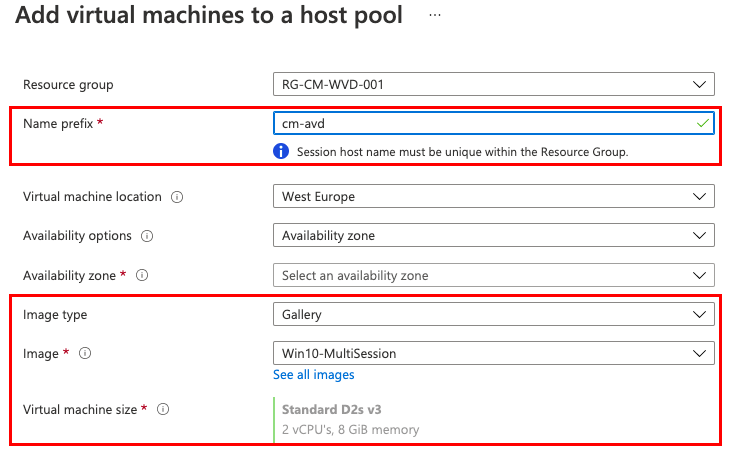
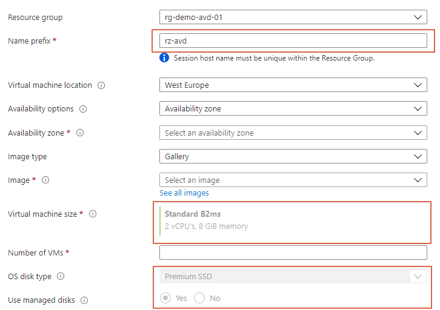

In automation using templates is key! Using templates makes life easier. No new information I guess. If you run tasks in DevOps, Terraform, or other engines you want to reuse code blocks. When deploying resources in Azure we use ARM or Bicep templates. Good to know there is also is a sort of ‘in place’-template available for AVD. This is the VM template and stored under the host pool information. In this blog post, I explain how to set and use VM templates. This will help you with the AVD sessionhost automation.



## Templates

During my travel in the world of AVD, I tested lots of automation sequences. Some of them I wrote down in the [AVD Automation Cocktail](https://www.rozemuller.com/avd-automation-cocktail-the-menu/). All of these cocktails have one thing in common, the use of templates (Bicep, ARM, YAML). Actually, even PowerShell functions are a sort of template.

In the end, all ‘deployment’-templates having the same goal: make sure you don’t have to repeat code and can use them in generic.

All these kinds of templates have one thing in common, they are file-based. When using [ARM](https://docs.microsoft.com/en-us/azure/azure-resource-manager/templates/syntax) or Bicep, we have .json or .bicep (parameter) files. Azure DevOps has [YAML templates](https://docs.microsoft.com/en-us/azure/devops/pipelines/process/templates?view=azure-devops) and PowerShell has modules (like [Az.Avd)](https://www.powershellgallery.com/packages/Az.avd) and functions.

In the case of Azure Resource Manager (ARM), we also have the ability to create template through the portal just before the deployment start.

### Automation best practices (for me)

To make my own automation life also a bit easier I created some automation best practices from where I start. It is not a list of rules but it helps me a lot working out automation strategies.

- Don’ repeat yourself (use templates and, in scripts, functions)
- Get your sequence unattended as much as possible (use enviroment information, in case of an initial deployment use parameters)
- Make your scripts and automation task independed as much as possible (Avoid using extra files and modules)
- If needed, make sure templates can used in generic (avoid hardcoded customer specific sidesteps, in that case use parameters insertion)


### VM-templates explained

In an Azure Virtual Desktop environment, the session hosts are the most dynamic part. We are building new images, adding/removing hosts all the time, and scale up and down. A good moment to look at AVD sessionhost automation.  
  
At this point it becomes interesting. Yes, session hosts are Azure resources and so you can use ARM and Bicep templates. However, there is another way to create a session host. And that’s the use of VM templates. This VM template information is stored in the host pool information.   
The good part about this template type is it solves two of my own automation best practices. Use environmental information (2) and be less independent (3).

Why is that?

Below I posted content inside a VM template. I got this information with the Get-AvdHostPoolInfo PowerShell command. This information is pretty useful.

```powershell
domain                : domain.local
galleryImageOffer     : 
galleryImagePublisher : 
galleryImageSKU       : 
imageType             : CustomImage
imageUri              : 
customImageId         : /subscriptions/xxxx/resourceGroups/RG-AVD-SIG-001/providers/Microsoft.Compute
                        /galleries/AVD_ImageGallery/images/Win10-MultiSession
namePrefix            : cm-avd
osDiskType            : StandardSSD_LRS
useManagedDisks       : True
vmSize                : @{id=Standard_D2s_v3; cores=2; ram=8}
galleryItemId         : 
```

In an AVD sessionhost automation scenario there are some considerations. A session host is pretty customer-specific. Think about the domain name and the session hostname prefix. Both are not recommended to be set in a generic template. As you can see the VM template information stores domain information, the name prefix, and the VM hardware for example. But some values could be used in generic like the imageType and the customImageId (Shared Image Gallery).

This information is needed when creating session hosts.

In earlier posts, I showed how to create session hosts based on an existing environment. I searched for the latest session host and grabbed all the needed information. However, a new environment has no session hosts. During the time I learned how to enroll session hosts always in the same way. Regardless of a new or existing environment. This with the help of VM templates.

## How to check VM templates

It is good to check if you are using VM templates. However, there is no kind of VM template blade available there is an option to check. As shown above, VM templates store important information. It is good to check if you are using it.

### Portal

Some of this information is available in the portal when creating session hosts. To check the available information go to the session host blade. Within that blade, click **add**. In the Virtual Machines tab, you will notice some information is pre-filled. Check the name prefix and the image part. Also, the correct VM hardware is selected.


### Code

When using PowerShell there is a single command to check if there is a template available. I use the Az.Avd PowerShell module.

```powershell
Get-AvdHostPoolInfo -HostPoolName avd-hostpool -ResourceGroupName rg-cm-avd-001 | select vmTemplate
```

```powershell
domain                : domain.local
galleryImageOffer     : 
galleryImagePublisher : 
galleryImageSKU       : 
imageType             : CustomImage
imageUri              : 
customImageId         : /subscriptions/xxxx/resourceGroups/RG-AVD-SIG-001/providers/Microsoft.Compute
                        /galleries/AVD_ImageGallery/images/Win10-MultiSession
namePrefix            : cm-avd
osDiskType            : StandardSSD_LRS
useManagedDisks       : True
vmSize                : @{id=Standard_D2s_v3; cores=2; ram=8}
galleryItemId         : 
```

<div aria-hidden="true" class="wp-block-spacer" style="height:30px"></div>In case of no template, the portal parts are empty. When l searching with PowerShell, you get a null value returned.

```powershell
vmTemplate
----------

```

## Enable VM templates

So, creating session hosts starts with a VM template. This means we have to create a VM template at the initial deployment. Good to know is when deploying a new AVD environment through the portal the VM template is created automatically. However, when creating AVD environments with code the VM template is empty.

### Add a VM template

As mentioned earlier, when creating a session host through the portal a VM template is created automatically. If you use automation make sure you add this as an extra step in your sequence.

To help in AVD sessionhost automation I updated the Az.Avd PowerShell module. In the Az.Avd PowerShell module there is a command called **Create-AvdVmTemplate**. This command asks you for all the needed information to create a VM template and add it to the host pool.

```powershell
create-AvdVmTemplate -HostpoolName avd-hostpool -ResourceGroupName rg-demo-avd-01 -domain rozemuller.local -namePrefix rz-avd -vmSku 'Standard_B2ms' -vmCores 2 -vmRam 8 -osDiskType "Premium_LRS"
```


## Where does it help?

Now we know what VM templates mean, I can imagine there are questions about the added value. What is the difference between using ARM engine templates (ARM or Bicep) and the VM template?   
In both cases we need templates but there are pros. The main difference is the fact that ARM engine templates are file-based where VM templates are not.

Besides the fact that some values are prefilled in the Azure portal under the add session host section, there is more. As described in the [VM templates explained](#vm-templates-explained) paragraph a VM templates hold customer-specific and non-customer-specific values. With that fact, some really cool things can be automated.

Let me explain based on some real-life scenarios.

### Hostpool purpose and VM hardware

Imagine you have several host pools with GPU-enabled session hosts. This kind of power host pool needs special hardware for the best performance. During this time more host pools are deployed at several customers. To deploy these session hosts you are used to deploying them with a customer-specific ARM template (with a domain name, prefix, etc).   
  
Now the time arrives that the VM hardware needs to be updated. And that’s the point where the use of a VM template could be a lifesaver. Instead of manually changing all those specific ARM templates you can search for those host pools (maybe based on a resource tag (eg. GPU host pool)) and update all those VM templates automatically.

### Image location

Another situation is when using your own images, for example from out of a Shared Image Gallery. As you properly know, a Shared Image Gallery provides images across multiple subscriptions. When using Azure Lighthouse you are also able to share them even with other customers.

In the end, it means that you have one basic image with rules them all. Imagine you have this custom image location in customer-specific ARM templates and the image location changes (for example, a new image from a new image gallery). With the use of VM templates, you can search the host pools VM templates for the custom image location and changed it automated.

### Custom objects

During testing, I noticed you can add custom properties. Since the VM template parameter accepts a string format there are no fixed objects. This means I was able to add the OU-path for example. These values are not present in the Azure Portal but can be used as PowerShell objects. This is extremely powerful.

To add these custom values, use the customObject parameter in the create-AvdTemplate command.

```powershell
$hostpoolName = 'avd-hostpool'
$ResourceGroupName = 'rg-demo-avd-01'
$customObjects = @{
    OuPath = 'OU=Computers,DC=rozemuller,DC=local'
    TestNonExisting = 'rozemuller.com'
}
create-AvdVmTemplate -HostpoolName $hostpoolName -ResourceGroupName $ResourceGroupName -domain rozemuller.local -namePrefix rz-avd -vmSku 'Standard_B2ms' -vmCores 2 -vmRam 8 -osDiskType "Premium_LRS" -CustomObject $customObjects

$vmtemplateInfo = Get-AvdHostPoolInfo -HostPoolName $hostpoolName -ResourceGroupName $ResourceGroupName
$vmtemplateInfo
```

![image-30(image-30.png)
## Considerations

Yes, there are some cons if you are not that familiar with PowerShell. For example, if configured a VM template you are not able to change the VM size within the portal.

The virtual machine size is greyed out.


Another thing is if you don’t fill in all the mandatory parameters you will break the template. During tests, I broke the template multiple times because of missing parameters. However, the docs aren’t telling you some parameters are extremely important.

For example, when only providing the VM CPU’s and memory you will get something like below where the VM type is missing.


Or even worse, no VM at all.


Luckily the Create-AvdVmTemplate in the Az.Avd PowerShell module helps you avoid this.

Thank you for reading this blog about using VM templates for AVD sessionhost automation.  

