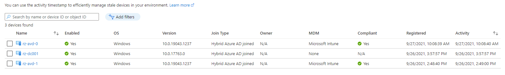
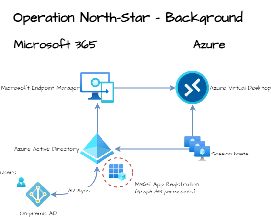
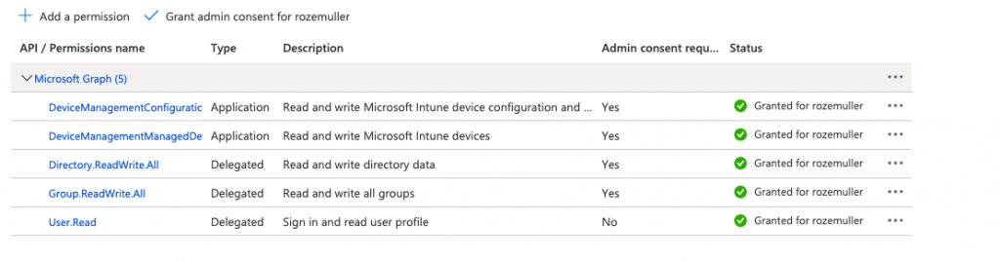
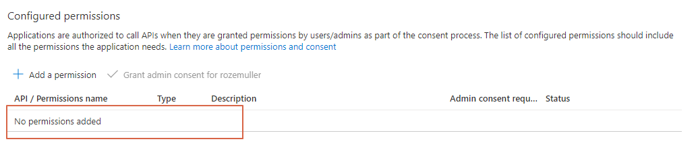
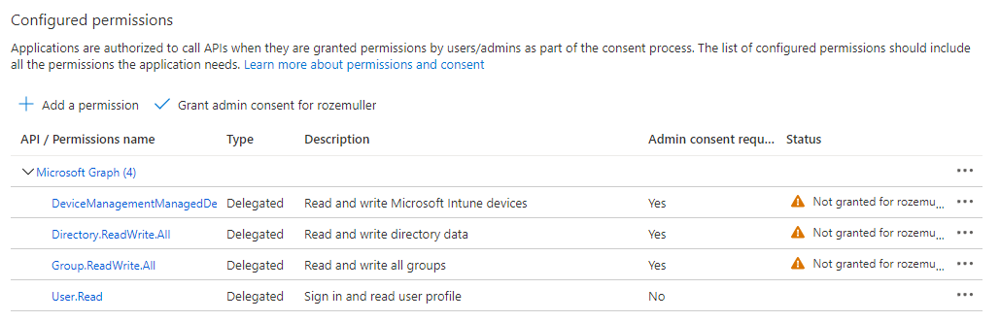
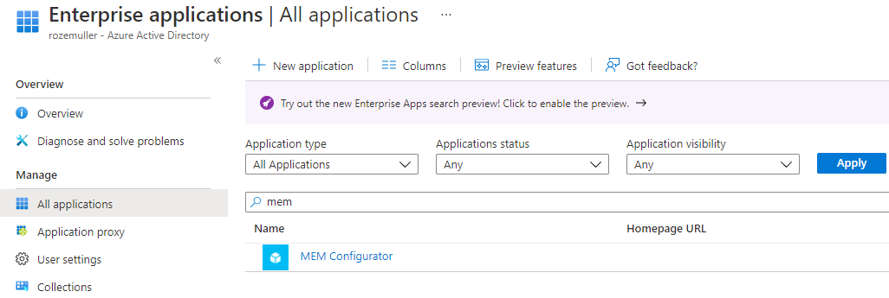
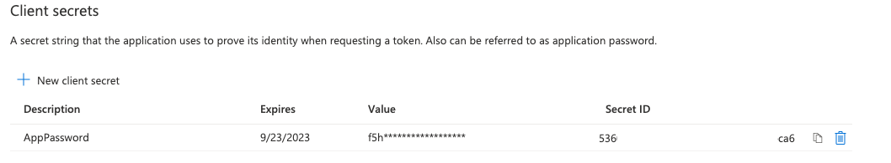
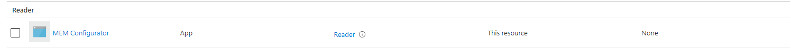
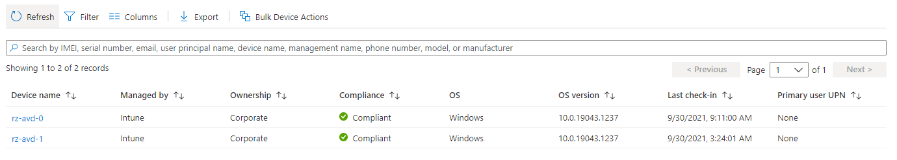

Welcome to a brand new series called Operation North Star. In the upcoming series, I will show how to manage AVD environments with Microsoft Endpoint Manager. I talk about how to manage AVD environments and how to deploy these settings automated. At last, I try to show how to configure a new way of management.

In the [AVD Automation Cocktail](https://www.rozemuller.com/avd-automation-cocktail-the-menu/) series, I showed how to deploy an AVD environment automated in several ways. For example with PowerShell, Bicep, or DevOps. As said in the upcoming series I will add a new layer for modern management with the main focus on Azure Virtual Desktop. What do you need? Why do you need it? How to deploy all these settings?

I called this operation ‘North-Star’. With this purpose, I try to help you further in the world of managing a modern workplace.

At least the following subjects will pass:

- Update management
- Security
- Monitoring
- Application management
- Optimizing

Altogether, with the back of Microsoft Endpoint Manager. To complete the series I will show how to deploy all of this automated.

Because of overlapping subjects, I have chosen to use this article to explain the background. Information about used techniques and prerequisites. At last how to deploy them. All of this, to avoid extremely long articles which make them hard to read.



## Why operation ‘North Star’

Microsoft has released a framework for Microsoft Endpoint Management called ‘North Star’. This framework is designed to deploy and secure Windows Devices in the cloud. Also, task to optimize and manage them. Because of all these settings, the framework is categorized into main blocks. To clarify more, these main blocks have four sub-blocks. In this blog series, I use the North Star framework to manage Azure Virtual Desktop after it is deployed.

[thumbnail](https://techcommunity.microsoft.com/t5/image/serverpage/image-id/289704i7B8110F372C81D4A/image-size/large?v=v2&px=999)
In addition to the introduction, more information is available via the link below.

<https://techcommunity.microsoft.com/t5/windows-it-pro-blog/a-framework-for-windows-endpoint-management-transformation/ba-p/2460684>

## Microsoft Endpoint Manager

To manage modern workplaces we use Microsoft Endpoint Manager (MEM). During this time, MEM has grown into a full management platform. In a Microsoft world a good way to manage client endpoints. Besides that, it also supports you in managing iOS and Android devices. In this series, the main focus is on Windows (10 and 11) devices from an AVD perspective. It helps you deliver a modern workplace and keeps your data secure.

Microsoft Endpoint Manager combines services like Microsoft Intune, Configuration Manager, Desktop Analytics, and Windows Autopilot. These services are part of the Microsoft 365 stack. And, help to secure access, protect data, and responds to risks.

These Microsoft 365 services in combination with Microsoft Azure services as Azure Virtual Desktop makes it a really interesting one. From that point, I started building up a new environment.

## General Operation Info

In the upcoming paragraphs, I explain how to read this series. Also, I explain the background and techniques I used. At last, I explain what is needed to start and, how to configure all the components.

### Background

To start this series it is good to know a little bit about the background. The North-Star framework has a focus on Windows endpoints. With the management of MEM. This is the left side of the drawing below, Microsoft 365 (M365). Because we deal with Azure Virtual Desktop, I also adding the Azure part. I’m using Azure information to configure MEM.

So, we have Azure and we have MEM. The starting point of MEM is we have nothing configured. The only thing in MEM is the AVD session hosts which are joined in MEM.

In Azure, there is an AVD environment with domain-joined virtual machines. The domain-join is based on an on-premises Active Directory with AD sync to AzureAD. The local AD has some users with AVD permissions to log in later.


  
For additional information about hybrid join, please check the posts below. My AVD buddy Stefan Dingemanse has written [some blogs about hybrid join](https://stefandingemanse.com/2020/09/30/managing-windows-virtual-desktop-with-microsoft-endpoint-manager-part-1-setup-hybrid-azure-domain-join/). Also, we have recorded a [YouTube video](https://www.youtube.com/watch?v=6_LdkKsoQ98) about this content.


In every operation, you will find a drawing like the above. The current situation and the new situation with a red dashed circle around it. In this operation start-up article, we will configure the M365 application registration in the Azure AD.

## Authentication

The first step in this operation is authentication. Good to know is we have to deal with two environments. These environments are Azure and Microsoft 365. Each environment has its management method. For Azure I use PowerShell. For Microsoft 365 I use the Graph API.

In the whole operation, we are connecting to Azure first. From there we also configure Microsoft Endpoint Manager.

```
Huh? But why do I need Azure for configuring Microsoft Endpoint Manager?
```

Yes, I know this sounds a bit weird but there is a philosophy behind this.  
  
The reason why I connect to Azure first is because of the big picture. I like to achieve a full deployment and configuration of the whole AVD environment. That, including the Microsoft 365 part from one point. For example, DevOps with a service connection.   
To manage one login for both sites we need an application registration in the Azure AD.

In the paragraphs below I explain how to authenticate with one single identity against both environments.

### Create Application

When talking about Active Directories we are common with user identities, group, and device objects. Actually, in Azure AD are more identity objects available. In this article, I use the application identity. This application has the correct permissions to log in and to get the needed token for Graph API.

Because I can write a blog about creating an application alone, I will only explain how to enroll. For now, I created an application with the correct permissions to write to the Graph API and a client secret.

The correct API permission for this context are:

- DeviceManagementManagedDevices.ReadWrite.All
- DeviceManagementConfiguration.ReadWrite.All
- Directory.ReadWrite.All
- Group.ReadWrite.All
- User.Read


To help to create the application with the correct permissions, I wrote some PowerShell functions.  
First, I create the application with the function below. Before starting, make sure you are logged in Azure (with Connect-AzAccount). At the New-Application command, we use a display name. I recommend saving the command execution into a variable. This is because we need the returned ID in later steps. (An application display name is **<span style="text-decoration: underline;">NOT</span>** unique).

```powershell
function GetAuthToken($resource) {
    $context = [Microsoft.Azure.Commands.Common.Authentication.Abstractions.AzureRmProfileProvider]::Instance.Profile.DefaultContext
    $Token = [Microsoft.Azure.Commands.Common.Authentication.AzureSession]::Instance.AuthenticationFactory.Authenticate($context.Account, $context.Environment, $context.Tenant.Id.ToString(), $null, [Microsoft.Azure.Commands.Common.Authentication.ShowDialog]::Never, $null, $resource).AccessToken
    $authHeader = @{
        'Content-Type' = 'application/json'
        Authorization  = 'Bearer ' + $Token
    }
    return $authHeader
}

function New-Application {
    param
    (
        [Parameter(Mandatory)]
        [ValidateNotNullOrEmpty()]
        [string]$AppDisplayName
    )
    $url = $script:mainUrl + "/applications"
    $body = @{
        displayName = $AppDisplayName
    }
    $postBody = $body | ConvertTo-Json
    $newApp = Invoke-RestMethod -Uri $url -Method POST -Body $postBody -Headers $script:token
    return $newApp
}

$script:token = GetAuthToken -resource 'https://graph.microsoft.com' 
$script:mainUrl = "https://graph.microsoft.com/beta"
$newApp = New-Application -AppDisplayName "MEM Configurator"
```

```powershell
# Sample response
PS> $newApp

@odata.context                : https://graph.microsoft.com/beta/$metadata#applications/$entity
@odata.id                     : https://graph.microsoft.com/v2/xxxxxxx-ae68-4a71-9c92-8508128134a2/directoryObjects/xxxxxx-91c7-497c-9175-xxxxxxxxxxxx/Microsoft.DirectoryServices.Application
id                            : xxxx-91c7-497c-9175-xxxxxxxxxxxx
deletedDateTime               : 
appId                         : xxxx-2f68-4fa9-9bee-xxxxxxxxxxxx
applicationTemplateId         : 
identifierUris                : {}
createdDateTime               : 01-10-2021 15:31:24
description                   : 
disabledByMicrosoftStatus     : 
displayName                   : MEM Configurator
isAuthorizationServiceEnabled : False
```

Next, after finishing the task you will notice the application is empty. Which means that the application has no permissions at all.


### Application permissions

When adding permissions automated, we need IDs. From this point, it becomes a bit nasty. Finding IDs isn’t that simple. The old PowerShell module AzureAD and AzureADPreview had some commands which helps a bit. Because I don’t want to depend on those old modules I tried another way with REST API. Unfortunately, I couldn’t find the correct commands, yet. But I know they are somewhere.

Because I need those IDs once, I decided to use Azure CLI to get those IDs. I know all the permissions are under the Microsoft Graph application. The only thing I changed was the permission value. (It is case-sensitive). I searched in the Microsoft Graph application for all the needed permissions. The ID and value output are needed in the add permissions function.

```powershell
az ad sp list --query "[?appDisplayName=='Microsoft Graph'].{permissions:oauth2Permissions}[0].permissions[?value=='User.Read'].{id: id, value: value, adminConsentDisplayName: adminConsentDisplayName, adminConsentDescription: adminConsentDescription}[0]" --all


{
  "adminConsentDescription": "Allows users to sign-in to the app, and allows the app to read the profile of signed-in users. It also allows the app to read basic company information of signed-in users.",
  "adminConsentDisplayName": "Sign in and read user profile",
  "id": "e1fe6dd8-ba31-4d61-89e7-88639da4683d",
  "value": "User.Read"
}
```

After all, we have the main object ID and permission IDs.

- Microsoft Graph : 00000003-0000-0000-c000-000000000000
- User.Read : e1fe6dd8-ba31-4d61-89e7-88639da4683d
- Group.ReadWrite.All : 4e46008b-f24c-477d-8fff-7bb4ec7aafe0
- Directory.ReadWrite.All : c5366453-9fb0-48a5-a156-24f0c49a4b84
- DeviceManagementManagedDevices.ReadWrite.All : 243333ab-4d21-40cb-a475-36241daa0842 (Role)
- DeviceManagementConfiguration.ReadWrite.All : 9241abd9-d0e6-425a-bd4f-47ba86e767a4 (Role)

I wrote some functions which allow me to add permissions to the created application.   
*The Get-Application function is missing in this example but you can find it on my GitHub repository.*

```powershell
function Add-ApplicationPermissions {
    param
    (
        [Parameter(Mandatory)]
        [ValidateNotNullOrEmpty()]
        [string]$appId,
        [Parameter(Mandatory)]
        [ValidateNotNullOrEmpty()]
        [object]$permissions

    )
    $url = $($script:mainUrl) + "/applications/" + $appId
    $body = @{
        requiredResourceAccess = @(
            $permissions
        )
    }
    $postBody = $body | ConvertTo-Json -Depth 5 
    $appPermissions = Invoke-RestMethod -Uri $url -Method PATCH -Body $postBody -Headers $script:token -ContentType "application/json"
    return $appPermissions
}

$permissions = @{
    resourceAppId  = "00000003-0000-0000-c000-000000000000"
    resourceAccess = @(
        @{
            id   = "e1fe6dd8-ba31-4d61-89e7-88639da4683d"
            type = "Scope"
        },
        @{
            id   = "4e46008b-f24c-477d-8fff-7bb4ec7aafe0"
            type = "Scope"
        },
        @{
            id   = "c5366453-9fb0-48a5-a156-24f0c49a4b84"
            type = "Scope"
        },
        @{
            id   = "9241abd9-d0e6-425a-bd4f-47ba86e767a4"
            type = "Role"
        },
        @{
            id   = "243333ab-4d21-40cb-a475-36241daa0842"
            type = "Role"
        }
    )
}

Add-ApplicationPermissions -AppId $newApp.appId -permissions $permissions 
```

After executing the function, the permissions are set. As shown in the screenshot below, we need more. The permissions need admin consent.


### Admin consent

Admin consent allows the application to execute tasks under the admin context. When consenting to an application, in the background a service principal is created. A service principal, or enterprise application, is used to manage how the registration behaves in the tenant. So, an enterprise application is representing the inner application in the Azure AD.

If you consent permissions through the portal, an enterprise application is created at the background automated. When automating, you need to create this application manual :). No not by hand but you have to create an enterprise application first.

The function below searches for the application registration and creates a service principal from that application. Also this time I save the output into a variable.

```powershell
function New-SPFromApp {
    param
    (
        [Parameter(Mandatory)]
        [ValidateNotNullOrEmpty()]
        [string]$AppId
    )
    $url = "$($script:mainUrl)/servicePrincipals"
    $body = @{
        appId = $AppId
    }
    $postBody = $body | ConvertTo-Json
    $servicePrincipal = Invoke-RestMethod -Uri $url -Method POST -Body $postBody -Headers $script:token
    return $servicePrincipal
}
$newSp = New-SPFromApp -AppId $newApp.appId 
```


After the service principal is created, we can consent. This PowerShell function below allows you to consent admin-permissions to an application. The Get-ServicePrincipal PowerShell function is available in my [GitHub repository](https://github.com/srozemuller/AVD/blob/dev/OperationNorthStar/Scripts/app-registration.ps1).

The function asks for the application display name (for example, MEM Configurator). The resourceId and the scope. The resourceId is the id of the GraphAggregator service principal. The scope is a string value with all the permissions in it.

For example: <meta charset="utf-8"></meta>“User.Read Directory.ReadWrite.All Group.ReadWrite.All DeviceManagementConfiguration.ReadWrite.All”

```powershell
Consent-ApplicationPermissions -ServicePrincipalId $newSp.id -ResourceId "3f73b7e5-80b4-4ca8-9a77-8811bb27eb70" -Scope "User.Read Directory.ReadWrite.All Group.ReadWrite.All DeviceManagementConfiguration.ReadWrite.All DeviceManagementManagedDevices.ReadWrite.All"
```

The <meta charset="utf-8"></meta>Consent-ApplicationPermissions sets the permissions. Because we also have to deal with application roles, we need to add these roles to the service principal. The commands below set the app role for both applications. (The function is available [in the script](https://github.com/srozemuller/AVD/blob/main/OperationNorthStar/Scripts/app-registration.ps1))

```powershell
Assign-AppRole -ServicePrincipalId $newSp.id -appRoleId "9241abd9-d0e6-425a-bd4f-47ba86e767a4"
Assign-AppRole -ServicePrincipalId $newSp.id -appRoleId "243333ab-4d21-40cb-a475-36241daa0842"
```


### Application secret

To log in with an application we need a password as well. This password is called a client secret. To create the secret I wrote the PowerShell function below, Create-ApplicationPassword. It only asks for the application name and returns the secret value.

```powershell
function New-ApplicationPassword {
    param
    (
        [Parameter(Mandatory)]
        [ValidateNotNullOrEmpty()]
        [string]$AppId
    )
    $url = $script:mainUrl + "/applications/"+ $AppId + "/addPassword"
    $body = @{
        passwordCredential = @{
            displayName = 'AppPassword'
        }
    }
    $postBody = $body | ConvertTo-Json
    $appPass = Invoke-RestMethod -Uri $url -Method POST -Body $postBody -Headers $script:token
    return $appPass
}

$appPass = New-ApplicationPassword -AppId $newApp.id
```

```powershell
@odata.context      : https://graph.microsoft.com/beta/$metadata#microsoft.graph.passwordCredential
customKeyIdentifier : 
endDateTime         : 23-09-2023 18:55:28
keyId               : 5360bc7a-b3f5-479
startDateTime       : 23-09-2021 18:55:28
secretText          : f5h7Q~PJ5jYn22pELrz
hint                : f5h
displayName         : AppPassword
```


### Add application to Azure role

At last, make sure the application has at least Reader permissions on the subscription level. This is because I log in via Connect-AzAccount. In the case of deploying resources, you need at least Contributor permissions. Make sure you request a new token for https://management.azure.com.

First, request the service principal info. The ID is used in the assignment.

```powershell
$script:token = GetAuthToken -resource 'https://graph.microsoft.com' 
$servicePrincipalInfo = Get-ServicePrincipal -appDisplayName $AppDisplayName
```

Next, requesting a new token for management.azure.com. Assign the Reader role to the service principal at the subscription level scope.

For more information about scopes, check [step 4 at the Microsoft documentation](https://docs.microsoft.com/en-us/azure/role-based-access-control/role-assignments-rest#assign-an-azure-role).

```powershell
$script:token = GetAuthToken -resource 'https://management.azure.com' 
$guid = (new-guid).guid
$roleDefinitionId = "/subscriptions/xxxxx/providers/Microsoft.Authorization/roleDefinitions/a795c7a0-d4a2-40c1-ae25-d81f01202912"
$url = "https://management.azure.com/subscriptions/xxxxx/providers/Microsoft.Authorization/roleAssignments/$($guid)?api-version=2018-07-01"
$body = @{
    properties = @{
        roleDefinitionId = $roleDefinitionId
        principalId      = $servicePrincipalInfo.id
    }
}
$jsonBody = $body | ConvertTo-Json -Depth 6
Invoke-RestMethod -Uri $url -Method PUT -Body $jsonBody -headers $script:token
```

Additional to built-in roles and IDs check the [Microsoft documentation](https://docs.microsoft.com/en-us/azure/role-based-access-control/built-in-roles).


## Log-in and final check

Finally, we have a registered application with the correct permissions and a secret. Now it is time to log in to the tenant again. This time with the application. Besides the fact, we have to log in to two environments, we need to log in once. After log-in, we requesting different authentication tokens. One for Azure, and later for Microsoft 365.

### Azure log-in

We start the log-in at Azure with Connect-AzAccount. The use of the -ServicePrincpal flag makes it possible to connect to Azure with a service principal, the registered application. We log in with these credentials from now. To test the account, I requested the session hosts within the Azure context

```
$tenantId = " "
$subscriptionId = " "
$clientId = $newApp.id
$clientSecret = $appPass.secretText

#Credentials
$passwd = ConvertTo-SecureString $clientSecret -AsPlainText -Force
$pscredential = New-Object System.Management.Automation.PSCredential($clientId, $passwd)
Connect-AzAccount -ServicePrincipal -Credential $pscredential -Tenant $tenantID -Subscription $subscriptionId
```

```powershell
(Get-AvdSessionHost -HostPoolName Rozemuller-hostpool -ResourceGroupName rg-roz-avd-01).value


name                                          id
----                                          --                                                                                    
Rozemuller-Hostpool/rz-avd-0.rozemuller.local /subscriptions/xxx/resourcegroups/RG-ROZ-AVD-01
Rozemuller-Hostpool/rz-avd-1.rozemuller.local /subscriptions/xxx/resourcegroups/RG-ROZ-AVD-01

```

For more info about log-in with a service principal, check the [Microsoft documentation](https://docs.microsoft.com/en-us/powershell/module/az.accounts/connect-azaccount?view=azps-6.4.0#example-3--connect-to-azure-using-a-service-principal-account).

### Microsoft 365 log-in

Second, I requested the endpoints in Microsoft Endpoint Manager. This time I first requested a token for the Graph API. The Graph API is used for managing Microsoft 365 components.

```powershell
$token = GetAuthToken -resource "https://graph.microsoft.com"
$url = "https://graph.microsoft.com/beta/deviceManagement/managedDevices"
(Invoke-RestMethod -Method GET -Headers $token -Uri $url).value | select deviceName, joinType, skuFamily

deviceName joinType            skuFamily
---------- --------            ---------
rz-avd-1   hybridAzureADJoined EnterpriseMultisession
<meta charset="utf-8"></meta>rz-avd-2   hybridAzureADJoined EnterpriseMultisession
```


Thank you for reading this kick-off blog about managing AVD environments automated with Microsoft Endpoint Manager.  

