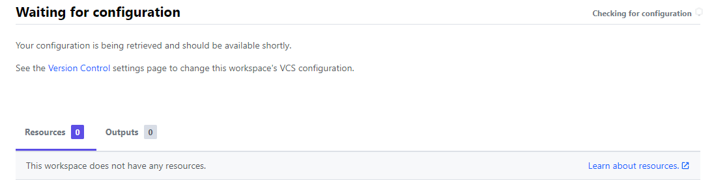
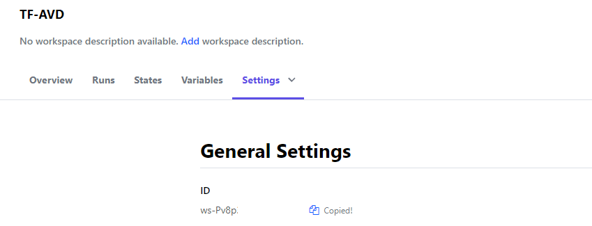

In this article, I explain a way how to manage Windows Updates for Azure Virtual Desktop (AVD). To achieve this goal I use update rings in Microsoft Intune. These update rings will be assigned to a dynamic Azure AD group. I also show how to create and assign this configuration automated with the use of PowerShell.



## Operation North-Star

This blog post is a part of Operation North-Star. What is operation “North-Star”?   
The main goal of operation “North-Star” is showing a way how to manage the modern workplace based on the North Star framework. Microsoft has released a framework for Microsoft Endpoint Management called ‘North Star’. This framework is designed to deploy, secure, optimize and manage Windows devices in the cloud.

For more information about this series please my blog about the North Star framework.

### General background info

In the picture below the red circles are in the scope of this part of the series. To get started I recommend start reading the kick-off blog about Operation North-Star.

[operation-northstar-updates](operation-northstar-updates.png)
## Device configuration

To manage Windows Updates on the AVD session host automated, we need to create and assign an Update Ring policy. But there is more. Updating machines is only one part of all. After the update, we also need to check the device’s health. And what about update delivery. You don’t want your network down because of Windows Updates. All these aspects are managed with device configuration in Microsoft Intune (MEM).

### odata types

To get started is good to know how device management works in MEM from an automation perspective. Actually, it all starts at the top of MEM. When looking at device policies, you may have noticed there are different kinds of policies. We have compliance- and configuration policies. And also update rings. In the portal, it all looks different.


However, looking closer to devices and policies, under the hood, they are all at the same place. These policies are requested by all the same REST API URL. This URL is *https://graph.microsoft.com/v1.0/deviceManagement/deviceConfigurations*. When requesting that URL I got all policies and update rings in one request.   
So, how is it possible to create different policies with the same REST API URL?

Well, that’s the moment where the @odata.type value is popping up. I requested all the policies and selected the display name and the @odata.type. As you can see the types are different. Based on these types you are able to configure the correct policy.   
In case of creating an Update Ring policy automated, we need the **\#microsoft.graph.windowsUpdateForBusinessConfiguration** type.


Now we know the correct data type we can look closer into policies. Also there we have to deal with different data types. In the basics, they all look the same with different settings. However, policies do have conditional settings. This means some settings are only available if you select a specific option. Knowing these differences helps you a lot in configuring them the automated way.

### @odata examples

To clarify, I created two in basics the same update rings. Based on those two policies I show you the difference. The difference between those rings is the automatic update behavior. ,

First, I created an update ring policy configured with automatic installation of updates. Also, it has a restart moment on any day at 03:00 AM in the morning.


Second, I created an update ring policy configured with auto-install at maintenance time. I configured this time between 8 AM and 5 PM.


As you can see these settings differ at the @odata.type.

## Deploy MEM configuration profiles automated

In the upcoming paragraphs, I show how to deploy configuration profiles automated in MEM. With odata.types in mind, I will configure a Windows Update Ring. And a policy for Delivery Optimization, and Desktop Analytics. All via the M365 REST API and the configuration profiles URL.

### Log in

To configure policies, we need to log in. As shown in the [operation briefing](https://www.rozemuller.com/manage-avd-automated-with-microsoft-endpoint-manager/), I created an application registration with the correct permissions. This is the first time we use the application. To log in I use the command below. After log-in, request a token for the Graph API. I also set the device configuration URL.

```powershell
$appId = ""
$appPss = ""
$sub = ""
$ten = ""
$PWord = ConvertTo-SecureString -String $appPss -AsPlainText -Force
$Credential = New-Object -TypeName "System.Management.Automation.PSCredential" -ArgumentList $appId,$Pword
Connect-AzAccount -Credential $Credential -Tenant $ten -Subscription $sub -ServicePrincipal
```

```powershell
$script:token = GetAuthToken -resource 'https://graph.microsoft.com' 
$script:deviceConfigurl = "https://graph.microsoft.com/beta/deviceManagement/deviceConfigurations"$script:token = GetAuthToken -resource 'https://graph.microsoft.com'
```

### Windows Update policy

These kinds of policies had a lot of options. It comes very precisely from the way how you create a policy automated. I have chosen to follow Microsoft’s default settings. Also within these policies, we have to deal with odata.types I stored all these settings in the configuration below.

I picked the auto-install at maintenance example from above. So you can see the whole configuration in its full glory.

```powershell
$updateRingBody = @{
    "@odata.type"                           = "#microsoft.graph.windowsUpdateForBusinessConfiguration"
    description                             = "This update policy is for AVD hosts only."
    displayName                             = "Update Ring - Azure Virtual Desktop"
    version                                 = 2
    deliveryOptimizationMode                = "httpOnly"
    prereleaseFeatures                      = "settingsOnly"
    automaticUpdateMode                     = "autoInstallAtMaintenanceTime"
    microsoftUpdateServiceAllowed           = $true
    driversExcluded                         = $true
    qualityUpdatesDeferralPeriodInDays      = 14
    featureUpdatesDeferralPeriodInDays      = 90
    qualityUpdatesPaused                    = $false
    featureUpdatesPaused                    = $false
    qualityUpdatesPauseExpiryDateTime       = (get-date).AddDays(7)
    featureUpdatesPauseExpiryDateTime       = (get-date).AddDays(14)
    businessReadyUpdatesOnly                = "businessReadyOnly"
    skipChecksBeforeRestart                 = $false
    featureUpdatesRollbackWindowInDays      = 60
    deadlineForFeatureUpdatesInDays         = 14
    deadlineForQualityUpdatesInDays         = 2
    deadlineGracePeriodInDays               = 1
    postponeRebootUntilAfterDeadline        = $false
    scheduleRestartWarningInHours           = 2
    scheduleImminentRestartWarningInMinutes = 15
    userPauseAccess                         = "disabled"
    userWindowsUpdateScanAccess             = "enabled"
    updateNotificationLevel                 = "defaultNotifications"
    installationSchedule                    = @{
        "@odata.type"    = "#microsoft.graph.windowsUpdateActiveHoursInstall"
        activeHoursStart = "08:00:00"
        activeHoursEnd   = "17:00:00"
    }
}
$postBody = $updateRingBody | ConvertTo-Json -Depth 3
$deployUpdateRing = Invoke-RestMethod -Uri $script:deviceConfigurl -Method POST -Headers $script:token -Body $postBody
```

[image-1](image-1.png)
In addition to the above please check the following URLs for more information about types.  
<https://docs.microsoft.com/en-us/graph/api/resources/intune-deviceconfig-windowsupdatescheduledinstall?view=graph-rest-1.0>  
<https://docs.microsoft.com/en-us/graph/api/resources/intune-deviceconfig-windowsupdateinstallscheduletype?view=graph-rest-1.0>

### Delivery Optimization Configuration

Now the Update Ring is set, it is time to manage the updates to endpoints. As said before, you don’t want to get your network down because of updates. You can use Delivery Optimization to reduce bandwidth consumption by sharing the work of downloading these packages among multiple devices in your deployment.

In the case of a few devices, it may be a bit overkill. But, adding this policy into your automation sequence won’t cost extra effort. In the end, in enterprise environments, it will save a lot of issues.

*Good to know is that Delivery Optimization is a cloud-managed solution. Access to the Delivery Optimization cloud services is a requirement. This means that in order to use the peer-to-peer functionality of Delivery Optimization, devices must have access to the internet.*

```powershell
$deliveryBody = @{
    "@odata.type" = "#microsoft.graph.windowsDeliveryOptimizationConfiguration"
    description = "This update policy is for AVD hosts only."
    displayName = "Delivery Optimization - Azure Virtual Desktop"
    version = 2
    deliveryOptimizationMode = "httpOnly"
    restrictPeerSelectionBy = "notConfigured"
    backgroundDownloadFromHttpDelayInSeconds = 60
    foregroundDownloadFromHttpDelayInSeconds = 60
    minimumRamAllowedToPeerInGigabytes = 4
    minimumDiskSizeAllowedToPeerInGigabytes = 32
    minimumFileSizeToCacheInMegabytes = 10
    minimumBatteryPercentageAllowedToUpload = 40
    maximumCacheAgeInDays = 7
    vpnPeerCaching = "notConfigured"
    cacheServerForegroundDownloadFallbackToHttpDelayInSeconds = 0
    cacheServerBackgroundDownloadFallbackToHttpDelayInSeconds = 0
    bandwidthMode = @{
        "@odata.type" = "#microsoft.graph.deliveryOptimizationBandwidthHoursWithPercentage"
        bandwidthBackgroundPercentageHours = @{
            bandwidthBeginBusinessHours = 8
            bandwidthEndBusinessHours = 17
            bandwidthPercentageDuringBusinessHours = 25
            bandwidthPercentageOutsideBusinessHours = 75
        }
    }
}

$deliveryPostBody = $deliveryBody | ConvertTo-Json -Depth 3
$deployDeliveryOptimization = Invoke-RestMethod -Uri $script:deviceConfigurl -Method POST -Headers $script:token -Body $deliveryPostBody
```

[image-2-2](image-2-2.png)
In addition to the paragraph above, check the URL with a great overview. <https://docs.microsoft.com/en-us/mem/intune/configuration/delivery-optimization-settings>

https://docs.microsoft.com/en-au/graph/api/resources/intune-deviceconfig-deliveryoptimizationbandwidthpercentage?view=graph-rest-beta

### Windows Health Monitoring

The last step is Windows health monitoring. Now the updates are deployed without network outage it is time to check if the updates are installed correctly. This is the moment where Windows health monitoring shows up. The Windows health monitor collects event data and provides recommendations to improve performance on your Windows devices.

```powershell
$windowsHealthBody = @{
    "@odata.type"                     = "#microsoft.graph.windowsHealthMonitoringConfiguration"
    description                       = "Shows the Windows Updates status"
    displayName                       = "Windows Health - Windows Updates"
    version                           = 1
    allowDeviceHealthMonitoring       = "enabled"
    configDeviceHealthMonitoringScope = "windowsUpdates"
}
$windowsHealthPostBody = $windowsHealthBody | ConvertTo-Json -Depth 3
$deployHealthMonitor = Invoke-RestMethod -Uri $script:deviceConfigurl -Method POST -Headers $script:token -Body $windowsHealthPostBody
```

[image-3](image-3.png)
For more information about Windows health monitoring, please check this URL: <https://docs.microsoft.com/en-us/mem/intune/configuration/windows-health-monitoring>

The complete Device Configuration Rest API type list is available at the following location: <https://docs.microsoft.com/en-us/graph/api/resources/intune-device-cfg-conceptual?view=graph-rest-1.0>

## Assignment

The last step to manage Windows Updates on an AVD host is to assign the policy. Because there are several ways to assign update policies to an object, let’s look at these options in detail. The highest level is users, groups, or devices. Because we are dealing with devices, we have two options left. Those options are groups and devices.  
In addition, in the case of a user assignment, the policy starts working at the point when a user signs in.

![image-14(image-14.png)
### Filters

As said we have two options which both will work. However, in the case of All Devices, we need to do some extra work. For a while, Microsoft came up with the filters option. Filters help you to narrow the assignment scope of a policy.

Using filters can help you with standards. It avoids creating (dynamic) groups for every special situation. Assign at every ‘device’-policy All Devices and enable the particular filter. I’m working on a piece of automation for creating and assigning filters.

To enable filters, go to Tenant Administration on the left, **click Filters (Preview)**. Click on the switch to enable it.


After enabling it the create filter option is available.

In the case of AVD, a filter could look like below. First, fill in a name and choose Windows 10 and later.

[image-17](image-17.png)
Second, choose the operatingSystemSKU property with the **Equals** operator.

[image-18](image-18.png)
Last select the **ServerRdsh (Windows 10 Enterprise Multi-Session)** value. This is the SKU for multi-session session hosts.

[image-19](image-19.png)
After creating the filter go to the created policy. Assign the policy to All Devices. You will notice a filter option is available. Select the correct filter.


In addition to filters check the following URL: <https://docs.microsoft.com/en-us/mem/intune/fundamentals/filters>

As mentioned, I’m working on filter automation. So for me now the only option left is the “Add groups. Because I let Microsoft do the job, I have chosen to create a dynamic group.

### Dynamic groups

The base of dynamic groups is that the group members are added dynamically. Based on the membership rule an object will be a member or not. Creating a dynamic group is based on the membership type.


In the body below it is an object which accepts two different types. These types are Unified or dynamicMemberShip.


### Membership rules

Dynamic groups depend on membership rules. If configured group types the body needs the memberShipRule. Otherwise, you will get an error like below.

```
{"error":{"code":"Request_BadRequest","message":"A value is required for property 'membershipRule'.","innerError":{"date":"2021-09-10T11:12:05","request-id":"cc8c3d81-686b-453a-9ad0-61e98ae8daf0","client-request-id":"cc8c3d81-686b-453a-9ad0-61e98ae8daf0"}}}
```

This is the point where I also need the Azure background. I’m still logged with the just created application (with Reader permissions on the subscription).   
I decided to fill the membership rule based on the computers OU with only AVD machines. To get this AVD machine I look at the machines which start with the AVD prefix.

I use the **Az.Avd** PowerShell module to get the AVD prefix. Running the Get-AvdHostpoolInfo will get all the hostpool information. From that information, I’m searching for the VM template information. This VM template stores all the information for current and future session hosts in a hostpool. However, this value is not mandatory I should suggest using this parameter.

For more information about the use of VM templates,[ please check my blog post about this subject](https://www.rozemuller.com/using-vm-templates-for-avd-sessionhost-automation/).

```powershell
$prefix = Get-AvdHostPool -HostpoolName AVD-Hostpool -ResourceGroupName rg-avd-demo-01
$namePrefix = $prefix.Properties.vmtemplate | ConvertFrom-Json
$membershipRules = '(device.organizationalUnit -contains "OU=Computers,DC=domain,DC=local") and (device.displayName -startsWith "'+$($namePrefix.namePrefix)+'")'
```

```powershell
$groupBody = @{
    description                        = "AVD - Session hosts"
    displayName                        = "AVD - Session hosts"
    groupTypes = @(
        "DynamicMemberShip"
    )
    mailEnabled = $false
    mailNickname = 'avdsh'
    isAssignableToRole = $false
    membershipRule = $membershipRules
    membershipRuleProcessingState = 'On'
    securityEnabled = $true
}
$group = @{
    method  = "POST"
    body = $groupBody | ConvertTo-Json -Depth 2
    uri     = "https://graph.microsoft.com/v1.0/groups"
    Headers = $script:token
}
$groupvalues = Invoke-RestMethod @group
```

After all, when PowerShell has deployed the group with the correct membership rules. Because I need this group later I stored the output into a variable.


For more info about groups check this URL: [https://docs.microsoft.com/en-us/graph/api/group-post-groups?view=graph-rest-1.0&amp;tabs=http](https://docs.microsoft.com/en-us/graph/api/group-post-groups?view=graph-rest-1.0&tabs=http)

### Assign

At last, this is the part where the puzzle completes. Now we put all the pieces together. The first needed piece is the $groupValues parameter.


Second is the update ring deployment output.


To assign the correct group to the update ring use the PowerShell below. You may have noticed I stored every deployment into a variable.

```powershell
$deployUpdateRing = Invoke-RestMethod -Uri $script:deviceConfigurl -Method POST -Headers $script:token -Body $postBody

$deployDeliveryOptimization = Invoke-RestMethod -Uri $script:deviceConfigurl -Method POST -Headers $script:token -Body $deliveryPostBody

$deployHealthMonitor = Invoke-RestMethod -Uri $script:deviceConfigurl -Method POST -Headers $script:token -Body $windowsHealthPostBody
```

And that’s for a reason. Every deployment returns the deployment outcome. This means the policy values including an ID. That’s the ID I need for the assignment code below. Check the URI in the assignParameters where the $deployUpdateRing variable is used to get the ID.

```powershell
$assignBody = @{
    "@odata.type" = "#microsoft.graph.deviceConfigurationAssignment"
    target        = @{
        "@odata.type" = "#microsoft.graph.groupAssignmentTarget"
        groupId  = $groupvalues.id
    }
}
$assignParameters = @{
    method  = "POST"
    uri     = "https://graph.microsoft.com/v1.0/deviceManagement/deviceConfigurations/$($<meta charset="utf-8"></meta>deployUpdateRing.id)/assignments"
    Headers = $GraphHeader
    body = $assignBody | ConvertTo-Json
}
$assignValues = Invoke-RestMethod @assignParameters
```

[assignment-1](assignment-1.png)
Thank you for reading this blog on how to manage Windows Updates for AVD automated.   

