---

title: 'AVD Automation Cocktail – Deploy AVD with Terraform Cloud'
date: '2021-10-27T10:41:34+02:00'
author: 'Sander Rozemuller'
image: cocktail-bar-automation-avd-bloody-harry.png
url: avd-automation-cocktail-avd-automated-with-terraform-cloud
categories:
    - 'AVD Cocktail'
    - Azure
    - 'Azure Virtual Desktop'
tags:
    - Automation
    - Azure Virtual Desktop
    - Cloud
    - Cocktail
    - HashiCorp
    - Monitoring
    - PowerShell
    - Terraform
---

Welcome (back) to the AVD Automation Cocktail. In the past [cocktail series](https://www.rozemuller.com/avd-automation-cocktail-the-menu), I showed different AVD deployment strategies and languages. During the time I got some requests about automation with Terraform. In this cocktail, The Dutch Bloody Harry, I’ll show you how to deploy an AVD environment automated with Terraform Cloud and Github. I’m using the Terraform cloud combined with my GitHub repository.



## Recipe

In this “BloodyHarry”-deployment recipe I will deploy an AVD environment automated with Terraform Cloud. This recipe slightly differs from the other cocktails. The biggest difference is the way of deployment. First, I create an initial virtual machine to use as the image version’s source.  
Once the machine is generalized, I deploy a network and shared image gallery (with the initial version). At last the AVD environment. Within the AVD environment, I deploy diagnostics on Log Analytics. At last, the All Users group is assigned to the application group.

### Before to drink

To begin with this cocktail, it is good to know something about the background. In the picture below I have drawn a high-level schema about the situation. Assuming you already have an Azure tenant with an active subscription. Make sure you have a [GitHub](https://www.github.com) account with a repository.

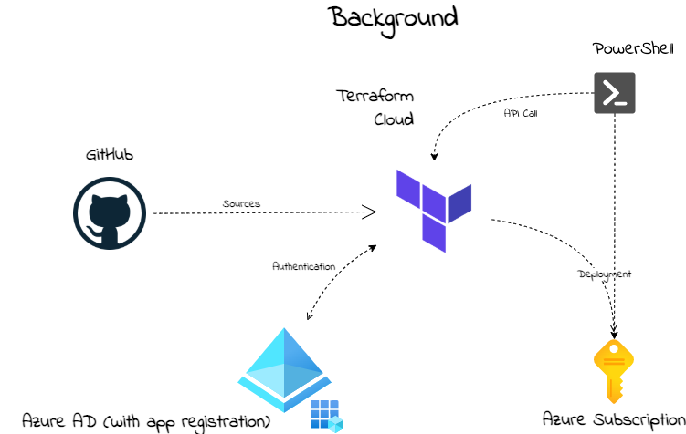

### List of Terraform ingredients

These are the main ingredients of this cocktail.

- <https://www.terraform.io/docs/cloud/workspaces/variables.html#managing-variables-in-the-ui>
- [https://registry.terraform.io/providers/hashicorp/azurerm/latest/docs/resources/virtual\_machine#identity](https://registry.terraform.io/providers/hashicorp/azurerm/latest/docs/resources/virtual_machine#identity)
- [https://registry.terraform.io/providers/hashicorp/azurerm/latest/docs/resources/virtual\_desktop\_host\_pool](https://registry.terraform.io/providers/hashicorp/azurerm/latest/docs/resources/virtual_desktop_host_pool)
- [https://registry.terraform.io/providers/hashicorp/azurerm/latest/docs/resources/shared\_image](https://registry.terraform.io/providers/hashicorp/azurerm/latest/docs/resources/shared_image)
- [https://registry.terraform.io/providers/hashicorp/azurerm/latest/docs/resources/windows\_virtual\_machine](https://registry.terraform.io/providers/hashicorp/azurerm/latest/docs/resources/windows_virtual_machine)

### Aftertaste

This cocktail reaches a sky-high level between two big clouds. It has a sweet taste of PowerShell with a strong Terraform taste on the side. In the end, you will have an AVD environment in Azure deployed with all the needed resources. These are a host pool, a workspace, an application group. Also, there are some session hosts. These hosts have an underlying image from a shared image gallery.

## Start with Terraform Cloud

In this chapter, I will explain how to start with Terraform Cloud. I also explain how to create a Terraform workspace and connect it to GitHub. I will recommend cloning my [AVD GitHub repository ](https://github.com/srozemuller/AVD)to get all the needed files, also for the other cocktails. The Terraform files are stored at this [location](https://github.com/srozemuller/TF-AVD)
First, we are going to set up a Terraform Cloud environment. In basics, Terraform Cloud looks a bit like Azure DevOps. We need an organization, connection to a tenant (in DevOps service connection) and, workbooks (in DevOps pipelines). One big difference between both is that Terraform is **<span style="text-decoration: underline;">only</span>** an infrastructure-as-a-code deployment platform. Where in Azure DevOps you also have the ability to run PowerShell tasks for example.

### Terraform Cloud organization

To use the Terraform Cloud, we need an organization. Creating an organization is very simple. First, we need to create an account at <https://app.terraform.io/>. After login, at the top of the page, you are able to create a new organization.

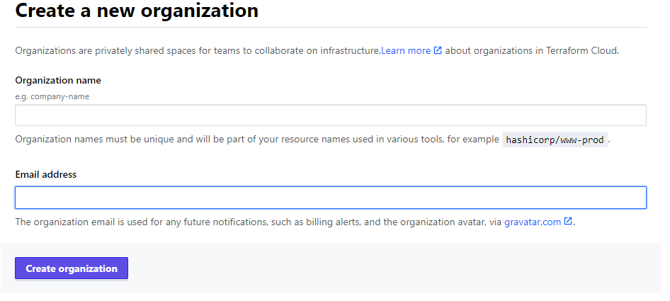
### Terraform Cloud Workspace

Before deploying to Azure, we need a workspace. Workspaces represent a collection of infrastructure resources. Each new workspace needs a unique name and needs to know where its Terraform configuration will come from. In this cocktail, I created a workspace to create an AVD infrastructure. When creating a workspace, the wizards ask where to find the configuration.

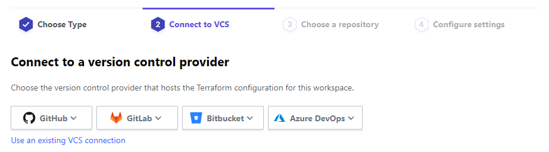
After choosing version control, several options appear. In my case I choose GitHub. In the case of GitHub, the wizard asks for the repository where the config is at. This can be every repository, private or public. In an empty repository, the workspace is waiting for a configuration.

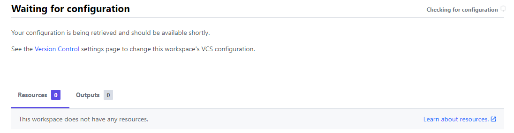
To provide a configuration, make sure you have a correct Terraform syntax file with the .tf or .terraform file extension in the GitHub repository. Use \*.auto.tfvars as a variable file. Finally, the workspace will notice the configuration and tells what is in it.

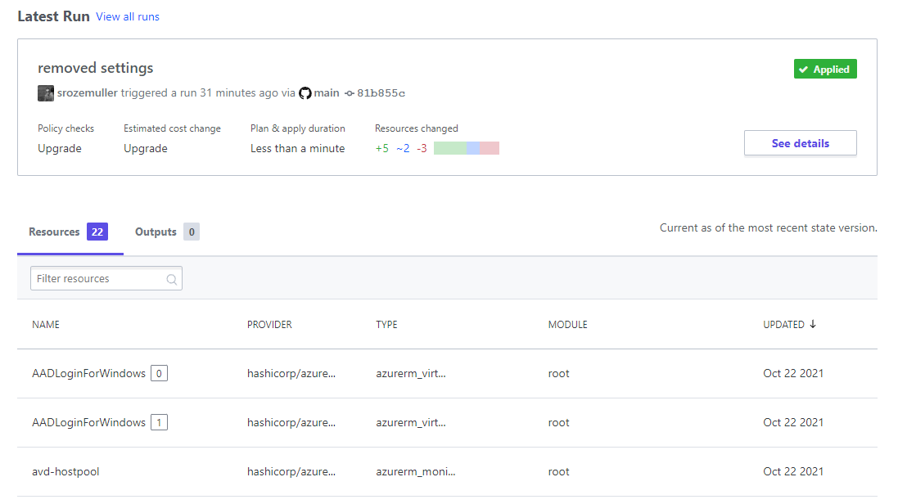
### Terraform Cloud Workspace Variables

Due to security reasons, it is not recommended to store provider credentials in a Terraform file. To connect to an Azure tenant, it is recommended to use environment variables. Every cloud provider has its own variable names. Make sure you find the correct names. Setting these correct names as a variable allows Terraform to pick up the correct values. In the case of Azure, I need the following variable names.

- ARM\_TENANT\_ID
- ARM\_SUBSCRIPTION\_ID
- ARM\_CLIENT\_ID
- ARM\_CLIENT\_SECRET

In the Terraform configuration file, you only need to set the correct provider.

```powershell
terraform {
  required_providers {
    azurerm = {
      source  = "hashicorp/azurerm"
      version = "=2.46.0"
    }
  }
}

# Configure the Microsoft Azure Provider
provider "azurerm" {
  features {}
}
```


For additional information about providers and variables, check the Terraform documentation.

<https://registry.terraform.io/providers/hashicorp/azurerm/latest/docs#argument-reference>  
<https://www.terraform.io/docs/cloud/workspaces/variables.html#managing-variables-in-the-ui>

### Terraform Cloud API

As mentioned earlier, Terraform is a deploy infrastructure-as-a-code platform. It is meant for deploying infrastructure resources in Azure. A thing that it does not have is the execution of scripts. To fill in that gap, I have chosen to start these workspaces with a REST API call. That allows me to run PowerShell additionally and, deploy resources with the use of Terraform.

In Terraform Cloud means that I need to create an API token. To get a token, go to User Settings -&gt; Tokens and create an API token.

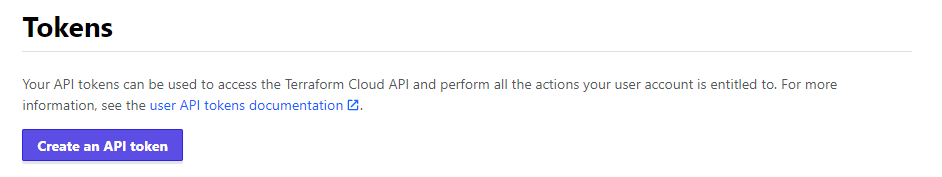
As a result, we have set up an organization, a workspace, and a token to get in remotely.

In addition, check the URL for more information: <https://www.terraform.io/docs/cloud/index.html>

### Terraform syntax

Before I start deploying resources it is good to know a bit about the syntax. At first sight, it looks very simple. In fact, it is very simple. Every configuration item is a separate code block. Within that block, we have attributes with values, like ```name = ‘hi\_my\_name\_is’```.  
Blocks can have different purposes. For resource deployment, we need a resource block. To get data out of a tenant, I need a data block. At last, if we need to connect to an Azure tenant, the provider block is needed.

Besides the block proposal, every block has its own unique name. After a deployment or data query, the output is assigned to that name. In fact, a block name is like using a PowerShell variable to store the output. ```powershell $hostpool = New-AvdHostpool -xx```, for example.

[image-37](image-37.png)
*<span class="has-inline-color has-luminous-vivid-amber-color">Suggestion: Use the VSCode Terraform extension. It helps you with providing the correct options.</span>*

For more about Terraform syntax check the documentation: <https://www.terraform.io/docs/language/syntax/configuration.html>

## Deploying Azure resources with Terraform Cloud

This sequence is different from other cocktails. Because there is no option running PowerShell within a Terraform deployment, I create an image version first. Whereafter I deploy the rest of the AVD resources. Because I need two workspaces I create two GitHub repositories. Both fed from those repositories. Another thing is the use of variables. I created three files. Firstly a config file, and a variable file. At last, the third file, I have a x.auto.tfvars file. In this file, all the values are stored. The main idea is only to change the variable file in case of a new deployment.

<div class="wp-block-image"><figure class="aligncenter size-full">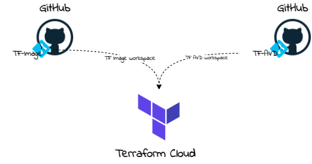
</div>### Authentication

Before deploying resources with Terraform, we need a tenant login. Also, we need the correct permissions at the subscription level. At first, we need an application registration in the Azure tenant. The application needs custom role permissions at the subscription level. Also, this application need group read API permissions for assigning roles.   
<https://registry.terraform.io/providers/hashicorp/azuread/latest/docs/data-sources/group#api-permissions>

The minimal API needed permissions are:

- Directory.Read.All or Group.Read.All

For creating an application registration automated I used PowerShell. The application has a custom role at the subscription level. I copied the contributor role and added the <meta charset="utf-8"></meta>“Microsoft.Authorization/\*/Write” action. Actually, I removed the write rule from the notActions. Only a subscription owner has these permissions. Due to security reasons, I created a Contributor Plus role. It is almost the same but then also with Authorization Write permissions.

<mark>The application also has Group.ReadWrite.All permissions for reading groups via Terraform.</mark>

The code which is I used is altogether stored in my [GitHub repository](https://github.com/srozemuller/TF-AVD/blob/main/app-registration.ps1).

Suggestion: Make sure you first connect to Azure with Connect-AzAccount.

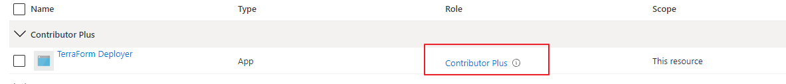
### Create initial VM for image

Before creating resources with Terraform Cloud, I first created a virtual machine that is sysprepped and generalized. First I create a virtual machine with Terraform. Thereafter I ran a PowerShell command which will Sysprep the machine and generalize it. In the next Terraform workspace, I pick up that machine to create an image version.

<div class="wp-block-image"><figure class="aligncenter size-full">
</div>To start the initial VM workspace in Terraform, I used the following commands. I would suggest using the auto-apply value (default false). The auto-apply takes care of starting the workbook without user interaction. Besides the token, you also need a workspaceId. To find the workspaceId, check the workspace general settings.

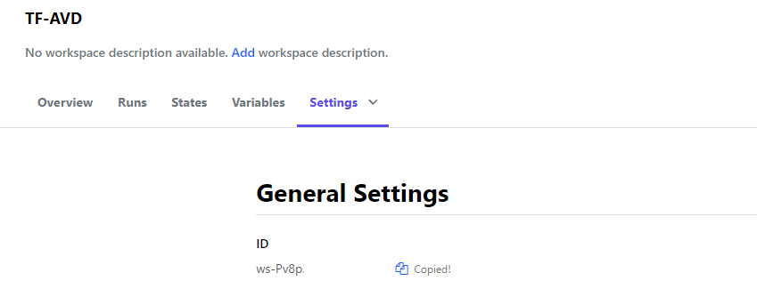
```powershell
$token = "YZLao5Pt6FM6gw.xxxxx"
$workspaceId = "ws-Pv8p"
$body = @{
    data = @{
        attributes    = @{
            message      = "From PowerShell"
            "auto-apply" = $true
        }
        type          = "runs"
        relationships = @{
            workspace = @{
                data = @{
                    type = "workspaces"
                    id   = $workspaceId
                }
            }
        }
    }
}
$jsonBody = $body | ConvertTo-Json -Depth 5
$header = @{
    Authorization  = "Bearer $token"
    "Content-Type" = "application/vnd.api+json"
}
$parameters = @{
    header = $header
    method = "POST"
    body   = $jsonBody
}
$url = "https://app.terraform.io/api/v2/runs"
Invoke-RestMethod -Uri $url @parameters
```


The Terraform configuration files are stored in my [TF-Image GitHub repository](https://github.com/srozemuller/TF-Image).

After the VM is deployed with Terraform, I use PowerShell. The commands I used to run a Sysprep and generalize the VM are below.

```powershell
$vmName = 'vm-init'
$vm = get-azvm -name $vmName  -Status
$vm | Invoke-AzVMRunCommand -CommandId "RunPowerShellScript" -ScriptPath .\sysprep.ps1
do {
  $vm = get-azvm -name $vmName -Status
  Write-Host $vm.Status
}
while($vm.PowerState -ne 'VM stopped')
$vm | Set-AzVm -Generalized
```

### Resource Group

As soon as the image is created, it is time to start the rest of the sequence. This is the part where we need the TF-AVD workspace. Before deploying anything we need to log in and create a new resource group. In the variable file, the content looks like below.

```powershell
variable "avd_rg_name" {
  type        = string
  description = "This is the AVD resource group"
}

variable "avd_rg_location" {
  type        = string
  description = "This is the AVD resource groups location"
}
```

The values are stored in the ```\*.auto.tfvars``` file and speaks for itself.

```powershell
# In this file all variable values are stored.
# Initial Image settings
init_vm_name = "vm-init"
init_rg_name = "rg-temp-init"
```

At last, the config file.

```powershell
resource "azurerm_resource_group" "rg-avd" {
  name     = var.avd_rg_name
  location = var.avd_rg_location
}
```

### Networking

Networking is a good resource, to begin with. In this step, a new virtual network with a default subnet is deployed. Thereafter a Network Security Group is deployed.

```json

# Variable part
variable "vnet_name" {
  type        = string
  default     = "vnet-roz-bh-001"
}
variable "vnet_nsg_name" {
  type        = string
  default     = "nsg-roz-bh-001"
}

variable "vnet_address_space" {
  type        = list
  default     = ["10.0.0.0/16"]
}

# Configuration part
resource "azurerm_virtual_network" "vnet" {
  name                = var.vnet_name
  location            = azurerm_resource_group.rg-avd.location
  resource_group_name = azurerm_resource_group.rg-avd.name
  address_space       = var.vnet_address_space
  tags = {
    environment = "Terraform test"
  }
}

resource "azurerm_subnet" "defaultSubnet" {
  name           = "defaultSubnet"
  resource_group_name = azurerm_resource_group.rg-avd.name
  virtual_network_name = azurerm_virtual_network.vnet.name
  address_prefixes = ["10.0.1.0/24"]
}

resource "azurerm_network_security_group" "nsg" {
  name                = var.vnet_nsg_name
  location            = azurerm_resource_group.rg-avd.location
  resource_group_name = azurerm_resource_group.rg-avd.name
  security_rule {
    name                       = "allow-rdp"
    priority                   = 100
    direction                  = "Inbound"
    access                     = "Allow"
    protocol                   = "Tcp"
    source_port_range          = "*"
    destination_port_range     = 3389
    source_address_prefix      = "*"
    destination_address_prefix = "*"
  }
}

resource "azurerm_subnet_network_security_group_association" "nsg_association" {
  subnet_id                 = azurerm_subnet.defaultSubnet.id
  network_security_group_id = azurerm_network_security_group.nsg.id
}
```

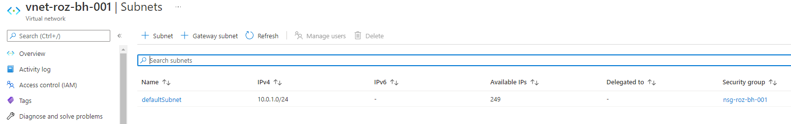
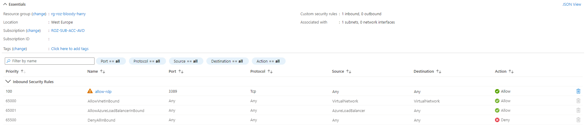
### Shared Image Gallery

In fact, the Shared Image Gallery actually consists of three resource types. The gallery, an image definition, and an image version. In the config below I deploy these three at once. Because most resources are quite simple I like to point to the image version.   
The image version depends on the earlier created virtual machine (in the TF-Image workspace). In this workspace, I look at the data block for the initial VM. The data output is used as an input variable in the resource block.

The whole config is stored altogether in the [TF-AVD GitHub repository](https://github.com/srozemuller/TF-AVD). As you may know, an image version can have different sources. It could be a virtual machine, disk, or a snapshot. In the beginning, I deploy an initial virtual machine. Whereafter the virtual machine is sysprepped and generalized. As a result of generalizing, it is time to use the vm as an image source.

To search for resources without deploying them, we need the Terraform data module. To clarify, I stored a snippet below. I search for an Azure resource-type virtual machine. I also search for the resource with a specific name in a specific resource group. The last two values are stored as a variable in the variables file. As a result of the data module, I got VM resource ID. The resource ID is used in the managed\_image\_id value.

```powershell
data "azurerm_resources" "initVM" {
  type = "Microsoft.Compute/virtualMachines"
  name = var.init_vm_name
  resource_group_name = var.init_rg_name
}

resource "azurerm_shared_image_version" "sig_version" {
  name                = formatdate("YYYY.MM.DD", timestamp())
  gallery_name        = azurerm_shared_image_gallery.sig.name
  image_name          = azurerm_shared_image.sig_def.name
  resource_group_name = azurerm_shared_image.sig_def.resource_group_name
  location            = azurerm_shared_image.sig_def.location
  managed_image_id    = data.azurerm_resources.initVM.resources[0].id
  
  target_region {
    name                   = azurerm_shared_image_gallery.sig.location
    regional_replica_count = 5
    storage_account_type   = "Standard_LRS"
  }
}
```

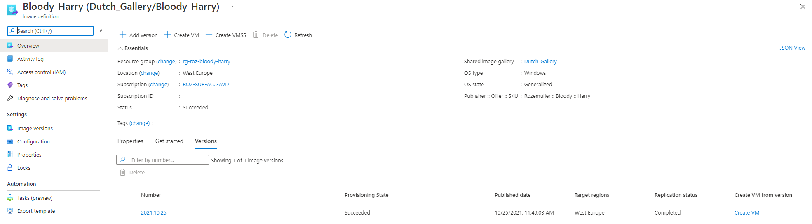
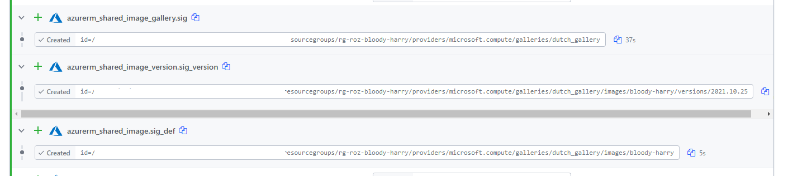
## Deploy AVD with Terraform

At last, it is time to deploy the Azure Virtual Desktop environment. I’m deploying a host pool, an application group, and a workspace. I have chosen to use Azure AD joined session hosts. Because of Azure AD join, we need extra settings. In the next paragraph, I clarify these settings.

### AVD Azure AD join Automated

Firstly, I deploy a hostpool by adding an extra RDP property to the host pool custom RDP properties, **<span style="text-decoration: underline;">targetisaadjoined:i:1</span>**. The host pool also needs the validation environment set. I also set the registration token with the timeAdd function.

```powershell
resource "azurerm_virtual_desktop_host_pool" "avd-hp" {
  location            = azurerm_resource_group.rg-avd.location
  resource_group_name = azurerm_resource_group.rg-avd.name

  name                     = var.avd_hostpool_name
  friendly_name            = var.avd_hostpool_friendly_name
  validate_environment     = true
  start_vm_on_connect      = true
  custom_rdp_properties    = "audiocapturemode:i:1;audiomode:i:0;targetisaadjoined:i:1;"
  description              = var.avd_hostpool_description
  type                     = var.avd_hostpool_type
  maximum_sessions_allowed = 1
  load_balancer_type       = "Persistent"
  personal_desktop_assignment_type = "Automatic"
  registration_info {
    expiration_date = timeadd(timestamp(), "24h")
  }
}
```

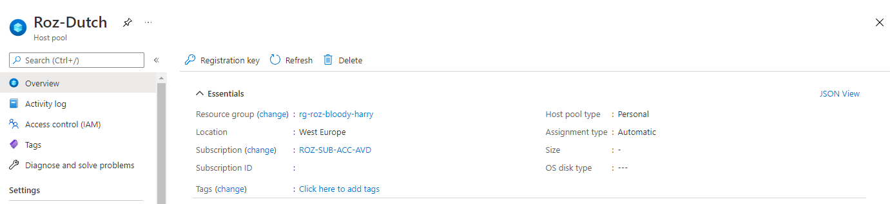
Secondly, we need to assign a Virtual Machine User Login or Virtual Machine Administrator Login role. This role should be assigned at the resource, resource group, or subscription level. For now, I choose the resource group scope. I use the All Users AD group for example.

```powershell
data "azuread_group" "aad_group" {
  display_name = var.aad_group_name
  security_enabled = true
}
data "azurerm_role_definition" "vm_user_login" {
  name = "Virtual Machine User Login"
}
resource "azurerm_role_assignment" "vm_user_role" {
  scope              = azurerm_resource_group.rg-avd.id
  role_definition_id = data.azurerm_role_definition.vm_user_login.id
  principal_id       = data.azuread_group.aad_group.id
}
```

Now we have the correct Id’s it is time to assign the role to the resource group for All Users

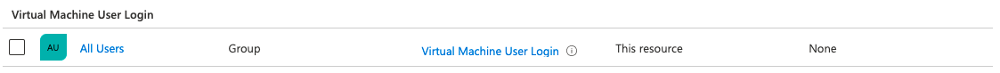
At last, we need to install the correct VM extension. I will discuss that point later in the session host deployment.

In addition to Azure AD join, check the Microsoft docs for more information: <https://docs.microsoft.com/en-us/azure/virtual-desktop/deploy-azure-ad-joined-vm>

### Hostpool

To begin with AVD, we need a hostpool first. Besides the well-known parameters, I like to shine a light on the registration info. To illustrate, I create a new registration token for two hours from now.

```powershell
resource "azurerm_virtual_desktop_host_pool" "avd-hp" {
  location            = azurerm_resource_group.rg-avd.location
  resource_group_name = azurerm_resource_group.rg-avd.name

  name                     = var.avd_hostpool_name
  friendly_name            = var.avd_hostpool_friendly_name
  validate_environment     = true
  start_vm_on_connect      = true
  custom_rdp_properties    = "audiocapturemode:i:1;audiomode:i:0;targetisaadjoined:i:1;"
  description              = var.avd_hostpool_description
  type                     = var.avd_hostpool_type
  maximum_sessions_allowed = 1
  load_balancer_type       = "Persistent"
  personal_desktop_assignment_type = "Automatic"
  registration_info {
    expiration_date = timeadd(timestamp(), "2h")
  }
}
```
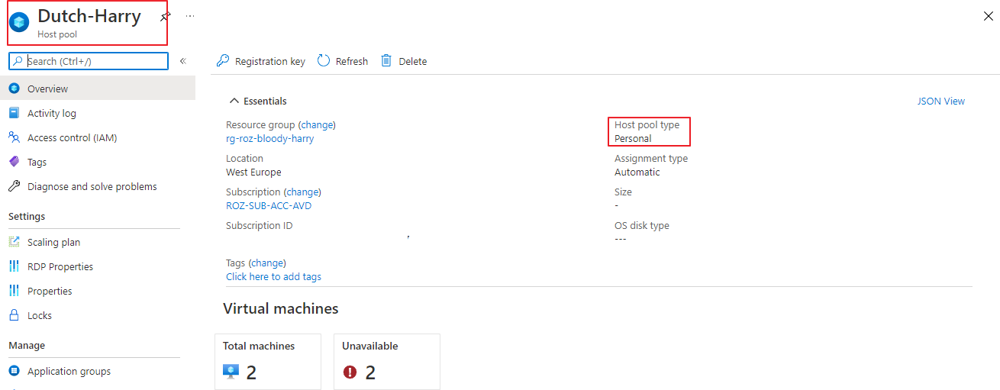
### Application group

Secondly, we need an application group. I used the code below to deploy the application group. The application group is the place where to assign users/groups to the AVD environment.

```powershell
resource "azurerm_virtual_desktop_application_group" "desktopapp" {
  name                = var.avd_applicationgroup_name
  location            = azurerm_resource_group.rg-avd.location
  resource_group_name = azurerm_resource_group.rg-avd.name
  type          = var.avd_applicationgroup_type
  host_pool_id  = azurerm_virtual_desktop_host_pool.avd-hp.id
  friendly_name = var.avd_applicationgroup_friendly_name
  description   = var.avd_applicationgroup_description
}
```

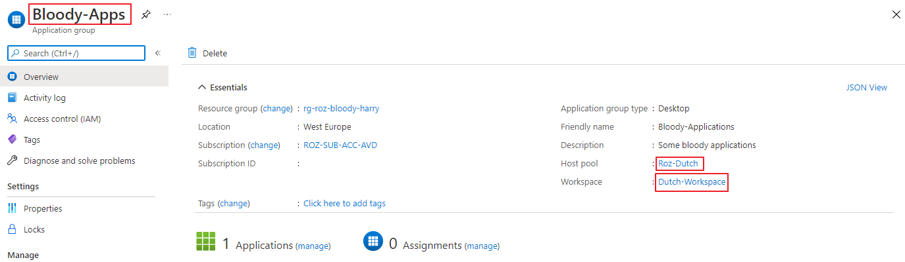
### Workspace

At last, we have the workspace. This is the place where people authenticate and subscribe at. I’m also referring to the application output. The result of that output is used to create a workspace name.

```powershell
resource "azurerm_virtual_desktop_workspace" "workspace" {
  name                = var.avd_workspace_name
  location            = azurerm_resource_group.rg-avd.location
  resource_group_name = azurerm_resource_group.rg-avd.name
  friendly_name = var.avd_workspace_friendly_name
  description   = var.avd_workspace_description
}

resource "azurerm_virtual_desktop_workspace_application_group_association" "workspaceremoteapp" {
  workspace_id         = azurerm_virtual_desktop_workspace.workspace.id
  application_group_id = azurerm_virtual_desktop_application_group.desktopapp.id
}
```

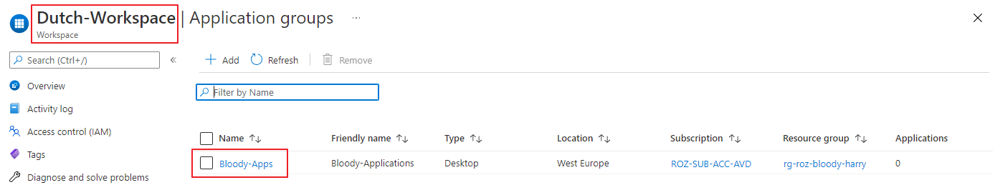
### Monitoring

As for every environment, we also like to monitor this environment. To monitor this environment we are going to use Log Analytics. Log Analytics workspaces names are unique. Because of that, I used the random\_integer module to create a random number.

```powershell
resource "random_integer" "random" {
  min = 1
  max = 50000
}

resource "azurerm_log_analytics_workspace" "laws" {
  name                = "${var.laws_name-prefix}-${random_integer.random.result}"
  location            = azurerm_resource_group.rg-avd.location
  resource_group_name = azurerm_resource_group.rg-avd.name
  sku                 = "PerGB2018"
  retention_in_days   = 30
}
```

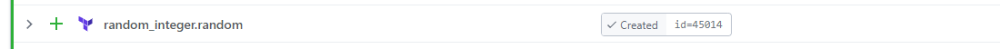
The random integer created a result 45014. This in combination with the name prefix I configured in the variable file makes it a unique name.

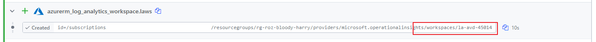
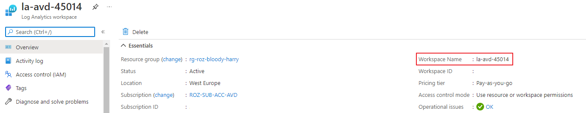
Next, we need to configure the diagnostic settings for the AVD host pool. In the command below I configure the error logs. The logs are sent to the just-created Log Analytics Workspace.

```powershell
resource "azurerm_monitor_diagnostic_setting" "avd-hostpool" {
  name               = "AVD - Diagnostics"
  target_resource_id = azurerm_virtual_desktop_host_pool.avd-hp.id
  log_analytics_workspace_id = azurerm_log_analytics_workspace.laws.id

  log {
    category = "Error"
    enabled  = true

    retention_policy {
      enabled = false
    }
  }
}
```

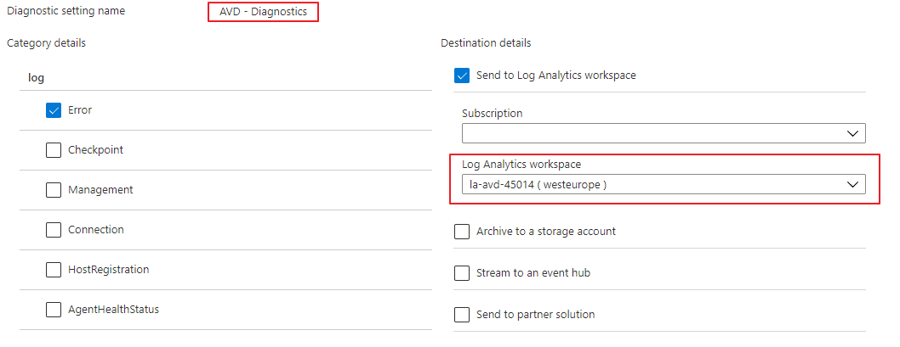
## Deploy AVD Session hosts with Terraform

Last is deploying the session hosts into the AVD hostpool with an Azure AD join. Also, deploy an AVD sessionhost is done with Terraform. I have chosen to join the AVD session hosts to Azure AD. To join Azure AD different settings must be set. The first thing to remember is the Desired State Config extension. The second thing which is different is the VM identity. A not AAD joined VM has no system assigned identity in the Azure AD.

### AVD Extension

The AVD module is a Desired State Config (DSC) extension. DSC is a management platform in PowerShell that enables you to ‘push’ configuration settings as code to a resource. In the case of AVD, means that the extension installs the AVD software with specific AVD environment settings. For example the registration token and the host pool name. Now AADJoin is part of the family a new module came up. This new module accepts the aadJoin parameter, which the native module does not.

If you install the native module with the AADJoin parameter you will get a message like below.

*(ArtifactNotFound) The VM extension with publisher ‘Microsoft.Azure.ActiveDirectory’ and type ‘ActiveDirectory’ could not be found.  
(VMExtensionProvisioningError) VM has reported a failure when processing extension ‘DSC’. Error message: “The DSC Extension received an incorrect input: A parameter cannot be found that matches parameter name ‘aadJoin’.*

After digging into the deployment I found the correct artifact URL.



To deploy the AVD DSC extension in Terraform I used the resource block below. Make the settings part in JSON string format. And, make sure the token is provided in the protected settings part. Otherwise will get this error:

***Error: Provider produced inconsistent final plan***

*When expanding the plan for azurerm\_virtual\_machine\_extension.AVDModule\[1\] to include new values learned so far during apply, provider “registry.terraform.io/hashicorp/azurerm” produced an invalid new value for .settings: inconsistent values for sensitive attribute. This is a bug in the provider, which should be reported in the provider’s own issue tracker.*

```powershell
resource "azurerm_virtual_machine_extension" "AADLoginForWindows" {
  count = var.avd_sessionhost_count
  depends_on = [
      azurerm_windows_virtual_machine.avd_sessionhost
  ]

  name                 = "AADLoginForWindows"
  virtual_machine_id   = "${azurerm_resource_group.rg-avd.id}/providers/Microsoft.Compute/virtualMachines/${var.avd_sessionhost_prefix}-${count.index}"
  publisher            = "Microsoft.Azure.ActiveDirectory"
  type                 = "AADLoginForWindows"
  type_handler_version = "1.0"
  settings = <<SETTINGS
    {
      "mdmId": "0000000a-0000-0000-c000-000000000000"
    }
SETTINGS
}
locals {
  registration_token = azurerm_virtual_desktop_host_pool.avd-hp.registration_info[0].token
}

resource "azurerm_virtual_machine_extension" "AVDModule" {
  count = var.avd_sessionhost_count
  depends_on = [
      azurerm_windows_virtual_machine.avd_sessionhost,
      azurerm_virtual_machine_extension.AADLoginForWindows
  ]

  name                 = "Microsoft.PowerShell.DSC"
  virtual_machine_id   = "${azurerm_resource_group.rg-avd.id}/providers/Microsoft.Compute/virtualMachines/${var.avd_sessionhost_prefix}-${count.index}"
  publisher            = "Microsoft.Powershell"
  type                 = "DSC"
  type_handler_version = "2.73"
  settings = <<SETTINGS
    {
        "modulesUrl": "https://wvdportalstorageblob.blob.core.windows.net/galleryartifacts/Configuration_6-1-2021.zip",
        "ConfigurationFunction": "Configuration.ps1\\AddSessionHost",
        "Properties" : {
          "hostPoolName" : "${azurerm_virtual_desktop_host_pool.avd-hp.name}",
          "aadJoin": true
        }
    }
SETTINGS
  protected_settings = <<PROTECTED_SETTINGS
  {
    "properties": {
      "registrationInfoToken": "${local.registration_token}"
    }
  }
PROTECTED_SETTINGS
}
```

### System identity

The next difference between a native domain joined VM is the resource identity.   
  
From Microsoft: **System-assigned** Some Azure services allow you to enable a managed identity directly on a service instance. When you enable a system-assigned managed identity, an identity is created in Azure AD that is tied to the lifecycle of that service instance. So when the resource is deleted, Azure automatically deletes the identity for you. By design, only that Azure resource can use this identity to request tokens from Azure AD.

Use the attribute below for assigning the system identity.

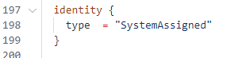
```powershell
  identity {
    type  = "SystemAssigned"
  }
```

In addition to this context please check the following URL for more information: <https://docs.microsoft.com/en-us/azure/active-directory/managed-identities-azure-resources/overview>

### Create session host

Now it is time to deploy AVD session hosts with Terraform. I decided to deploy two session hosts. This means we have to loop with Terraform. To loop with Terraform, I use the count function based on a variable.

```powershell
variable "avd_sessionhost_count" {
  type = number
  default = 2
  description = "Number of session host to deploy at first time"
}

```

You are able to use the count function in resource deployment.

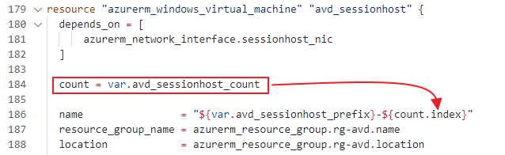
Based on the counter index, the code determines the session hosts number. As you can see, there is a dependence on the NIC. Within the network interface block, I’m doing the same trick. I create 2 NIC’s whereafter I attach them to a virtual machine. With virtual machine extensions, I also do the same trick.

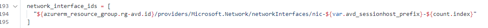
For the whole overview please check [my GitHub repository](https://github.com/srozemuller/TF-AVD) for all the files.

Finally, in the end, we have Azure AD Join session hosts.


I have the automated assignment of users to the application group under investigation.   
For now, everything is in place you only have to assign a user group to the application group and that’s it.

## Conclusion

Deploying AVD automated with Terraform Cloud was really fun. I haven’t used Terraform in the past. The first steps were a bit wonky but after walking a while, it was not that hard to get something running. I was very surprised about the deployment speed. Within minutes a whole environment came up.

A big advantage of the cloud environment is I don’t need to build a Terraform myself. The logging is quite well and clear in the overview.

For me, as a full automation guy, Terraform fill in my needs for around 80%. As mentioned at the top of this article, Terraform is an infrastructure-as-a-code platform. I also needed PowerShell to achieve my goal. For me, that was a reason to trigger workspaces with PowerShell as well.

In fact, this whole sequence is able to run with Azure DevOps for example.

## Thank you!

I hope you liked the Dutch Bloody Harry and got a bit inspired. Now you know how to deploy AVD automated with Terraform Cloud. If you like another cocktail feel free to stay and check the [AVD Automation Cocktail menu](https://www.rozemuller.com/avd-automation-cocktail-the-menu/).

Enjoy your day and happy automating 👋