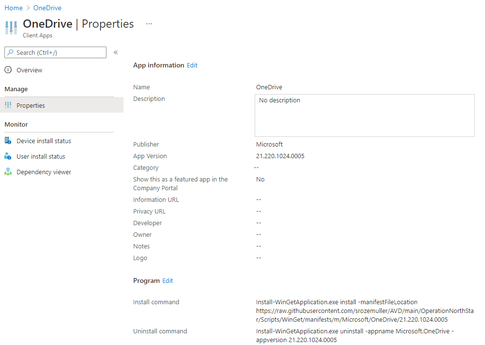
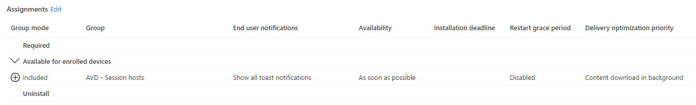
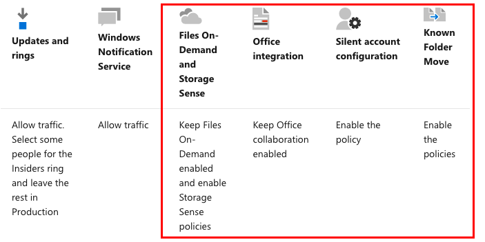
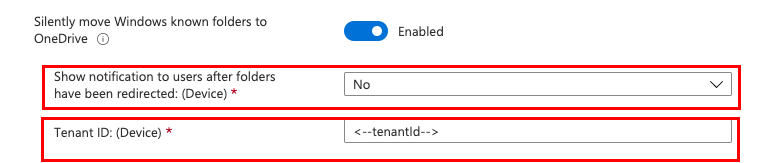
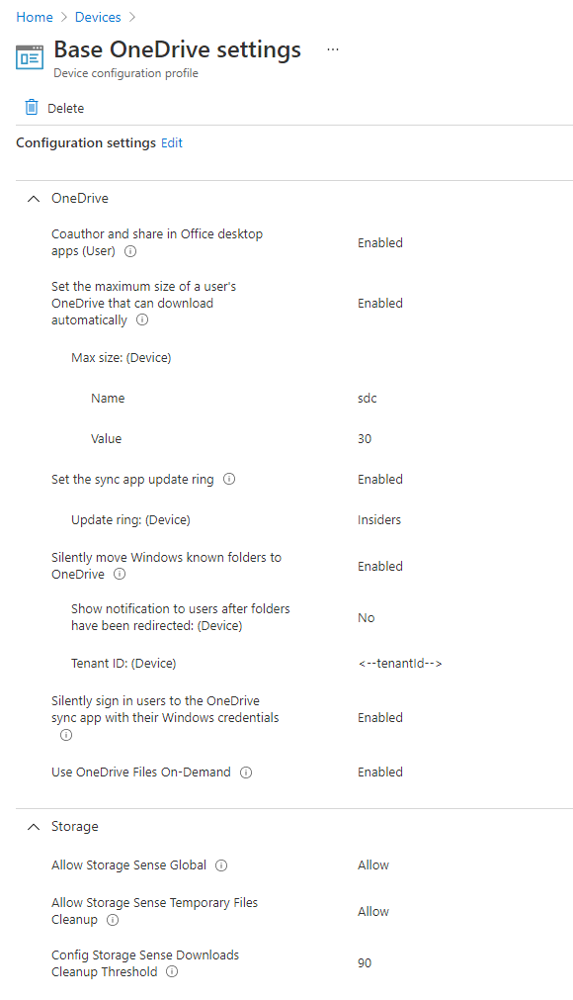

In this article, I explain how to distribute OneDrive with Microsoft Endpoint Managed based on Winget. After deploying OneDrive I configure a settings catalog configuration policy. This policy has all the OneDrive best practices. At last, a sync device is triggered.



## Operation North-Star

This blog post is a part of Operation North-Star within the Extend category. What is operation “North-Star”?   
The main goal of operation “North-Star” is to show a way how to manage the modern workplace based on the North Star framework. Microsoft has released a framework for Microsoft Endpoint Management called ‘North Star’. This framework is designed to deploy, secure, optimize and manage Windows devices in the cloud.

For more information about this series please my blog about the North Star framework.

### General background info

In the picture below the red circles are in the scope of this part of the series. Before starting, I recommend start reading the [kick-off blog about Operation North-Star](https://www.rozemuller.com/manage-avd-automated-with-microsoft-endpoint-manager).

<figure class="wp-block-image is-resized"></figure>## OneDrive

In the transition to the public cloud, OneDrive is very useful when migrating user data. OneDrive is a central place on the Microsoft cloud. It is accessible from anywhere and on any device. When logged in on these devices, data is synchronized to OneDrive. Using OneDrive also helps you keep away from local shared storage or removable storage.

In this paragraph, I show how to install and assign the OneDrive application to an AD group. Also, I show the OneDrive best practices and how to configure them in Mircosoft Endpoint Manager. Automated of course.

### Install application

A new way of installing applications is using the [Windows Package Manager](https://docs.microsoft.com/en-us/windows/package-manager/). Windows Package Manager is a CLI package installation tool, aka Winget. Winget is used for installing applications on Windows 10 and Windows 11. For installing OneDrive I also use this new way of application distribution.

To deploy OneDrive as a Win32 application in Microsoft Intune I used the commands below. I use the updated [IntuneWin32App PowerShell module](https://github.com/srozemuller/IntuneWin32App/tree/clientsecret-login-option) to log in with a service principal. Second, I created a PowerShell file. This file is used for configuring a Win32 application in MEM.

I created a manifest file and stored it in my repository.   
About the intunewinfile, I created a general executable that is used with any manifest file. So, I did not create a specific file for OneDrive only. At last, I run the PowerShell script with these parameters.

```powershell
Connect-MSIntuneGraph -TenantID $tenantId -ClientID $clientId -ClientSecret $clientSecret

$parameters = @{
    yamlfile = "https://raw.githubusercontent.com/srozemuller/AVD/main/OperationNorthStar/Scripts/WinGet/manifests/m/Microsoft/OneDrive/21.220.1024.0005/Microsoft.OneDrive.installer.yaml"
    IntuneWinfile = "C:\AVD\OperationNorthStar\Scripts\WinGet\Appinstaller\Install-WinGetApplication.intunewin"
    assignToGroupName = "AVD - Session hosts"
}
.\Deploy-Win32Apps.ps1 @parameters
```





In addition to this subject, check my blog post about [installing Winget applications in Microsoft Intune](https://www.rozemuller.com/install-winget-applications-using-microsoft-endpoint-manager/).

For more information about Windows Package Manager check the Microsoft Docs: <https://devblogs.microsoft.com/commandline/windows-package-manager-1-1/>

### OneDrive best practices

In this paragraph, the OneDrive best practices, or ideal state, will pass. These settings are for the best performance, reliability, and user experience. The main goal is to show which settings are configured. And, how to deploy OneDrive best practices automated.

To deploy settings, we need configuration policies (again).  
The needed settings are shown in the picture below within the red square.


I have chosen to deploy a policy based on the settings catalog. A settings catalog allows me to configure single settings. To deploy a settings catalog policy, you need the <meta charset="utf-8"></meta>/deviceManagement/configuationProfiles REST API URL. This is instead of <meta charset="utf-8"></meta>/deviceManagement/deviceConfiguration URL where update rings are configured for example.   
When requesting the configuration policy URL the policies are returned. But you will notice there are no settings in it.

```powershell
$script:PostPolurl = "https://graph.microsoft.com/beta/deviceManagement/configurationPolicies"
PS> (Invoke-RestMethod -Uri $script:PostPolurl -Method GET -Headers $script:token).value

createdDateTime      : 02-12-2021 19:21:44
creationSource       : 
description          : OneDrive Best Practices
lastModifiedDateTime : 02-12-2021 19:21:44
name                 : Base OneDrive settings
platforms            : windows10
roleScopeTagIds      : {0}
settingCount         : 9
technologies         : mdm
id                   : 7fe5f6e4-1378-4260-b11a-267057e5e3e3
templateReference    : @{templateId=; templateFamily=none; templateDisplayName=; templateDisplayVersion=}
```

To get the settings within the policy you need the request the policy settings based on the policy id (eg. <meta charset="utf-8"></meta>7fe5f6e4-1378-4260-b11a-267057e5e3e3). This with the /deviceManagement/configurationPolicies(‘policiyId’)/settings URL.   
In the request below I requested the OneDrive best practices policy. This policy has 9 settings. (as you can see in the output above at the settingCount).

```powershell
$script:deviceConfigurl = "https://graph.microsoft.com/beta/deviceManagement/configurationPolicies('7fe5f6e4-1378-4260-b11a-267057e5e3e3')/settings"
$script:token = GetAuthToken -resource 'https://graph.microsoft.com'
PS> (Invoke-RestMethod -Uri $script:deviceConfigurl -Method GET -Headers $script:token).value


id settingInstance
-- ---------------
0  @{@odata.type=#microsoft.graph.deviceManagementConfigurationChoiceSettingInstance; settingDefinitionId=user_vendor_msft_policy_config_onedrivengscv2~policy~onedrivengsc_enableallocsiclients; settingInstanceTemplateReference=; choiceSettingValue=}
1  @{@odata.type=#microsoft.graph.deviceManagementConfigurationChoiceSettingInstance; settingDefinitionId=device_vendor_msft_policy_config_onedrivengscv2~policy~onedrivengsc_diskspacecheckthresholdmb; settingInstanceTemplateReference=; choiceSettingValue=}
2  @{@odata.type=#microsoft.graph.deviceManagementConfigurationChoiceSettingInstance; settingDefinitionId=device_vendor_msft_policy_config_onedrivengscv2~policy~onedrivengsc_gposetupdatering; settingInstanceTemplateReference=; choiceSettingValue=}
3  @{@odata.type=#microsoft.graph.deviceManagementConfigurationChoiceSettingInstance; settingDefinitionId=device_vendor_msft_policy_config_onedrivengscv2~policy~onedrivengsc_kfmoptinnowizard; settingInstanceTemplateReference=; choiceSettingValue=}
4  @{@odata.type=#microsoft.graph.deviceManagementConfigurationChoiceSettingInstance; settingDefinitionId=device_vendor_msft_policy_config_onedrivengscv2~policy~onedrivengsc_silentaccountconfig; settingInstanceTemplateReference=; choiceSettingValue=}
5  @{@odata.type=#microsoft.graph.deviceManagementConfigurationChoiceSettingInstance; settingDefinitionId=device_vendor_msft_policy_config_onedrivengscv2~policy~onedrivengsc_filesondemandenabled; settingInstanceTemplateReference=; choiceSettingValue=}
6  @{@odata.type=#microsoft.graph.deviceManagementConfigurationChoiceSettingInstance; settingDefinitionId=device_vendor_msft_policy_config_storage_allowstoragesenseglobal; settingInstanceTemplateReference=; choiceSettingValue=}
7  @{@odata.type=#microsoft.graph.deviceManagementConfigurationChoiceSettingInstance; settingDefinitionId=device_vendor_msft_policy_config_storage_allowstoragesensetemporaryfilescleanup; settingInstanceTemplateReference=; choiceSettingValue=}
8  @{@odata.type=#microsoft.graph.deviceManagementConfigurationSimpleSettingInstance; settingDefinitionId=device_vendor_msft_policy_config_storage_configstoragesensedownloadscleanupthreshold; settingInstanceTemplateReference=; simpleSettingValue=}
```

A settings catalog policy consists of settings, called a setting instance. Every instance has child settings like the picture below. This picture represents one instance. A red box represents a child setting.



To clarify settingsInstances under the hood, I picked the setting which represents the info shown above in the red boxes. I picked value 3 and converted the info to JSON. Every setting has its own block. When looking [at the config file at my GitHub](https://github.com/srozemuller/AVD/blob/main/OperationNorthStar/Configurations/OneDrive/onedrive-settings.json) repo you will see the whole structure.

```powershell
$script:PostPolurl ="https://graph.microsoft.com/beta/deviceManagement/configurationPolicies('7fe5f6e4-1378-4260-b11a-267057e5e3e3')/settings"
$policy = Invoke-RestMethod -Uri $script:PostPolurl -Method GET -Headers $script:token 
$policy.value[3] | ConvertTo-Json -Depth 99

```

```json
{
  "id": "3",
  "settingInstance": {
    "@odata.type": "#microsoft.graph.deviceManagementConfigurationChoiceSettingInstance",
    "settingDefinitionId": "device_vendor_msft_policy_config_onedrivengscv2~policy~onedrivengsc_kfmoptinnowizard",
    "settingInstanceTemplateReference": null,
    "choiceSettingValue": {
      "settingValueTemplateReference": null,
      "value": "device_vendor_msft_policy_config_onedrivengscv2~policy~onedrivengsc_kfmoptinnowizard_1",
      "children": [
        {
          "@odata.type": "#microsoft.graph.deviceManagementConfigurationChoiceSettingInstance",
          "settingDefinitionId": "device_vendor_msft_policy_config_onedrivengscv2~policy~onedrivengsc_kfmoptinnowizard_kfmoptinnowizard_dropdown",
          "settingInstanceTemplateReference": null,
          "choiceSettingValue": {
            "settingValueTemplateReference": null,
            "value": "device_vendor_msft_policy_config_onedrivengscv2~policy~onedrivengsc_kfmoptinnowizard_kfmoptinnowizard_dropdown_0",
            "children": []
          }
        },
        {
          "@odata.type": "#microsoft.graph.deviceManagementConfigurationSimpleSettingInstance",
          "settingDefinitionId": "device_vendor_msft_policy_config_onedrivengscv2~policy~onedrivengsc_kfmoptinnowizard_kfmoptinnowizard_textbox",
          "settingInstanceTemplateReference": null,
          "simpleSettingValue": {
            "@odata.type": "#microsoft.graph.deviceManagementConfigurationStringSettingValue",
            "settingValueTemplateReference": null,
            "value": "<--tenantId-->"
          }
        }
      ]
    }
  }
}
```

### Deploy OneDrive best practices automated

Now we have our settings, let’s create the policy. First, I create a POST body with a name, description, platform, and technologies. The platform and technologies accept a fixed set of values. When reading the [docs about the request body](https://docs.microsoft.com/en-us/graph/api/intune-deviceconfigv2-devicemanagementconfigurationpolicy-create?view=graph-rest-beta#request-body), you will notice there is no settings parameter available. However, the URL is accepting this value. So, that allows me to put the OneDrive best practices settings into the policy directly. In my example, I created a OneDrive best practices configuration file. The file is used to input settings data.   
Because the file is JSON and my body is a PowerShell hashtable, I first revert the content back to PowerShell objects. Then, the POST body is converted to JSON.

```powershell
$policyBody = @{
    "@odata.type"  = "#microsoft.graph.deviceManagementConfigurationPolicy"
    "name"         = "Base OneDrive settings"
    "description"  = "Description value"
    "platforms"    = "windows10"
    "technologies" = "mdm"
    "settings"     = @( 
        Get-Content ./onedrive-settings.json | ConvertFrom-Json
    )
}
$jsonBody = $policyBody | ConvertTo-Json -Depth 99
$script:PostPolurl = "https://graph.microsoft.com/beta/deviceManagement/configurationPolicies"
$policy = Invoke-RestMethod -Uri $script:PostPolurl -Method POST -Headers $script:token -Body $jsonBody -ContentType 'Application/json'
$policy
```

At last, the policy is made successful.


### Image management

If you are deploying OneDrive and its policies within an image, make sure you take a note about the following.

SilentAccountConfig creates a SilentBusinessConfigCompleted registry entry once SilentAccountConfig has successfully provisioned the user in OneDrive.exe. This prevents SilentAccountConfig from reprovisioning the user in OneDrive.exe if the user manually stops syncing.

If SilentAccountConfig has successfully completed on a computer you’re going to use as your master for building a Windows deployment image (for example, SysPrep), you need to ensure this registry key is removed before you prepare your image. You can do so by running the following command:

```powershell
reg delete HKCU\Software\Microsoft\OneDrive /v SilentBusinessConfigCompleted /f
```

<https://docs.microsoft.com/en-us/onedrive/use-silent-account-configuration#windows-image-prep-requirements>

In addition to OneDrive and best practices check the docs: <https://docs.microsoft.com/en-us/onedrive/ideal-state-configuration.>

## Sync devices

In the end, the AVD hosts must be synchronized with MEM. By default, a Windows machine syncs every 8 hours. Because I don’t want to wait for 8 hours, I wrote a simple loop to sync every AVD session host. To find AVD session hosts I’m filtering the devices list on the SKU family. For the AVD session hosts, the SKU family is **EnterpriseMultisession**

```powershell
$script:devicesUrl = "https://graph.microsoft.com/beta/deviceManagement/managedDevices/"

$devices  = Invoke-RestMethod -Uri $script:devicesUrl -Method GET -Headers $script:token 
$devices.value | Where-Object {$_.skuFamily -eq 'EnterpriseMultisession'} | ForEach-Object {
    $devicesSyncUrl = "https://graph.microsoft.com/beta/deviceManagement/managedDevices/" + $_.id + "/syncDevice"
    Invoke-RestMethod -Uri $devicesSyncUrl -Method POST -Headers $script:token 
}
```

Thank you for reading this blog about installing OneDrive with OneDrive best practices in Microsoft Intune. 

