In this blog post, I explain how to configure FSLogix for Azure AD-joined machines automated. Also, I explain how to test the configuration and I rearranged the installation procedure in a more efficient way.

Microsoft [announced](https://techcommunity.microsoft.com/t5/azure-virtual-desktop-blog/announcing-public-preview-of-fslogix-profiles-for-azure-ad/ba-p/3019855) the public preview of FSLogix profiles support for Azure AD-joined VMs for Azure Virtual Desktop. The preview allows you to create an Azure Files share to store the FSLogix profiles and configure it to support Azure AD authentication.



## Before you start

### What is FSLogix

[FSLogix](https://docs.microsoft.com/en-us/fslogix/) is a set of solutions that enhance, enable, and simplify non-persistent Windows computing environments. FSLogix solutions are appropriate for virtual environments in both public and private clouds. For combining FSLogix with Azure Virtual Desktop as a desktop virtualization solution on Azure, I store profiles on Azure Files. In this blog post, I show how to configure Azure Files with Azure AD joined session hosts automated.

In addition, please check the documentation about FSLogix: <https://docs.microsoft.com/en-us/azure/architecture/example-scenario/wvd/windows-virtual-desktop-fslogix>

### Prerequisites

Before you start deploying FSLogix with Azure AD joined automated machines make sure you met the prerequisites below.

- Windows 10 or 11 Enterprise single or multi-session, versions 2004 or later with the latest cumulative updates installed, especially the [KB5007253 – 2021-11 Cumulative Update Preview for Windows 10](https://support.microsoft.com/topic/november-22-2021-kb5007253-os-builds-19041-1387-19042-1387-19043-1387-and-19044-1387-preview-d1847be9-46c1-49fc-bf56-1d469fc1b3af).
- Windows Server, version 2022 with the latest cumulative updates installed, especially the [KB5007254 – 2021-11 Cumulative Update Preview for Microsoft server operating system version 21H2](https://support.microsoft.com/topic/november-22-2021-kb5007254-os-build-20348-380-preview-9a960291-d62e-486a-adcc-6babe5ae6fc1).
- The user accounts must be hybrid identities. This means the user accounts are synchronized between the Active Directory and Azure AD with AD Sync.
- To assign Azure Role-Based Access Control (RBAC) permissions for the Azure file share to a user group, you must create the group in Active Directory and sync it to Azure AD.

Following my blog post there is also an important thing.

At some time you need to [assign permissions at the directory level](https://docs.microsoft.com/en-us/azure/virtual-desktop/create-profile-container-azure-ad#assign-directory-level-access-permissions). To prevent users from accessing the user profile of other users, you must also assign directory-level permissions. Microsoft provided a script to run on a local AD joined machine. When looking at the script closely it is only needed to gather some local domain information. So I decided to choose a different route.   
  
Using this route saves time, and you don’t have an extra login moment. Which is key in automation.

<span style="text-decoration: underline;">To use this route make sure you have an Azure virtual machine that is local-domain joined. </span>

### AVD Fslogix best practices

During the configuration, I kept the Azure Files best practices in mind.

<https://docs.microsoft.com/en-us/azure/architecture/example-scenario/wvd/windows-virtual-desktop-fslogix#azure-files-best-practices>

In the script, I use variables and snippets from a complete script. The complete [script is stored on my GitHub repository](https://github.com/srozemuller/AVD/tree/main/FsLogix).

### Script location

In the past, I got some questions about functions or commands which didn’t work in this blog post. To clarify. I use snippets in this post. All the needed scripts are stored on my GitHub. [You can check it over here](https://github.com/srozemuller/AVD/tree/main/FsLogix).

## Storage Account

FSLogix depends on storage. So at first, we will create a storage account and a file share. In the end, this file share is accessible from an Azure AD-joined sessionhost. This file share stores all the profiles. Before beginning, make sure you have installed and imported the Az.Storage PowerShell module.

```powershell
Install-Module Az.Storage
Import-Module Az.Storage
```

### Resource group

Now we have all the commands available, I create a new resource group first. In this resource group, I create the storage account. I store the resource group deployment output into a variable so I can use it later.

```powershell
$resourceGroupName = "RG-ROZ-STOR-01"
$location = "WestEurope"
$rgParameters = @{
    resourceGroupName = $resourceGroupName
    location = $location 
}
$resourceGroup = New-AzResourceGroup @rgParameters
```
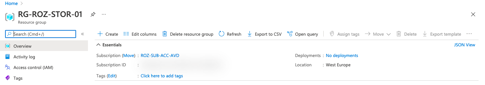

### Create a storage account and share

In this resource group, I create a storage account and a share. Because I need the storage account creation output in the next step, I save them out in a variable. Next, I’m able to pipe the information into the share creation. An FSlogix best practice is a storage account name with a max of 15 characters. Because of that, I use a random number of max 4 numbers. The name FSlogix with 4 numbers makes 11, so that is fine.

```powershell
$storageAccountParameters = @{
    Name = "fslogix$(Get-Random -max 10000)"
    SkuName = "Premium_LRS"
    Kind = "FileStorage"
}
$storageAccount = $resourceGroup | New-AzStorageAccount @storageAccountParameters
$storageAccount 
$saShareParameters = @{
    Name = "profiles"
    AccessTier = "Premium"
    QuotaGiB = 1024
}
$saShare =  $storageAccount | New-AzRMStorageShare @saShareParameters
$saShare
```

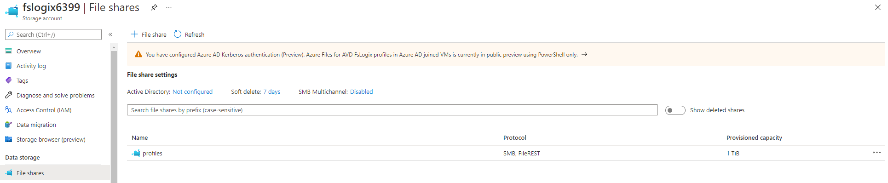

Why use New-AzRMStorageShare instead of New-AzStorageShare? First, because of its parameters. I’m not able to set a quota for example. Another point is the backend explained here: <https://github.com/MicrosoftDocs/azure-docs/issues/60129>.  
For more information about creating a file share on an Azure Storage Account, [check the documentation](https://docs.microsoft.com/en-us/azure/storage/files/storage-how-to-create-file-share?tabs=azure-powershell#create-a-file-share).

### Assign share permissions

In the next step, the correct permissions are set. There are 2 main permission levels, all authenticated identities or users & groups. Because of security reasons I choose users and groups. With the code below, I’m assigning a synced Active Directory group with a **Storage File Data SMB Share Contributor** role to the storage account. The role is a [build-in role with a fixed ID](https://docs.microsoft.com/en-us/azure/role-based-access-control/built-in-roles#storage-file-data-smb-share-contributor).

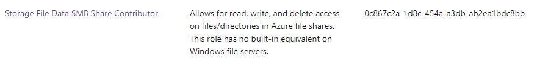
The principal ID is the group object ID gathered from my Azure AD.


```powershell
$guid = (new-guid).guid
$smbShareContributorRoleId = "0c867c2a-1d8c-454a-a3db-ab2ea1bdc8bb"
$roleDefinitionId = "/subscriptions/" + $(get-azcontext).Subscription.id + "/providers/Microsoft.Authorization/roleDefinitions/" + $smbShareContributorRoleId
$roleUrl = $script:AzureUrl + $storageAccount.id + "/providers/Microsoft.Authorization/roleAssignments/$($guid)?api-version=2018-07-01"
$roleBody = @{
    properties = @{
        roleDefinitionId = $roleDefinitionId
        principalId      = "f119eef3-fee6-44c6-a692-4d761eccaf7e" # AD Group ID
        scope            = $storageAccount.id
    }
}
$jsonRoleBody = $roleBody | ConvertTo-Json -Depth 6
Invoke-RestMethod -Uri $roleUrl -Method PUT -Body $jsonRoleBody -headers $script:AzureToken
```

***If you have an existing storage account, use  ```$storageAccount = Get-AzStorageAccount -Name xx -ResourceGroupname xx ``` to retrieve the resource’s ID.***

### Setting Azure AD authentication on the storage account

In this step, we enable the Azure AD authentication on the storage account. This option is only available through PowerShell. After executing this command, at the storage account, you will notice the following message in the portal.

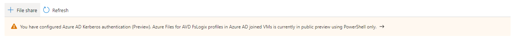

```powershell
$Uri = $script:AzureUrl + $storageAccount.id + "?api-version=2021-04-01"
$kerbBody = 
@{
    properties = @{
        azureFilesIdentityBasedAuthentication = @{
            directoryServiceOptions = "AADKERB"
        }
    }
}
$kerbJsonBody = $kerbBody | ConvertTo-Json -Depth 99
try {
    Invoke-RestMethod -Uri $Uri -ContentType 'application/json' -Method PATCH -Headers $script:AzureToken -Body $kerbJsonBody;
}
catch {
    Write-Host $_.Exception.ToString()
    Write-Error -Message "Caught exception setting Storage Account directoryServiceOptions=AADKERB: $_" -ErrorAction Stop
}
```

Next is configuring a new storage account key for Kerberos. This Kerberos key is a password shared between Azure AD and Azure Storage. Kerberos derives the password’s value from the first 32 bytes of the storage account’s kerb1 key. To set the password, run the cmdlets below. Also, this option is only available through PowerShell.

## Create an Azure AD application &amp; set permissions

The next big step in configuring FSlogix for Azure AD joined session hosts automated, is to create an Azure AD application. This application is needed to set permissions. Resources like VMs, users, groups, function apps, etc, have a system identity option. Storage accounts don’t have this option. This is the reason we need an Azure AD application. This application is representing the storage account in Azure AD.

To create an application I use the <span style="text-decoration: underline;">graph.windows.net</span> API. I know this API is deprecated but at the moment the only API which accepts the ‘strange’ storage account URLs. I spoke with the Microsoft API product team and they are going to fix this issue in the Graph API. This is the only part where I’m using this API.

In the code below I create an array with the identifier URI and also, the application API permissions.

- openid: 37f7f235-527c-4136-accd-4a02d197296e
- User.Read: e1fe6dd8-ba31-4d61-89e7-88639da4683d
- profile: 14dad69e-099b-42c9-810b-d002981feec1

In the end, I create the application at once.

```powershell
$identifierURIs = [System.Collections.Arraylist]::New()
$identifierURIs.Add('HTTP/{0}.file.core.windows.net' -f $storageAccount.StorageAccountName) | Out-Null
$identifierURIs.Add('CIFS/{0}.file.core.windows.net' -f $storageAccount.StorageAccountName) | Out-Null
$identifierURIs.Add('HOST/{0}.file.core.windows.net' -f $storageAccount.StorageAccountName) | Out-Null
$url = $script:graphWindowsUrl + "/" + $(get-azcontext).Tenant.Id + "/applications?api-version=1.6"
# assign permissions
$permissions = @{
    resourceAppId  = "00000003-0000-0000-c000-000000000000"
    resourceAccess = @(
        @{
            id   = "37f7f235-527c-4136-accd-4a02d197296e" #openid
            type = "Scope"
        },
        @{
            id   = "e1fe6dd8-ba31-4d61-89e7-88639da4683d" #User.Read
            type = "Scope"
        },
        @{
            id   = "14dad69e-099b-42c9-810b-d002981feec1" #profile
            type = "Scope"
        }
    )
}

$body = @{
    displayName            = $storageAccount.StorageAccountName
    GroupMembershipClaims  = "All"
    identifierUris         = $identifierURIs
    requiredResourceAccess = @(
        $permissions
    ) 
}
$postBody = $body | ConvertTo-Json -Depth 4
$application = Invoke-RestMethod -Uri $url -Method POST -Body $postBody -Headers $script:graphWindowsToken -UseBasicParsing
```

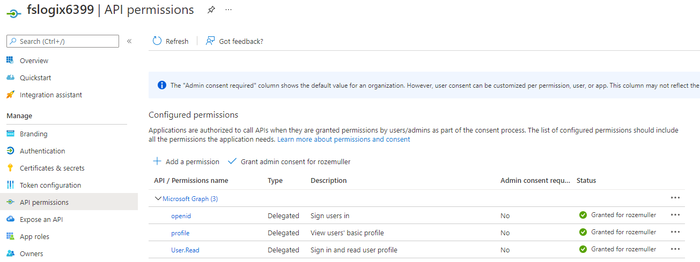

*Small note: the granted consent in this picture is set in the [<span style="text-decoration: underline;">next paragraph</span>](#create-sp-consent).*

## Create a service principal

To access resources in Azure, we need a service principal. In this next part, I’m creating a service principal based on the just-created application. To create the service principal based on an application, we need the application ID. Also, I’m providing the service principal application type. To simplify the steps, I also provide the storage account key.

### Create a storage account key

I’m creating an extra storage account key (besides the default key1 and key2) with the name kerb1. This is the password used for communication between the storage account and the service principal. After creating, I’m converting the storage account key to a service principal key and assigning it to the service principal.

```powershell
$keyName = "kerb1"
$storageAccount  | New-AzStorageAccountKey -KeyName $keyName -ErrorAction Stop 
# Assign password to service principal
$kerbKey1 =  $storageAccount | Get-AzStorageAccountKey -ListKerbKey | Where-Object { $_.KeyName -eq $keyName }
$aadPasswordBuffer = [System.Linq.Enumerable]::Take([System.Convert]::FromBase64String($kerbKey1.Value), 32);
$password = "kk:" + [System.Convert]::ToBase64String($aadPasswordBuffer);
```

As mentioned before, creating an extra access key is only available through PowerShell. In the portal, you only have key1 and key2.

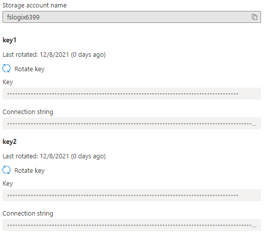

PowerShell output:

```powershell
$storageAccount | Get-AzStorageAccountKey -ListKerbKey
```

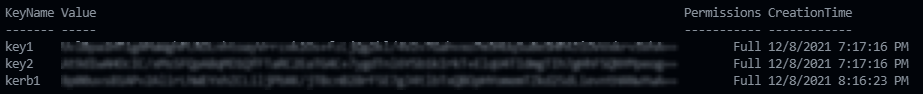

### Create service principal &amp; consent

Now we have an application and a storage account password. I provided these values into the body to create a service principal (aka Enterprise applications).

```powershell
$url = $Script:GraphApiUrl + "/Beta/servicePrincipals"
$body = @{
    appId                = $application.appId
    ServicePrincipalType = "Application"
}
$postBody = $body | ConvertTo-Json
$newSp = Invoke-RestMethod -Uri $url -Method POST -Body $postBody -Headers $script:graphApiToken
```

After the service principal is created, we can consent to API permissions at the application level.

At first, I’m looking for the GraphAggregatorService to get the correct object ID. Then I consent at the OpenID, User.Read and profile permissions (must be exactly named, is case sensitive) at the scope part.

```powershell
$url = $Script:GraphApiUrl + "/Beta/servicePrincipals?`$filter=appId eq '00000003-0000-0000-c000-000000000000'"
$graphAggregatorServiceObjectId = (Invoke-RestMethod -Uri $url -Headers $script:graphApiToken).Value.id
$date = Get-Date
$url = $($Script:GraphApiUrl) + "/Beta/oauth2PermissionGrants"
$body = @{
    clientId    = $newSp.id
    consentType = "AllPrincipals"
    principalId = $null
    resourceId  = $graphAggregatorServiceObjectId
    scope       = "openid User.Read profile"
    startTime   = $date
    expiryTime  = $date
}
$postBody = $body | ConvertTo-Json
Invoke-RestMethod -Uri $url -Method POST -Body $postBody -Headers $script:graphApiToken
```

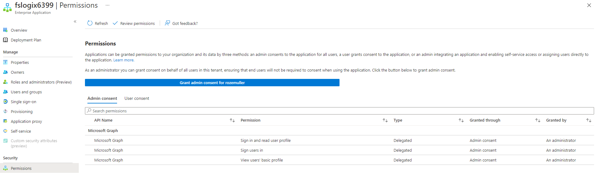</figure>

### Add storage account password

To add the storage account password, we need the graph.windows.net API again. This is because the password value field is read-only in the Graph API.

```powershell
$url = "https://graph.windows.net/" + $(get-azcontext).Tenant.id + "/servicePrincipals/" + $newSp.id + "?api-version=1.6"
$body = @{
    passwordCredentials = @(
        @{
            customKeyIdentifier = $null
            startDate           = [DateTime]::UtcNow.ToString("s")
            endDate             = [DateTime]::UtcNow.AddDays(365).ToString("s")
            value               = $password
        }
    )
}
$postBody = $body | ConvertTo-Json -Depth 6
Invoke-RestMethod -Uri $url -Method PATCH -Body $postBody -Headers $script:graphWindowsToken
```

## Assign directory permissions

In relation [to Microsoft](https://docs.microsoft.com/en-us/azure/virtual-desktop/create-profile-container-azure-ad#assign-directory-level-access-permissions), I managed to skip the local Active Directory part. With the script below you can request the needed information and configure the storage account in one single session. The main reason for me was to skip the login part at a local domain-joined machine. This is because I’m already logging in and only need the domain information.

The main idea is to grab the local domain information within my current session. To make this work, you need an Active Directory domain-joined Azure VM. Otherwise use the [script provided by Microsoft](https://docs.microsoft.com/en-us/azure/virtual-desktop/create-profile-container-azure-ad#assign-directory-level-access-permissions).

```powershell
$vm = Get-AzVM -name vmname -ResourceGroupName resourcegroup
$output = $vm | invoke-azvmruncommand -CommandId 'RunPowerShellScript' -ScriptPath 'local-domaininfo.ps1'
$domainGuid = ($output.Value[0].Message -replace '(?<!:.*):', '=' | ConvertFrom-StringData).domainGuid
$domainName = ($output.Value[0].Message -replace '(?<!:.*):', '=' | ConvertFrom-StringData).domainName
$domainSid = ($output.Value[0].Message -replace '(?<!:.*):', '=' | ConvertFrom-StringData).domainSid
$forestName = ($output.Value[0].Message -replace '(?<!:.*):', '=' | ConvertFrom-StringData).forestName
$netBiosDomainName = ($output.Value[0].Message -replace '(?<!:.*):', '=' | ConvertFrom-StringData).netBiosDomainName
$azureStorageSid = $domainSid + "-123454321"

$body = @{
    properties = @{
        azureFilesIdentityBasedAuthentication = @{
            directoryServiceOptions   = "AADKERB";
            activeDirectoryProperties = @{
                domainName        = $domainName
                netBiosDomainName = $netBiosDomainName
                forestName        = $forestName
                domainGuid        = $domainGuid
                domainSid         = $domainSid
                azureStorageSid   = $azureStorageSid
            }
        }
    }
}
$Uri = $script:AzureUrl + $storageAccount.Id + "?api-version=2021-04-01"
$jsonBody = $body | ConvertTo-Json -Depth 99
Invoke-RestMethod -Uri $Uri -ContentType 'application/json' -Method PATCH -Headers $script:token -Body $jsonBody
```

## Configuring AVD Session hosts with FSLogix

The last step in configuring FSLogix for Azure AD joined session hosts automated, is to set the correct registry keys on the AVD session host. This should be a part of the automated session host deployment.

To set the correct FSLogix registry keys I wrote a PowerShell script. This script is stored in my [GitHub repository](https://github.com/srozemuller/AVD/blob/main/FsLogix/deploy-fslogix-config.ps1). The idea is to run this script via [the custom script extension](https://docs.microsoft.com/en-us/powershell/module/az.compute/set-azvmcustomscriptextension?view=azps-7.0.0). This type of extension allows me to execute public scripts on Azure virtual machines.

```powershell
# Configuring FSLogix
$profileLocation = "\\$($storageAccount.StorageAccountName).file.core.windows.net\profiles"
$officeLocation = "\\$($storageAccount.StorageAccountName).file.core.windows.net\$($saShare.Name)"
$generalParameters = @{
    ResourceGroupName = "RG_BPS_WE_AVD_MU"
    vmName            = "AAD-VM-0"
    Name              = "Configure.FSLogix.Keys"
}
$extensionParameters = @{
    Location   = 'westeurope'
    FileUri    = "https://raw.githubusercontent.com/srozemuller/AVD/main/FsLogix/deploy-fslogix-config.ps1"
    Run        = 'deploy-fslogix-config.ps1'
    Argument   = "-profileLocation $profileLocation -officeLocation $officeLocation "
    ForceReRun = $true
}
Set-AzVMCustomScriptExtension @generalParameters @extensionParameters
```

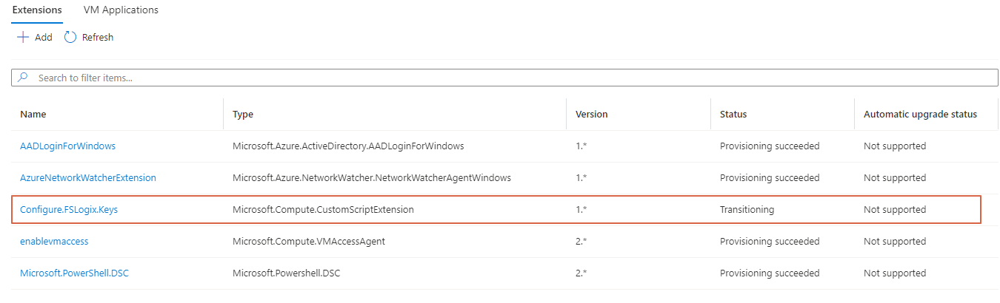
Because, it is possible to assign only one custom script extension to a virtual machine, I remove the extension after it has run successfully.

```powershell
Get-AzVMExtension @generalParameters | Remove-AzVMExtension -Force
```

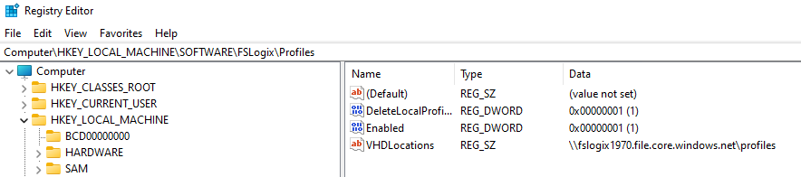
After login in again I got the following screen.

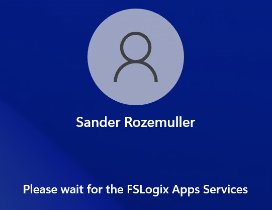  

At the file share on the storage account, I got a folder with my profile in it.

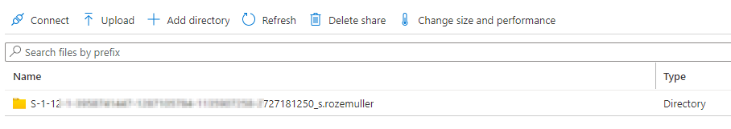
## Testing

When all the components are in place the final step is there. We need to test if the session host gets a Kerberos ticket from Microsoftonline.com. [I wrote a quick test script](https://github.com/srozemuller/AVD/blob/main/FsLogix/test-kbrt.ps1) that checks on the string **Server: krbtgt/KERBEROS.MICROSOFTONLINE.COM @ KERBEROS.MICROSOFTONLINE.COM**.

To test if a user gets a Kerberos ticket from Microsoft Online run the test script with the Invoke-AzVMRuncommand PowerShell command. In the first test, I ran the test script without the Azure AD Kerberos registry keys. In the second test, I ran the configure FSLogix script first. Thereafter I ran the test script again. Now I got a Kerberos ticket from MicrosoftOnline.com

First I look for the session host. Then I run the Invoke-AzRMRunCommand.

```powershell
$vm = Get-azvm -name "AAD-avd-2" -ResourceGroupName 'RG-roz-avd-01'
$testParameters = @{
    aadUserName = "AzureAD\userprincipalName"
    azureADUserPwd = "thepasswordIsS3cret"
    psexecDownloadLocation = "https://download.sysinternals.com/files/PSTools.zip"
}
$testOutput = $vm | Invoke-AzVMRunCommand -CommandId 'RunPowerShellScript' -ScriptPath .\test-kbrt.ps1 -Parameter $testParameters
$testOutput.Value[0].Message
```

In the test script, I use the [PSExec tool](https://docs.microsoft.com/en-us/sysinternals/downloads/psexec). Because the Invoke-AzVMRuncommand runs under SYSTEM context, I need a PowerShell box under the correct credentials. Running the **‘klist get krbtgt’** only works under the correct AzureAD user since SYSTEM has no Kerberos tickets.

As said, I ran the command first without the AAD Kerberos enabled keys.

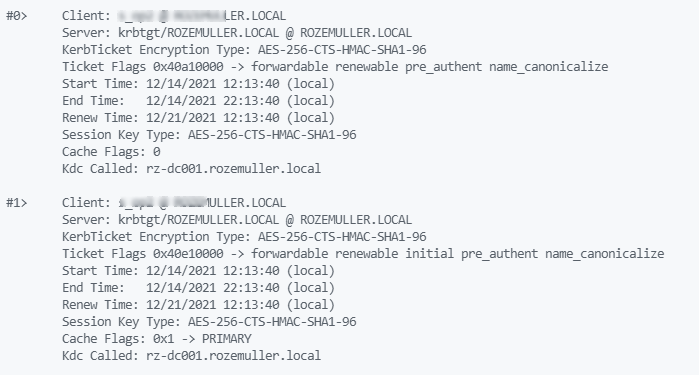
After enabling AAD with Kerberos on the session host, I got the output below.

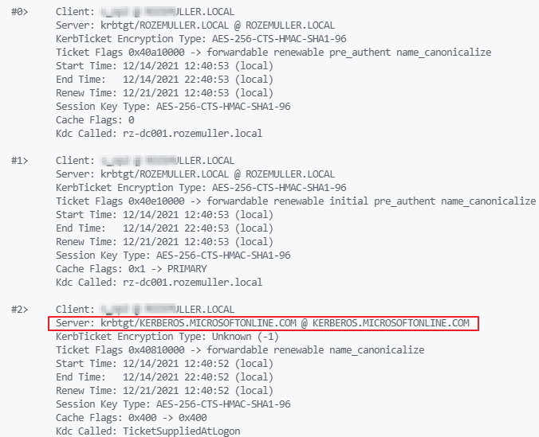
At last, I can check the output if the Kerberos string is there.

```powershell
if ($testOutput2.Value[0].Message | Select-String -Pattern "Server: krbtgt/KERBEROS.MICROSOFTONLINE.COM @ KERBEROS.MICROSOFTONLINE.COM" -CaseSensitive -SimpleMatch){
    Write-Output "Its OK!"
}
else {
    Write-Warning "NOT OK!"
}
```

Thank you for reading this blog about configuring FSLogix with Azure AD automated. 
