Welcome to the AVD Automation Cocktail. In this cocktail series, I will show different AVD deployment strategies and languages. In this cocktail, Santa’s Tree Ride, I will show you how to deploy an AzureAD joined only AVD environment automated with DevOps and the Az.Avd PowerShell module.



## Recipe

In this “SantasRide”-deployment recipe I will deploy an AVD environment based on AzureAD automated with DevOps and the [Az.Avd PowerShell](https://www.powershellgallery.com/packages/Az.avd) module. Unlike the other cocktails, I am not using the Azure Compute Gallery. I’m installing a session host directly from the Azure Marketplace (Windows 11) and assigning an Azure AD group to the application group.

### Before to drink

To start enrolling AVD automated with DevOps and Az.Avd you need to have a DevOps organization. Within that organization, you need a project. In that project, you will have to configure a service connection to an Azure tenant. Configuring the DevOps requirements is not the scope of this cocktail. For more info about configuring DevOps the automated way please check my series [‘the DevOps project’](https://www.rozemuller.com/prepare-azure-devops-for-windows-virtual-desktop-deployment-app-registration/)

### List DevOps of ingredients

 PowerShell Module
- Azure DevOps
- Yaml

### Aftertaste

This cocktail has an Azure DevOps in YAML base as the main ingredient. There is an Az.Avd PowerShell taste. In the end, you will have an AVD environment AAD join environment deployed automated with PowerShell with all the needed resources. These are a hostpool, a workspace, an application group. Also, there are session hosts with some applications installed.

### Background

A little bit about the background. On the left, we have a DevOps repository. I stored some PowerShell files which I’m going to execute. These PowerShell files deploy the components. I’m working with YAML templates which come together in a master pipeline. The master pipeline is the one that I’m going to execute.

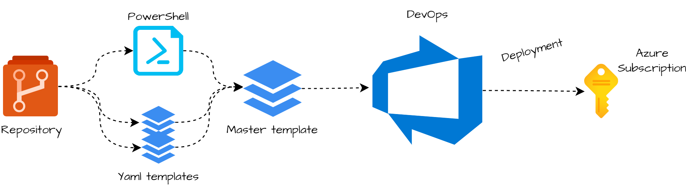
## Introduction to Azure DevOps

In contrast to the other cocktails, I feel the need to write a little bit about the techniques I used. This is because these techniques are very important to the whole automation sequence and differ from other cocktails.  
As I mentioned in earlier cocktails, variables are key in automation. I’m using variables all the time which helps me avoid providing input all the time.

In coding languages like PowerShell, Azure CLI, bash, Python you are able to use variables. In Azure DevOps, it is a bit different because Azure DevOps isn’t a programming language. But there are options, of course.

### YAML Pipelines

Maybe you know there are two ways to create pipelines, classic, and YAML. The classic release pipeline is a clickable page where you are able to create stages and jobs. In this article, I’m using the other option, YAML.  
One of the reasons why using YAML is the ability to use output variables over different stages and jobs. Another good reason is that YAML pipelines are saved in the current project’s repository. This makes the use of version, import, and export possible. Yes, the learning curve is a bit steep but it is worth it.

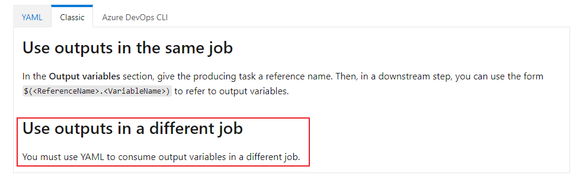
[https://docs.microsoft.com/en-us/azure/devops/pipelines/process/variables?view=azure-devops&amp;tabs=yaml%2Cbatch#use-output-variables-from-tasks](https://docs.microsoft.com/en-us/azure/devops/pipelines/process/variables?view=azure-devops&tabs=yaml%2Cbatch#use-output-variables-from-tasks)

### Pipeline variables

DevOps provides the ability to use jobs outcome as output variables. To output variables via PowerShell, you need the code below. Make sure you output every value you need with a line of code. Write the output to the host, give

```powershell
Write-Host "##vso[task.setvariable variable=workspaceId;isOutput=true;issecret=false]$($workspace.id)"
```

> Make sure you will add the <span style="text-decoration: underline;">isOutput=true </span>to the line. Otherwise, there is no output.

### YAML templates

In DevOps, I love using templates. Using templates helps me keep the code clean and reuse code. If your template is in another repository then your pipeline you will need to add that repository into your pipeline. Because the master pipeline must be able to run in every project I added the repository in the master pipeline by default.

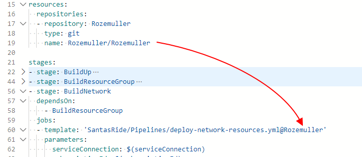  

For more information about YAML templates check the [Microsoft docs](https://docs.microsoft.com/en-us/azure/devops/pipelines/process/templates?view=azure-devops)

## AVD automated with DevOps and Az.Avd

In this chapter, I will explain how to deploy an AVD environment based on AzureAD with DevOps and Az.Avd. The deployment is fully automated with Azure DevOps in YAML and the Az.Avd PowerShell module. I will recommend cloning my AVD GitHub repository to get all the needed files, also for the other cocktails.

### Variables

At the beginning of the pipeline, I created a few variables which I need during the pipeline. Pointing to variables in pipelines use ```$(varname)``` as value. Using variables at the top is a best practice. In this blog, I also put plain values inside the pipeline, just to clarify what is happening.

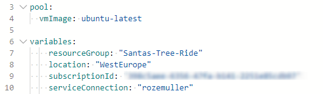
### Context

Because my service connection has permissions to more than one subscription, I set the subscription context in to my PowerShell files. Otherwise, the service connection will pick the configured subscription Id.

```powershell
Set-AzContext -Subscription $subscriptionId
```

### Resource group

The first step in our deployment is creating a new resource group. In this group, I will deploy all the resources in this blog post. The resource group deployment is configured in a DevOps stage where a start a job template with parameters.

```yaml
- stage: BuildResourceGroup
  dependsOn:
    - BuildUp
  jobs:
  - template: 'SantasRide/Pipelines/deploy-resourcegroup.yml@Rozemuller'
    parameters:
      serviceConnection: $(serviceConnection)
      subscriptionId: $(subscriptionId)
      jobName: deployRG
      taskName: 'rgTask'
      name: $(resourceGroup)
      location: $(location)
```

Within the template, I configured an inline PowerShell task to deploy the resource group. In a PowerShell inline task use ```${{ parameters.parametername }}``` to reference the parameter.

```yaml
  - task: AzurePowerShell@5
    name: ${{ parameters.taskName }}
    enabled: true
    inputs:
      azureSubscription: ${{ parameters.serviceConnection }}
      ScriptType: 'InlineScript'
      Inline: |
        Set-AzContext -Subscription ${{ parameters.subscriptionId }}
        $rgParameters = @{
            Name = "${{ parameters.name }}"
            Location = '${{ parameters.location }}'
            Force = $true
        }
        New-AzResourceGroup @rgParameters
      azurePowerShellVersion: 'LatestVersion'
```

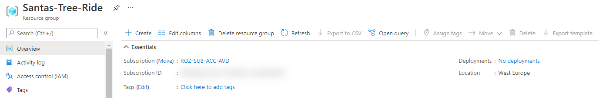
### Networking

After the resource group is deployed, the second step in our “CandyTree”-deployment is deploying a VNET a subnet, and a network security group. A network security group, or NSG, will help us protect our network from unwanted traffic.

At first, I will deploy the NSG with the code below. As you can see the resource group output is used here as a variable. To make this work make sure you have added the needed job in the dependsOn part. I created a stage for the network part. As you can see the stage depends on the previous stage BuildResourceGroup. If you don’t add this part, this stage will also start to run parallel. Because you can’t deploy a VNET into a non-existing resource group, I need a resource group first.

```yaml
- stage: BuildNetwork
  dependsOn:
    - BuildResourceGroup
  jobs:
  - template: 'SantasRide/Pipelines/deploy-network-resources.yml@Rozemuller'
    parameters:
      serviceConnection: $(serviceConnection)
      subscriptionId: $(subscriptionId)
      jobName: deployNetwork
      taskName: 'networkTask'
      resourceGroup: $(resourceGroup)
      location: $(location)
      nsgName: 'nsg-avd'
      subnetName: 'avd'
      subnetPrefix: '10.0.1.0/24'
      vnetName: 'vnet-candy-tree'
      vnetPrefix: '10.0.0.0/16'
```

In the task, I start the deploy-network-resources.ps1 PowerShell file with all the needed parameters.

```yaml
  - task: AzurePowerShell@5
    name: ${{ parameters.taskName }}
    enabled: true
    inputs:
      azureSubscription: ${{ parameters.ServiceConnection }}
      ScriptType: 'FilePath'
      ScriptPath: '$(Pipeline.Workspace)/drop/Scripts/deploy-network-resources.ps1'
      ScriptArguments: '-subscriptionId ${{ parameters.subscriptionId }} -resourceGroup "${{ parameters.resourceGroup }}" -location ${{ parameters.location }} -nsgName "${{ parameters.nsgName }}" -subnetName "${{ parameters.subnetName }}" -subnetPrefix "${{ parameters.subnetPrefix }}" -vnetName "${{ parameters.vnetName }}" -vnetPrefix "${{ parameters.vnetPrefix }}"'
      errorActionPreference: 'stop'
      azurePowerShellVersion: 'LatestVersion'
```

Within the PowerShell file, I send the subnet output back as a task variable with:

```powershell
Write-Host "##vso[task.setvariable variable=subnetId;isOutput=true;]$($subnetId.id)"
```

This is the subnet Id I need at the session host deployment step.

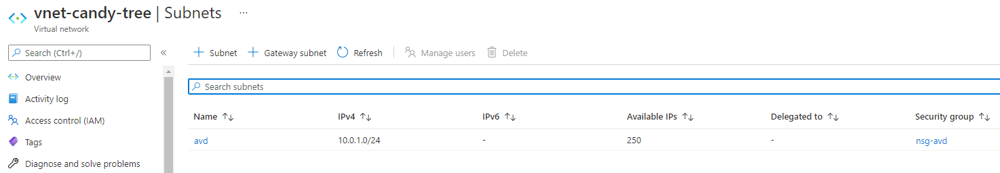
## Azure Virtual Desktop

After the network is prepared, it is time to deploy the AVD environment. I split the AVD deployment into two parts, the backend and session hosts. In the first part, we deploy the backend with a hostpool, application group, and workspace. Second, I create a registration token and install the session host with the AzureAD extension and AVD extension.

### AVD hostpool, application group and workspace

The first step in deploying an AVD environment automated with DevOps and the Az.Avd PowerShell module.

Within the stage, I run the template with the needed parameters. These parameters are provided to the PowerShell file. In PowerShell, all the magic happens.

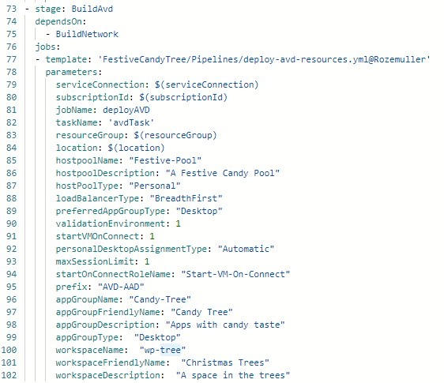

Within the template, I start the PowerShell file to deploy AVD resources.

```yaml
  - task: AzurePowerShell@5
    name: ${{ parameters.taskName }}
    enabled: true
    inputs:
      azureSubscription: ${{ parameters.ServiceConnection }}
      ScriptType: 'FilePath'
      ScriptPath: '$(Pipeline.Workspace)/drop/Scripts/deploy-avd-resources.ps1'
      ScriptArguments: "
        -subscriptionId ${{ parameters.subscriptionId }}
        -resourceGroup ${{ parameters.resourceGroup }}
        -location '${{ parameters.location }}' 
        -hostpoolName '${{ parameters.hostpoolName }}'
        -hostpoolDescription' ${{ parameters.hostpoolDescription }}'
        -hostPoolType '${{ parameters.hostPoolType }}'
        -loadBalancerType '${{ parameters.loadBalancerType }}' 
        -preferredAppGroupType '${{ parameters.preferredAppGroupType }}'
        -personalDesktopAssignmentType '${{ parameters.personalDesktopAssignmentType }}'
        -maxSessionLimit '${{ parameters.maxSessionLimit }}'
        -startOnConnectRoleName '${{ parameters.startOnConnectRoleName }}'
        -appGroupName '${{ parameters.appGroupName }}'
        -appGroupFriendlyName '${{ parameters.appGroupFriendlyName }}'
        -appGroupDescription '${{ parameters.appGroupDescription }}'
        -appGroupType '${{ parameters.appGroupType }}'
        -workspaceName '${{ parameters.workspaceName }}'
        -workspaceFriendlyName '${{ parameters.workspaceFriendlyName }}'
        -workspaceDescription '${{ parameters.workspaceDescription }}'"
```

In PowerShell, I’m installing and importing the Az.Avd PowerShell module. Make sure you set the scope to CurrentUser. This is in case you don’t have permission to install modules at the system level.

```powershell
Install-Module -Name Az.Avd -AllowPrerelease -Force -Verbose -Scope CurrentUser
Import-Module -Name Az.Avd

Set-AzContext -Subscription $subscriptionId

$hostpoolParameters = @{
    HostpoolName          = $hostpoolName
    Description           = $hostpoolDescription
    ResourceGroupName     = $ResourceGroupName
    Location              = $location
    HostpoolType          = $hostPoolType
    LoadBalancerType      = $loadBalancerType
    preferredAppGroupType = $preferredAppGroupType
}

Write-Verbose "Deploying hostpool $hostpoolName"
$avdHostpool = New-AvdHostpool @hostpoolParameters

if ($AADJoin) {
    Update-AvdHostpool -HostpoolName $HostpoolName -ResourceGroupName $ResourceGroupName -CustomRdpProperty "targetisaadjoined:i:1"
}
```

The whole PowerShell is stored in my GitHub repository.

### Assign applicationgroup permissions

The Az.Avd PowerShell module also has a command to assign permissions to an AVD application group. In the script, I added a command to assign permissions to an application group. I’m assigning All Users to the group with the command below.

```powershell
Add-AvdApplicationGroupPermissions -ResourceId $application -GroupName "All Users"
```

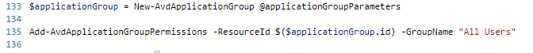
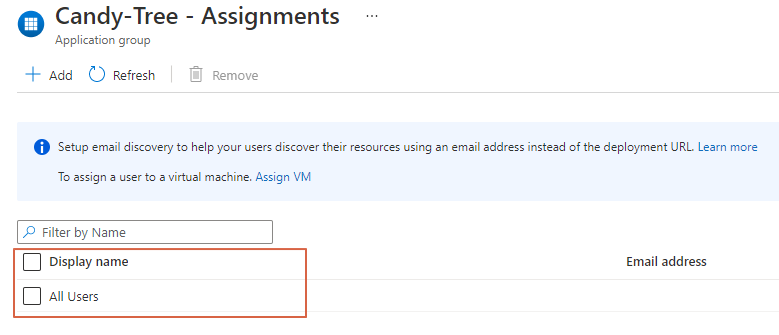
### AVD Session hosts

At last, it is time to create a session host. Since update 2.1.1 of the Az.Avd PowerShell module it is possible to create session hosts with Azure AD join. Make sure you will install this version.

In the master pipeline, I use the template to deploy AVD session hosts. This is the stage where variables from other stages come together. Because it depends on earlier stages, make sure you add these stages to the DependsOn list.

It is looking at the stage in the first place. Second is the jobname, in this case, the deployNetwork and deployAvd jobs. Within the job, it is looking for the task. In this case, the networkTask and avdTask.   
These tasks execute PowerShell files. In these PowerShell files, I write the output with a name to the host. This is the last part of the variable. In this case the subnetId, hostpoolName and, hostpoolResourceGroup.   
In the ideal world, you should use output variables for all values.

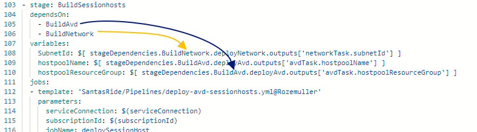

In the task, I provide the parameters to the PowerShell file with script arguments.

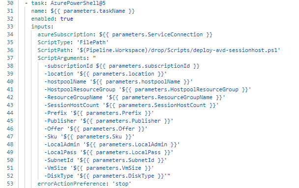
In the end, in the PowerShell file, I execute new-avdaadsessionhost with these parameters. Also, I set the context and installing the Az.Avd module again. Install modules **must** be executed in every new PowerShell context (DevOps tasks)

```powershell
Install-Module -Name Az.Avd -AllowPrerelease -Force -Verbose -Scope CurrentUser
Import-Module -Name Az.Avd

Set-AzContext -Subscription $subscriptionId

$avdHostParameters = @{
    HostpoolName = $HostpoolName 
    HostpoolResourceGroup = $HostpoolResourceGroup 
    ResourceGroupName = $ResourceGroupName
    sessionHostCount = $SessionHostCount 
    Location = $Location 
    Publisher = $Publisher
    Offer = $Offer
    Sku = $Sku
    Prefix = $Prefix
    DiskType = $DiskType
    LocalAdmin = $LocalAdmin
    LocalPass = $LocalPass
    SubNetId = $SubNetId
    VmSize = $VmSize
}

New-AvdAadSessionHost @avdHostParameters
```

<div aria-hidden="true" class="wp-block-spacer" style="height:30px"></div>This is the end of the AVD deployment automated with Azure DevOps and the Az.Avd PowerShell module. For all the please check my [GitHub ](https://github.com/srozemuller/AVD/tree/main/Deployment/StrawberryBanana)[repository](https://github.com/srozemuller/AVD/tree/main/Deployment/SantasRide).

## Thank you!

I hope you liked Santa’s 🎅 Tree 🎄 Ride 🛷 and got a bit inspired. Now you know deploy an AVD based on AzureAD with DevOps and the Az.Avd PowerShell module is one of the options. If you like another cocktail feel free to stay and check the [AVD Automation Cocktail menu](https://www.rozemuller.com/avd-automation-cocktail-the-menu/).

