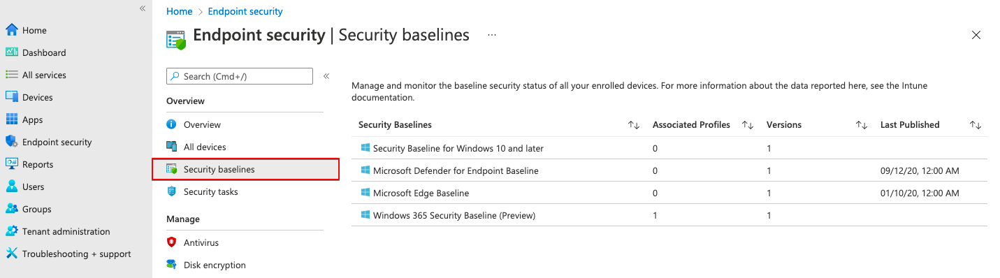
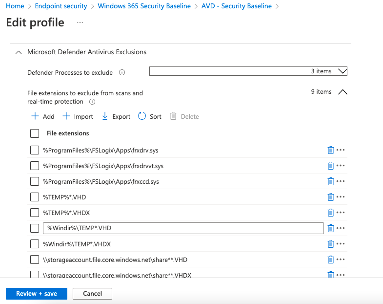
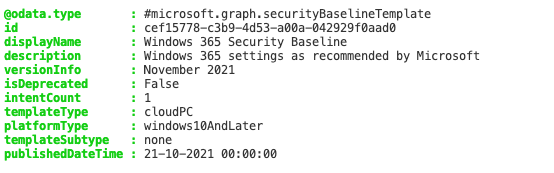
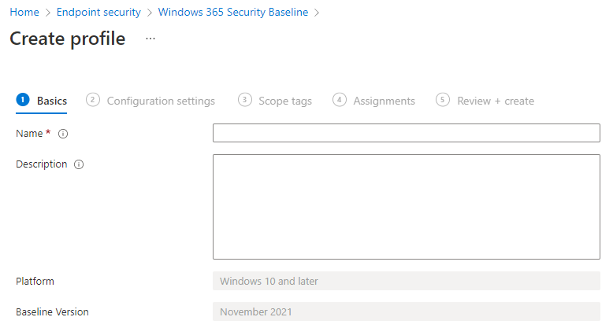
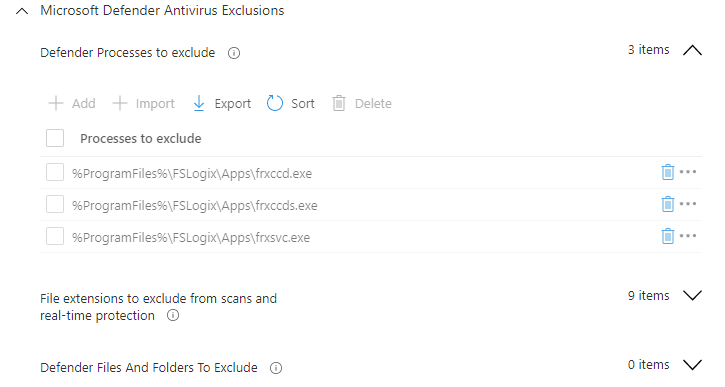
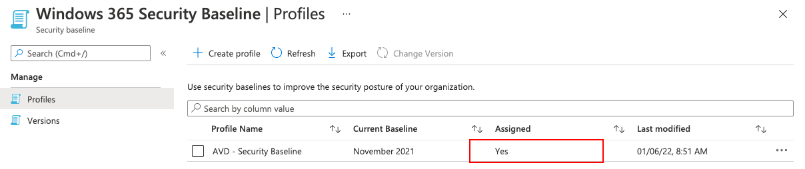
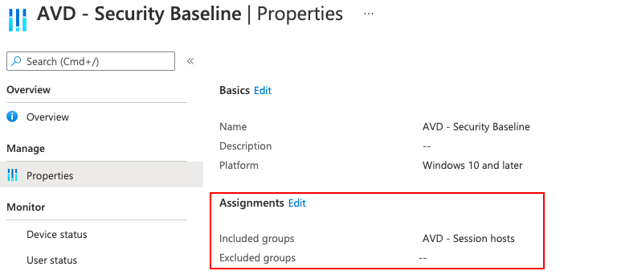
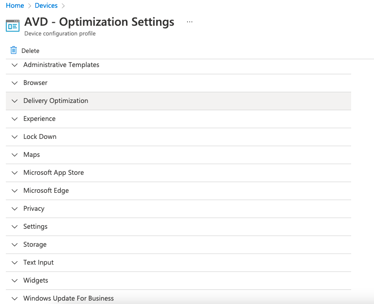
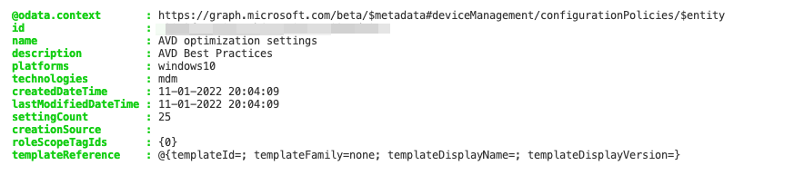

In this blog post, I explain how to secure and optimize AVD and CloudPC environment using Microsoft Intune automated. The configuration is all deployed automated based on PowerShell, JSON templates, and Graph API. I explain how to create a security baseline and how to deploy a configuration profile with settings.

In this blog post, the focus is on the standardized part of the North Star framework. This means we are going to look at the following subjects:

- Security baselines
- Configuration profiles with a settings catalog instead of GPO

However, it is not a part of the North Start framework I also configure a lot of optimization settings to get the best out of the virtual desktop and CloudPC.



## Operation North-Star

This blog post is a part of Operation North-Star. What is operation “North-Star”?  
The main goal of operation “North-Star” is showing a way how to manage the modern workplace based on the North Star framework. Microsoft has released a framework for Microsoft Endpoint Management called ‘North Star’. This framework is designed to deploy, secure, optimize and manage Windows devices in the cloud.

For more information about this series please read [my kick-off blog about the North Star framework](https://www.rozemuller.com/manage-avd-automated-with-microsoft-endpoint-manager/).

## Secure AVD and CloudPC using security baselines

The first part of secure and optimize AVD and CloudPC is creating a security baseline. Security baselines are a part of Endpoint Security in Microsoft Intune. Security Baselines consist of profiles and versions. Currently, there are four profiles available.



In my situation, I choose the Windows 365 Security Baseline (Preview) profile. I have chosen this one because it fits the most to Azure Virtual Desktop and CloudPC. Antivirus exclusions for FSLogix are preconfigured and WiFi are stripped from this settings policy.


At this place, I mentioned the word settings a few times already. This is because a Security Baseline profile consists of settings. Just like a configuration profile under device management. Actually, under the hood Security Baselines are a part of the device management REST API. However, a lot more is happening underwater. For that reason, I decided to write another blog post about Security Profiles under de hood. How it fits in Endpoint Manager and how to use the REST API for automation. (keep attention on my website or follow me via [Twitter](https://twitter.com/SandeRozemuller)) For now, I continue with standardizing AVD using Microsoft Intune automated.

### Create a security baseline profile automated

As mentioned before, we need a security baseline for Windows 365. This baseline actually is a template from where a profile is created from. To get the correct baseline, I searched for all available templates and filtered for **Windows 365 Security Baseline**. The template type is categorized under CloudPC.

```powershell
$script:templatesUrl = "https://graph.microsoft.com/beta/deviceManagement/templates?`$filter=(displayName eq 'Windows 365 Security Baseline')"
$templateId = (Invoke-RestMethod -Uri $script:templatesUrl -Method GET -Headers $script:token).value.id
```


In the next step, I create a profile within the Windows 365 Security Baseline and all the needed settings. In this post, I keep the default template settings. The steps below describe how to create a new security baseline profile automated with the template settings.


In the code above we found the correct template Windows 365 Security Baseline. In the next steps, we need ID representing this baseline. At first we grab all the settings from the template and store it into the **$securityBsaelineSettings** variable.

Make a note about the **`$expand=settings**. However the [docs](https://docs.microsoft.com/en-us/graph/api/intune-deviceintent-devicemanagementsettinginstance-list?view=graph-rest-beta#http-request) says to use /settings at the end of the URL it looks like there is a bug or the documentation isn’t right yet. When requesting the URL you will get an error like below.

Invoke-RestMethod: {“error”:{“code”:”No method match route template”,”message”:”No OData route exists that match template *~/singleton/navigation/key/navigation with http verb GET for request /DeviceManagementIntent/DeviceManagementIntentService/83661860-ffff-3213-1205-120819383819/deviceManagement/templates(‘cef15778-c3b9-4d53-a00a-042929f0aad0’)/settings.”,”innerError”:{“date”:”2022-01-11T15:10:28″,”request-id”:”d3add198-6b01-49f5-98a2-88e465a3d233″,”client-request-id”:”d3add198-6b01-49f5-98a2-88e465a3d233″}}}*

```powershell
$script:baselineSettingsUrl = "https://graph.microsoft.com/beta/deviceManagement/templates/{0}?`$expand=settings" -f $templateId
$securityBaselineSettings = Invoke-RestMethod -Uri $script:baselineSettingsUrl -Method GET -Headers $script:token
$securityBaselineSettings.settings
```

To clarify the settings part, I searched for the categories and picked Microsoft Defender Antivirus Exclusions. Within this category, FSLogix exclusions are set. The query output shows three collections with values. The screenshot below represents those settings in the portal.

```powershell
$script:baselineSettingsUrl = "https://graph.microsoft.com/beta/deviceManagement/templates/{0}/categories" -f $templateId
Invoke-RestMethod -Uri $script:baselineSettingsUrl -Method GET -Headers $script:token

id                 : b65b2f09-a697-41e9-add3-1115e09aa393
displayName        : Microsoft Defender Antivirus Exclusions
hasRequiredSetting : False


$script:baselineSettingsUrl = "https://graph.microsoft.com/beta/deviceManagement/templates/{0}/categories" -f $templateId
Invoke-RestMethod -Uri $script:baselineSettingsUrl -Method GET -Headers $script:token

$url = "https://graph.microsoft.com/beta/deviceManagement/templates/{0}/categories/b65b2f09-a697-41e9-add3-1115e09aa393/recommendedSettings" -f $templateId
$catogory = Invoke-RestMethod -Uri $url -Method GET -Headers $script:token
$category.value | FL

@odata.type  : #microsoft.graph.deviceManagementCollectionSettingInstance
id           : e54bc711-3b81-4202-bf01-6bc7e5e0907d
definitionId : deviceConfiguration--windows10EndpointProtectionConfiguration_defenderProcessesToExclude
valueJson    : ["%ProgramFiles%\\FSLogix\\Apps\\frxccd.exe","%ProgramFiles%\\FSLogix\\Apps\\frxccds.exe","%ProgramFiles%\\FSLogix\\Apps\\frxsvc.exe"]

@odata.type  : #microsoft.graph.deviceManagementCollectionSettingInstance
id           : 91224658-78ae-4e95-a358-ad95b2add175
definitionId : deviceConfiguration--windows10EndpointProtectionConfiguration_defenderFileExtensionsToExclude
valueJson    : ["%ProgramFiles%\\FSLogix\\Apps\\frxdrv.sys","%ProgramFiles%\\FSLogix\\Apps\\frxdrvvt.sys","%ProgramFiles%\\FSLogix\\Apps\\frxccd.sys","%TEMP%*.VHD","%TEMP%*.VHDX","%Windir%\\TEMP*.VHD","%Windir%\\TEMP*.VHDX","\\ 
               \\storageaccount.file.core.windows.net\\share**.VHD","\\\\storageaccount.file.core.windows.net\\share**.VHDX"]

@odata.type  : #microsoft.graph.deviceManagementCollectionSettingInstance
id           : eee0be1a-6333-4e38-a43c-0c94df358318
definitionId : deviceConfiguration--windows10EndpointProtectionConfiguration_defenderFilesAndFoldersToExclude
valueJson    : null
```



Now I have settings and a template, I am able to create a new profile under the Windows 365 Security Baseline. To create a new profile automated, I used the code below. I create a body and store the **$securityBaselineSettings** variable as the settingsdelta value.

```powershell
$jsonbody = @{
    "displayName"     = "AVD - Security Baseline"
    "description"     = "Used for Azure Virtual Desktop"
    "settingsDelta"   = $securityBaselineSettings 
    "roleScopeTagIds" = @(
        "0"
    )
}
$jsonbody = $jsonbody | ConvertTo-Json -Depth 99
$script:templatesUrl = "https://graph.microsoft.com/beta/deviceManagement/templates/{0}/createInstance" -f $templateId
Invoke-RestMethod -Uri $script:templatesUrl -Method POST -Headers $script:token -Body $jsonbody
```

### Assign security baseline to a group

At last, we need to assign the policy to the Azure Virtual Desktop hosts AD group.   
In [the Operation North Star Update AVD hosts blog article](https://www.rozemuller.com/manage-windows-updates-for-avd-using-micrcosoft-endpoint-manager/#assignment), I created an <span style="text-decoration: underline;">AVD – Session hosts</span> AD group. In this step, I also use this AD group.

First, I search for the AVD – Session hosts AD group again and use the group object ID to assign the security baseline to.

```powershell
$group = @{
    method  = "GET"
    uri     = "https://graph.microsoft.com/v1.0/groups?`$filter=(displayName eq 'AVD - Session hosts')"
    Headers = $script:token
}
$groupId = (Invoke-RestMethod @group).value.id
$groupId
```

I use the groupId as the groupID input in the body. As with every assignment, we need to create an assignmentId. This can be every valid GUID.

```powershell
$assignBody = @{
    "assignments" = @(
        @{
            "@odata.type" = "#microsoft.graph.deviceManagementIntentAssignment"
            "id" = $(New-Guid).Guid
            "target" = @{
                "@odata.type"                                = "#microsoft.graph.groupAssignmentTarget"
                "groupId"   = $groupId
                "deviceAndAppManagementAssignmentFilterType" = "none"

            }
        }
    )
}
$assignBody = $assignBody | ConvertTo-Json -Depth 99
$script:assignUrl = "https://graph.microsoft.com/beta/deviceManagement/intents/{0}/assign" -f $newProfileId
Invoke-RestMethod -Uri $script:assignUrl -Method POST -Headers $script:token -Body $assignBody
```




For more information about device management and templates check the urls: <https://docs.microsoft.com/en-us/graph/api/intune-deviceintent-devicemanagementtemplate-list?view=graph-rest-beta>

<https://docs.microsoft.com/en-us/graph/api/intune-deviceintent-devicemanagementsettinginstance-list?view=graph-rest-beta#http-request>

## Optimize AVD with the settings catalog

In this second secure and optimize AVD and CloudPC part we create optimization settings. I use the settings catalog in Microsoft Intune to create a configuration profile. The settings catalog lists all the settings you can configure and all in one place. This feature simplifies how you create a policy, and how you see all the available settings. The settings catalog should be compared with the Group Policy Objects (GPO’s) in the native Active Directory.   
In the chapter below, I use the settings catalog to configure settings for optimizing Azure Virtual Desktop. I show how to deploy these settings automated. Also, I will show how to assign the configuration profile to the AVD – Session hosts group.

### Azure Virtual Desktop optimization settings

As you properly know, there is a tool called [The Virtual Desktop Optimization Tool](https://github.com/The-Virtual-Desktop-Team/Virtual-Desktop-Optimization-Tool). The tool/script helps you set a lot of settings to get the best out of your virtual desktop. Based on the OS version the correct settings are set. Also, things like services and unwanted applications are disabled. And much more.  
  
It is a great help and I’m using it while creating Azure Virtual Desktop images. During my image preparation process, I also run the script. However, there are more options, besides PowerShell, to set the correct settings. What about Microsoft Intune and configuration profiles. I [found an article that describes what setting needs to be set in MEM](https://github.com/DanielWep/Intune-ConfigProfiles-AVD-Optimization) based on the Virtual Desktop Tool.   
  
From that point, I go a step further and show how to deploy AVD optimization settings in MEM all automated.


For more information about the settings catalog, check the URL: <https://docs.microsoft.com/en-us/mem/intune/configuration/settings-catalog>

### Deploy configuration profile automated

The next step is deploying the configuration profile with all AVD optimization settings. I managed to put all the settings into a JSON file first. Because it is in a JSON file, I’m also able to reuse the settings in other environments too. In the body below, I use the avd-optimization.settings.json content as the complete settings package.

```powershell

$policyBody = @{
    "@odata.type"  = "#microsoft.graph.deviceManagementConfigurationPolicy"
    "name"         = "AVD optimization settings"
    "description"  = "AVD Best Practices"
    "platforms"    = "windows10"
    "technologies" = "mdm"
    "settings"     = @( 
        Get-Content ./avd-optimization.settings.json | ConvertFrom-Json
    )
}
$jsonBody = $policyBody | ConvertTo-Json -Depth 99
$script:PostPolurl = "https://graph.microsoft.com/beta/deviceManagement/configurationPolicies"
$policy = Invoke-RestMethod -Uri $script:PostPolurl -Method POST -Headers $script:token -Body $jsonBody -ContentType 'Application/json'
$policyId = $policy.id
```

The AVD-optimization.settings.json is stored at [my GitHub repository](https://github.com/srozemuller/AVD/tree/main/OperationNorthStar/Configurations/AVD-Optimization).


### Assign configuration profile automated

The last step is assigning the just-created configuration profile to the correct AD group. With the code below I create a new GUID again and use the group ID in [the earlier step](#assign-security-baseline).

```powershell
$url = "https://graph.microsoft.com/beta/deviceManagement/configurationPolicies/{0}/assign" -f $policyId
$assignBody = @{
    "assignments" = @(
        @{
            "@odata.type" = "#microsoft.graph.deviceManagementConfigurationPolicyAssignment"
            "id"          = (New-Guid).Guid
            "target"      = @{
                "@odata.type"                                = "#microsoft.graph.groupAssignmentTarget"
                "deviceAndAppManagementAssignmentFilterId"   = $null
                "deviceAndAppManagementAssignmentFilterType" = "none"
                "groupId"                                    = $groupId
            }
        }
    )
}
$jsonbody = $assignBody | ConvertTo-Json -Depth 99
Invoke-RestMethod -Uri $url -Headers $script:token -Method POST -Body $jsonbody
```

For more information about configuration policies, check the URL: <https://docs.microsoft.com/en-us/graph/api/resources/intune-deviceconfigv2-devicemanagementconfigurationpolicy?view=graph-rest-beta>

Thank you for reading this blog about how to secure and optimize AVD and CloudPC with Microsoft Intune automated. 

