During writing automation blog posts about deploying security baselines automated, I felt the need to write a new blog about how these security baselines actually work. Not in the way how security baselines are deployed but how security baselines are built. Which components does a baseline have and how do settings fit together. In this blog post, I peel off a security baseline and explain how to grab the correct settings.

Endpoint Security is very important, no new till so far I think. Because of the Microsoft introduced security baselines. A set of pre-configured Windows settings that help to apply and enforce granular security settings. Settings recommended by relevant security teams.

In the blog post, I explain the different layers in security baselines and how to manage security baselines. The main goal is to understand how security baselines actually work. Another part is how to configure these baselines with the main goal, deploy security baselines automated. In the blog post, I try to map the portal (<https://endpoint.microsoft.com>) view with the information under the hood. To get sight under the hood, I use the Graph API.

## Permissions

To get started, make sure you have an application registration with at least the following permissions:

- DeviceManagementConfiguration.ReadWrite.All



## General information

Security baselines are groups of pre-configured Windows settings that help you apply and enforce granular security settings that are recommended by the relevant security teams. You can also customize each baseline you deploy to enforce only those settings and values you require. When you create a security baseline profile in Intune, you’re creating a template that consists of multiple *device configuration* profiles.

Security baselines are stored under **Endpoint Security** in the security baselines blade. Currently, there are four types of security baselines. A security baseline is a template with predefined settings. A security baseline includes the best practices and recommendations on settings that impact security. Every type has its own versions and settings.

<https://docs.microsoft.com/en-us/mem/intune/protect/security-baselines#available-security-baselines>

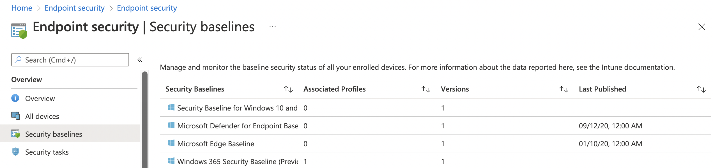

### Graph API Authentication

Before requesting the Graph API, we need to authenticate first.

```powershell
$resourceUrl = "https://graph.microsoft.com"
$token = Get-AzAccessToken -Resource $resourceUrl
$authHeader = @{
    'Content-Type' = 'application/json'
    Authorization  = 'Bearer ' + $token.Token
}
```

Let’s take a look at what the Graph API output looks like. However security baselines are stored at a different location in Microsoft Endpoint Manager, in the Graph API, you can find the baselines under the /templates endpoint. To get all security baselines, we need the Graph URL below.

```basic
https://graph.microsoft.com/beta/deviceManagement/templates
```

This is the endpoint where every template is behind. In the code below, I requested all the available templates.

```powershell
$getParams = @{
    method = "GET"
    uri = "https://graph.microsoft.com/beta/deviceManagement/templates"
    headers = $authHeader
}
$templates = Invoke-RestMethod @getParams
$templates.value
```

After the request the API response with all the available templates. To clarify, I selected two different template types. The first template is a security baseline (Windows 365 Security Baseline). The second is a device configuration template for Email.

So, how do you see the difference? It all has to do with @odata.type. The @odata.type tells what kind of template is it. In the case of a **GET** request (like above), the type isn’t that important. In the case of a **POST** request (when creating a new profile), it is a **MUST**. Because we have one single templates endpoint we need to tell what kind of template it is and where the request needs to put the template. I will discuss this point later.

```basic
@odata.type       : #microsoft.graph.securityBaselineTemplate
id                : cef15778-c3b9-4d53-a00a-042929f0aad0
displayName       : Windows 365 Security Baseline
description       : Windows 365 settings as recommended by Microsoft
versionInfo       : November 2021
isDeprecated      : False
intentCount       : 1
templateType      : cloudPC
platformType      : windows10AndLater
templateSubtype   : none
publishedDateTime : 21/10/2021 00:00:00
```

```basic
id                : 54dd8d4d-f159-4da0-9d8f-40f44aef5608
displayName       : Email
description       : Mifo Windows 10 and later Email
versionInfo       : Version 1
isDeprecated      : False
intentCount       : 0
templateType      : deviceConfigurationForOffice365
platformType      : windows10AndLater
templateSubtype   : none
publishedDateTime : 01/01/2001 00:00:00
```

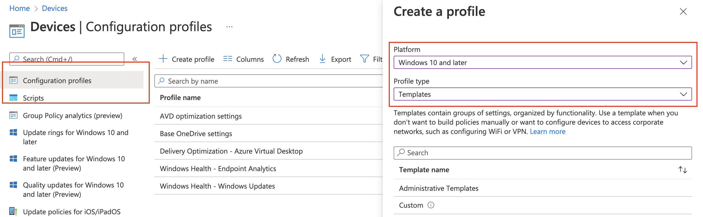

## Profiles

Security baselines are templates with predefined settings. To use these settings and assign a baseline template to devices and/or users we need to create a new profile.

### Create a security baseline profile

To create a profile click on the correct security baseline and go to the profiles blade. Then click on **Create Profile**. In the wizard fill in the needed settings and you’re all set.

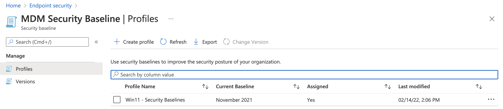

## Create a security baseline profile automated

Creating a security baseline profile through the portal isn’t that hard. But what about creating a security baseline profile automated and assigning the profile to a user group. To create a security baseline profile automated you need to create a new instance. To create a new instance use the Graph API URL below.

```basic
https://graph.microsoft.com/beta/deviceManagement/templates/{deviceManagementTemplateId}/createInstance
```

<https://docs.microsoft.com/en-us/graph/api/intune-deviceintent-devicemanagementtemplate-createinstance?view=graph-rest-beta>

What is the **{deviceManagementTemplateId}** and how to get it? This is the id of the source template. Let’s take a look at an example. In the screenshot below we have the security baselines. The baseline with the red box is the one we are focussing on.

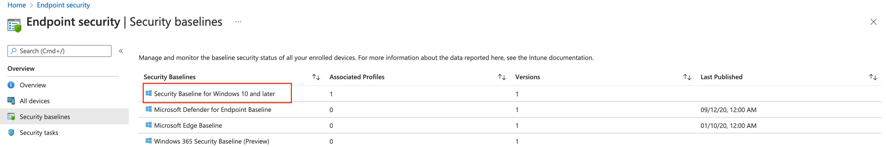

### Get the source template

With the createInstance URL in mind, we need to get the source template id. To get the source baseline template id we first need to list all the templates. After [authentication](#authentication), I used the code below to get the correct security baseline from the /templates endpoint.

```powershell
$getParams = @{
    method = "GET"
    uri = "https://graph.microsoft.com/beta/deviceManagement/templates?`$filter=startswith(displayName, 'MDM Security Baseline for Windows 10')"
    headers = $authHeader
}
$templates = Invoke-RestMethod @getParams
$templates.value
```

The result of ***$templates.value*** is shown below. As shown in the result, this baseline is from November 2021. The **isDeprecated** object is ***False*** which means that this baseline is currently the latest version. Because I created a profile in the portal the intentCount value is 1. The intentCount represents the associated profiles.

```basic
@odata.type       : #microsoft.graph.securityBaselineTemplate
id                : 034ccd46-190c-4afc-adf1-ad7cc11262eb
displayName       : MDM Security Baseline for Windows 10 and later for November 2021
description       : MDM Security Baseline for Windows 10 and later
versionInfo       : November 2021
isDeprecated      : False
intentCount       : 1
templateType      : securityBaseline
platformType      : windows10AndLater
templateSubtype   : none
publishedDateTime : 22/10/2021 00:00:00
```

<https://docs.microsoft.com/en-us/graph/api/intune-deviceintent-securitybaselinetemplate-list?view=graph-rest-beta>

### Create new profile

Now we have the correct Id, we can call the createInstance endpoint. As the most **POST** requests, we do need to provide a body in JSON format.

```powershell
$postBody = @{
    displayName = "Win11 - Security Baseline Automated"
    description = "MDM Security Baseline for Windows 10 and later"
    versionInfo = "February 2022"
    isDeprecated = $false
    templateType = "securityBaseline"
    platformType = "windows10AndLater"
    templateSubtype = "none"
}
$postParams = @{
    uri = "https://graph.microsoft.com/beta/deviceManagement/templates/{0}/createInstance" -f $templates.value.id
    headers = $authHeader
    Method = "POST"
    body = $($postBody | ConvertTo-Json)
}
Invoke-RestMethod @postParams
```

After creation, I requested the template endpoint URL again. The intentCount value is now 2. In the portal, the intentCount is called Associated Profiles.

```basic
@odata.type       : #microsoft.graph.securityBaselineTemplate
id                : 034ccd46-190c-4afc-adf1-ad7cc11262eb
displayName       : MDM Security Baseline for Windows 10 and later for November 2021
description       : MDM Security Baseline for Windows 10 and later
versionInfo       : November 2021
isDeprecated      : False
intentCount       : 2
templateType      : securityBaseline
platformType      : windows10AndLater
templateSubtype   : none
publishedDateTime : 22/10/2021 00:00:00
```

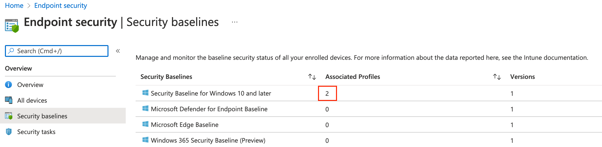
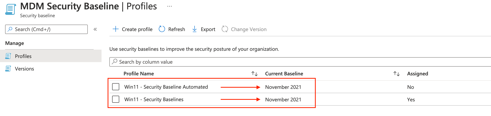

As you can see, however, I provided a custom version in the POST body (February 2022), the profile is using the template’s current version.   
In this chapter, we created a profile based on the MDM Security Baseline for Windows 10 (and above). If you want Microsoft’s default setting then you’re all set and ready to assign the profile.

## Customize security baseline profiles

Now we know the security baselines are templates and we need to create profiles (intents). Sometimes you like to override the default settings. A scenario could be in the base if you have your own antivirus product and want to edit the Microsoft Defender settings.

If you like to edit the defaults then this is the chapter to follow. In this chapter, I explain how to get all settings and how to deploy settings in a baseline with custom settings.  
The main goal is to override the Microsoft Defender settings. To edit settings it is good to know what the settings look like in the background?

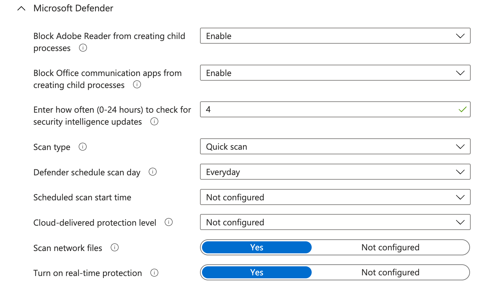
### Getting security baseline settings

At first, we have to query the source template, the MDM Security Baseline. To get baseline settings, two extra things are needed. First, use the same Graph API URL added by the template Id. The second is adding the **$expand=settings** at the end of the URL.

```basic
https://graph.microsoft.com/beta/deviceManagement/templates/034ccd46-190c-4afc-adf1-ad7cc11262eb?`$expand=settings
```

(Without the *extend* parameter, you just get the general template information. There is also an option with the URL below.

```basic
https://graph.microsoft.com/beta/deviceManagement/templates('034ccd46-190c-4afc-adf1-ad7cc11262eb')/settings
```

However, with that URL you only get the settings and miss all other template information. During coding, I try to get as much information into one request as possible. With that in mind, it helps me keep my code clean. I try to avoid using variables all over the place.

```
<meta charset="utf-8"></meta>$getSettings = @{
    method = "GET"
    uri = "https://graph.microsoft.com/beta/deviceManagement/templates/{0}?`$expand=settings" -f "034ccd46-190c-4afc-adf1-ad7cc11262eb"
    headers = $authHeader
}
$settings = Invoke-RestMethod @getSettings
$settings.settings | Where {$_.definitionId -match "defender"}
```

Based on the screenshot above, I picked some Defender settings from the output of the settings request to clarify.

```basic
# Block Adobe Reader from creating child processes 
@odata.type  : #microsoft.graph.deviceManagementStringSettingInstance
id           : d0e98a90-a30c-4753-b57d-3adae5af0723
definitionId : deviceConfiguration--windows10EndpointProtectionConfiguration_defenderAdobeReaderLaunchChildProcess
valueJson    : "enable"
value        : enable

# Defender schedule scan day
@odata.type  : #microsoft.graph.deviceManagementStringSettingInstance
id           : c6d23b54-615d-4cef-b24d-4c7443bec8d2
definitionId : deviceConfiguration--windows10GeneralConfiguration_defenderScheduleScanDay
valueJson    : "everyday"
value        : everyday

# Enter how often (0-24 hours) to check for security intelligence update
@odata.type  : #microsoft.graph.deviceManagementIntegerSettingInstance
id           : 7dbc8ff3-f604-4b75-b5dd-15438d0fab7b
definitionId : deviceConfiguration--windows10GeneralConfiguration_defenderSignatureUpdateIntervalInHours
valueJson    : 4
value        : 4
```

Every configurable setting has a ‘@odata.type’. The type shows what kind of setting it is. In the output above we have two types, deviceManagementIntegerSettingInstance and deviceManagementBooleanSettingInstance. An integer means the value is a number. A boolean means the setting is **True** or **False**. Mostly a boolean type is enabling or disabling a setting.  
Then we have an ID, this is the setting unique identifier. The definitionId is also a unique identifier but then more readable.

### Configure custom settings

As said, when creating a new instance without providing setting the default settings are deployed. In the previous paragraph, I showed how to get settings out of a template. Now it is time to create a **JSON** body with settings and custom values. Let’s pick the Microsoft Defender settings and set the following settings:

| **Setting** | **Default value** | **New value** |
|---|---|---|
| Block Adobe Reader from creating child processes | Enabled | Block |
| Enter how often (0-24 hours) to check for security intelligence updates | 4 | 8 |
| Defender schedule scan day | Every day | Monday |

To edit settings I copied the output and created a PowerShell object. Within the object, I stored the settings with the new values.

```
$settings = @(
    @{
        # Block Adobe Reader from creating child processes 
        '@odata.type' = '#microsoft.graph.deviceManagementStringSettingInstance'
        id            = 'd0e98a90-a30c-4753-b57d-3adae5af0723'
        definitionId  = "deviceConfiguration--windows10EndpointProtectionConfiguration_defenderAdobeReaderLaunchChildProcess"
        valueJson     = '"AuditOnly"'
    }
    @{   
        # Defender schedule scan day
        '@odata.type' = '#microsoft.graph.deviceManagementStringSettingInstance'
        id            = 'c6d23b54-615d-4cef-b24d-4c7443bec8d2'
        definitionId  = 'deviceConfiguration--windows10GeneralConfiguration_defenderScheduleScanDay'
        valueJson     = '"monday"'
    }
    @{  
        # Enter how often (0-24 hours) to check for security intelligence update
        '@odata.type' = '#microsoft.graph.deviceManagementIntegerSettingInstance'
        id            = '7dbc8ff3-f604-4b75-b5dd-15438d0fab7b'
        definitionId  = 'deviceConfiguration--windows10GeneralConfiguration_defenderSignatureUpdateIntervalInHours'
        valueJson     = "8"
    }
)
```

Make sure that the valueJson of the <meta charset="utf-8"></meta>**\#microsoft.graph.deviceManagementStringSettingInstance** type are surrounded with ” “. Otherwise, you get an error like below.

```basic
| {"error":{"code":"BadRequest","message":"{\r\n \"_version\": 3,\r\n \"Message\": \"Setting Block Adobe Reader from creating child processes has invalid ValueJson. Setting Id: deviceConfiguration--windows10EndpointProtectionConfiguration_defenderAdobeReaderLaunchChildProcess -
```

### Create POST body with name and settings

Second, I create a POST body with the settings in it. The displayName and description do not need any introduction I guess. The settingsDelta value is exactly what the name suggests. It’s the value of all settings which are different from the default (the delta’s).

```
# Create the request body
$postBody = @{
    displayName   = "Win11 - Security Baseline Automated - Custom"
    description   = "MDM Security Baseline for Windows 10 and later"
    settingsDelta = $settings
}
```

<meta charset="utf-8"></meta>

At the PowerShell level, I’m creating a nested hashtable. The settings hashtable is stored in the post body hashtable. After the values are set I put to provide this nested hashtable as a body in the post parameters.

### Sending POST request

To keep my code clean and want to avoid extreme long command lines I put all the needed settings in an object again. In there I store the Invoke-RestMethod parameters and values. Because this POST request needs a JSON body, I need to convert the hashtable into JSON. Converting PowerShell hashtables to JSON is easily done with the Convert-ToJson command. By default, the convert command converts the first 2 levels in a hashtable. The rest will be a nested object which is not valid JSON. In the case you have more levels use the -Depth command. I often see scripts with ConvertTo-Json with -Depth 99 regardless of the number of levels. In my opinion, there is nothing wrong with that but I want to keep my code as clean as possible.  
At last, I provide the object to the Invoke-RestMethod command. Make a note about the @ instead of $.

```
$postParams = @{
    uri     = "https://graph.microsoft.com/beta/deviceManagement/templates/{0}/createInstance" -f $templates.value.id
    headers = $authHeader
    Method  = "POST"
    body    = $($postBody | ConvertTo-Json)
}
Invoke-RestMethod @postParams
```

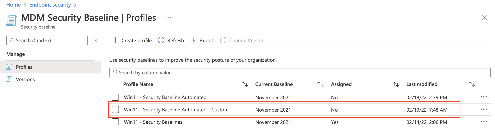
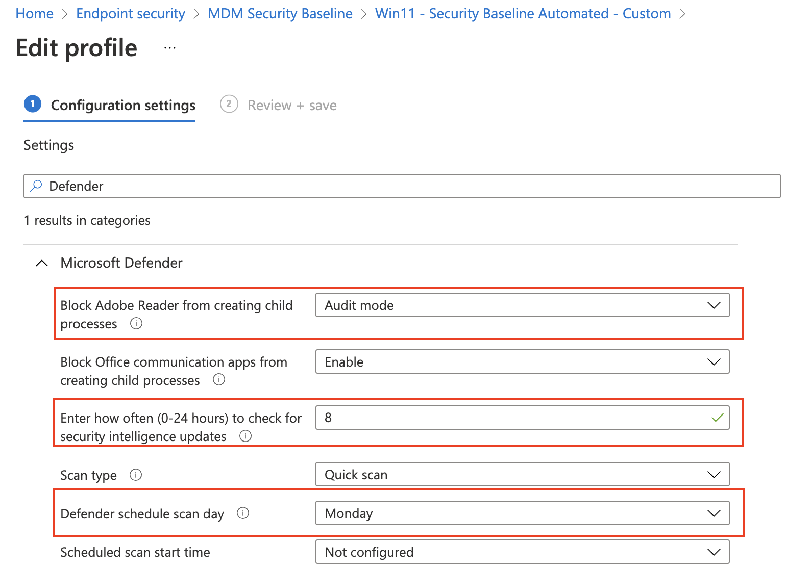

## Assign security baseline

Before the security baselines work, we need to assign the baseline to something. There are three types of assignment, users, groups, and devices. If you don’t need special assignments (like to specific users or devices) use add all users or all devices. Currently, filters are not available at the security baseline level so if you need some filtering, then use (dynamic) groups. Please check [my post about securing and optimizing AVD hosts and CloudPC](https://www.rozemuller.com/secure-and-optimize-avd-and-cloudpc-using-microsoft-endpoint-manager/#assign-security-baseline) to learn more about assigning groups.

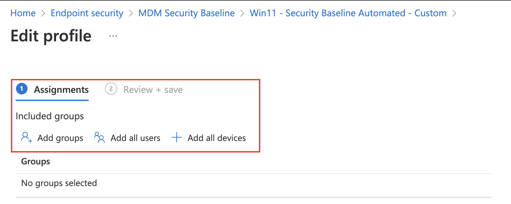

In this chapter, I focus on assigning the security baseline to all users and all devices. In the upcoming paragraphs, I will show how to assign the security baseline automated to all users and all devices.

### Assign security baseline to all devices automated

We are going back to the first security baseline profile I created automated, Win11 – Security Baseline Automated profile. As shown in the screenshot below the profile is not assigned.

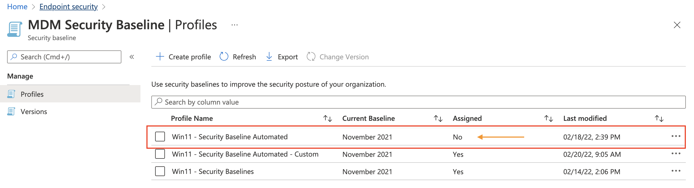
At first, I query for the security baseline profile with the code below. For authentication, I reused the commands in the first chapter.

```
$getParams = @{
    method  = "GET"
    uri     = "https://graph.microsoft.com/beta/deviceManagement/intents?`$filter=displayName eq 'Win11 - Security Baseline Automated'"
    headers = $authHeader
}
$templates = Invoke-RestMethod @getParams
$templates.value
```

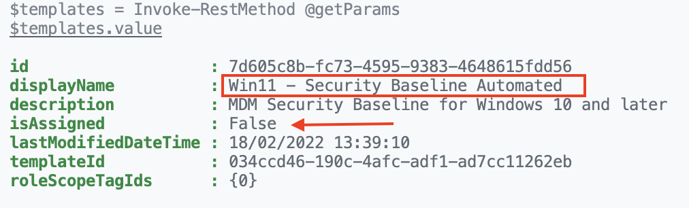

As shown in the output, the security baseline is not assigned. Let’s go further with the next step, assign the security baseline automated.

I stored the output in the $templates variable. This is because I need the id in the next step.

To assign the security baseline to all devices, I use the code below.   
At first, I create a body that will be sent in the POST request. The body must be in JSON format, so I convert the PowerShell hashtable into JSON format. Because the hashtable has more than 2 nested objects (4), I also provide the -Depth parameter.

```powershell
$assignBody = @{
    "assignments" = @(
        @{
            "@odata.type" = "#microsoft.graph.deviceManagementIntentAssignment"
            "id" = $(New-Guid).Guid
            "target" = @{
                "@odata.type"                                = "#microsoft.graph.allDevicesAssignmentTarget"
                "deviceAndAppManagementAssignmentFilterType" = "none"
            }
        }
    )
}
$assignBody = $assignBody | ConvertTo-Json -Depth 4
```

After converting the hashtable into a JSON format the content looks like below.

```
<pre class="wp-block-code">```json
{
  "assignments": [
    {
      "@odata.type": "#microsoft.graph.deviceManagementIntentAssignment",
      "id": "9a311654-a756-4089-a6a9-b9ba4a0a8aa3",
      "target": {
        "@odata.type": "#microsoft.graph.allDevicesAssignmentTarget",
        "deviceAndAppManagementAssignmentFilterType": "none"
      }
    }
  ]
}
```

If you are not sure about the -Depth number then use 99, which is the max depth number. If the number is too low the content looks like something like below. You also will get an error:

<meta charset="utf-8"></meta>WARNING: Resulting JSON is truncated as serialization has exceeded the set depth of n

```powershell
$assignBody = $assignBody | ConvertTo-Json -Depth 2
WARNING: Resulting JSON is truncated as serialization has exceeded the set depth of 2.
```

```
{
  "assignments": [
    {
      "@odata.type": "#microsoft.graph.deviceManagementIntentAssignment",
      "id": "6f05b34b-bdb5-4f60-aa9d-b7dbae043349",
      "target": "System.Collections.Hashtable" <----- This is not good
    }
  ]
}
```

In the end, create the POST request with the JSON body, the header, and the correct URI.

```powershell
$newProfileId = $template.value.id
$postParams = @{
    method  = "POST"
    uri     = "https://graph.microsoft.com/beta/deviceManagement/intents/{0}/assign" -f $newProfileId
    headers = $authHeader
    body = $assignBody
}
Invoke-RestMethod @postParams
```

The assignment POST request returns a **NULL** value. To check afterward use the GET request again.

```powershell
$getParams = @{
    method  = "GET"
    uri     = "https://graph.microsoft.com/beta/deviceManagement/intents?`$filter=displayName eq 'Win11 - Security Baseline Automated'"
    headers = $authHeader
}
$assignToProfile = Invoke-RestMethod @getParams
$assignToProfile.value
```

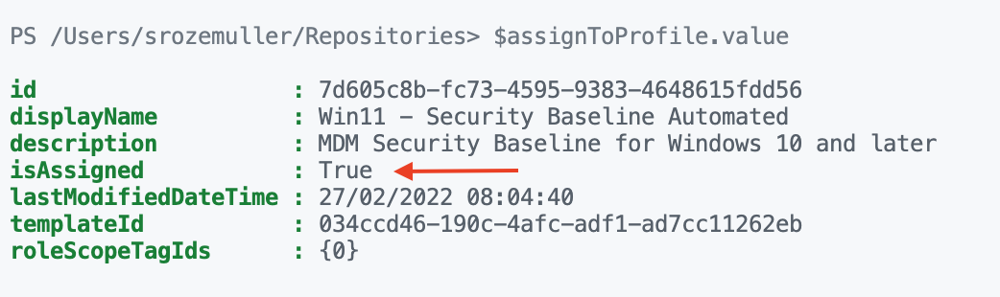

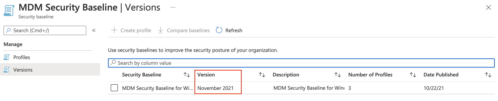

### Assign security baseline to all users automated

If you want to assign the profile to all users, then use the ***microsoft.graph.allLicensedUsersAssignmentTarget*** as the @odata.type. See the body below.

```powershell
$assignBody = @{
    "assignments" = @(
        @{
            "@odata.type" = "#microsoft.graph.deviceManagementIntentAssignment"
            "id" = $(New-Guid).Guid
            "target" = @{
                "@odata.type"                                = "#microsoft.graph.allLicensedUsersAssignmentTarget"
                "deviceAndAppManagementAssignmentFilterType" = "none"
            }
        }
    )
}
$assignBody = $assignBody | ConvertTo-Json -Depth 4
```

## Versions

Every security baseline has its own version provided by Microsoft. Good to know is that when a new version becomes available, the currently selected version becomes read-only. In fact, this means that your current production baseline is not editable anymore. But, the settings still will do their job. Another thing is when a new version becomes available, profiles will **NOT** be updated automatically to the latest version.

[version](version.png)
To check the version I used the code below. I return back to the MDM Security Baseline for Windows 10 template.

```
$getParams = @{
    method  = "GET"
    uri     = "https://graph.microsoft.com/beta/deviceManagement/templates?`$filter=startswith(displayName, 'MDM Security Baseline for Windows 10')"
    headers = $authHeader
}
$templates = Invoke-RestMethod @getParams
$templates.value
```

When looking at the back of the template the information looks like below. The version is stored in the title as in the version info object. Because there is no other version available at this time, I can’t test with other versions. But I do think the **isDeprecated** value also represents the current version. I think the isDeprecated value will become **True** when a new version is available.

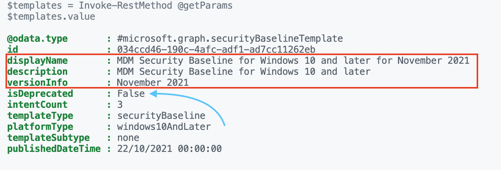

The URL below points to the <meta charset="utf-8"></meta>MDM Security Baseline for Windows 10. The other baselines are also stored at that location.

<https://docs.microsoft.com/en-us/mem/intune/protect/security-baseline-settings-mdm-all?pivots=november-2021>

## Summary

In this blog post, I security baseline was explained. I showed the components and how to create a profile automated. Also, I explained how to create a baseline with custom settings. In the upcoming post around the security baseline subject, I will show how to monitor security baselines at different points. Which values are important and how to get the correct information.

Thank you for reading this blog about security baselines explained. I hope you got a bit inspired.

