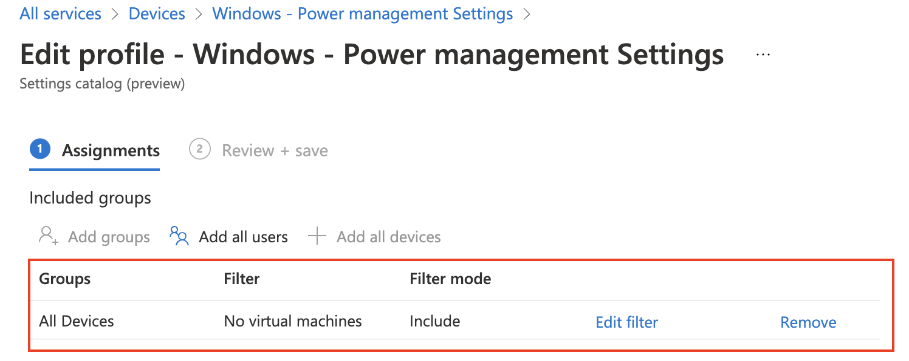

Climate changes are the talk of the day. Every little step to help the world is great. Power consumption is a big topic in those discussions. In this blog post, I show how to deploy power management settings automated in Microsoft Intune. This is to save battery on hardware devices. I also show how to assign the policy to the devices part with a filter.

Together with [Mattias Melkersen](https://twitter.com/MMelkersen) (Twitter), we decided to write a blog about how to configure power settings in Microsoft Intune. Matthias has [written a blog](https://blog.mindcore.dk/2022/02/manage-power-settings-via-microsoft.html) about how to configure power settings in the portal. Based on that post, I’m writing a post about how to configure power settings the automated way.



## Authentication

To deploy settings in Microsoft Intune we need to authenticate. During deployment, I use the Graph API. To authenticate against the Graph API we need API permissions. The API permissions are set at an application registration. The application registration needs the following permissions:

- **DeviceManagementConfiguration.ReadWrite.All**   
    *(Allows the app to read and write properties of Microsoft Intune-managed device configuration and device compliance policies and their assignment to groups, without a signed-in user.)*

To authenticate against the Graph API I used the PowerShell code below:

```powershell
$appId = "077d124e"
$appSecret = "0UF7Q"
$tenantId = "dag7"

$body = @{    
    grant_Type    = "client_credentials"
    scope         = "https://graph.microsoft.com/.default"
    client_Id     = $appId
    client_Secret = $appSecret 
} 
$connectParams = @{
    uri = "https://login.microsoftonline.com/{0}/oauth2/v2.0/token" -f $tenantId
    method = "POST" 
    body = $body
}
$connect = Invoke-RestMethod @connectParams
$authHeader = @{
    'Content-Type' = 'application/json'
    Authorization  = 'Bearer ' +$connect.access_token
}
```

If you are not that familiar with REST API authentication then it also possible to use the PowerShell command **Get-AzAccessToken**. To use that command you need to connect to Azure first with **Connect-AzAccount**. I also connect with the application. If you use these commands, install the **Az.Accounts** PowerShell module.

```powershell
$passwd = ConvertTo-SecureString $appSecret -AsPlainText -Force
$pscredential = New-Object System.Management.Automation.PSCredential($appId, $passwd)
Connect-AzAccount -ServicePrincipal -Credential $pscredential -Tenant $tenantId
$token = Get-AzAccessToken -ResourceUrl 'https://graph.microsoft.com'
$authHeader = @{
    'Content-Type' = 'application/json'
    Authorization  = 'Bearer ' + $token.Token
}
```

## Deploy power settings policy automated

In this chapter, we configure a configuration policy named Windows – Power management settings. The policy is created with the Graph API. In the first part, I discuss the settings and how it is formatted. In the second part, I show how to bring all parts together and sent the request to the Graph API.

### Power management settings

A configuration policy consists of settings. Within this policy, I configure the following settings based on the **settings catalog**.

The settings are based on [Mattias Melkersen his blogpost](https://blog.mindcore.dk/2022/02/manage-power-settings-via-microsoft.html) and [Kenneth Van Surksum his blog post](https://www.vansurksum.com/2021/03/30/configuring-windows-update-for-business-settings-for-your-microsoft-endpoint-manager-managed-modern-workplace/) (scroll down to the Power Settings chapter) about power management. I also added some extra settings which I think also helps.

| **Category** | **Setting Location** | **Setting** | **Value** |
|---|---|---|---|
| General | Administrative Templates &gt; System &gt; Power Management | Select an active power plan | Enabled |
| General | Administrative Templates &gt; System &gt; Power Management | Active Power Plan: (Device) | Automatic |
| Power | Administrative Templates &gt; System &gt; Power Management &gt; Hard Disk Settings | Turn Off the hard disk (plugged in) | Disabled |
| Power | Administrative Templates &gt; System &gt; Power Management &gt; Hard Disk Settings | Turn Off the Hard Disk (seconds)(Device) | 0 |
| Power | Administrative Templates &gt; System &gt; Power Management &gt; Notification Settings | Low battery notification action | Enabled |
| Power | Administrative Templates &gt; System &gt; Power Management &gt; Notification Settings | Low Battery Notification Action (Device) | Sleep |
| Power | Administrative Templates &gt; System &gt; Power Management &gt; Notification Settings | Low battery notification level | Enabled |
| Power | Administrative Templates &gt; System &gt; Power Management &gt; Notification Settings | Low Battery Notification Level (Device) (in percent) | 5 |
| Power | Administrative Templates &gt; System &gt; Power Management &gt; Sleep Settings | Require a password when a computer wakes (plugged in) | Enabled |
| Power | Administrative Templates &gt; System &gt; Power Management &gt; Sleep Settings | Specify the system sleep timeout (plugged in) | Enabled |
| Power | Administrative Templates &gt; System &gt; Power Management &gt; Sleep Settings | System Sleep Timeout (seconds) | 1200 |
| Power | System &gt; Power Management &gt; Video and Display Settings | Turn off the display (plugged in) | Enabled |
| Power | System &gt; Power Management &gt; Video and Display Settings | When plugged in, turn display off after (seconds) | 300 |
| Power | Power | Select Lid Close Action Plugged In | Sleep |
| Power | Power | Select Power Button Action Plugged In | System |

Power plugged in settings

| **Category** | **Setting Location** | **Setting** | **Value** |
|---|---|---|---|
| General | Administrative Templates &gt; System &gt; Power Management | Select an active power plan | Enabled |
| General | Administrative Templates &gt; System &gt; Power Management | Active Power Plan: (Device) | Automatic |
| Battery | Administrative Templates &gt; System &gt; Power Management &gt; Hard Disk Settings | Turn Off the hard disk (on battery) | Enabled |
| Battery | Administrative Templates &gt; System &gt; Power Management &gt; Hard Disk Settings | Turn Off the Hard Disk (seconds)(Device) | 1 |
| Battery | Administrative Templates &gt; System &gt; Power Management &gt; Sleep Settings | Require a password when a computer wakes (battery) | Enabled |
| Battery | Administrative Templates &gt; System &gt; Power Management &gt; Sleep Settings | Specify the system sleep timeout (plugged in) | Enabled |
| Battery | Administrative Templates &gt; System &gt; Power Management &gt; Sleep Settings | System Sleep Timeout (seconds) | 600 |
| Battery | System &gt; Power Management &gt; Video and Display Settings | Turn off the display (battery) | Enabled |
| Battery | System &gt; Power Management &gt; Video and Display Settings | When plugged in, turn display off after (seconds) | 60 |
| Power | Power | Select Lid Close Action Plugged In | Sleep |
| Power | Power | Select Power Button Action Plugged In | System |
| General | Power | Energy Saver Battery Threshold On Battery | 10 |

Battery settings


### Settings body

Because it makes life much easier, I converted all the settings into a JSON file. The idea is to read the content and add the content to the request body. The file with the power configuration policy setting is [stored in my GitHub repository](https://github.com/srozemuller/MicrosoftEndpointManager/blob/main/ConfigurationPolicies/power-management-settings.json). A part file content looks like below.

```json
{
    "id": "1",
    "settingInstance": {
      "@odata.type": "#microsoft.graph.deviceManagementConfigurationChoiceSettingInstance",
      "settingDefinitionId": "device_vendor_msft_policy_config_admx_power_diskacpowerdowntimeout_2",
      "settingInstanceTemplateReference": null,
      "choiceSettingValue": {
        "settingValueTemplateReference": null,
        "value": "device_vendor_msft_policy_config_admx_power_diskacpowerdowntimeout_2_0",
        "children": []
      }
    }
  }
```

## Deploy configuration policy automated

In the post body below I set up the name and description. The platforms and technologies objects are Microsoft predefined settings. The settings object is filled with the JSON content file. I convert the content back to a PowerShell object first. This to create a request body with PowerShell objects only. In the end, I convert the whole body into a JSON object.   
If you are converting JSON content twice you get really strange content that the REST API is not accepting.

For more information about the request body, check the URL: <https://docs.microsoft.com/en-us/graph/api/intune-deviceconfigv2-devicemanagementconfigurationpolicy-create?view=graph-rest-beta#request-body>

```
$policyBody = @{
    "@odata.type"  = "#microsoft.graph.deviceManagementConfigurationPolicy"
    "name"         = "Windows - Power management Settings"
    "description"  = "Settings for Windows power management"
    "platforms"    = "windows10"
    "technologies" = "mdm"
    "settings"     = @( 
        Get-Content ./power-management-settings.json| ConvertFrom-Json
    )
}
```

After the body is done, I’m putting all the parts together into a PowerShell object. The URL, method, headers (from the first chapter), and the body with the settings. I’m using the PowerShell splatting technique to execute the command with all the parameters.

```powershell
$policyUrl = "https://graph.microsoft.com/beta/deviceManagement/configurationPolicies"
$policyParams = @{
    URI     = $policyUrl 
    Method  = "POST"
    Headers = $authHeader
    Body    = $policyBody | ConvertTo-Json -Depth 99
}
$policy = Invoke-RestMethod @policyParams
$policy
```


The result


## Power settings assignment with filters

In the last part, we assign the policy to all NOT virtual machines. This is because virtual machines actually don’t have a battery and the policy is not applicable to those machines. To create a ‘NOT’-group I use filters. Based on the device’s model I created a filter where the module is not equal to virtual machines.


For more information about filters, check the URL: <https://docs.microsoft.com/en-us/mem/intune/fundamentals/filters>

*Creating filters automated is out of the scope of the blog.*

I searched for the created filter with the code below and used the ID in the assignment body.

```powershell
$filterUrl = "https://graph.microsoft.com/beta/deviceManagement/assignmentFilters"
$filterParams = @{
    URI     = $filterUrl 
    Method  = "GET"
    Headers = $authHeader
}
$filters = Invoke-RestMethod @filterParams
$filters.value | Where-Object {$_.displayName -eq 'No virtual machines'}
```

To assign policies automated with PowerShell I used the code below. First is the request body. I create a new GUID and provided the $filters.value.id value as the filter ID. At last, I convert to body into JSON format.

```powershell
$assignBody = @{
    "assignments" = @(
        @{
            id     = $(New-Guid).Guid
            target = @{
                "@odata.type"                              = "#microsoft.graph.allDevicesAssignmentTarget"
                deviceAndAppManagementAssignmentFilterType = "include"
                deviceAndAppManagementAssignmentFilterId   = $filters.value.id
            }
        }
    )
}
$assignBody = $assignBody | ConvertTo-Json -Depth 4
```

In the request, I provide the $assignBody and the $policy.Id from the steps above.

```powershell
$assignmentUrl = "https://graph.microsoft.com/beta/deviceManagement/configurationPolicies/{0}/assign" -f $policy.id
$policyParams = @{
    URI     = $assignmentUrl 
    Method  = "POST"
    Headers = $authHeader
    Body    = $assignBody
}
$assignment = Invoke-RestMethod @policyParams
$assignment
```


## Summary

In this post, I showed how to configure power management settings in Microsoft Intune the automated way. I showed how to create a configuration policy and how to assign the policy to all devices. A part of the assignment is the use of filters.

Thank you for reading this blog about how to enroll power management settings automated in Microsoft Intune. 

