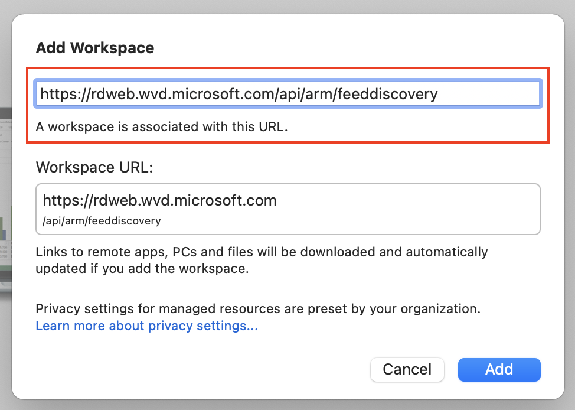
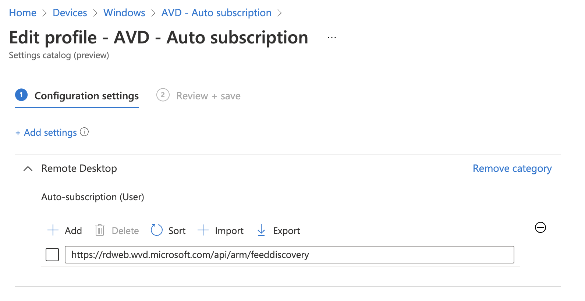
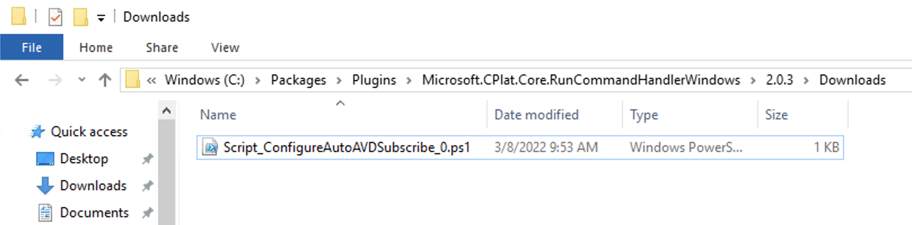
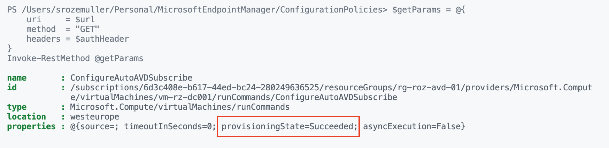

Azure Virtual Desktop (AVD) is a great addition to your IT environment. To connect to an AVD environment you need a browser or the Remote Desktop client. When using the browser you have to go to the ‘rdweb’-URL. When using the remote desktop client, you need to subscribe to a workplace. In this blog post, I show how to configure the subscribe URL for AVD automated. How to configure this setting in MEM automated. Also, I show a way to deploy the setting if you are not using MEM.

This specific setting became available on 7 March 2022 as a new setting in the settings catalog. The main idea of this post is to show some ways how to configure auto subscribe for AVD in the remote desktop client. This is the URL that you need to subscribe to in the case you are using Azure Virtual Desktop. The AVD subscribe URL is *https://rdweb.wvd.microsoft.com/api/arm/feeddiscovery*. Till the setting became available in MEM we had to configure this in other ways (later in this blog). Now the setting is available I show how to configure a configuration policy with the Remote Desktop – Auto subscription URL automated.





## AVD Auto subscription with Microsoft Intune

In this first chapter, I show how to deploy a configuration policy with the Remote Desktop Auto Subscribe URL automated. The policy is assigned to all devices. Before we are able to deploy the AVD auto subscribe policy automated we need to authenticate first. In earlier posts, [I described how to authenticate based on an application registration](https://www.rozemuller.com/deploy-power-settings-automated-in-microsoft-endpoint-manager/#auth). For now, I skip that part. The following permissions are needed:

- **DeviceManagementConfiguration.ReadWrite.All**  
    *(Allows the app to read and write properties of Microsoft Intune-managed device configuration and device compliance policies and their assignment to groups, without a signed-in user.)*

### Auto subscribe policy settting

The auto subscribe setting is quite simple. The settings have an input field where to store an URL. I searched for this setting at the back and created a JSON file which I provide in the body in the next step. The [JSON file is in my GitHub repository](https://github.com/srozemuller/MicrosoftEndpointManager/blob/main/ConfigurationPolicies/power-management-settings.json).

```powershell
{
    "id": "0",
    "settingInstance": {
        "@odata.type": "#microsoft.graph.deviceManagementConfigurationSimpleSettingCollectionInstance",
        "settingDefinitionId": "user_vendor_msft_policy_config_remotedesktop_autosubscription",
        "settingInstanceTemplateReference": null,
        "simpleSettingCollectionValue": [
            {
                "@odata.type": "#microsoft.graph.deviceManagementConfigurationStringSettingValue",
                "settingValueTemplateReference": null,
                "value": "https://rdweb.wvd.microsoft.com/api/arm/feeddiscovery"
            }
        ]
    }
}
```

In the post body below I set up the name and description. The platforms and technologies objects are Microsoft predefined settings. The settings object is the JSON content file. I convert the content back to a PowerShell object first. This is to create a request body with PowerShell objects only. In the end, I convert the whole body into a JSON object.  
If you are converting JSON content twice you get really strange content that the REST API is not accepting.

```powershell
$policyBody = @{
    "@odata.type"  = "#microsoft.graph.deviceManagementConfigurationPolicy"
    "name"         = "AVD - Auto subscription settings"
    "description"  = "Settings for AVD"
    "platforms"    = "windows10"
    "technologies" = "mdm"
    "settings"     = @( 
        Get-Content ./avd-autosubscription-settings.json | ConvertFrom-Json
    )
}
$policyUrl = "https://graph.microsoft.com/beta/deviceManagement/configurationPolicies"
$policyParams = @{
    URI     = $policyUrl 
    Method  = "POST"
    Headers = $authHeader
    Body    = $policyBody | ConvertTo-Json -Depth 99
}
$policy = Invoke-RestMethod @policyParams
$policy
```

In the end, I have a policy with the auto-subscribe URL.



## Auto subscription configuration on Azure VM (for image management)

Most customers are not using an Azure VM as a client. But in some cases, I use an Azure VM for image management. If you are not using Microsoft Intune (MEM) or have an Azure virtual machine, there is another option to configure the auto subscription setting. At the back also MEM adds a registry key with a value. Thank you Tom Hickling for providing the key.

*HKEY\_CURRENT\_USER\\Software\\Policies\\Microsoft\\Windows NT\\Terminal Services\\AutoSusbscription  
Reg\_SZ: <https://rdweb.wvd.microsoft.com/api/arm/feeddiscovery>*

I’ve [created a PowerShell script](https://github.com/srozemuller/AVD/blob/main/Auto%20subscription/auto-subscription.ps1) to run on the Azure virtual machine. ***(NOTE: These machines are not the AVD session host but normal virtual machines)***  
You are able to run the script during imaging or on the virtual machine in later steps. In this example, I use the [**RunCommands** REST API](https://docs.microsoft.com/en-us/rest/api/compute/virtual-machine-run-commands/create-or-update) command to run the script on an Azure virtual machine. If you use the Invoke-AzVmRunCommand, make sure you have stored the file on the device from where the command is started. The script I created is at my GitHub repository.

To use the Azure management API we also need to authenticate. This time we need to authenticate in Azure. In PowerShell use the Connect-AzAccount command. Make sure you log in with an account with at least a **Virtual Machine Contributor** role. <https://docs.microsoft.com/en-us/azure/virtual-machines/windows/run-command#limiting-access-to-run-command>

```powershell
$vm = Get-Azvm -ResourceGroupName "rg-vms" -Name "vm-01"
$runCommandName = "ConfigureAutoAVDSubscribe"
$url = "https://management.azure.com/{0}/runCommands/{1}?api-version=2021-04-01" -f $vm.Id, $runCommandName
$body = @{
    location   = $vm.Location
    properties = @{
        source = @{
            scriptUri = "https://raw.githubusercontent.com/srozemuller/AVD/main/Auto%20subscription/auto-subscription.ps1"
            commandId = "RunPowerShellScript"
        }
    }
} | ConvertTo-Json
$postParams = @{
    uri     = $url
    method  = "PUT"
    body    = $body
    headers = $authHeader
}
Invoke-RestMethod @postParams
```

The PowerShell script has been downloaded on the virtual machine after executing the command. Thereafter the PowerShell is executed.


Use the URL to get the status for monitoring.

```powershell
$getParams = @{
    uri     = $url
    method  = "GET"
    headers = $authHeader
}
Invoke-RestMethod @getParams
```


! [avd-autosubscribe-registry](avd-autosubscribe-registry.png)

## Auto subscribe without MEM or in image management

There could be also a situation where Microsoft Intune is not involved. Because you are managing endpoints in another way or in the case of creating images for autopilot or in the Azure Compute gallery. In that case, it is just a matter of executing the PowerShell script on the device. The [script](https://github.com/srozemuller/AVD/blob/main/Auto%20subscription/auto-subscription.ps1) is in my GitHub repository.

When creating images with platforms Azure DevOps add the script in a YAML task and add it to your sequence. I’ve added a short example below.

```yaml
- task: AzurePowerShell@5
  name: AVD_AutoSubscribe
  displayName: Deploying AVD auto subscribe URL
  enabled: true
  inputs:
    azureSubscription: ${{ parameters.ServiceConnection }}
    ScriptType: 'FilePath'
    ScriptPath: "$(Pipeline.Workspace)/auto-subscription.ps1"
    errorActionPreference: 'stop'
    azurePowerShellVersion: 'LatestVersion'
```

## Summary

In this blog post, I show different ways to configure the AVD subscription URL automated. I showed how to configure this setting in Microsoft Intune, as on an Azure virtual machine. Also, I showed an example of how to embed the configuration script into a YAML DevOps pipeline.

Thank you for reading this blog about how to configure auto subscribe for AVD in the remote desktop client automated. 

