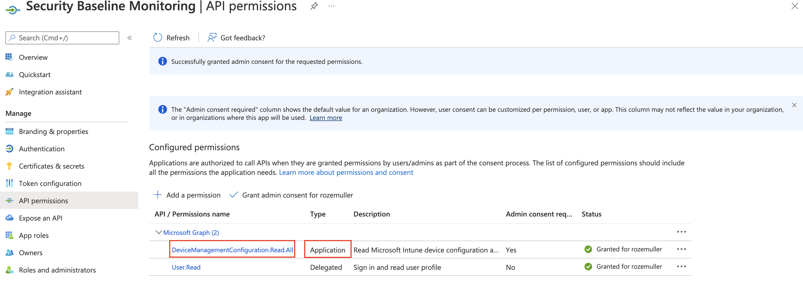
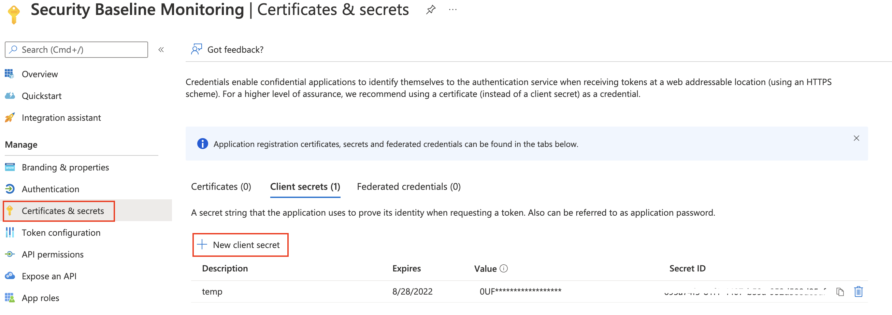
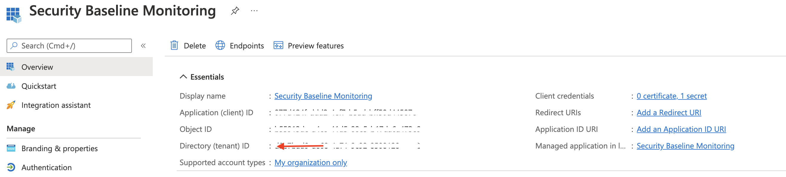
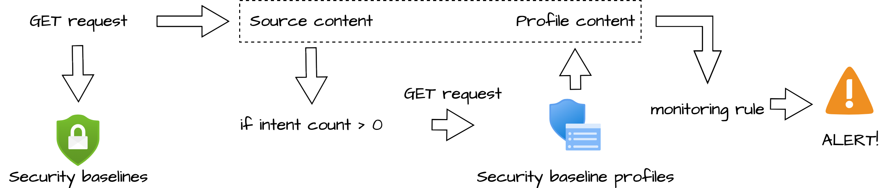
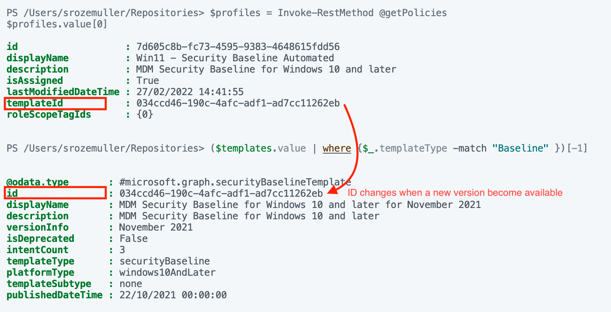
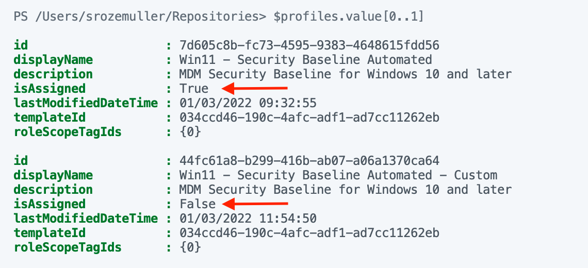
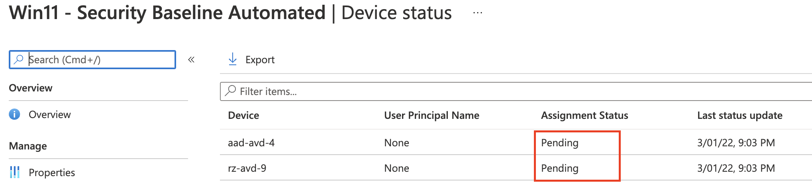
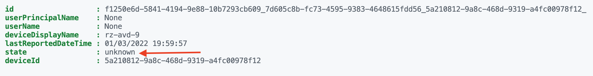

A security baseline has some values which are interesting to know. It has a status that tells us the current deployment status if a profile is assigned or is deprecated. In this post, I show how to monitor security baselines. The current status, versions, and if a profile is assigned. I will explain which data is important, how to get the data and show different ways to send alerts.

To understand security baselines please read [my security baseline explained post](https://www.rozemuller.com/microsoft-endpoint-managerm-security-baselines-explained/) first. This post is going further on that base.



## Security baselines data

Security baselines have some important data which need attention. In this chapter, I will show why this data is important and how to get this data. As shown in [my earlier post](https://www.rozemuller.com/microsoft-endpoint-managerm-security-baselines-explained/), security baselines are templates with predefined settings. A security baseline consists of profiles with **versions**. Based on the settings you are able to create a profile. The profile can be **assigned** to a group, all users, or all devices. After assignment, a profile gets a **status**.

Those three values are important and tell if a security baseline is working fine and is up-to-date.

### Application and permissions

To get security baseline data, we use the Graph API. Before getting data from the Grapp API we need to authenticate first. For authentication, I use an application registration in the Azure Active Directory. This application has only read permissions at the **application** level:

*DeviceManagementConfiguration.Read.All*



Thereafter go to **certificates &amp; secrets** and create an application secret.



### Authenticate to Graph API with PowerShell

After we have created an application registration with the correct permissions, it is time to authenticate. To authenticate to Graph API with PowerShell I used the code below. Use the just created application’s ID and secret. Also, make sure you have the tenant ID. Find the tenant ID under the application’s **overview**.



We are able to log in now.

```powershell
$secMonAppId = "xx"
$secMonAppSecret = "xx"
$tenantId = "xx"

$body = @{    
    grant_Type    = "client_credentials"
    scope         = "https://graph.microsoft.com/.default"
    client_Id     = $secMonAppId 
    client_Secret = $secMonAppSecret
} 
$connectParams = @{
    uri = "https://login.microsoftonline.com/{0}/oauth2/v2.0/token" -f $tenantId
    method = "POST" 
    body = $Body
}
$connect = Invoke-RestMethod @connectParams
$authHeader = @{
    'Content-Type' = 'application/json'
    Authorization  = 'Bearer ' +$connect.access_token
}
```

### Get security baseline data

Next, after authentication, we get security baseline data. I used the code below to get security baseline data and saved the output in a variable (we need that later).

```powershell
$getParams = @{
    method  = "GET"
    uri     = "https://graph.microsoft.com/beta/deviceManagement/templates"
    headers = $authHeader
}
$templates = Invoke-RestMethod @getParams
$templates.value
```

How do you know when a new version becomes available? Let’s take a look closer at the content below. This content is an output of a security baseline.

```basic
@odata.type       : #microsoft.graph.securityBaselineTemplate
id                : 034ccd46-190c-4afc-adf1-ad7cc11262eb
displayName       : MDM Security Baseline for Windows 10 and later for November 2021
description       : MDM Security Baseline for Windows 10 and later
versionInfo       : November 2021
isDeprecated      : False
intentCount       : 3
templateType      : securityBaseline
platformType      : windows10AndLater
templateSubtype   : none
publishedDateTime : 22/10/2021 00:00:00
```

As you can see there are some values that tell us something about the version. At first, the version name is in the **display name**. Also, we have the **version info** object, which tells us the version is from November 2021. Also, we have the **publishedDateTime** object. The published data is on 22 October 2021. A change in one of these objects indicated there was a change.

Another interesting object is the isDeprecated object. The False value means NOT deprecated. When the value becomes True the version is deprecated and not up-date-date anymore.

After doing some research I also found out that the security baseline’s ID is unique. Unique in that way that when a new version becomes available also the ID will change.

## Monitor security baselines

In the upcoming paragraphs, I will show how to get the correct data and how to use it. After we have the data I will show some alerting mechanisms.

### Monitoring strategy

The idea is to use the baseline information (from above) as the source. The source information has an object called **intentCount**. When the intent count value is greater than 0, it means the baseline has profiles. If a baseline has profiles then we need to look for the profiles.   
After requesting the profiles I use the output to compare with the source baseline.



### Security baseline version monitoring

As mentioned in [my security baseline explain post](https://www.rozemuller.com/microsoft-endpoint-managerm-security-baselines-explained/#versions), security baselines have versions. A version represents a baseline with settings and values. Each new version instance of a baseline can add or remove settings or introduce other changes. Because baselines are not updating to new versions automatically, it is a good idea to monitor your own baselines as Microsoft’s baseline. An older version remains to work but it is a best practice to update profiles to the latest versions as soon as possible.

I asked the Microsoft product team what is happening when a new version becomes available. One of the things which happen is the change of the security baseline ID. Every security baseline version has its own ID. With that in mind, we could make a match between the security baseline ID and the templateID object from the profile.

I used the code below, to get the profiles. I reused the authentication header from the first chapter.

```powershell
$getPolicies = @{
    method  = "GET"
    uri     = "https://graph.microsoft.com/beta/deviceManagement/intents"
    headers = $authHeader
}
$policies = Invoke-RestMethod @getPolicies
$policies.value
```

In the output below I have the security baseline and a profile in the baseline. In the profile output, you see a templateID. This is the ID of the source template. In the case of a new version, the ID value of the template will change. In that case, there won’t be a match which means the source template has changed.


*At this moment of writing, there is only one version available at every security baseline.*

### Security baseline assignment monitoring

A security baseline profile only makes sense when it is assigned. Otherwise, an ’empty’ baseline profile is quite useless. From another perspective, I want to keep my environment as clean as possible. I want to know if a profile is assigned.   
Monitoring assignment in basics is not very hard. When requesting profiles you will notice there is an isAssigned object. The **true** value means the profile is assigned.


I’m also working on a blog post about advanced assignment monitoring. In this blog, I will show how to get more detailed assignment information.

### Security baseline status monitoring

This monitoring rule differs from the other two above. This is because a security baseline profile has no status in itself. Monitoring security baseline statuses is at the device level. A profile in combination with a device has several status events. It tells if a profile is active or has some errors. To monitor the status we have to look into the profile.

A profile can have the following statuses:

- **Succeeded**: Policy is applied.
- **Error**: The policy failed to apply. The message typically displays with an error code that links to an explanation.
- **Conflict**: Two settings are applied to the same device, and Intune can’t sort out the conflict. An administrator should review.
- **Not applicable**: The device can’t receive the policy. For example, the policy updates a setting specific to the latest version of Windows, but the device runs an older (earlier) version that doesn’t support that setting

Pending is also a security baseline profile status but is not added to the global profile overview. But with the Graph API, this status is catchable.

- **Pending**: The device hasn’t checked in with Intune to receive the policy yet.

Source: <https://docs.microsoft.com/en-us/mem/intune/protect/security-baselines-monitor>

To get profile statuses you need the profile ID. The ID is retrieved with the code below.

```powershell
$getParams = @{
    method  = "GET"
    uri     = "https://graph.microsoft.com/beta/deviceManagement/intents?`$filter=displayName eq 'Win11 - Security Baseline Automated'"
    headers = $authHeader
}
$templates = Invoke-RestMethod @getParams
$templates.value
```

The template output is used below to read the device statuses per profile.

```powershell
$profileId = $templates.value.id
$getStatus = @{
    method  = "GET"
    uri     = "https://graph.microsoft.com/beta/deviceManagement/intents/{0}/deviceStates" -f $profileId
    headers = $authHeader
}
$status = Invoke-RestMethod @getStatus
$status.value
```

In the case below we have a **pending** state.




## Summary

In this post, I showed how to get data to monitor security baseline profiles.

Thank you for reading this blog about how to monitor security baselines in Endpoint Security. I hope you got a bit inspired.

Enjoy your day and happy automating 👋