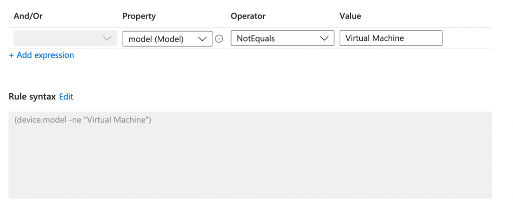
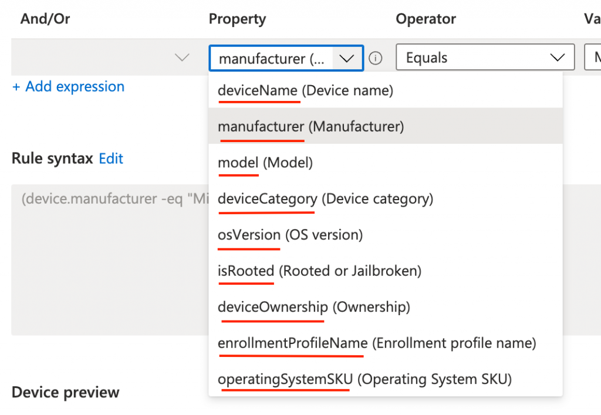

Intune filters are a great way to assign MEM policies to devices. In fact, filters go over groups in several scenarios. Filters help you keep your environment reliable and fast. In this blog, I do some basic explanations about filters, how to use filters, and show how to create Intune filters in an automated way. At last, I show how to assign filters to policies.



## Filters in basics

Filters has to do with targeting. When you create a policy, you can use filters to assign a policy based on rules you create. A filter allows you to narrow the assignment scope of a policy. For example, to target devices with a specific OS version or a specific manufacturer. In relation to AD groups, filtering is high performance and low latency. In the rule syntax you add expressions to create a set of rules based on device properties. Good to know is that expressions are only at the device level.


### Why filters instead of dynamic groups?

Several ways are available to group a set of devices dynamically. Using filters is one, and secondly there are dynamic groups. In both there is a rule syntax so what is the difference. I’m not going into detail in this post but the main fact it is all about **performance**. Azure AD and Intune are two different enviroment/platforms. Between the platforms synchronisation takes place. When having a 10k devices + environment every synchronisation has a large impact.

If you assign Intune workloads to large Azure AD groups containing many users or devices, it may cause large synchronization backlogs in your account. This impacts policy and app deployments, which will take longer to reach managed devices.

Filters takes place at the **All Users** and **All Devices** virtual groups. These groups only exists in Intune. When using filters over virtual groups no new synchronisation is needed. The best way to understand is to compare filters with a SQL view on a database. A SQL view shows information over (multiple) SQL tables to get all needed information together without creating new tables every time with all needed information.   
For more information about grouping, filtering and targeting the URL below.

<https://techcommunity.microsoft.com/t5/intune-customer-success/intune-grouping-targeting-and-filtering-recommendations-for-best/ba-p/2983058>

Or the the recording at: <https://techcommunity.microsoft.com/t5/video-hub/microsoft-endpoint-manager-a-deep-dive-on-grouping-targeting-and/ba-p/2911265>

For a filter overview please check the Microsoft documentation: <https://docs.microsoft.com/en-us/mem/intune/fundamentals/filters>

## Authentication

To deploy filters in Microsoft Endpoint Manager we need to authenticate. I use the Graph API for automated filter deployment. To authenticate against the Graph API we need API permissions. The API permissions are set at an application registration. The application registration needs the following permissions:

- **DeviceManagementConfiguration.ReadWrite.All**   
    *(Allows the app to read and write properties of Microsoft Intune-managed device configuration and device compliance policies and their assignment to groups, without a signed-in user.)*

To authenticate against the Graph API I used the PowerShell code below:

```powershell
$appId = "077d124e"
$appSecret = "0UF7Q"
$tenantId = "dag7"

$body = @{    
    grant_Type    = "client_credentials"
    scope         = "https://graph.microsoft.com/.default"
    client_Id     = $appId
    client_Secret = $appSecret 
} 
$connectParams = @{
    uri = "https://login.microsoftonline.com/{0}/oauth2/v2.0/token" -f $tenantId
    method = "POST" 
    body = $body
}
$connect = Invoke-RestMethod @connectParams
$authHeader = @{
    'Content-Type' = 'application/json'
    Authorization  = 'Bearer ' +$connect.access_token
}
```

If you are not that familiar with REST API authentication then it also possible to use the PowerShell command **Get-AzAccessToken**. To use that command you need to connect to Azure first with **Connect-AzAccount**. I also connect with the application. If you use these commands, install the **Az.Accounts** PowerShell module.

```powershell
$passwd = ConvertTo-SecureString $appSecret -AsPlainText -Force
$pscredential = New-Object System.Management.Automation.PSCredential($appId, $passwd)
Connect-AzAccount -ServicePrincipal -Credential $pscredential -Tenant $tenantId
$token = Get-AzAccessToken -ResourceUrl 'https://graph.microsoft.com'
$authHeader = @{
    'Content-Type' = 'application/json'
    Authorization  = 'Bearer ' + $token.Token
}
```

## Create Intune filters automated

Now it is time to create Intune filters the automated way. The body is quite simple. It consists of a displayname, a show description, the platform, and the rule syntax. The displayname and description are free values. The platform has some fixed values: android, androidForWork, iOS, macOS, windowsPhone81, windows81AndLater, windows10AndLater, androidWorkProfile or unknown.

At last is the rule itself. As shown above, filter rules consists of a device’s property. To clarify, I underlined the property names. For example: devices.deviceName or devices.manufacturer.



```powershell
$filterBody = @{
    displayName = "Automated Filter Creation"
    description = "This filter is created the automated way"
    platform = "windows10AndLater"
    rule = '(device.manufacturer -eq "Microsoft Corporation")'
} 
```

After that, the body is prepared let’s send the request. To send the request I used the PowerShell code below. That filters are a way to filter devices is also proven by the API URL. This because it is a part of the devices management system.

*https://graph.microsoft.com/beta/deviceManagement/assignmentFilters*

```powershell
$filterUrl = "https://graph.microsoft.com/beta/deviceManagement/assignmentFilters"
$filterParams = @{
    URI     = $filterUrl 
    Method  = "POST"
    Headers = $authHeader
    Body = $filterBody | ConvertTo-Json
}
$filters = Invoke-RestMethod @filterParams
$filters
```

<figure class="wp-block-image size-large"></figure>
For more information about creating filters check the URL: <https://docs.microsoft.com/en-us/graph/api/intune-policyset-deviceandappmanagementassignmentfilter-get?view=graph-rest-beta>

## Assing profiles with Intune filters automated

As shown above, filters are using in combination with virtual groups (All Users, All Devices). In the last step I explain how to assign the All Devices virtual group to a policy with a filter. To achieve that goal I first search for the policy.   
Main goal is to assign the Windows Power Settings policy to non virtual machines.

The result is stored in the $policy variable which I need later.

```powershell
$policyUrl = "https://graph.microsoft.com/beta/deviceManagement/configurationPolicies?`$filter=name eq 'Windows Power Settings'"
$policyParams = @{
    URI     = $policyUrl 
    Method  = "GET"
    Headers = $authHeader
}
$policy = Invoke-RestMethod @policyParams
$policy.value
```

Secondly I search for the non virtual machines filter. In this command I store the filter also in a variable.

```powershell
$filterUrl = "https://graph.microsoft.com/beta/deviceManagement/assignmentFilters"
$filterParams = @{
    URI     = $filterUrl 
    Method  = "GET"
    Headers = $authHeader
}
$filters = Invoke-RestMethod @filterParams
$filter = $filters.value | Where-Object {$_.displayName -eq 'No virtual machines'}
```

In the last step I bring all the parts together. The Windows Power Settings policy and the non virtual machines filter. First I create the assignments body. In the code I use the **allDevicesAssignmentTarget** type. This represents the All Devices virtual group. As every assignment also this one needs a unique ID. Generating an unique ID with PowerShell is simply done with the New-Guid command.

The filter expression is to search for device models which are NOT virtual machines. The results must be included in this policy. The filter type in these is **Include** (non virtual machines). At last we need the filter ID from the $filter variable. The whole package is converted to JSON.

```powershell
$assignBody = @{
    "assignments" = @(
        @{
            id     = $(New-Guid).Guid
            target = @{
                "@odata.type"                              = "#microsoft.graph.allDevicesAssignmentTarget"
                deviceAndAppManagementAssignmentFilterType = "include"
                deviceAndAppManagementAssignmentFilterId   = $filter.id
            }
        }
    )
}
$assignBody = $assignBody | ConvertTo-Json -Depth 4
```

Last, we need to assign the package to the policy. This is the time where the $policy variable comes up.

```powershell

$assignmentUrl = "https://graph.microsoft.com/beta/deviceManagement/configurationPolicies/{0}/assign" -f $policy.id
$policyParams = @{
    URI     = $assignmentUrl 
    Method  = "POST"
    Headers = $authHeader
    Body    = $assignBody
}
$assignment = Invoke-RestMethod @policyParams
$assignment
```

<div class="wp-block-image"><figure class="aligncenter size-large is-resized"></figure></div>## Summary

In this blog post, I showed how to create a filter in Intune automated and how to assign a filter. Filters help target policies to the correct devices without creating new AD groups every time and improve the environment’s performance.   
Thank you for reading my blog about how to create Intune filters automated into Microsoft Endpoint Manager. If you need another example, take a look at my blog about how to deploy [power management settings to non-virtual machines](https://www.rozemuller.com/deploy-power-settings-automated-in-microsoft-endpoint-manager/)

Enjoy your day and happy automating 👋