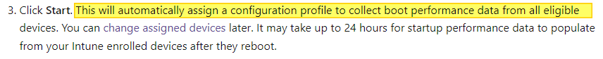
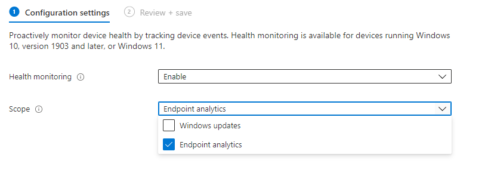

Happy users are key. But with all the changes in hardware, software distributions, security- and OS updates, it could take a lot of effort. Now remote working is embedded into our culture it costs even more effort to keep sight of what is happening. Endpoint analytics gives you insight into how the organization is working and the quality of experience which is delivered to users. I show how to enable endpoint analytics automated.



## Endpoint Analytics in short

It also helps identify issues with hardware or policies which slow down devices (slow boot times for example). So Endpoint Analytics gives you important information which helps fix issues before end-users created a ticket. In the upcoming paragraphs, I show how to deploy enable Endpoint Analytics in an automated way.

### Prerequisites

Before we enable Endpoint Analitycs make sure you pass the following:

- Intune enrolled or co-managed devices running the following:
    - Windows 10 version 1903 or later
        - The cumulative update from July 2021 or later installed
        - Pro, Pro Education, Enterprise, or Education. Home and long-term servicing channel (LTSC) isn’t supported.
- Windows devices must be Azure AD joined or hybrid Azure AD joined.
    - Workplace joined or Azure AD registered devices aren’t supported.
- The **Connected User Experiences and Telemetry** service on the device is running

Another requirement is that the device can reach: **https://\*.events.data.microsoft.com**. This is the URL where endpoints send the data to. For more about data collection check [https://docs.microsoft.com/en-us/mem/analytics/data-collection#bkmk\_datacollection](https://docs.microsoft.com/en-us/mem/analytics/data-collection#bkmk_datacollection)

At last, you need at least one of these licenses:

- [Enterprise Mobility + Security E3](https://www.microsoftvolumelicensing.com/ProductResults.aspx?doc=Product%20Terms,OST&fid=51) or higher
- [Microsoft 365 Enterprise E3](https://www.microsoft.com/en-us/microsoft-365/enterprise?rtc=1) or higher.[](https://docs.microsoft.com/en-us/mem/analytics/enroll-intune#endpoint-analytics-permissions)

Source: [https://docs.microsoft.com/en-us/mem/analytics/enroll-intune#bkmk\_prereq](https://docs.microsoft.com/en-us/mem/analytics/enroll-intune#bkmk_prereq)

## Enable Endpoint Analytics automated

Onboarding devices to Endpoint Analytics is very simple. It is just a matter of configuring a device configuration policy with a Windows Health monitoring profile type. So, how do we enable Endpoint Analytics automated?   
Because I want a separate policy, I’m using the code below to enable Endpoint Analytics. Make a note about the @odata.type value which is the windowsHealthMonitoringConfiguration. This type allows providing parameters that belong to this kind of policy.

When using the portal, you will notice the scope has two options. In this situation, I only choose Endpoint Analytics (EA). The configDeviceHealthMonitoringScope items represent this value which is a **<span style="text-decoration: underline;">String</span>**. Use the bootPerformance value to configure EA.   
This sounds a bit weird but actually, EA is capturing the Windows boot performance data.



Source: [https://docs.microsoft.com/en-us/mem/analytics/enroll-intune#bkmk\_onboard](https://docs.microsoft.com/en-us/mem/analytics/enroll-intune#bkmk_onboard)

During configuration, you will have the ability to configure applicability rules. In these rules, you specify device profiles to where a policy is assigned or not. In the case of Azure Virtual Desktop (AVD), choose the Windows 10 Enterprise option.

After log-in using Connect-AzAccount, I request a Graph token. Because endpoint analytics is also a device configuration policy, we need the device configuration URL. By pointing to the correct @odata.type, we can configure the correct objects. In my [blog about Update AVD with MEM](https://www.rozemuller.com/manage-windows-updates-for-avd-using-micrcosoft-endpoint-manager/#odata-types), I explained more about @odata.types.

```powershell
function GetAuthToken($resource) {
    $context = [Microsoft.Azure.Commands.Common.Authentication.Abstractions.AzureRmProfileProvider]::Instance.Profile.DefaultContext
    $Token = [Microsoft.Azure.Commands.Common.Authentication.AzureSession]::Instance.AuthenticationFactory.Authenticate($context.Account, $context.Environment, $context.Tenant.Id.ToString(), $null, [Microsoft.Azure.Commands.Common.Authentication.ShowDialog]::Never, $null, $resource).AccessToken
    $authHeader = @{
        'Content-Type' = 'application/json'
        Authorization  = 'Bearer ' + $Token
    }
    return $authHeader
}
$script:deviceConfigurl = "https://graph.microsoft.com/beta/deviceManagement/deviceConfigurations"
$script:token = GetAuthToken -resource 'https://graph.microsoft.com'

$endpointAnalyticsBody = @{
    "@odata.type"                     = "#microsoft.graph.windowsHealthMonitoringConfiguration"
    description                       = "Shows the analytics about endpoints"
    displayName                       = "Windows Health - Endpoint Analytics"
    version                           = 1
    allowDeviceHealthMonitoring       = "enabled"
    configDeviceHealthMonitoringScope = "bootPerformance"
}
$endpointAnalyticsPostBody = $endpointAnalyticsBody | ConvertTo-Json -Depth 3
$deployEndpointAnalytics = Invoke-RestMethod -Uri $script:deviceConfigurl -Method POST -Headers $script:token -Body $endpointAnalyticsPostBody
```

For more information about the endpoint analytics feature, check the Mircosoft documentation: <https://docs.microsoft.com/en-us/mem/analytics/overview>

### Assignment

The last step in configuring endpoint analytics the automated way is the assignment. Because I want to capture as much info as possible, I have chosen to assign the policy to all devices. To assign to all devices, use the “#microsoft.graph.allDevicesAssignmentTarget” odata type.

```powershell

$assignBody = @{
    "@odata.type" = "#microsoft.graph.deviceConfigurationAssignment"
    target        = @{
        "@odata.type"                              = "#microsoft.graph.allDevicesAssignmentTarget"
        deviceAndAppManagementAssignmentFilterType = $null
        deviceAndAppManagementAssignmentFilterId   = $null
    }
}
$assignParameters = @{
    method  = "POST"
    uri     = "https://graph.microsoft.com/v1.0/deviceManagement/deviceConfigurations/{0}/assignments" -f $deployEndpointAnalytics.id
    Headers = $token
    body    = $assignBody | ConvertTo-Json
}
$assignValues = Invoke-RestMethod @assignParameters
$assignValues
```

## Summary

In this blog post, I explained that Endpoint Analytics gives you insight into how the organization is working. It gives you an overview of the experience delivered to users. Also, I showed how to configure Endpoint Analytics automated. In the next blog (writing on it) I show how to use the data and how to create alerts for unwanted situations.

Thank you for reading this blog about configuring Endpoint Analytics automated. I hope you got a bit inspired.   
Enjoy your day and happy automating 👋