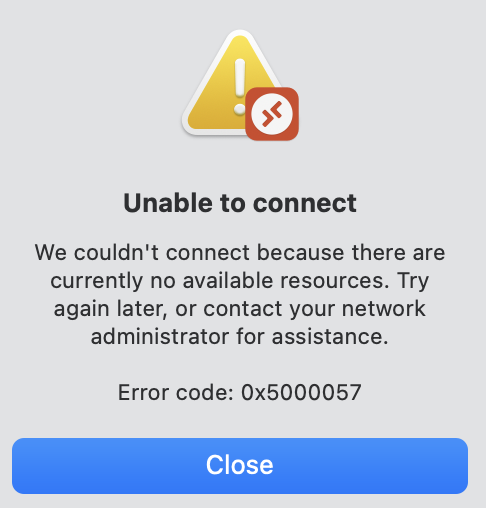
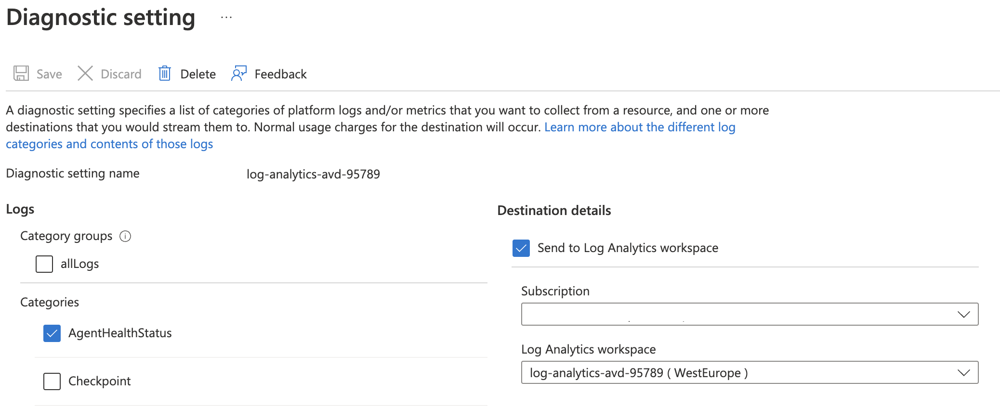
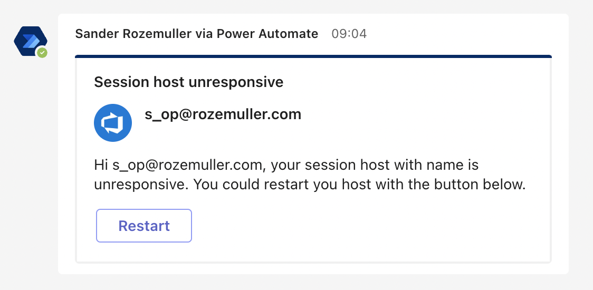
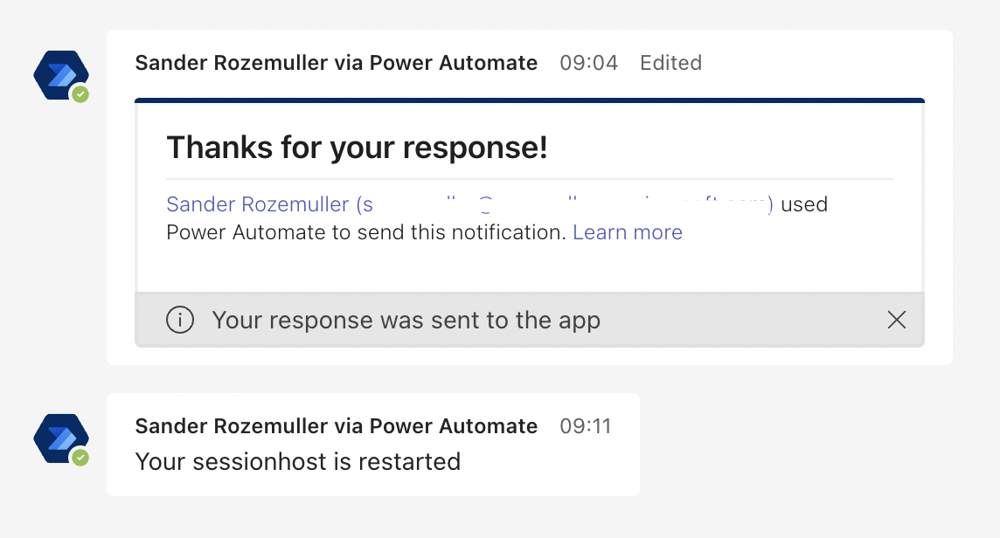

In this post, I show how to make it possible to fix a personal AVD host as a user. There could be a situation where your  AVD session host becomes unresponsive. In that case, you want to try to restart the host but are not able to log in to the host. Also, you can't restart the host in the web portal / RD client.


A healthy session host depends on several components. A session host must be online (heartbeat) and domain-joined. Also, a monitor- and AVD agent must be installed and running. If due some reason one of these components isn’t working well the session host becomes unresponsive. Unresponsive AVD session hosts are not available for the end-user.

At that moment you have to call the environments admin or support to restart your session host.

In this blog, I explain how to monitor an AVD session host status and send a remediation task to an end-user. (Almost) all configured in an automated way. That makes it possible to fix a personal AVD host as a user.






## The idea

The main idea to fix an AVD host as a user is to send a Microsoft Teams message to the end-user if the user’s session host becomes unresponsive. In the message, the end-user is able to restart the session host. After the session host has restarted, the end-user is able to log in.   
In the end, the result saves a call to support from an end-user.


### Permissions

In this blog, we have two contexts, deployment, and execution. For deployment, we need a **contributor** role.

In the Logic App, tasks are executed to get VM and session-host information and restart the session-host. Before assigning the permissions I configured the Logic App as a **<span style="text-decoration: underline;">managed identity</span>**. Thereafter the identity is assigned to the resource groups with the AVD resources and the virtual machines.

The Logic App permissions are:

- Desktop Virtualization Reader (Read AVD configuration, session host information, and [more](https://docs.microsoft.com/en-us/azure/virtual-desktop/rbac#desktop-virtualization-reader))
- Virtual Machine Contributor (to restart the machine. [Check the permissions overview](https://docs.microsoft.com/en-us/azure/role-based-access-control/built-in-roles#virtual-machine-contributor))

### Startup

This is the deployment context. In this chapter, I explain which components we need and how to deploy these components in an automated way. For deployment, I use the Azure REST API and the [Az.Avd PowerShell module](https://www.powershellgallery.com/packages/Az.avd).

#### Prerequisites

Before you start keep the following in mind:

- You have a personal AVD environment enrolled; (if you do not have an AVD environment yet, check my blog post about deploying AVD automated)
- Creating a resource group is out of scope, but not that hard to create :);

### Authentication

In the upcoming chapter, I show the needed components where it is used, and how to configure the component in an automated way. To deploy resources we need to log in first with an account with proper permissions. In the deployment context, I use a user account with **contributor** permissions. And use PowerShell to deploy the resources. Because I use the REST API, I need an authentication header to send in the request.

Use the command below to get the authentication header.


```powershell
$token = Get-AzAccessToken -resource https://management.azure.com
$graphAuthHeader = @{
    'Content-Type' = 'application/json'
    Authorization  = 'Bearer ' +$token.token
}
```


In the case of a DevOps pipeline or another automation sequence, you might use an application. If you use an application please read this[ article where I explain how to log in with an application registration](https://www.rozemuller.com/monitor-security-baselines-in-endpoint-security/#auth-with-powershell).

### Starting variables

At the top of the script, I created a few variables ahead. This is because I do need these values multiple times.

```powershell
$azureApiUrl = "https://management.azure.com"
$location = "WestEurope"
$resourceGroupName = 'rg-roz-avd-mon'
$subscriptionId = (Get-azcontext).Subscription.Id
$hostpoolName = 'Rozemuller-Hostpool'
$hpResourceGroupName = 'rg-roz-avd-01'
$logicAppWorkflowName = "la-sessionhost-alert"
$laWorkspace = "log-analytics-avd-" + (Get-Random -Maximum 99999)
$connectorName = "teams-connector"
$actionGroupName = "ag-to-logicApp"
$monitorRuleName = "monrule-avd-sessionhosthealth"
```


## AVD monitoring preparation

Before we are able to fix an AVD host as a user we need to prepare our AVD environment. In the first deployment block, we prepare the AVD environment to make sure we capture all the needed information into Log Analytics.

### Log Analytics

The basis is Log Analytics. This is where all the logs are stored and where I point the alert rule to. Creating a Log Analytics workspace is the first step in line.

Use the code below to create a Log Analytics workspace automated with the REST API.

```powershell
$laWorkspace = "log-analytics-avd-" + (Get-Random -Maximum 99999)
$lawsBody = @{
    location   = $location
    properties = @{
        retentionInDays = "30"
        sku             = @{
            name = "PerGB2018"
        }
    }
}
$lawsUrl =  "{0}/subscriptions/{1}/resourcegroups/{2}/providers/Microsoft.OperationalInsights/workspaces/{3}?api-version=2020-08-01" -f $azureApiUrl, $subscriptionId, $resourceGroupName, $laWorkspace
$loganalyticsParameters = @{
    URI     = $lawsUrl 
    Method  = "PUT"
    Body    = $lawsBody | ConvertTo-Json
    Headers = $graphAuthHeader
}
$laws = Invoke-RestMethod @loganalyticsParameters
$laws
```


### Configure AVD host pool diagnostics

In the next step, we configure the AVD hostpool to sent data to the Log Analytics Workspace. In this step, we configure the diagnostics settings at AVD hostpool level. The setting we need at least is AgentHealthStatus. For more information about configuring monitoring for AVD checks the [monitoring part of this article](https://www.rozemuller.com/avd-automation-cocktail-avd-automated-with-rest-api/#monitoring).

To configure the diagnostics at the host pool level we need the host pool ID first. To get the host pool’s resource ID quick I use the Az.Avd PowerShell module.

```powershell
$hostpoolId = Get-AvdHostPool -HostPoolName $hostpoolName -ResourceGroupName $hpResourceGroupName
```


After gathering the host pool information I set up the diagnostics with the code below.

```powershell
$diagnosticsBody = @{
    Properties = @{
        workspaceId = $laws.id
        logs        = @(
            @{
                Category = 'AgentHealthStatus'
                Enabled  = $true
            }
        )
    }
}  
$diagnosticsUrl = "{0}{1}/providers/microsoft.insights/diagnosticSettings/{2}?api-version=2017-05-01-preview" -f $azureApiUrl, $hostpoolId.id, $laws.name
$diagnosticsParameters = @{
    uri     = $diagnosticsUrl
    Method  = "PUT"
    Headers = $graphAuthHeader
    Body    = $diagnosticsBody | ConvertTo-Json -Depth 4
}
$diagnostics = Invoke-RestMethod @diagnosticsParameters
$diagnostics
```



## Logic App

The next step in line is creating the Logic App. The Logic App is triggered by the Azure Monitor rule that is created later. The reason why I create the Logic App first is because of the webhook URL. The webhook URL is needed in the Azure Monitor action group. Because we are receiving the webhook URL after saving the Logic App, this is the most efficient way of our deployment. (Instead of creating an action group first and updating it later)

### Create MS Teams API connector

Use an MS Teams connector to send messages to MS Teams. The connector is a separate Azure resource, create the connector first. The connector is created automatically in the background when using the portal. To create the API connector for Logic Apps automated, I used the code below.

Skipping the deep code analysis for now but, make a note about the ```**$connectorName**``` variable. This is the variable configured in the starting variables block. This is also the name that the Logic App uses.

***<span style="text-decoration: underline;">Search in the send-toteams-if-unhealthy.json for &lt;–connectorName–&gt; and change that into the connector name.</span>***

```powershell
$apiConnectionWebBody = @{
    location   = $location
    type       = "Microsoft.Web/connections"
    properties = @{ 
        api               = @{
            brandColor  = "#4B53BC"
            category    = "Standard"
            description = "Microsoft Teams enables you to get all your content, tools and conversations in the Team workspace with Office 365."
            displayName = "Microsoft Teams"
            iconUri     = "https://connectoricons-prod.azureedge.net/releases/v1.0.1585/1.0.1585.2895/teams/icon.png"
            id          = "/subscriptions/{0}/providers/Microsoft.Web/locations/westeurope/managedApis/teams" -f $subscriptionId
            name        = "teams"
            type        = "Microsoft.Web/locations/managedApis"
        }
    }
}
$apiConnectionWebUrl = "{0}/subscriptions/{1}/resourceGroups/{2}/providers/Microsoft.Web/connections/{3}?api-version=2018-07-01-preview" -f $azureApiUrl, $subscriptionId, $resourceGroupName, $connectorName
$apiConnectionWebParameters = @{
    uri     = $apiConnectionWebUrl
    Method  = "PUT"
    Headers = $graphAuthHeader
    Body    = $apiConnectionWebBody | ConvertTo-Json -Depth 99
}
$logicApiConnectioncApp = Invoke-RestMethod @apiConnectionWebParameters
$logicApiConnectioncApp
```

### Create Logic App workflow automated

In this part, we create the Logic App workflow based on a JSON configuration file. As mentioned above, make sure you changed the &lt;–connectorName–&gt; token in the JSON file into the correct name. The Logic App is created and gets a system-assigned identity.

```powershell
$logicAppBody = @{
    location   = $location
    identity = @{
        type = "SystemAssigned"
     }
    properties = @{
        definition = Get-Content ./send-toteams-if-unhealty.json | ConvertFrom-Json  
        parameters = @{
            "`$connections" = @{
                value = @{
                    $connectorName = @{
                        "connectionId"   = "{0}" -f $logicApiConnectioncApp.id
                        "connectionName" = "{0}" -f $connectorName
                        "id"             = "{0}" -f $logicApiConnectioncApp.properties.api.id
                    }
                }
            }
        }
    }
}
$logicAppUrl = "{0}/subscriptions/{1}/resourceGroups/{2}/providers/Microsoft.Logic/workflows/{3}?api-version=2016-06-01" -f $azureApiUrl, $subscriptionId, $resourceGroupName, $logicAppWorkflowName
$logicAppParameters = @{
    uri     = $logicAppUrl
    Method  = "PUT"
    Headers = $graphAuthHeader
    Body    = $logicAppBody | ConvertTo-Json -Depth 99
}
$logicApp = Invoke-RestMethod @logicAppParameters
```


### Assign Logic App permissions to resources

The Logic App needs permissions to get the session host information and to restart a VM. I searched in the build-in roles documentation for the roles I need. Next is to assign the Logic App on these roles as scope the permissions at resource group level. The session hosts are stored in this resource group.

Assign Azure roles to the resource groups automated with the code below. I created a small loop based on the build-in role Id’s and assign (scope) the roles at the AVD resource group. Fill in the Logic App identity at the principalId location.

```powershell
# Virtual Machine Contributor : 9980e02c-c2be-4d73-94e8-173b1dc7cf3c
# Desktop Virtualization Reade : 49a72310-ab8d-41df-bbb0-79b649203868
$rolesIds = @("9980e02c-c2be-4d73-94e8-173b1dc7cf3c","49a72310-ab8d-41df-bbb0-79b649203868") 
$rolesIds | ForEach-Object {
    $assignGuid = (New-Guid).Guid
    $assignURL = "{0}/subscriptions/{1}/resourcegroups/{2}/providers/Microsoft.Authorization/roleAssignments/{3}?api-version=2015-07-01" -f $azureApiUrl, $subscriptionId,$hpResourceGroupName , $assignGuid
    $assignBody = @{
        properties = @{
            roleDefinitionId = "/subscriptions/{0}/resourcegroups/{1}/providers/Microsoft.Authorization/roleDefinitions/{2}" -f $subscriptionId, $hpResourceGroupName, $_
            principalId      = $logicapp.identity.principalId
        }
    } | ConvertTo-Json 
    Invoke-RestMethod -Method PUT -Uri $assignURL -Headers $graphAuthHeader -Body $assignBody
}
```


### Final (manual) step

I left a manual step especially for the people who are not that familiar with automation :). After deploying all the resources there is only one thing left, authorization. This is by design and how OAuth2 works. There is no way to fully automate an api-connection authorization. After some research I found the following:

From the Microsoft docs: [Authorize OAuth connections](https://docs.microsoft.com/en-us/azure/logic-apps/logic-apps-deploy-azure-resource-manager-templates#authorize-oauth-connections)


Also in [this topic](https://docs.microsoft.com/en-us/answers/questions/793299/authorising-office365-logic-app-api-connection-wit.html) I found an answer which says the same.


In the Azure portal the connection will be in error state with the following error. If you click on the error, you are able to authenticate the connector.


There are way to avoid also this manual step by creating a preconfigured api-connection and refer to that connection in the Logic App. This is a good choice when enrolling more Logic Apps.

## Azure Monitor

The next big part to fix a personal AVD host by an user is Azure Monitor. In the Azure Monitor, we create an action group and a monitor rule. An action group is a collection of notification preferences. Preferences like sending an SMS, email, or triggering a webhook. In this blog we the webhook trigger. A monitor rule is one that checks for unwanted situations. If an error occurred for a specific duration, the rule creates an alert. The rule is assigned to the action group.

### Azure monitor action group

As mentioned we create an action group first. Besides the default settings, in this action group, I configure to trigger a webhook if an alert hits this group. The first step is getting the webhook URL from the just created Logic App. The webhook URL is the entry point to trigger the Logic App to run. The Logic App trigger can handle parameters as well.

To get the Logic App trigger URL I used the code below.

```powershell
$triggerUrl = "{0}{1}/triggers/manual/listCallbackUrl?api-version=2016-10-01" -f $azureApiUrl, $logicApp.id
$triggerParameters = @{
    uri     = $triggerUrl
    Method  = "POST"
    Headers = $graphAuthHeader
}
$trigger = Invoke-RestMethod @triggerParameters
$trigger.value
```

After searching for the trigger URL, it is time to create an action group. As mentioned earlier an action group can have multiple actions. In this part, we configure an action group that triggers the Logic App. Besides the general settings like location and names, we have the ability to configure several breakouts like a Logic App.   
The following receivers are available at this time. All with their own settings.

- armRoleReceivers
- automationRunbookReceivers
- azureAppPushReceivers
- azureFunctionReceivers
- emailReceivers
- eventHubReceivers
- itsmReceivers
- logicAppReceivers
- smsReceivers
- voiceReceivers
- webhookReceivers

To create an Azure Monitor Action Group automated, I used the code below. The code creates a breakout to the logicAppReceivers. To trigger a Logic App you also can use the webhookReceivers breakout.

```powershell
$actionGroupBody = @{
    location = "Global"
    properties = @{
        groupShortName = "agToLa"
        enabled = $true
        logicAppReceivers = @(
            @{
              name = "{0}" -f $logicApp.name
              resourceId = "{0}" -f $logicApp.id
              callbackUrl = "{0}" -f $trigger.value
              useCommonAlertSchema = $true
            }
        )
    }
}
$actionGroupUrl = "{0}/subscriptions/{1}/resourceGroups/{2}/providers/Microsoft.Insights/actionGroups/{3}?api-version=2021-09-01" -f $azureApiUrl, $subscriptionId, $resourceGroupName, $actionGroupName
$actionGroupParameters = @{
    uri     = $actionGroupUrl
    Method  = "PUT"
    Headers = $graphAuthHeader
    Body    = $actionGroupBody | ConvertTo-Json -Depth 5
}
$actionGroup = Invoke-RestMethod @actionGroupParameters
$actionGroup
```


<https://docs.microsoft.com/en-us/azure/azure-monitor/alerts/action-groups>

### Azure Monitor rule

The next step in line is creating a monitor role. A monitor rule in basics consists of scope, condition, and action.


At first, we scope the rule to Log Analytics Workspace we created earlier in this post. Based on the scope we get the applicable monitor signals.


In the second step, we configure a condition. The condition tells where the rule needs to look at and when to send an alert. Because we scoped at a Log Analytics resource, we are able to execute a custom log query. Based on the query output we configure when the result is an error.

The Kusto query looks like the below. In this query, I search for the AVD session host statuses. The query outputs every status where I configure the dimensions in the monitor rule.   
You could also choose to filter in the query directly. The advantage of filtering afterward is that, during configuring dimensions, the portal provides all values where you just have to select the one you need. (This avoids typos)

```sql
WVDAgentHealthStatus 
| project TimeGenerated, LastHeartBeat, SessionHostName, SessionHostResourceId, Status, sessionHostId = strcat(_ResourceId,"/sessionhosts/",SessionHostName),  _ResourceId , EndpointState
```


The further configuration like measures and threshold depends on your situation. In my case, the rule checks every 5 minutes and counts the rows. If the row count is greater than 0 an alert is sent.

At last, we configure the action which sent the alerts to the action group we created above. You can have multiple action groups configured.

What does this look like in automation?   
There are a few monitor rule types. In my case, I use the scheduled query rule. This rule type gives the ability to run Kusto queries every n minute.

```powershell
$monitorRuleBody = @{
    location   = $location
    properties = @{
        severity            = 0
        enabled             = $true
        evaluationFrequency = "PT5M"
        scopes              = @(
            $laws.id
        )
        targetResourceTypes = @(
            $laws.type
        )
        windowSize          = "PT5M"
        criteria            = @{
            allOf = @(
                @{
                    query           = "WVDAgentHealthStatus | project TimeGenerated, LastHeartBeat, SessionHostName, SessionHostResourceId, Status, sessionHostId = strcat(_ResourceId,'/sessionhosts/',SessionHostName),  _ResourceId , EndpointState"
                    timeAggregation = "Count"
                    dimensions      = @(
                        @{
                            name     = "SessionHostName"
                            operator = "Include"
                            values   = @("*")
                        }
                        @{
                            name     = "SessionHostResourceId"
                            operator = "Include"
                            values   = @("*")
                        }
                        @{
                            name     = "Status"
                            operator = "Include"
                            values   = @("Unavailable")
                        }
                        @{
                            name     = "sessionHostId"
                            operator = "Include"
                            values   = @("*")
                        }
                        @{
                            name     = "_ResourceId"
                            operator = "Include"
                            values   = @("*")
                        }
                        @{
                            name     = "EndpointState"
                            operator = "Include"
                            values   = @("Unhealthy")
                        }
                    )
                    operator        = "GreaterThanOrEqual"
                    threshold       = 1
                    failingPeriods  = @{
                        numberOfEvaluationPeriods = 1
                        minFailingPeriodsToAlert  = 1
                    }
                }
            )
        }
        autoMitigate        = $false
        actions             = @{
            actionGroups = @(
                $actionGroup.id
            )
        }
    }
}
$monitorRuleUrl = "{0}/subscriptions/{1}/resourceGroups/{2}/providers/Microsoft.Insights/scheduledQueryRules/{3}?api-version=2021-08-01" -f $azureApiUrl, $subscriptionId, $resourceGroupName, $monitorRuleName
$monitorRuleParameters = @{
    uri     = $monitorRuleUrl
    Method  = "PUT"
    Headers = $graphAuthHeader
    Body    = $monitorRuleBody | ConvertTo-Json -Depth 8
}
$monitorRule = Invoke-RestMethod @monitorRuleParameters
$monitorRule
```


## The process

Before we go to the next steps let’s see what we have so far. We have configured the following:

- A new Log Analytics Workspace
- We configured diagnostics settings in the AVD host pool to send logs to the workspace
- A Logic App with an authenticated MS Teams connector
- An Azure Monitor Action group that send alerts to a Logic App
- An Azure Monitor Rule which looks for unhealthy session hosts every 5 minutes

Now it is time to look at what is happening after the Logic App received an alert. Imagine a session host went unresponsive and there is an alert.


After an alert occurred the action group triggers the Logic App. The Logic App searches for the virtual machine first. If the machine is NOT deallocated the Logic App search for the session host and gathers the assigned user (that is the reason why this only works with personal AVD host pools).


There after the Logic App sends an MS Teams adaptive card for the first time with the option to restart the session host. After the end-user responded the Logic App sends a second message when the restart was successful.


After the end-user’s response a new message is sent when the session host is restarted.


You see log rules in the Actitity Log like below.


## Summary

I want to thank you reading this post about how to fix a personal AVD session host as an user

I showed in this blogpost how to create a kind of AVD self-service option for end-users. An end-user is able to restart his personal session host if it becomes unavailable. The message is sent to Microsoft Teams based on an adaptive card.   
We created a Log Analytics Workspace and prepared the AVD hostpool to sent information to the workspace. Also, we created a Logic App and a MS Teams connector. At last we created an Azure Monitor action group and an alert rule. All those resources are deployed in automated way.

