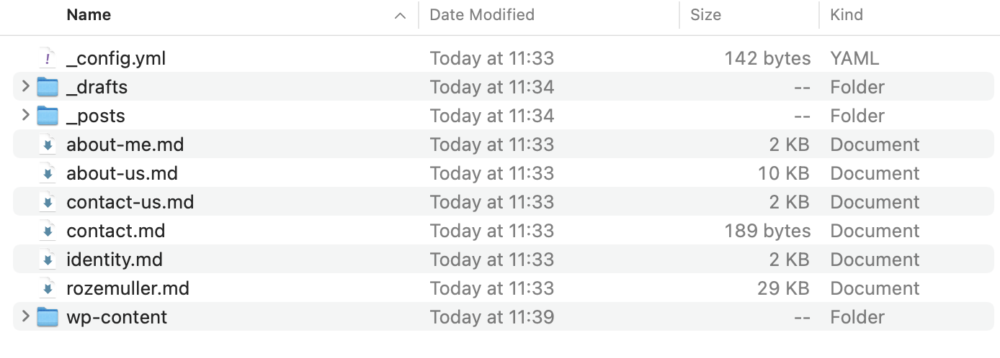
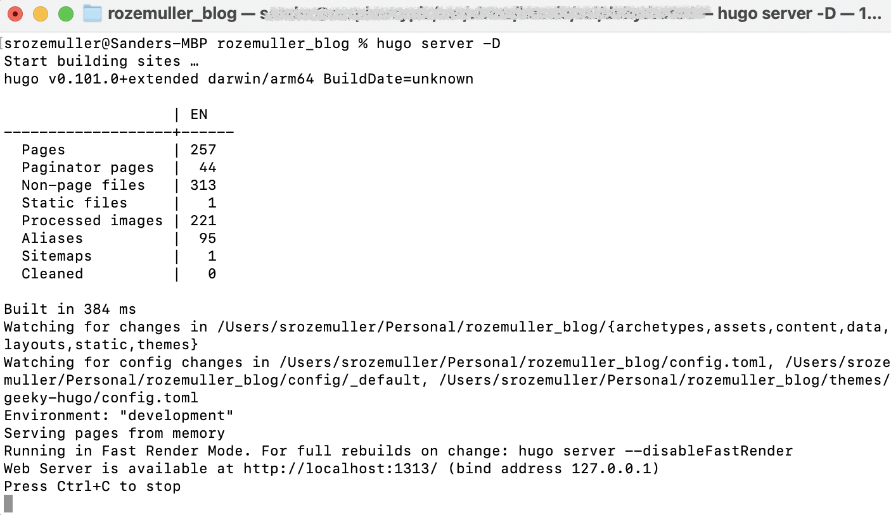
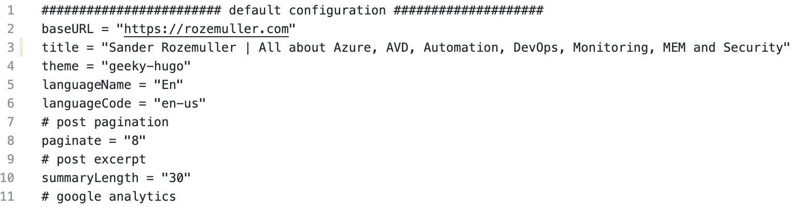
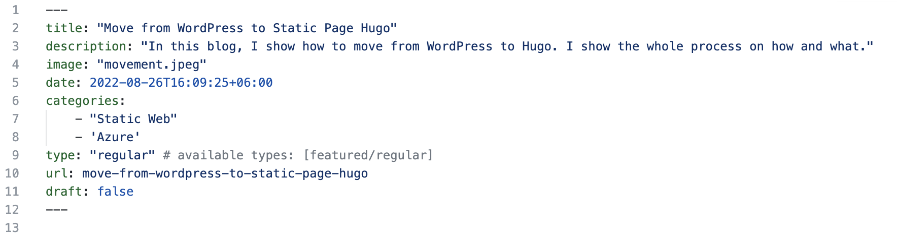
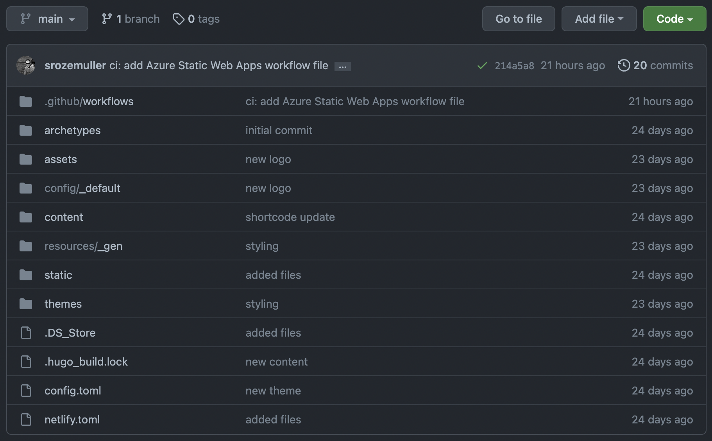
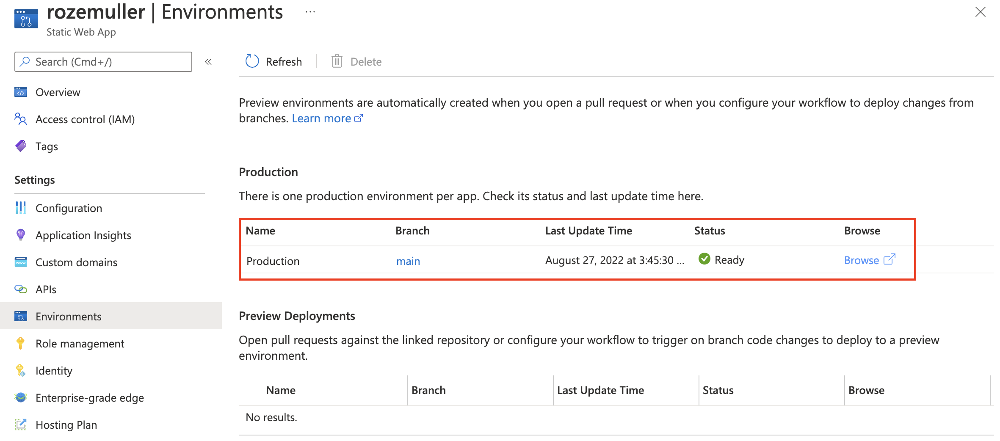
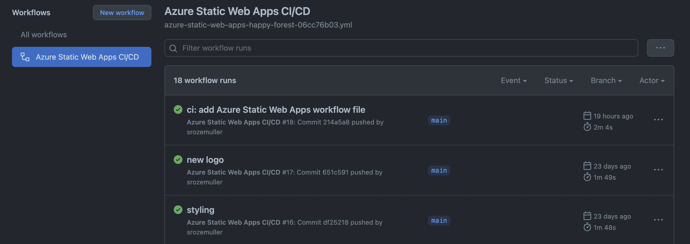
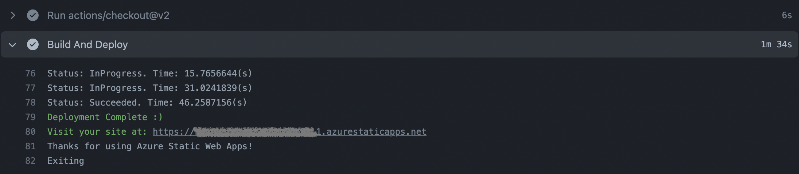
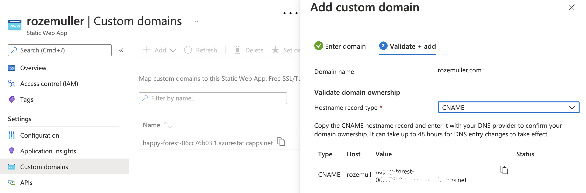
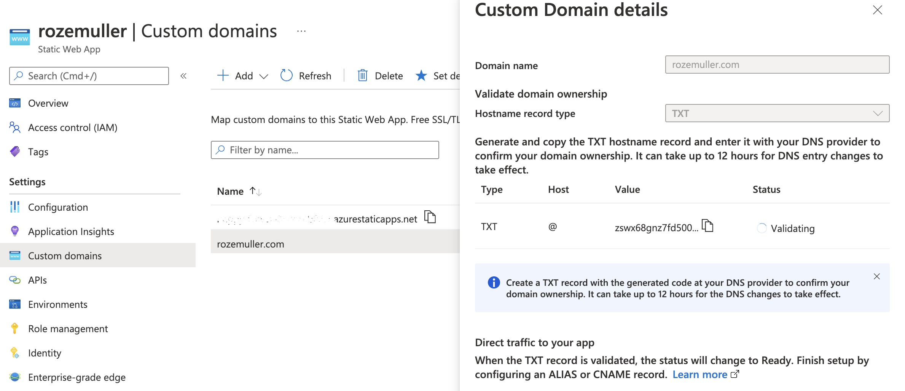

We all know WordPress. It is a good platform for running websites with almost every purpose. Since the start of this blog, I also used WordPress. It has a lot of templates and plug-ins available. For me running this blog on WordPress was good enough. Now a few years later it became more a frustration than a pleasure to keep my website up and running. In this blog, I explain why and how I changed my website into a static webpage. 



## Why change direction?

After almost two years I overlooked my website and noticed that around 98% is static. The only thing that changes are blog posts (updates or new) and comments.

Also, a big thing for me is the website’s speed. Besides speed some other topics become frustrating to me:

- Updates ( from different perspectives)
- Security
- Plug-ins
- Backups
- Efficiency

#### Speed

WordPress is a client-server website which means that all data is stored on a server (database). Every (configuration) item is written in the database. Think about blog posts, images, settings, etc. Every request is a search in the database that takes time.

WordPress isn’t that efficient when it comes to data management. Data is shattered in many tables and many files are placed in the host. For example, every image uploaded creates several resolutions to give a responsive feeling.

Also, it depends on how fast the hosting provider is.

#### Security

Another thing that matters is security. Client-server means you have to use credentials to log in at the website’s backend to create/edit content. With the come of MFA it became better but also WordPress has its own user to manage the website and write to the DB. WordPress is pretty vulnerable to SQL injections and needs to be updated almost every week.

#### Plugins

To keep my site as secure and fast as possible I use plug-ins. For every purpose I need a different plugin.
In the end, I used more than 15 plug-ins to run my website in a way I like. Good to know is that the more plug-ins you have the more your website is slowing down. Adding more plugins is working oppositely.

#### Updates

Mentioned a bit before are updates. At first we have WordPress itself that has an update almost every week. Then we have the plug-ins and also the WordPress theme. In the end, there is a long list with updates almost every day. 

#### Backups

Not the most annoying thing but you need a WordPress backup. This is the database and files. Most hosting providers have the ability to schedule WordPress backups from their control panel. But it is an extra step that needs to be monitored as well.

#### Efficiency

In the end, maintaining the website is a job in itself. But there is more. I was looking for a faster way of working from a writing experience.

Often I write about new features that depends on specific lines of code. During the time these line of code are changing. Think about specific configuration versions like the AVD desired stated configuration artifact. If these lines change I have to update these lines in every single blog and hopefully, I updated them all.

This isn't very efficient. Also in every article I use components like a table of contents, a summary, and a goodbye saying.

Every time I have to create that myself (or use an extra plug-in(s) for using shortcodes or reusable blocks.

Another extra topic is the post format. A WordPress post consists of many chapters, sub-chapters, paragraphs, and code blocks. In WordPress, every block must be selected from a library. While writing costs a lot of time.

So for me enough reasons to change direction.

## Goodby dynamic, hello static

As said, speed is my first topic to solve. Because client-server isn’t that fast I need to look into a non-server solution. Because of that dynamic platforms are out of sight. Luckily my site is actually as static as an old oak so that is not a problem 🙃.

So I started exploring the world of static website generators.

### What is a static website generator?

A lot of content is available on the web about this subject. Because of that, I skip the deep dive static website generator part.

In short, from Cloudflare:

- *A static site generator is a tool that generates a full static HTML website based on raw data and a set of templates. Essentially, a static site generator automates the task of coding individual HTML pages and getting those pages ready to serve users ahead of time. Because these HTML pages are pre-built, they can load very quickly in users' browsers.**

In basics, a static website generator generates a website once, based on fixed data. From then nothing changes till you rebuild the site again. (Keep this in mind)

https://www.cloudflare.com/learning/performance/static-site-generator

### Choose a generator

Ok, now static web generator it is, what is next?

Google helped me 😉 while searching for the best static web generator. Several popped up, where the most popular are Hugo and Jekyll.

Every generator has its pros and cons. Where I have chosen Hugo. For me the main reason is speed. Take a look at this benchmark [Hugo vs Jekyll: Benchmarked](https://forestry.io/blog/hugo-vs-jekyll-benchmark/)

The fact, that the initial setup is a bit more complex and very less available templates (from Jekyll's perspective) I took for granted.

Further,  I skip the in-detail part because it does not matter for now.

Check this detailed article that explains Hugo vs. Jekyll in detail.

[Hugo vs. Jekyll: Which is Right for Your Blog?](https://draft.dev/learn/hugo-vs-jekyll)

## How to migrate WordPress to Hugo

Ok, I decided to go all-in for a static page generator with Hugo. Now I need to migrate from WordPress to Markdown. Markdown is the raw data page format that Hugo renders into a nice webpage.

With that in mind, I started searching again on how to migrate WordPress to Hugo. I read a lot but unfortunately, I ran into problems. Not so much technical but more in the process.

### Where to start

After trial and error (a lot), I think this is a good process.

It sounds a bit weird, maybe, but I started with a Hugo theme first. I started looking for a theme that fits the most to my needs.

The reason for that is every template has its own layouts, settings, and options. Options at the page level, table of contents, shortcodes, etc.

Having the right theme first saves a lot of time later because you don’t need to rewrite your blog articles with the correct options and shortcodes every time!

**Suggestion: write down your requirements. That helps find the best template for you.**

(The thing that WordPress does well is the easiness of using a sidebar, left or right). That’s a requirement for me also in Hugo.

Another thing was having blog features like tags and categories. Also, a search option must be available.

With that in mind, only a few templates fit my need. From that point, it’s just the look and feel you like.

Hugo themes are mostly free. A good place to find Hugo themes is at [https://github.com/gohugoio/hugoThemes](https://github.com/gohugoio/hugoThemes)

### Export WordPress content

After you have found a theme, the next step is to export your WordPress posts and pages.
Exporting WordPress content is simple via the WordPress menu. However, a default WordPress export results in an XML file which is not what we need.
Because we need Markdown format I installed a plugin called [Jekyll Exporter](https://wordpress.org/plugins/jekyll-exporter/).
Using this plugin results in a ZIP file that contains markdown files of every post and page.



Now every post is in Markdown format it was time for me to check every post on the correct image location, removing Wordpress blocks and other unwanted syntaxes.

It was a very time-consuming job. But looking at the bright sight, rebuilding my website gave me the time to get all content nice and clean. (WordPress makes a mess from it)

## Build up your new static website

Now the fun part starts. Setting up your new Hugo website. At first, I deploy a Hugo site on my own system before we start creating an Azure static web app connected to GitHub.
I started based on this [Microsoft Document about how to publish a Hugo site to Azure Static Web Apps](https://docs.microsoft.com/en-gb/azure/static-web-apps/publish-hugo)

### Running Hugo local

Running Hugo locally is because of the development speed. Let me explain in short.
As mentioned earlier a static website generator builds a website based on static content and never changed till a new build.
During developing and testing the website changes all the time. When running the website in a public place I have to wait till the website has been rebuilt. This takes around 2 minutes every time.
Running Hugo locally the build is done directly after saving. So I create the website till it is finished and then upload all the files at once into my Github repository. After a commit, a GitHub action takes care of rebuilding the website to my Azure static app.

How to run Hugo locally check this URL.

[Quick Start](https://gohugo.io/getting-started/quick-start/)

Before running these commands browse to a location you like.  That will be the website root and the place to store the Markdown files.
Adding your own chosen theme is simple by doing by repeating step 3. But this way has a downside because it fully depends on the theme’s repository.
I have chosen to do it another way because I used a theme as a basis and made modifications like adding shortcodes, widgets, and the way how to display blogs.

To add a standalone theme I downloaded the theme from the repository and removed all the hidden GitHub folders.
Thereafter I put the folder in the themes folder.
After starting the Hugo website with ```Hugo server -D``` then go to [https://localhost:1313](https://localhost:1313)



Hugo runs on a MAC almost natively. If you use a Windows client make sure you read this post.
https://bwaycer.github.io/hugo_tutorial.hugo/tutorials/installing-on-windows/ 

In the post they refer to a Hugo for Windows package. Make sure you download the extended version. Otherwise some features won't work. https://github.com/gohugoio/hugo/releases
 
I found a solution in this post: https://discourse.gohugo.io/t/resize-image-this-feature-is-not-available-in-your-current-hugo-version/34682

I tried with succes. 


### Configure your website

After your website is running locally it is time for configuration. Hugo depends on a configuration file. This file can be stored in the website's root or in the /config folder under the name config.toml (or .yaml / .json)



First, enable your founded theme.
When the theme is enabled it is time to format the menus, colors, and your exported blog posts to markdown format. Take a look at the theme’s page options.
Options to set a title, image, categories, etc and are set at the head of the post.



After every save, you will notice every change directly in your browser at https://localhost:1313

Most work is done for now.

For more information about Hugo configuration check: https://gohugo.io/getting-started/configuration/

## Publish your website in public

When you are happy it is time to put your website online.

I use an Azure Static Web App because of its many benefits. It supports CI/CD connected to my GitHub repository, custom domains, and SSL for example. In the repository, all Hugo content is stored.

[What is Azure Static Web Apps?](https://docs.microsoft.com/en-us/azure/static-web-apps/overview)

### Create a GitHub repository

The source of all is my GitHub repository. In there all Hugo content is stored.
How do you get the correct Hugo content? That is the content for your local Hugo installation.
What I did is created a GitHub repository and cloned it to my device. In the empty cloned folder I created a Hugo instance with the steps above.

From now this is my center point. I’m able to start the Hugo website locally for testing purposes and after a save I’m able to commit all changes directly to the repository.


Check my repo online: [github-repo](https://github.com/srozemuller/rozemuller_blog)

### Create Azure Static web app automated

The Azure Static web app I create is connected to my GitHub account. Another option is an Azure DevOps repository.

To create an Azure static web app automated I used the code below.

```powershell
$websiteName = "newStaticWebsite"
$url = "https://management.azure.com/subscriptions/xxxx/resourceGroups/website/providers/Microsoft.Web/staticSites/{0}?api-version=2022-03-01" -f $websiteName
$body = @{
    "location"   = "WestEurope"
    "properties" = @{
        "repositoryUrl"   = "https://github.com/srozemuller/rozemuller_blog"
        "branch"          = "main"
        "repositoryToken" = "github_pat_token"
        "buildProperties" = @{
            "appLocation"         = "app"
            "apiLocation"         = "api"
            "appArtifactLocation" = "build"
        }
    }
    "sku"        = @{
        "name" = "standard"
        "tier" = "standard"
    }
} | ConvertTo-Json -Depth 6
$authHeader = GetAuthToken -resource "https://management.azure.com"
Invoke-RestMethod -Method put -uri $url -Headers $authheader -Body $body

```

Read this doc about how to [create a GitHub PAT token](https://docs.github.com/en/authentication/keeping-your-account-and-data-secure/creating-a-personal-access-token).



### Github action explained

You will notice there is a GitHub action created in your repository after creation.

The GitHub action (or DevOps pipeline in case of a DevOps connection) takes care of rebuilding your website after a commit to the main branch. 



After a commit, the action starts automatically. When the action is finished the website will be rebuilt again.

## Add a custom domain to Azure static web app

A Static Web App in Azure does have a unique URL by default. But it is nice to have your domain connected. Connecting your domain is simple. Adding a custom domain is the first step followed by a validation step. (CNAME or TXT)



I used the code below for adding a custom domain to an Azure Static Web App automated.

```powershell
$url = "https://management.azure.com/subscriptions/xxxx/resourceGroups/website/providers/Microsoft.Web/staticSites/rozemuller/customDomains/rozemuller.com?api-version=2022-03-01"
$body = @{
    "properties" = @{ 
        domainName = "rozemuller.com"
        validationMethod = "dns-txt-token"
    }
} | ConvertTo-Json
$authHeader = GetAuthToken -resource "https://management.azure.com"
Invoke-RestMethod -Method put -uri $url -Headers $authheader -Body $body
```

The custom domain is now added and waiting for validation. The only thing I have to do now is added a TXT record to my DNS configuration and fill it with the provided code.

Use ```cname-delegation``` under **validationMethod** in case you like adding a CNAME in your DNS. 



For more information about adding custom domains check: https://docs.microsoft.com/en-us/azure/static-web-apps/custom-domain
Take a good look at the preparation part. 
## My workflow

Now everything is in place and the website is globally available. I like to share my workflow on how I update my website.

It is very simple and repeats steps from above.

- I start the local Hugo server first from the repository folder with ```hugo server -D```
- In the content folder, I create a new folder for my blog post. (I use the branch bundle structure )

[Page Bundles](https://gohugo.io/content-management/page-bundles/#examples-of-branch-bundle-organization)

- In the created folder, I create an index.md file with the blog content. All other content like images is also stored in this folder.

I used the [leaf bundle](https://gohugo.io/content-management/page-bundles/#leaf-bundles) to have all related blog content in one place.

- After I finished writing I commit the changes to the main branch.

From that moment a GitHub action takes care of rebuilding the website with the GitHub Action mentioned earlier.

## Leftovers and considerations

WordPress has some great plug-ins that helped me building my website. Think about Google Analytics and Yoast SEO.

Those where for me the biggest issues to solve.

### Google Analytics

This one is easy. Google Analytics plug-in places a small Javascript in the head of the page. A lot of Hugo themes also have this option available. Also mine. So that was an easy fix.

The only thing I did was move the script from the head to the footer. This is to load my site even faster.

### SEO and Hugo

A good page ranking is important. Search engine optimization helps with that and has many factors. Yoast SEO for WordPress helps you. When using Hugo you have to fix some by yourself.

The most important things are a good title, meta description, and keywords. However, sometimes it’s hard to come up with a good title, etc. you have full control over these.

Another thing is having a responsive theme. Also supported by most themes.

Search engines don’t reveal their search algorithm but another big thing is load speed.

I know Yoast helps you get your SEO better but all these little extras don’t fill the gap in relation to speed. So I agree with the little things I miss.

[Tips on Hugo SEO (Search Engine Optimize)](https://djangocas.dev/blog/hugo/tips-on-hugo-seo/)

### Comments

People do react to my blog posts. Most comments are a thank you or code updates (thank you for that :)). Hugo supports Disqus this is fine for me. For code updates also Github provides an option to create a new issue. At last, we have social media like [Twitter](https://www.twitter.com/sanderozemuller). I tried to update my blog pages based on the comments. However, due the migration some comments felt of. If you have any question please let me know. 

Enough options to reach out to me.

### Social Sharing
After I finished all I ran into a problem while sharing a post on the social media. The problem was that the image was not loaded. After searching the web I found [this](https://www.kelvinpapp.com/a-dive-into-social-sharing-and-hugo/) post that describes my problem. After all I created an image with a max width of 600px and stored it into the same folder as the rest of the blog post images and named it xxx-thumbnail.extension.


## Fixes
Now a short time later the website is running fine but I noticed some things were handled by Apache which is now Hugo. Think about URL redirection in the case of 404. 

### Custom 404 page Azure Static Web App
Azure Static Web App can handle 404, but it redirects the client to a default Azure 404 page. I do have my 404 that I want to use. To use your  redirect pages you need *response overrides*

https://learn.microsoft.com/en-us/azure/static-web-apps/configuration#response-overrides

In the website`s root, I create a file staticwebapp.config.json. In the file, I created a responseOverrides with the 404 code and the page where clients need to be sent.

```json
    "responseOverrides": {
        "404": {
            "rewrite": "/404.html"
        }
    }
```


I still have some work to do on the new format that will cost some time. Overall I'm happy about the way how the migration went and the website`s speed. I hope it will help you get the right content even better. I also hope you'll agree with this new format. If you have any suggestions to make this site better please let me know.

