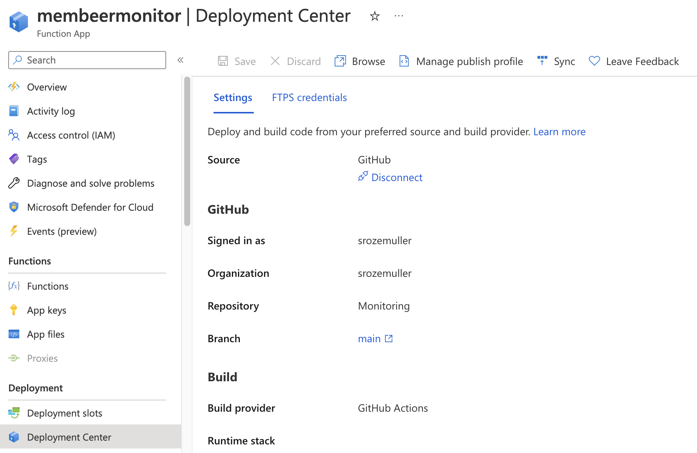
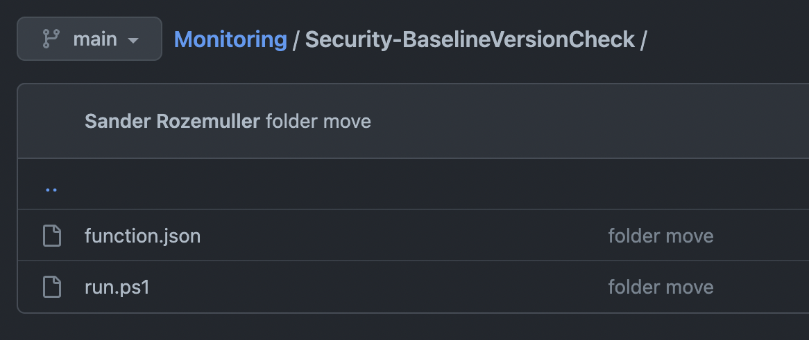
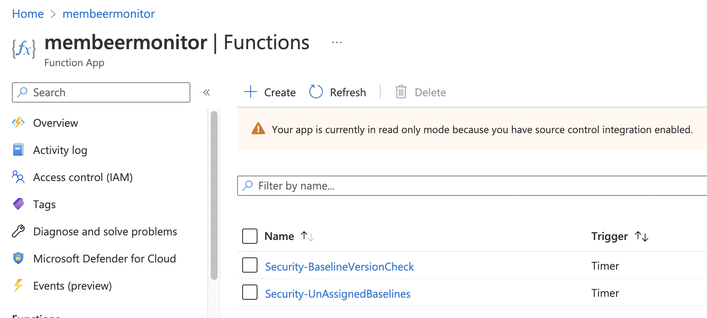
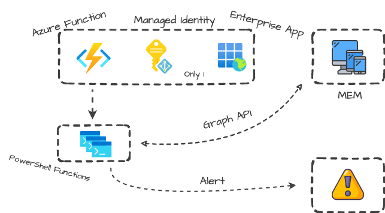
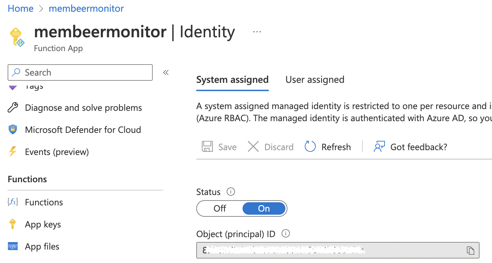
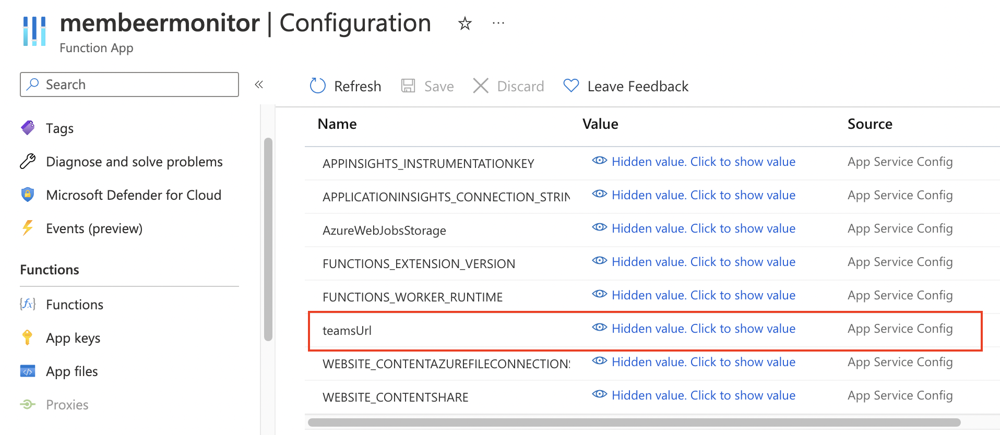
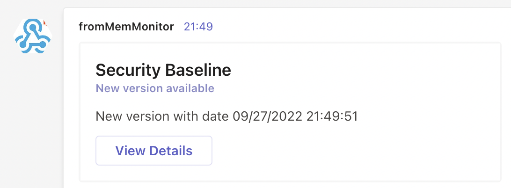

Intune and the rest of Microsoft Endpoint Manager are growing. To keep your environment nice, clean and secure it is a good idea to monitor your MEM environment.
In this blog, I explain how to monitor Intune based on Graph API and PowerShell with Azure Functions. 



## Monitor Intune with Diagnostics Settings or Graph API
With growing environments in mind, I enabled the diagnostics settings that send the logs to Log Analytics. When digging into the logs I noticed a lot of interesting information is not available. Think about a security profile that is out of date or unassigned baselines. 
Also, some form of notification is missing. Luckily, we have the Graph API that has lots of valuable information to dig into.


>Graph API is a treasure chest which lots of valuable information to dig into.

## Why Azure Functions
More ways are leading to Rome so why do I use Azure Functions instead of Logic App for example? The answer is simple, CONTROL. I do have the infrastructure-as-a-code philosophy and try to have all components in code as much as possible. But there is more. 


### Source control
The main reason for using Azure Functions is *source control*. With source control I do have full control about what is changing, by who and when the change will be live in the functions.  
Configure source control under the deployment center at the Azure Function level. By enabling source control editing code in the browser has been disabled. You MUST change the code in the repository.


Source control does not support subfolders. To make functions work put a ```run.ps1``` (which is the PowerShell script) and ```function.json``` (which is the function configuration file) in this folder. The name of the folder is the name of the function. In the end, the whole repository is uploaded to the Azure Function but only the folders with a correct ```run.ps1``` and ```function.json``` will work as functions.




Check the repository content for more information: https://github.com/srozemuller/Monitoring/tree/main/Security-BaselineVersionCheck

### Security Control
Another topic is security. A little forward to the next paragraph, Azure Functions can use managed identities (system or user). During creation, I consciously choose to create a System Assigned identity. This makes the identity only available for this Azure Resource. Every inside function is using this identity. By knowing the inside functions, I also know what is using the identity and when.
Using a User identity means that other resources can use that identity with a change overcommitting permissions.


### Efficiency
DRY, aka, Don't Repeat Yourself. Using Azure Functions means having freedom and control to create functions based on different coding languages like Python, .NET or PowerShell. In this case, I use PowerShell which can use functions or import modules. 

Concerning a non-code solution (which is fine of course!) every purpose is a full configuration. If something general changes, you have to change it in all your solutions. 
As mentioned, the whole repository is synced to Azure Functions. Check the module file in my repository https://github.com/srozemuller/Monitoring/tree/main/Modules.
Use ```import-module ./functions-file.psm1``` to import a module file in your scripts. 

```powershell
try {
    import-module .\Modules\mem-monitor-functions.psm1
}
catch {
    Write-Error "Functions module not found!"
    exit;
}
```

## Azure Functions architecture
At the top, we have the Azure Function with a System Assigned Managed Identity. Considering a User Assigned this identity is managed by the Azure AD. After an Azure Function removal, the managed identity is also removed. A User Assigned Identity needs to be removed by the admin.   

Why not use a User Assigned managed identity?  

This is because I think the system must be running sovereign. And, from a security perspective, a System Assigned identity is safer than a shared User identity. This is because the identity is assigned to the resource only and I know exactly what is using the System Identity.





### Set Graph API permissions on Managed Identity
A managed identity is an enterprise application in the background just like an app registration. Configuring API permissions under an app registration is simple by going to the API Permissions page in the specific app. 

In the case of a managed identity, there is no app registration and no API permission page. To configure API permissions for a managed identity we need to code. In the example below, I also use Graph API.
At first, I generate a token to use in the header. 

```powershell
$tokenInfo = Get-AzAccessToken -ResourceUrl "https://graph.microsoft.com" # "https://graph.microsoft.com"
$header = @{
  Authorization  = "{0} {1}" -f $tokenInfo.Type, $tokenInfo.Token
  'Content-Type' = "application/json"
}
```

I search for the Graph API service principal for the Graph API permissions. From the result, I search for the ```DeviceManagementManagedDevices.Read.All``` permission. To get the correct permissions I suggest reading this part: https://www.rozemuller.com/deploy-intune-settings-catalog-automated-from-scratch-with-graph-api/#how-do-i-get-settings-before-automation

```powershell
$graphAppId = "00000003-0000-0000-c000-000000000000"
$graphAppUrl = "https://graph.microsoft.com/beta/servicePrincipals?`$filter=appId eq '$GraphAppId'"
$getGraphPermissions =  Invoke-RestMethod -uri $graphAppUrl -Method GET -Headers $header | Select-Object value
$PermissionName = "DeviceManagementManagedDevices.Read.All"
$appRoleId = $getGraphPermissions.value.appRoles | Where-Object {$_.value -eq $PermissionName -and $_.AllowedMemberTypes -contains "Application"}
```
I search for the created System Assigned managed identity. This is de created Azure Function name. 
Thereafter the result is used to assign app roles based on the Graph API Service Principal.

```powershell
$url = "https://graph.microsoft.com/beta/servicePrincipals?`$filter=displayname eq 'membeermonitor'"
$servicePrincipal = Invoke-RestMethod -uri $url -Method GET -Headers $header | Select-Object value
$spUrl = "https://graph.microsoft.com/beta/servicePrincipals/{0}/appRoleAssignedTo" -f $getGraphPermissions.value.id
$body = @{
  principalId = $servicePrincipal.value.id
  resourceId = $getGraphPermissions.value.id
  appRoleId = $appRoleId.id
} | ConvertTo-Json
$assignPermissions = Invoke-RestMethod -uri $spUrl -Method POST -Headers $header -Body $body
$assignPermissions
```

Check this URL for a detailed overview about assign permissions to a managed identity. https://gotoguy.blog/2022/03/15/add-graph-application-permissions-to-managed-identity-using-graph-explorer/

### PowerShell Functions
Within Azure Functions there are the (PowerShell) functions themselves. I created a few functions with a security purpose that executes different Graph API requests.
In the basics, the functions are the same and divided into three parts: authentication, request, and send.

### Authentication using Managed Identity in Azure Functions
Authentication using the managed identity in Azure Functions is simple. Use the command ```Connect-AzAccount -Identity```  
See: https://learn.microsoft.com/en-us/powershell/module/az.accounts/connect-azaccount?view=azps-8.3.0#example-5-connect-using-a-managed-service-identity

After creating a managed identity in the Azure Function environment the secret is available in the environment variables. 
The ```connect-azaccount -identity``` uses the System Assigned secret to login. A simple IF statement helps you to define if a function can use a managed identity or not.

```powershell
    if ($env:MSI_SECRET) {
        Connect-AzAccount -Identity
    }
```
Considering efficiency, I created a function called ```Get-AuthApiToken``` that is imported at the beginning. 

```powershell
try {
    import-module .\Modules\mem-monitor-functions.psm1
}
catch {
    Write-Error "Functions module not found!"
    exit;
}
try {
    Get-AuthApiToken -resource $env:graphApiUrl
}
catch {
    Throw "No token received, $_"
}
```

The function file is stored in my [GitHub repository](https://github.com/srozemuller/Monitoring/tree/main/Modules).
### Request the Graph API
In the next block, the request is sent to a Graph API URL. The variable ```$results``` holds the results.
In the URL below I request every template that has an advancedThreatProtectionSecurityBaseline, microsoftEdgeSecurityBaseline or, cloudPC type.

```powershell
try {
    Write-Information "Searching for security baselines"
    $getUrl = "{0}/beta/deviceManagement/templates?$filter=(templateType%20eq%20'securityBaseline')%20or%20(templateType%20eq%20'advancedThreatProtectionSecurityBaseline')%20or%20(templateType%20eq%20'microsoftEdgeSecurityBaseline')%20or%20(templateType%20eq%20'cloudPC')" -f $env:graphApiUrl
    $results = Invoke-RestMethod -URI $getUrl -Method GET -Headers $authHeader
}
catch {
    Write-Error "Unable to request for security baselines, $_"
}
```
A message is sent to an admin if there are baselines out of date. To send messages I created a Send-AlertsToAdmin function.


### Send alerts
In the last part, an alert is sent to an administrator. The example below shows how to send a simple message to MS Teams using a webhook.
In the function I refer to ```$env:teamsUrl```. This is an environment variable that is configured at the Azure Function level.



```powershell
Send-AlertToAdmin -Title "Security Baseline" -SubTitle "New version available" -Description "New version with date $(Get-Date)"
```

How to configure a webhook for MS Teams check the documentation: https://learn.microsoft.com/en-us/microsoftteams/platform/webhooks-and-connectors/how-to/add-incoming-webhook




