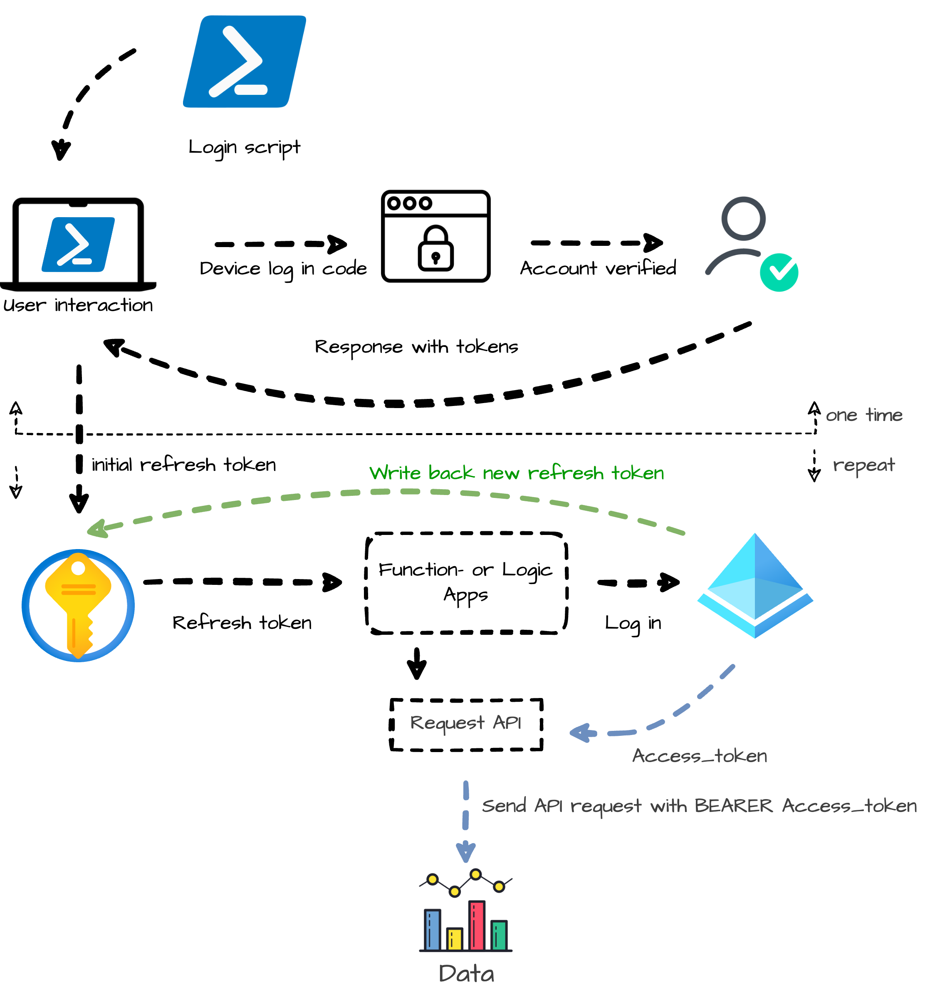
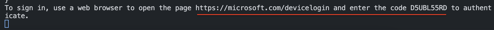
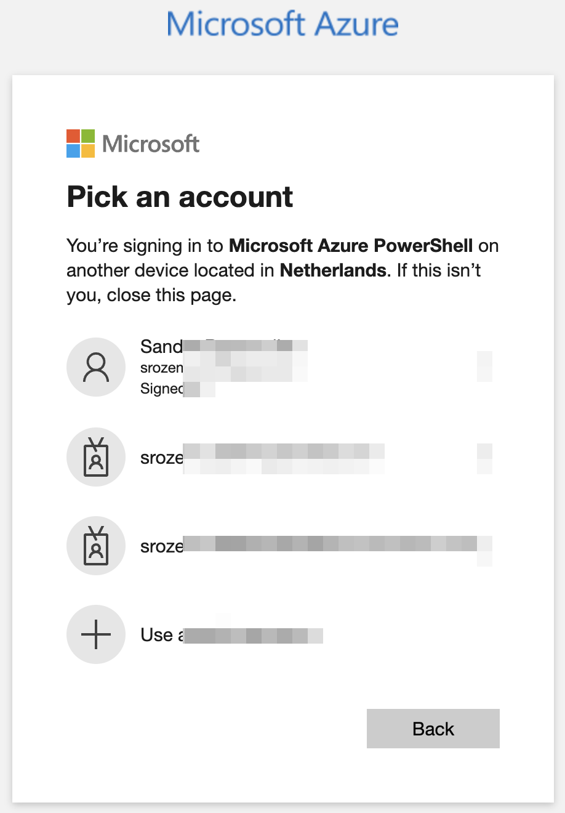
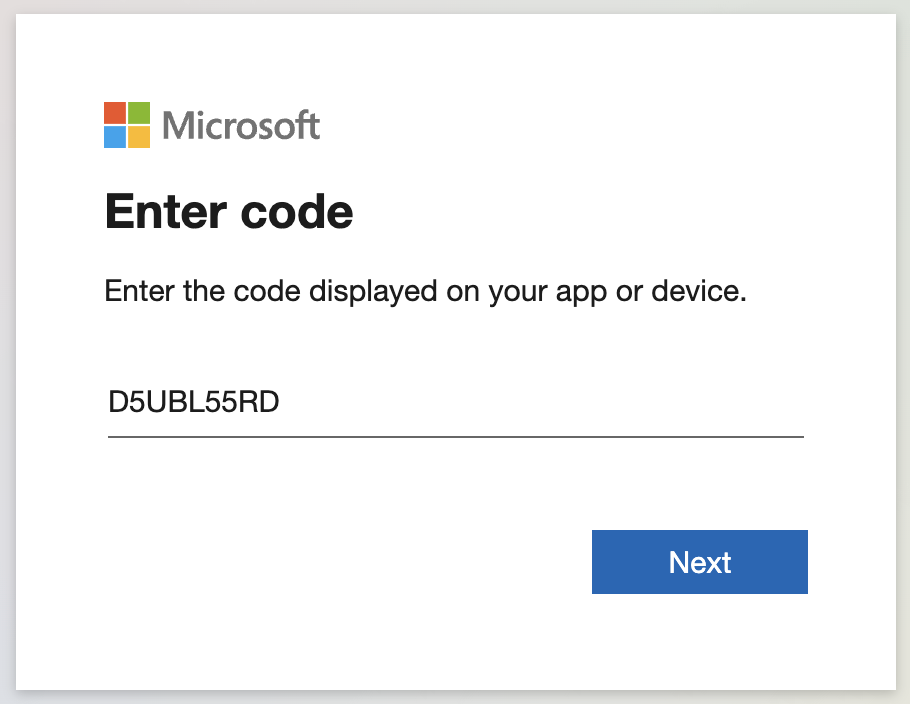
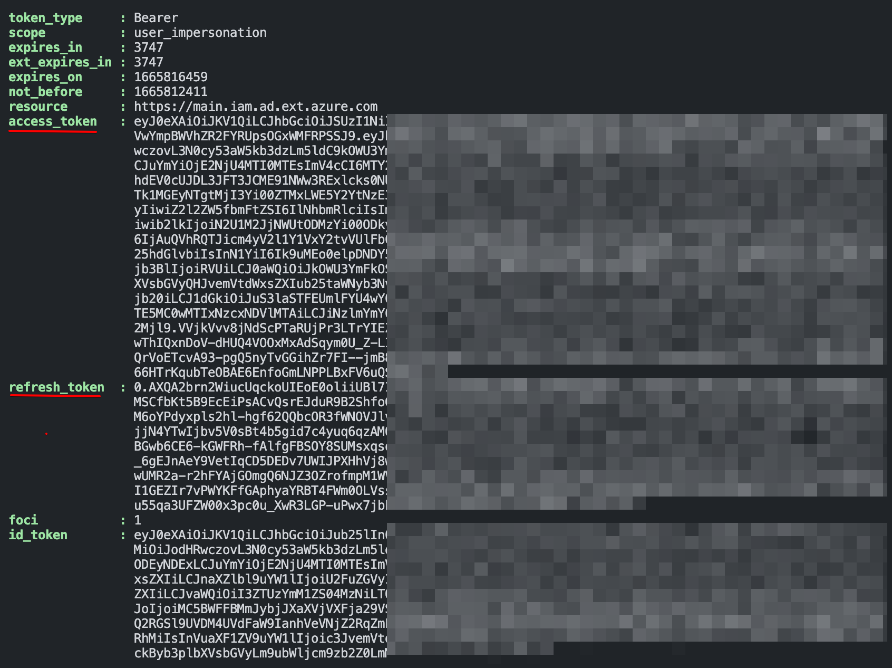
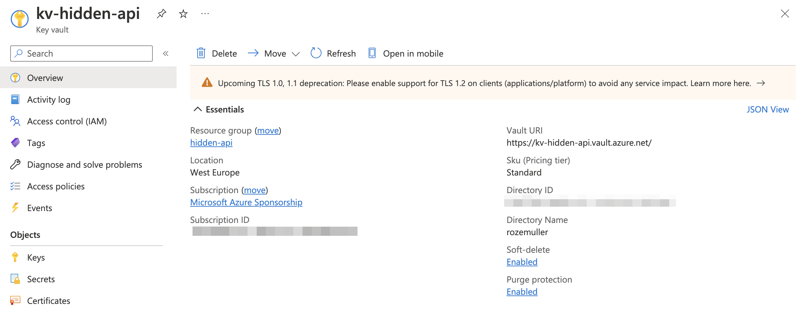
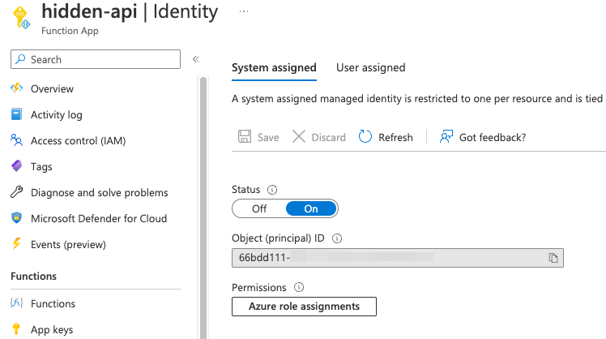
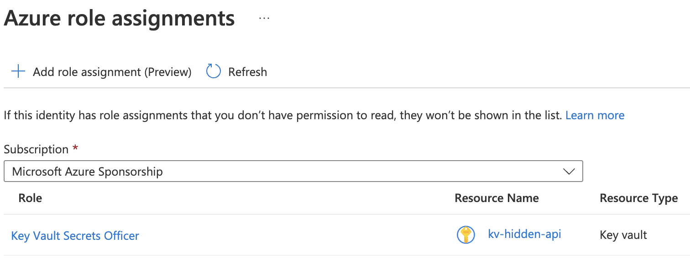
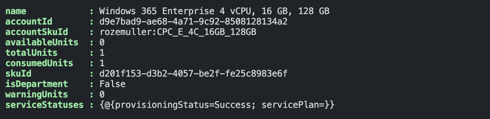

We all know the Graph API, graph.microsoft.com, and the Azure management API, management.azure.com. Both APIs are used very often and lots of automation tasks depend on those APIs. Also, most PowerShell modules rely on them and, the Graph and Azure management APIs are well documented.

But, there are situations where those APIs are not enough. (see my blog about [configuring authentication strength automated](https://www.rozemuller.com/deploy-monitor-conditional-access-require-authentication-strength/)). When looking in the Azure portal a lot of information is present and interesting to monitor or create reports. Or, to create resources. 
But when mapping the browser over the well-documented APIs you will notice not every item is available in the API. 

So, how do we get ALL information or, how do we automate if there is none of the API endpoints available?

>If it's in the browser, you can get it out of it. 



## The Azure steam machine
The answer is in the Azure basement where a steam machine is running called ```https://main.iam.ad.ext.azure.com/api/```. This API isn't documented but is very useful. A lot of Azure actions still depend on this API and it holds useful information. Use the developer panel in a browser while walking through the Azure portal and you will notice. 


## How to use the hidden internal Azure API?
Using the ```https://main.iam.ad.ext.azure.com/api/``` endpoint differs from the regular APIs. The biggest difference is authentication. The API does NOT support the use of a service principal and a client_credentials login method like the Graph authentication example below.

```powershell
$body = @{    
  grant_Type    = "client_credentials"
  scope         = "https://graph.microsoft.com/.default"
  client_Id     = "appId"
  client_Secret = "appSecret" 
} 
$connectParams = @{
  uri    = "https://login.microsoftonline.com/{0}/oauth2/v2.0/token" -f "tenantId"
  method = "POST" 
  body   = $body
}
$connect = Invoke-RestMethod @connectParams
$authHeader = @{
  'Content-Type' = 'application/json'
  Authorization  = 'Bearer ' + $connect.access_token
}
```

### Authenticate to main.iam.ad.ext.azure.com
To use the hidden API you MUST log in with a user for the first time. After login and user_impersonation you receive a refresh token. The permissions are based on the user's role. The refresh token can be used to reauthenticate later interactively without providing credentials.
Make sure you put the token in a safe place!! (Azure KeyVault for example).  
A refresh token has a 90-day lifetime. If the token is used it refreshes (as the name says) to a new token that needs to be stored again.

## How to use main.iam.ad.ext.azure.com in automation?
In this part, I will show the workflow on how to use the access_token and update the refresh tokens in automation tasks. The main components are the script (from above) and, an Azure Key Vault. The idea is to log in as a user for the first time and then write the refresh token to the Azure Key Vault. 



After logging in, I use the starting variables below.

```powershell
$mainUrl = "https://management.azure.com"
$context = [Microsoft.Azure.Commands.Common.Authentication.Abstractions.AzureRmProfileProvider]::Instance.Profile.DefaultContext
$token = [Microsoft.Azure.Commands.Common.Authentication.AzureSession]::Instance.AuthenticationFactory.Authenticate($context.Account, $context.Environment, $context.Tenant.Id.ToString(), $null, [Microsoft.Azure.Commands.Common.Authentication.ShowDialog]::Never, $null, $mainUrl).AccessToken
$subscriptionId = [Microsoft.Azure.Commands.Common.Authentication.Abstractions.AzureRmProfileProvider]::Instance.Profile.DefaultContext.Subscription.Id
$headers = @{
    'Content-Type' = 'application/json'
    Authorization  = 'Bearer ' + $token
}
$tenantId = $context.Tenant.Id
$location = "WestEurope"
$method = "PUT"
```


## Authenctication process
The first step is running the initial authentication process. The process needs to run once to get a refresh token. You also get an access token but is not needed in this step. 

Inspired by [Jos Lieben`s script](https://www.lieben.nu/liebensraum/2020/04/calling-graph-and-other-apis-silently-for-an-mfa-enabled-account/), I created a script that creates an access token and the refresh token based on a device login and, writes the refresh token back to the Key Vault.
The script is stored on my GitHub. https://github.com/srozemuller/Identity

When running the script, on the screen a message returns like below.


Follow the link and the wizard in the browser. Select the correct user, and fill in the code from the screen.




Heading back to the PowerShell command box you see a response like below where all the authentication information is returned.



Considering the response the access_token and refresh_token are important. The access_token is used to get access. The 'normal' token as we know in the Graph and Azure management APIs uses the client_credentials login method. 

The refresh_token is important in automation tasks. This is the token that must be used to log in without a user prompt and to receive an access_token.

### Store refresh token in Azure Key Vault
To store the refresh tokens for later use, I create an Azure Key Vault and write back the refresh token. 

In the initial step, I copied the refresh token manual into the secret. 

As mentioned, the refresh token is the user's password.  
Think twice about which user to use for impersonation. If you just need information, use a user with a READER role. 
That said, the Azure Key Vault becomes an important component. Make sure to restrict access as much as possible. 

I created an Azure Key Vault with the code below. Before I did, I logged in with ```Connect-AzAccount``` in PowerShell and created a header.  
The full script is on my GitHub.  

I enabled public network access. This is because otherwise, Azure Functions can not connect to the key vault. Azure Functions is not marked as a trusted Azure Service. Also, the Azure Functions endpoints have a wide range of IP addresses which is hard to enable all IPs in the key vault firewall. I enabled the RBAC authorization instead of access policies. In later steps, a system identity is the Key Vault Contributor role. 

```powershell
$vaultName = "kv-hidden-api"
$uri = "{0}/subscriptions/{1}/resourceGroups/{2}/providers/Microsoft.KeyVault/vaults/{3}?api-version=2021-10-01" -f $mainUrl, $subscriptionId, $resourceGroupName, $vaultName
$kvBody = @{
    location   = "WestEurope"
    properties = @{
        enablePurgeProtection = $true
        enableRbacAuthorization = $true
        publicNetworkAccess = "Enabled"
        tenantId = $tenantId
        sku = @{
            family = "A"
            name = "standard"
        }
    }
} | ConvertTo-Json -Depth 5

$keyVaultParameters = @{
    uri     = $uri
    method  = $method
    headers = $headers
    body    = $kvBody
}
$kv = Invoke-RestMethod @keyVaultParameters
$kv
```


## Create automation task
There are several ways to run tasks in Azure. Think about Azure Functions, Azure Automation and Logic Apps. In this part, I create an Azure Function that sends API requests to get readable license information. 

### Create and assign the system identity to Key Vaults Secrets Officer
At first, we need a resource with a system identity. The system identity is assigned to the Key Vaults Secrets Officer role. 
Due to the length of the blog post, I skip the resource creation.
I used the code below to assign the resource's system identity to the Key Vault Secrets Officer role (id: b86a8fe4-44ce-4948-aee5-eccb2c155cd7). See https://learn.microsoft.com/en-us/azure/role-based-access-control/built-in-roles#key-vault-contributor  

The scope is set to the key vault only. I used the ```$kv.id``` from the earlier key vault creation. 
```powershell
$roleGuid = (New-Guid).Guid
$roleUri = "{0}/{1}/providers/Microsoft.Authorization/roleAssignments/{2}?api-version=2018-01-01-preview" -f $mainUrl, $kv.id, $roleGuid
$roleBody = @{
    properties = @{
        roleDefinitionId = "/subscriptions/{0}/providers/Microsoft.Authorization/roleDefinitions/b86a8fe4-44ce-4948-aee5-eccb2c155cd7" -f $subscriptionId ## b86a8fe4... guid is the buildin role ID Key Vault Secrets Officer
        principalId = "66bdd111-6acf-41bb-a68f-cdf3f2a39842" ## This is the system identity id or the resource
    }
} | ConvertTo-Json -Depth 5

$roleParameters = @{
    uri     = $roleUri
    method  = $method
    headers = $headers
    body    = $roleBody
}
$role = Invoke-RestMethod @roleParameters
$role
```
For more information about Key Vaults roles please check: https://learn.microsoft.com/en-us/azure/key-vault/general/rbac-guide?tabs=azure-cli#azure-built-in-roles-for-key-vault-data-plane-operations  

The principal ID in the body properties is the resource's system identity ID. 
  

After the assignment, check the *Azure role assignments*


### Get and set the refresh token from Key Vault
Now the resource has proper permissions to the Key Vault we can update secrets. 
In the example below I created a PowerShell function Within the Azure Functions resource. At first, the function is logging in as a system identity and creating an authentication header for requesting the Key Vault

```powershell
$azureAccount = Connect-AzAccount -Identity
$accessToken = Get-AzAccessToken -ResourceUrl $resource -DefaultProfile $azureAccount
$authHeader = @{
  'Content-Type' = 'application/json'
  Authorization  = 'Bearer {0}' -f $accessToken.Token
}
```

To get and set the secret I use the code below. I set the audience to ```vault.azure.net```. Which was ```graph.microsoft.com``` earlier for example.
To get the value I use the ```GET``` method, in the case of setting a new value you need the ```PUT``` method.
```powershell
$vaultUrl = "https://vault.azure.net"
$getMethod = "GET"
$token = [Microsoft.Azure.Commands.Common.Authentication.AzureSession]::Instance.AuthenticationFactory.Authenticate($context.Account, $context.Environment, $context.Tenant.Id.ToString(), $null, [Microsoft.Azure.Commands.Common.Authentication.ShowDialog]::Never, $null, $vaultUrl).AccessToken
$headers = @{
    'Content-Type' = 'application/json'
    Authorization  = 'Bearer ' + $token
}
$kvSecretName = "RefreshToken"
$secretUri = "{0}/secrets/{1}?api-version=7.3" -f $kv.properties.vaulturi, $kvSecretName
$secretBody = @{
    value = $resourceToken
} | ConvertTo-Json -Depth 5

$secretParameters = @{
    uri     = $secretUri
    method  = $getMethod
    headers = $headers
    body    = $secretBody
}
$secret = Invoke-RestMethod @secretParameters
$secret.value
```

### Log in with the refresh token
To log in with the refresh token I request the ```login.windows.net``` page and provide the refresh token. With the response, I create a header with an access_token. 
I use the ```$tenant``` from above. The ```$clientId``` is the Microsoft Azure PowerShell id that was used in the initial script. 
In the response also the new refresh token is provided. Use the code above to set the new refresh token in the key vault for later use. 

```powershell
$response = (Invoke-RestMethod "https://login.windows.net/$tenantId/oauth2/token" -Method POST -Body "resource=74658136-14ec-4630-ad9b-26e160ff0fc6&grant_type=refresh_token&refresh_token=$refreshToken&client_id=$clientId&scope=openid" -ErrorAction Stop)
$resourceToken = $response.access_token
$headers = @{
    "Authorization"          = "Bearer " + $resourceToken
    "Content-type"           = "application/json"
    "X-Requested-With"       = "XMLHttpRequest"
    "x-ms-client-request-id" = [guid]::NewGuid()
    "x-ms-correlation-id"    = [guid]::NewGuid()
}
```
For more information about how to set keys, check: https://learn.microsoft.com/en-us/rest/api/keyvault/secrets/set-secret

## Request main.iam.ad hiddden API
With the header, we can request ```https://main.iam.ad.ext.azure.com```. In the example below, I request all assigned account SKU's. These are assigned licenses with also a readable display name. Something that isn't available in the Graph API. 

```powershell
$uri = "https://main.iam.ad.ext.azure.com/api/AccountSkus?backfillTenants=true"
Invoke-RestMethod -Method get -uri $uri -header $headers
```

  

The full Azure function is stored here: https://github.com/srozemuller/Identity/tree/main/LicenseInformation  
The script to deploy a resource group, key vault, and set the correct RBAC role is stored here: https://github.com/srozemuller/Identity/blob/main/HiddenAPI/create-hidden-api-environment.ps1

## Summary
In the blog post, I showed how to use the hidden ```https://main.iam.ad.ext.azure.com``` in automation with the use of Azure Functions and PowerShell. 
The main 'trick' is to log in with the refresh token to get an access token returned to log in. The new refresh token is saved in the Key Vault.

As mentioned earlier, the refresh token is the new password. Keep it safe and make sure to use an account with as less permissions as possible. 
Due to the length of the blog post, I'm planning a new post on how to use this method in Logic Apps. 

