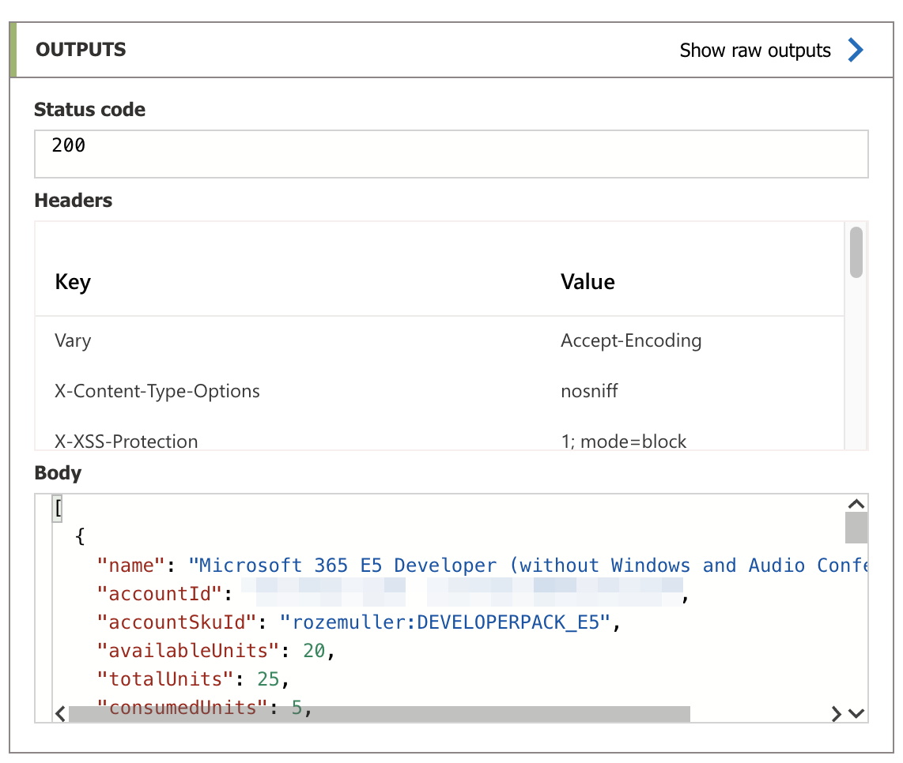

This blog post is a follow-up to [my post about using the hidden API in automation](https://www.rozemuller.com/use-internal-azure-api-in-automation/). In that post, I explained how to authenticate to the ```https://main.iam.ad.ext.azure.com/api/``` endpoint and, how to get information from it. If you haven't already, I would suggest reading that post first. 
I used Azure Functions to run the automation tasks. 

In this blog post, I show how to get the same license information using Logic Apps. 
I will skip the [authentication](https://www.rozemuller.com/use-internal-azure-api-in-automation/#authenticate-to-mainiamadextazurecom), Key Vault setup and [store the initial refresh token](https://www.rozemuller.com/use-internal-azure-api-in-automation/#store-refresh-token-in-azure-key-vault) parts. 



## Create Logic App
At first, we need a Logic App. After the Logic App is created the Key Vault Secrets Officer role is assigned to the system identity. To assign the correct role please check the part [assign the correct roles](https://www.rozemuller.com/use-internal-azure-api-in-automation/#create-and-assign-the-system-identity-to-key-vaults-secrets-officer) from my other blog post. 

After [authentication](https://www.rozemuller.com/use-internal-azure-api-in-automation/#authenticate-to-mainiamadextazurecom), I create an empty Logic App workflow with the code below.
```powershell
$workFlowName = "getLicenses"
$uri = "{0}/subscriptions/{1}/resourceGroups/membeermonitor_group/providers/Microsoft.Logic/workflows/{2}?api-version=2016-06-01" -f $mainUrl, $subscriptionId, $workFlowName
$logicAppWorkflowBody = @{
    location = "westeurope"
    properties = @{
        definition = @{ 
            "`$schema" = "https://schema.management.azure.com/providers/Microsoft.Logic/schemas/2016-06-01/workflowdefinition.json"
        }
    }
    identity = @{
        type = "SystemAssigned"
      }
} | ConvertTo-Json -Depth 5
$logicApp = Invoke-RestMethod -Headers $headers -Method PUT -uri $uri -Body $logicAppWorkflowBody
$logicApp
```


The reason why I created an empty Logic App first is because of the managed identity ID. This ID is needed to give the identity permissions to the Azure Key Vault.

### Assign the correct role to the system identity
To assign the correct role for the Azure Key Vault usage, I will suggest reading [the assign role part](https://www.rozemuller.com/use-internal-azure-api-in-automation/#create-and-assign-the-system-identity-to-key-vaults-secrets-officer) of my previous blog.

Replace the *```"system identity ID"```* in the code with ```$logicApp.id``` from the deployment above. 

### Create Logic App steps automated
In this part, the different Logic App steps are created in an automated way. The steps are defined under the properties in the definition object. The definition (that is the Logic App) consists of parameters, triggers, actions and outputs. 
The Logic App now has only a trigger (manual) and actions.

I use the create-block from above and appended the trigger and actions in the body. The ```$uri``` variable is the same as above. With the code below I only update the body.

```powershell
$logicAppContentBody = @{
    location = "westeurope"
    properties = @{
        definition = @{ 
            "`$schema" = "https://schema.management.azure.com/providers/Microsoft.Logic/schemas/2016-06-01/workflowdefinition.json"
            triggers = @{
                manual = @{
                    type = "Request"
                    kind = "HTTP"
                }
            }
            actions = $jsonBody | ConvertFrom-Json -Depth 99
        }
    }
} | ConvertTo-Json -Depth 99
$logicAppContent = Invoke-RestMethod -Headers $headers -Method PUT -uri $uri -Body $logicAppContentBody
$logicAppContent
```
After the request, the Logic App has a trigger and all actions. The trigger is created in the request body above. The actions are filled from a JSON file I created. [The file is stored on my GitHub](https://github.com/srozemuller/Monitoring/tree/main/LogicApps/LicenseInfo). 
If you want to use the file's content directly in the request, change the PowerShell variables ```$($kvRefeshTokenSecret)``` and ```$($tenantId)``` in the file. In that case, skip the step below.

If you want to use the current PowerShell variables then do the following:

Copy the JSON file content between de @ lines and save the content into the variable.

```powershell 
$kvRefeshTokenSecret = "https://[keyVaultName].vault.azure.net/secrets/[secretName]?api-version=7.3"
$tenantId = "TenantID"
$jsonBody = @"
---- JSON CONTENT FROM FILE ----
"@
```


## Logic App explained
We have created a Logic App automated with PowerShell to grab license information using the Azure hidden API. Let me explain in short how the Logic App works.

### Trigger (HTTP)
The HTTP trigger is created with this part of the code. The HTTP trigger is used to start the Logic APP. 
```powershell
triggers = @{
    manual = @{
        type = "Request"
        kind = "HTTP"
    }
}
```


### Trigger (Recurrence)
If you want to run the Logic App at scheduled times, then use the recurrence trigger. Run the code below to create a recurrence trigger instead of a HTTP trigger.
```powershell
trigger = @{
  Recurrence = @{
    recurrence = @{
      frequency = "Week"
      interval = 1
    },
    evaluatedRecurrence = @{
      frequency = "Week"
      interval = 1
    },
    type = "Recurrence"
  }
}
```


### Actions
The actions are straightforward. In the first block, the variables are initialized for later use.


In the next step, the refresh token secret is requested from the Key Vault. In the block, I use the ```RefreshTokenLocationUrl``` variable. Also, I added the authentication parameter to use a system-assigned managed identity to authenticate. In this case, I use the system-managed identity of the Logic App itself. For the audience I use ```https://vault.azure.net```. This is the API endpoint for Azure Key Vaults.


The response is in a JSON body that is parsed to objects. I used the response content as a sample to create the schema. The value from the parse action is the refresh token content that is used in the login request. The ```tenantId``` is the variable from above.


After login, a new refresh token is generated. I store the new token back in the Azure Key Vault based on the ```RefreshTokenLocation URL``` and the ```PUT``` method. Also this time I use the system-assigned managed identity.  
From the ```ParseJsonFromLogin``` action, I used the access token object to create an authorization header. The two x-ms-*** objects MUST exist in the header for using the main.iam.ad.ext.azure.com header. The GUIDs are just random created id's.

In the URI ```https://main.iam.ad.ext.azure.com/api/AccountSkus?backfillTenants=true``` I request all available licenses in my tenant with nicely created display names. 




## Summary
I want to thank you for reading my post about how to use the hidden ```https://main.iam.ad.ext.azure.com``` Azure API with Logic Apps, refresh tokens, and the Azure Key Vault. I showed how to create all components, including the Logic App, are created in an automated way.  


