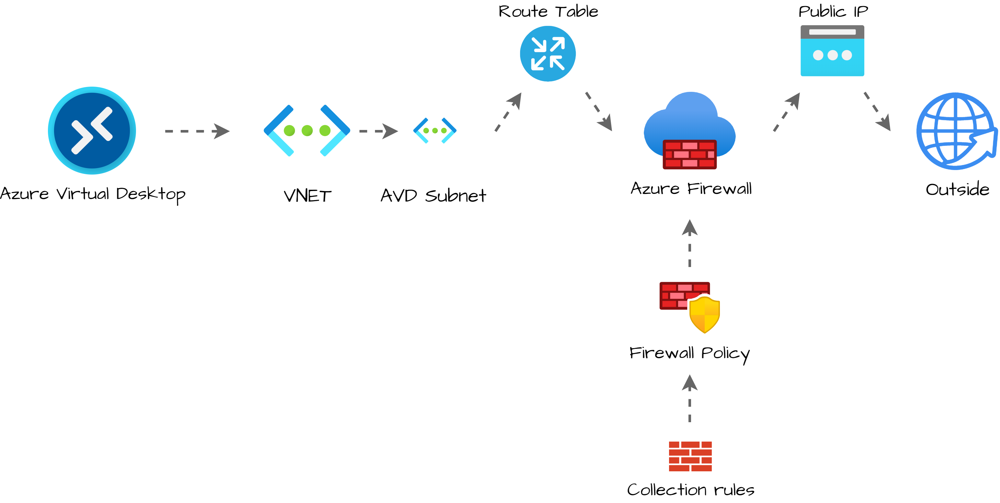
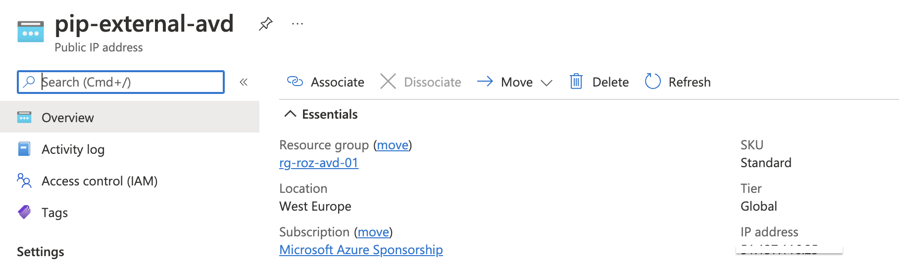
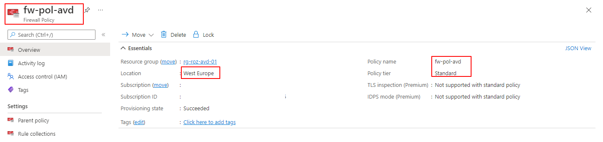
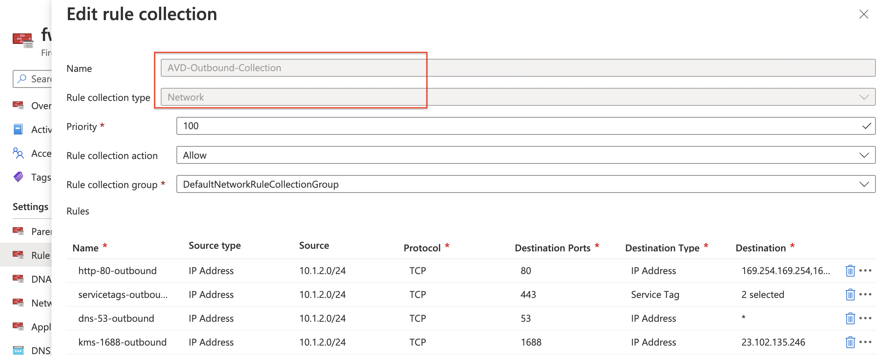
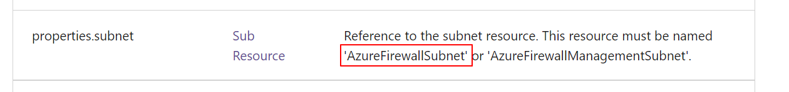
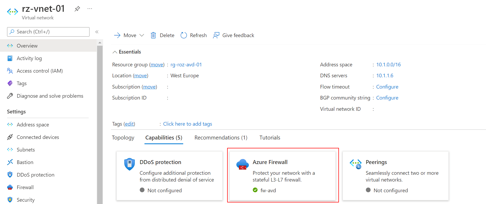
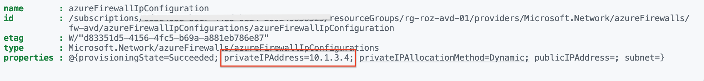
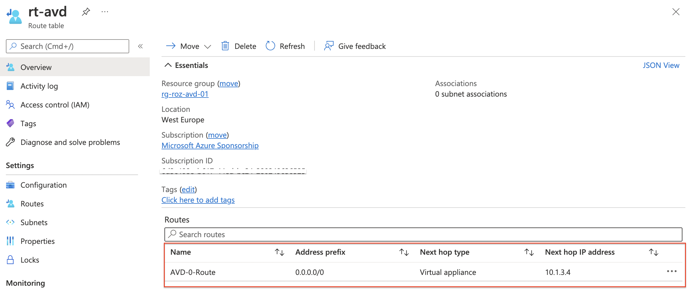
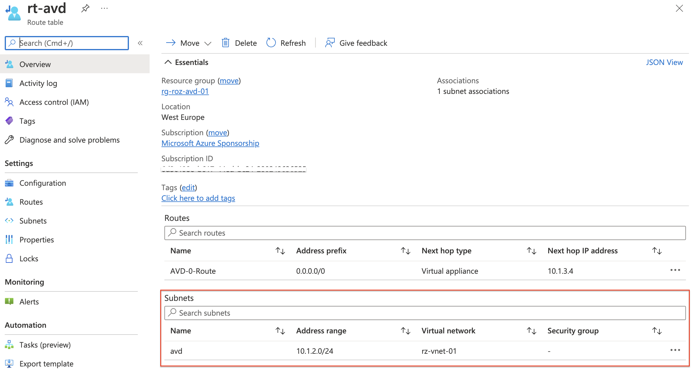

Recently I had a situation where a customer asked me how to make sure the AVD environment always has the same WAN IP. To give Azure Virtual Desktop a fixed external IP, some options are available. Think about a NAT gateway or an Azure Firewall. In this blog post, I show how to configure a static WAN IP for AVD with the use of the Azure Firewall in an automated way.

When creating an Azure Firewall we need additional resources. A public IP (becomes the static WAN IP for AVD), a Firewall Policy, and a virtual network. In this blog, I assume that you already have a fully operating Azure Virtual Desktop environment. From that point, we pick up the deployment.



## Static WAN IP for AVD Architecture

To clarify configuring a static WAN IP for AVD, I have drawn the schema below. The main idea is to send all the traffic from an existing AVD subnet helped by a routing table through the Azure Firewall. The Azure Firewall has a public IP that represents the network.


### Deployment strategy

Before we start to deploy, I assume you already have a fully operating AVD environment. (If not, please check my [AVD Automation Cocktail series](https://rozemuller.com/avd-automation-cocktail-the-menu/). In this series, I show different AVD deployment methods).   
The first step is searching for the current VNET used in your AVD environment. In the existing VNET, I create a new subnet called AzureFirewallSubnet (must be this name).  
Secondly, I create the public IP. The public IP is the static external WAN IP that represents the AVD network on the outside.   
Next, I create a firewall policy. The policy has settings from the [protect AVD documentation](https://docs.microsoft.com/en-us/azure/firewall/protect-azure-virtual-desktop).   
Based on the best practices I create a rule collection and add it to the just-created policy. In the firewall, I add the policy.

At last, I bring the AVD and firewall parts together by creating a routing table and assigning the table to the existing AVD subnet. The routing table sends all the outside traffic (0-route) to the Azure Firewall.

The reason why I created a routing table, at last, is because of not having downtime. Routing traffic to non-existing addresses results in sending traffic to a dead end.

### Authentication

To authenticate I use an Azure login account with enough permissions at the subscription or resource group level. In this situation, I do not use an app registration.

```powershell
Connect-AzAccount
$token = Get-AzAccessToken -ResourceUrl "https://management.azure.com"
$authHeader = @{
    'Content-Type' = 'application/json'
    Authorization  = 'Bearer ' + $token.Token
}
```

## Azure Firewall setup

I hear people thinking Azure Firewall, Why?!? A NAT gateway is cheaper. And yes, you are right. Within the AVD community, we experienced a lot of disconnects when using a NAT gateway. An Azure Firewall is more stable.

### Add AzureFirewallSubnet subnet to existing AVD VNET

As mentioned we are going to update an existing Azure Virtual Desktop environment with no Azure Firewall already placed. During an Azure Firewall deployment, you must create a subnet named AzureFirewallSubnet. This is the firewall’s own subnet.

First I search for the current VNET using the Get-AvdNetworkInfo command. This command is a part of the [Az.Avd PowerShell module.](https://www.powershellgallery.com/packages/Az.Avd) Based on the provided AVD host pool, this command searches for the session host`s virtual network and subnet information. During the subnet creation, I use the VNET information.

*Login in with the Connect-AzAccount command.*

```powershell
Install-Module Az.Avd
Import-Module Az.Avd
```

### Get AVD network information with Az.Avd

To get the current AVD subnet information, I use the [Az.Avd PowerShell module](https://www.powershellgallery.com/packages/Az.Avd). This module searches network information based on the session hosts in a host pool. Because we need the VNET information in the next step, I stored the command output in a variable.

```powershell
$Parameters = @{
    hostpoolName = "Rozemuller-hostpool"
    resourceGroupName = "rg-roz-avd-01"
}
$network = Get-AvdNetworkInfo @Parameters
```

The $network variable has the network information of all of the session hosts. The first step in creating a new subnet with the REST API is getting a token that is provided in the header information.   
Secondly, I create a body with the address prefix, and the network segment, in it. The body is in JSON format. In the next step, I create a splatting table with all the parameters in it. Parameters provided to the API request.

The URI is formatted with the base REST API URL, the VNET resource ID, and the new subnet name. Because I only need one VNET ID, I picked the first record in the output variable by adding the \[0\] behind.

```powershell
$body = @{
    properties = @{
        addressPrefix = "10.1.0.0/26"
    }
} | ConvertTo-Json
$vnetParameters = @{
    uri = "https://management.azure.com/{0}/subnets/{1}?api-version=2021-05-01" -f $network.VnetId[0], "AzureFirewallSubnet"
    method = "PUT"
    body = $body
    headers = $authHeader
}
$subnet = Invoke-RestMethod @vnetParameters
```

*Take a note about the address prefix, which must be at least a /26 network.*

### Create public IP

In the next part, we create a public IP with the Azure REST API. At first, I use the variables to create the REST API URL. Secondly, I create a body and convert it to JSON format again. At last, I create a splatting table with all the parameters. I re-use the $authHeader from the subnet part.

```powershell
$resourceGroup = "rg-roz-avd-01"
$subscription = (Get-AzContext).Subscription
$publicIpName = "pip-external-avd"
$uri = "https://management.azure.com/subscriptions/{0}/resourceGroups/{1}/providers/Microsoft.Network/publicIPAddresses/{2}?api-version=2021-05-01" -f $subscription, $resourceGroup, $publicIpName

$pipBody = @{
    properties = @{
        publicIPAllocationMethod = "Static"
        idleTimeoutInMinutes = 10
        publicIPAddressVersion = "IPv4"
      }
      sku = @{
        name = "Standard"
        tier = "Regional"
      }
      location = "westeurope"
} | ConvertTo-Json

$pipParameters = @{
    uri = $uri
    method = "PUT"
    body = $pipBody
    headers = $authHeader
}
$pip = Invoke-RestMethod @pipParameters
$pip
```


For more information about creating public IPs through the REST API, check the [public IP documentation](https://docs.microsoft.com/en-us/rest/api/virtualnetwork/public-ip-addresses/create-or-update).

### Create Azure Firewall policies

Firewall policies are the firewall’s brains. With policies, you tell how the firewall acts and what to do with network traffic. For this situation, routing AVD traffic to a fixed external IP, we also create a policy. In the example below, I create a policy that protects your AVD environment based on Microsoft’s best practices. This will not mean this policy fits your own security policy.

Check the documentation about how to secure your AVD environment in detail [here](https://docs.microsoft.com/en-us/azure/firewall/protect-azure-virtual-desktop).

I created a policy in West Europe named **fw-pol-avd**. Because I need the policy in later steps, I store the output in the $policy variable.

```powershell
$resourceGroup = "rg-roz-avd-01"
$subscription = (Get-AzContext).Subscription
$policyName = "fw-pol-avd"
$policyUrl = "https://management.azure.com/subscriptions/{0}/resourceGroups/{1}/providers/Microsoft.Network/firewallPolicies/{2}?api-version=2021-08-01" -f $subscription, $resourceGroup, $policyName
$body = @{
    location   = "WestEurope"
    properties = @{
        sku             = @{
            tier = "Standard"
        }
        threatIntelMode = "Alert"
    }
} | ConvertTo-Json -Depth 10
$parameters = @{
    uri     = $policyUrl
    method  = "PUT"
    headers = $authHeader
    body    = $body
}
$policy = Invoke-RestMethod @parameters
```


For more information about creating a firewall policy with the REST API, please check the [docs](https://docs.microsoft.com/en-us/rest/api/virtualnetwork/firewall-policies/create-or-update).

### Deploy network policy rule collection and assign it to the policy

The next step is creating network rules which allow and deny traffic to our AVD subnet. In this step, I need the ```powershell $network``` variable again from [the first step](#avd-network-info). As mentioned above I use[ Microsoft’s secure AVD best practices](https://docs.microsoft.com/en-us/azure/firewall/protect-azure-virtual-desktop) in this example. The collection is committed to the policy. I use the $policy variable to assign the collection rule to the policy.

```powershell
$collectionUrl = "https://management.azure.com/{0}/ruleCollectionGroups/DefaultNetworkRuleCollectionGroup?api-version=2021-08-01" -f $policy.id
$body = @{  
    properties = @{
        priority        = 100
        ruleCollections = @(
            @{
                ruleCollectionType = "FirewallPolicyFilterRuleCollection"
                name               = "AVD-Outbound-Collection"
                priority           = 100
                action             = @{
                    type = "Allow"
                }
                rules              = @(
                    @{
                        ruleType             = "NetworkRule"
                        name                 = "http-80-outbound"
                        ipProtocols          = @(
                            "TCP"
                        )
                        destinationPorts     = @(
                            "80"
                        )
                        sourceAddresses      = @(
                            $network[0].SubnetInfo.properties.addressPrefix
                        )
                        destinationAddresses = @(
                            "169.254.169.254","168.63.129.16"
                        )
                    }
                    @{
                        ruleType             = "NetworkRule"
                        name                 = "servicetags-outbound"
                        ipProtocols          = @(
                            "TCP"
                        )
                        destinationPorts     = @(
                            "443"
                        )
                        sourceAddresses      = @(
                            $network[0].SubnetInfo.properties.addressPrefix
                        )
                        destinationAddresses = @(
                            "AzureCloud", "WindowsVirtualDesktop"
                        )
                    }
                    @{
                        ruleType             = "NetworkRule"
                        name                 = "dns-53-outbound"
                        ipProtocols          = @(
                            "TCP"
                        )
                        destinationPorts     = @(
                            "53"
                        )
                        sourceAddresses      = @(
                            $network[0].SubnetInfo.properties.addressPrefix
                        )
                        destinationAddresses = @(
                            "*"
                        )
                    },
                    @{
                        ruleType             = "NetworkRule"
                        name                 = "kms-1688-outbound"
                        ipProtocols          = @(
                            "TCP"
                        )
                        destinationPorts     = @(
                            "1688"
                        )
                        sourceAddresses      = @(
                            $network[0].SubnetInfo.properties.addressPrefix
                        )
                        destinationAddresses = @(
                            "23.102.135.246"
                        )
                    }
                )
            }
        )
    } 
} | ConvertTo-Json -Depth 10
$parameters = @{
    uri     = $collectionUrl
    method  = "PUT"
    headers = $authHeader
    body    = $body
}
$ruleCollection = Invoke-RestMethod @parameters
```


In addition to creating a firewall rule collection check the [API documentation](https://docs.microsoft.com/en-us/rest/api/virtualnetwork/firewall-policy-rule-collection-groups/create-or-update).

### Deploy Azure Firewall with REST API

Creating a policy and rules completes the list with mandatory components to create an Azure Firewall. To clarify, let’s summarize what we have so far. We have searched for the current AVD subnet (network variable). This is the subnet that needs a fixed public IP. We have created a public IP (pip variable) and, create a firewall policy, with rules. (policy variable)  
Because I stored every deployment into variables, I have all the needed information present.

Now it is time to create the Azure Firewall with the REST API. In the body below all the components are coming together. The policy, the AVD VNET, and public IP. By providing the AzureFirewallSubnet subnet, the firewall is assigned to the correct VNET automatically.


```powershell
$resourceGroup = "rg-roz-avd-01"
$subscription = (Get-AzContext).Subscription
$fwName = "fw-avd"
$fwUrl = "https://management.azure.com/subscriptions/{0}/resourceGroups/{1}/providers/Microsoft.Network/azureFirewalls/{2}?api-version=2021-08-01" -f $subscription, $resourceGroup, $fwName
$fwBody = @{
    location   = "WestEurope"
    properties = @{
        firewallPolicy   = @{
            id = $policy.id
        }
        sku              = @{
            name = "AZFW_VNet"
            tier = "Standard"
        }
        threatIntelMode  = "Alert"
        ipConfigurations = @(
            @{
                name       = "azureFirewallIpConfiguration"
                properties = @{
                    subnet          = @{
                        id = $subnet.id
                    }
                    publicIPAddress = @{
                        id = $pip.id
                    }
                }
            }
        )
    }
} | ConvertTo-Json -Depth 99
$fwParameters = @{
    uri     = $fwUrl
    method  = "PUT"
    body    = $fwBody
    headers = $authHeader
}
Invoke-RestMethod @fwParameters
```


Another great advantage of saving the output into variables is that the deployment bodies are way smaller than putting all the information into one single request. This makes your code more comfortable to read and troubleshoot. And fewer mistakes.

Check the[ Azure Firewall REST API documentation](https://docs.microsoft.com/en-us/rest/api/firewall/azure-firewalls/create-or-update) for more information.

## AVD Network routing

In this last part, we need to route the traffic through the Azure Firewall. To route traffic in Azure use a Route Table. In a routing, table routes are defined. A route consists of a source, destination, and next-hop. In this chapter, I create a routing table, and a route and assign the routing table to the AVD subnet.

### Routing source and destination

As mentioned we need to route AVD traffic to Internet via the Azure Firewall. Let’s find the source network first. To find the source AVD network, I use the Az.Avd PowerShell module. I like to refer back to the top of this blog post about [how to get the AVD network information.](#Get-AVD-network-information-with-Az.Avd)

About the destination, I could be very clear. In network language, the route to the Internet is also called the 0-route. This is because the Internet destination address is 0.0.0.0

### Next hop, get Azure Firewall’s private IP

The next-hop represents the next network location where the traffic is sent. In this situation, we need the Azure Firewall’s private IP. With the code below, I search for the private IP address. The private IP address is available in the ipConfigurations properties. I store the whole output into the $fw variable. This is because I use the private IP address in the route creation.

```powershell
$fwParameters = @{
    uri     = $fwUrl
    method  = "GET"
    headers = $authHeader
}
$fw = Invoke-RestMethod @fwParameters
$fw.properties.ipConfigurations.properties.privateIPAddress
```

The $fwUrl parameter is a variable from the firewall creation paragraph. In relation to that paragraph I know to use the GET method instead of PUT.


*Creating an Azure Firewall takes time. During deployment, the private is not available directly.*

Use a loop to check the deploy status. The deployment status is available in the general properties. ($fw.properties)


### Create route table

After creation, it is time to bring all the parts together with a route in a route table. With the code below I create a route table and a route at once with the REST API. Make sure you provide **VirtualApplicance** as the next hop type. The next-hop IP address is the firewall’s private IP.

```powershell
$resourceGroup = "rg-roz-avd-01"
$subscription = (Get-AzContext).Subscription
$rtName = "rt-avd"
$routeTableUrl = "https://management.azure.com/subscriptions/{0}/resourceGroups/{1}/providers/Microsoft.Network/routeTables/{2}?api-version=2021-08-01" -f $subscription, $resourceGroup, $rtName
$rtBody = @{
    location   = "WestEurope"
    properties = @{
        routes = @(
            @{
                name = "AVD-0-Route"
                properties = @{
                    nextHopType    = "VirtualAppliance"
                    nextHopIpAddress = $firewall.properties.ipConfigurations.properties.privateIPAddress
                    addressPrefix  = 0.0.0.0/0
                }
            }
        )
    }
} | ConvertTo-Json -Depth 5
$rtParameters = @{
    uri     = $routeTableUrl
    method  = "PUT"
    body    = $rtBody
    headers = $authHeader
}
$routeTable = Invoke-RestMethod @rtParameters
$routeTable
```


In the last step, we assign the routing table to the AVD subnet. To associate the routing table with a network subnet I use the REST API code below. This time we go back to the subnet REST API endpoint.

For more information about creating route tables with REST API, check the [documentation](https://docs.microsoft.com/en-us/rest/api/virtualnetwork/route-tables/create-or-update).

### Assign route table to subnet

At last, we create the routing table and associate it with the AVD subnet. I use the $rt variable and the $network variable again. In the body, I provide the routing table and the address prefix (is mandatory)

```powershell
$avdSubnetUrl = "https://management.azure.com/{0}?api-version=2021-08-01" -f $network[0].subnetInfo.id
$resourceGroup = "rg-roz-avd-01"
$subscription = (Get-AzContext).Subscription
$subnetBody = @{
    properties = @{
        addressPrefix = $network[0].subnetInfo.properties.addressPrefix
        routeTable = @{
            id = $routeTable.id
        }
    }
} | ConvertTo-Json
$subnetParameters = @{
    uri     = $avdSubnetUrl
    method  = "PUT"
    body    = $subnetBody
    headers = $authHeader
}
$avdSubnet = Invoke-RestMethod @subnetParameters
$avdSubnet
```


For updating subnets with REST API check [this document](https://docs.microsoft.com/en-us/rest/api/virtualnetwork/subnets/create-or-update).

## Summary

Thank you for reading my blog about configuring a static WAN IP for AVD in an automated way.

