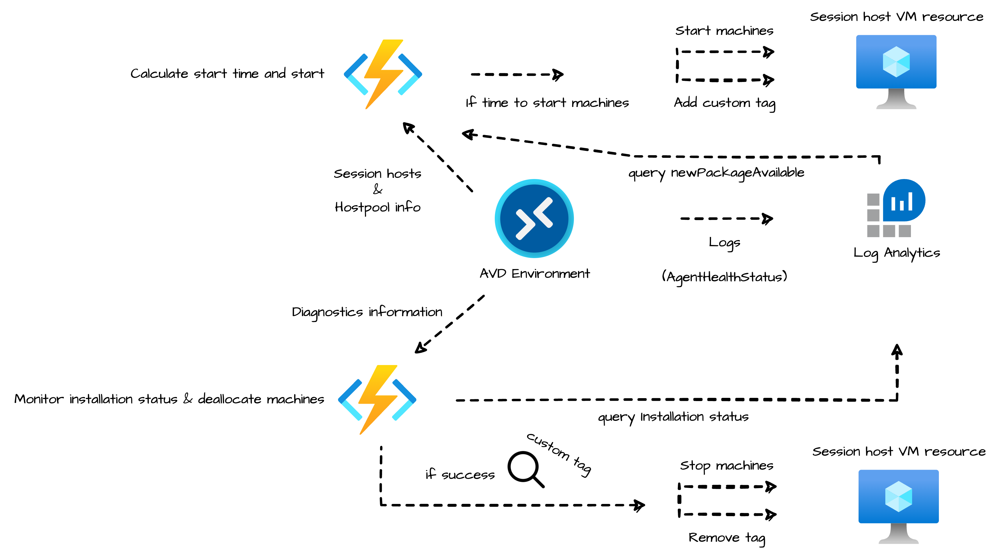
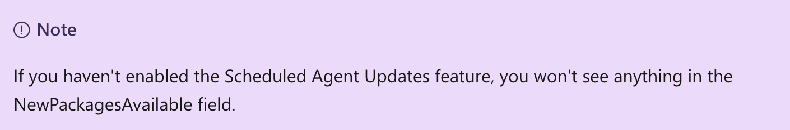
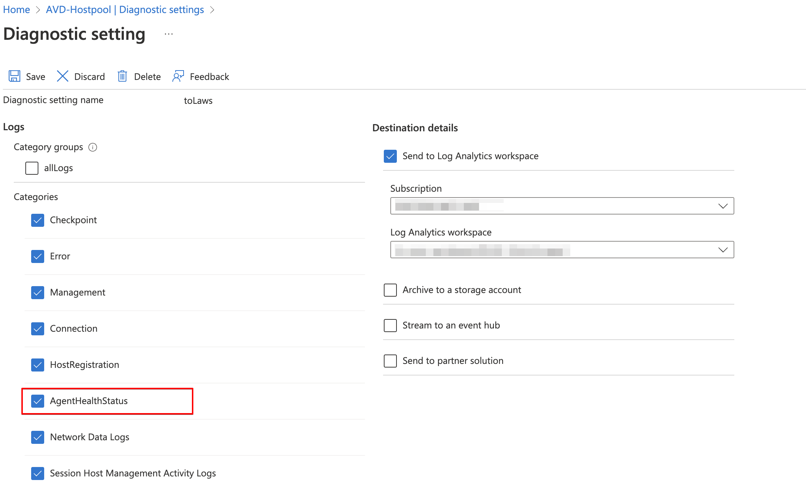
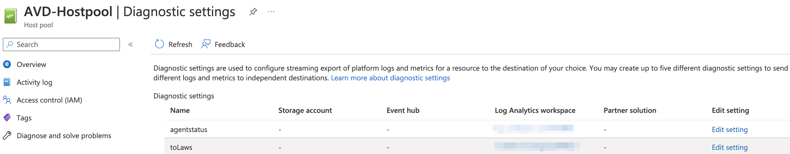
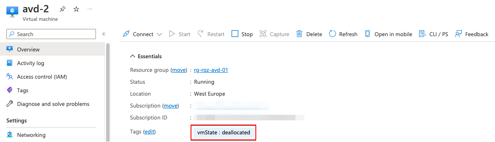
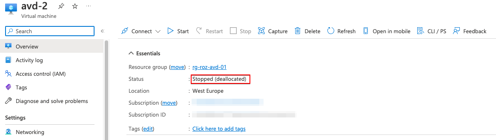

Recently, a question passed my screen if [the AVD scheduled agent feature](https://learn.microsoft.com/en-us/azure/virtual-desktop/scheduled-agent-updates) supports deallocated machines. The answer is short, no. Also when not enabling the feature, Microsoft does not start deallocated machines.
So, how do we make sure when a new agent becomes available also deallocated machines are updated?

In this post, I show a mechanism that can help achieve that goal. Updating AVD Agent also on deallocated machines. 



## The idea
The idea consists of two main parts. Part one is to find out if a new package is available, and start the deallocated machines. The started machines are flagged by tags to know which hosts are started from a deallocated status. 
Then, the updates are installed by the Microsoft ecosystem.

In part two, we look into Log Analytics, to check if the installation was successful. Then machines are shut down (with deallocation) again and the tags are removed.




Both parts are scheduled close to the maintenance windows configured in the Scheduled Agent Updates feature.
The task starts the deallocated machines in a host pool just before the maintenance window (that has been set in the Scheduled Agent Updates feature) in combination with the *NewPackagesAvailable* column in the *WVDAgentHealthStatus* log table. 


In the blog, I explain how to configure the function apps, how to get the AVD host pool information, add/remove tags, start and stop machines, and how to get information from the Log Analytics workspace. All with the use of PowerShell ([Az.Avd module](https://www.powershellgallery.com/packages/Az.Avd)) a REST API. 

## AVD Scheduled agent updates explained
Before we start I like to explain the feature's basics first.  
From Microsoft: *The Scheduled Agent Updates feature lets you create up to two maintenance windows for the Azure Virtual Desktop agent, side-by-side stack, and Geneva Monitoring agent to get updated so that updates don't happen during peak business hours. To monitor agent updates, you can use Log Analytics to see when agent component updates are available and when updates are unsuccessful.*

That means when the option is NOT configured Microsoft decides when the updates are installed on only running machines.
When a machine comes online, the mechanism starts updating the agent. That is the point where the problem starts. 

If a machine starts, you don't want to wait for updating agents. Especially, when starting session hosts just-in-time with [the start VM on connect feature](https://learn.microsoft.com/en-us/azure/virtual-desktop/start-virtual-machine-connect?tabs=azure-portal).

See: https://learn.microsoft.com/en-us/azure/virtual-desktop/scheduled-agent-updates

## Prerequisites to deploy the technique
In this part, I explain how to deploy the architecture all automated. Out of scope is the Log Analytics workspace. Assuming you already have one.  
I use the Az.Avd PowerShell. The commands in this post are not in production yet.  
I published v2.4.3-beta.15 on my GitHub which can be downloaded from this URL: https://github.com/srozemuller/AzAvd/releases/tag/v2.4.3-beta.15

Extract after download and use the code below to import.

```powershell
Import-Module ./AzAvd/Az.Avd.psm1 -RequiredVersion 2.4.3
```

## Part 1: Start deallocated machines if a new AVD agent is available
The first step is to know when agent updates are installed.
Updates can only be installed on running machines. That means deallocated machines must be started, but when? Enabling the schedules agent updates feature provides new information in the logs that can be used. To use the information we need to set up diagnostics at the AVD host pool level.





To configure logs use the command from the Az.Avd below.
```powershell
$avdParams = @{
    hostpoolName      = "AVD-Hostpool"
    resourceGroupName = 'rg-roz-avd-01'
}
Update-AvdDiagnostics @avdParams -Categories @("AgentHealthStatus") -LAWorkspace log-analytics-avd-95789 -LaResourceGroupName rg-roz-avd-mon -DiagnosticsName agentstatus 
```



For more information about configuring diagnostics, check: https://learn.microsoft.com/en-us/azure/virtual-desktop/agent-updates-diagnostics

### Search and start
Now the diagnostic settings are enabled, we can search if there is a new package available. First, search in the host pool for current diagnostic settings. This is to get the configured Log Analytics workspace to query against too. 
```powershell
$avdParams = @{
    hostpoolName      = "AVD-Hostpool"
    resourceGroupName = 'rg-roz-avd-01'
}
$avdHp = Get-AvdHostPool @avdParams
```
In the next part, search for the session hosts in the AVD host pool. Then, check for every session host if there is a new package available. If available and the host is deallocated, then add a custom tag. Adding a tag is because in later steps you know which session host was started from deallocated mode and turn it back into that state later. (I use vmState with a deallocated value)

```powershell
$tags = @{
    vmState = "deallocated"
} 
$avdHosts = Get-AvdSessionHostResources @avdParams
$avdHosts.ForEach({
$queryString = "WVDAgentHealthStatus 
| where TimeGenerated >= ago(30d) 
| where SessionHostName == "$($_.vmResources.name)" 
| project TimeGenerated, AgentVersion, SessionHostName, LastUpgradeTimeStamp, UpgradeState, UpgradeErrorMsg, NewPackagesAvailable
| sort by TimeGenerated desc
| take 1"

$packageCheck = Send-LawsQuery -queryString $queryString

    if (($packageCheck) -and ('PowerState/deallocated' -in $_.vmResources.properties.instanceview.statuses.code)) {
        $sessionHostId = $_.id
        Start-AvdSessionHost -Id $sessionHostId
        Add-AvdSessionHostTags -Tags $tags -Id $sessionHostId
    }
})
```

After requesting the AVD session host resource information (with ```Get-AvdSessionHostResources```), there is a check per session host if there is a new package available. 
If there is a new package available and the machine is deallocated, the custom tags are set and the session is started.  

*The file with the functions is stored on my GitHub.*

From that moment, Microsoft takes over. 

## Part 2: Check installation status and bring back session hosts to deallocate status
The idea of this part is to search for session hosts with the custom tag. Then bring back the session hosts to a deallocated state and remove the tags. The other session hosts keep their current status.  



### Search and stop
This part has three sub-parts, search install status, search session hosts with custom tags, and stop machines. At first, find out the installation status per session host.
```powershell
$avdParams = @{
    hostpoolName      = "AVD-Hostpool"
    resourceGroupName = 'rg-roz-avd-01'
}
$avdHosts = Get-AvdSessionHostResources @avdParams
```

Then per session host check the installation status and if the installation was successful, then stop & deallocate the session host, and remove the custom tags.

```powershell
$avdHosts.ForEach({
$queryString = "WVDAgentHealthStatus 
| where TimeGenerated >= ago(30d) 
| where SessionHostName == "$($_.vmResources.name)" 
| where MaintenanceWindowMissed == true
| project TimeGenerated, AgentVersion, SessionHostName, LastUpgradeTimeStamp, UpgradeState, UpgradeErrorMsg, MaintenanceWindowMissed
| sort by TimeGenerated asc "

$installStatusCheck = Send-LawsQuery -queryString $queryString
   if (($installStatusCheck) -and  (($_.vmResources.tags | Get-Member ).Name.Contains($tags.Keys))) {
        $sessionHostId = $_.id
        Stop-AvdSessionHost -Id $sessionHostId -Deallocate
        Remove-AvdSessionHostTags -Tags $tags -Id $sessionHostId
    }
})
```


## Summary
However, I would suggest using an image management process with images or the Azure Compute gallery, I created this blog post on how to update deallocated AVD session hosts based on the [Scheduled Agent Updates feature](https://learn.microsoft.com/en-us/azure/virtual-desktop/agent-overview#agent-update-process). Currently, only running machines are updated with a new AVD agent and there is no option to start deallocated machines when a maintenance window is configured. 

